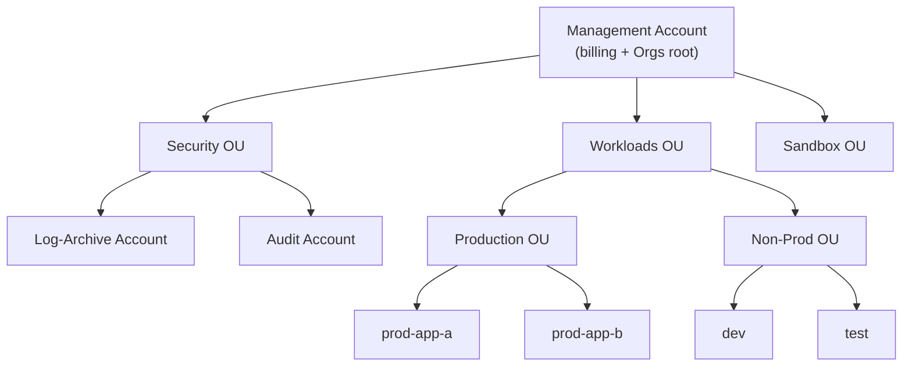
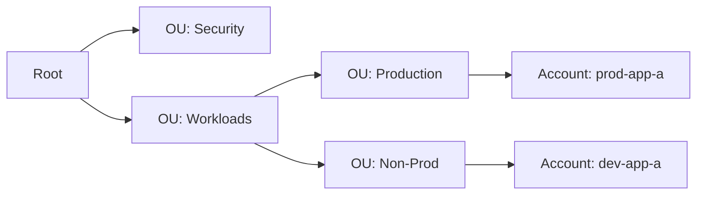
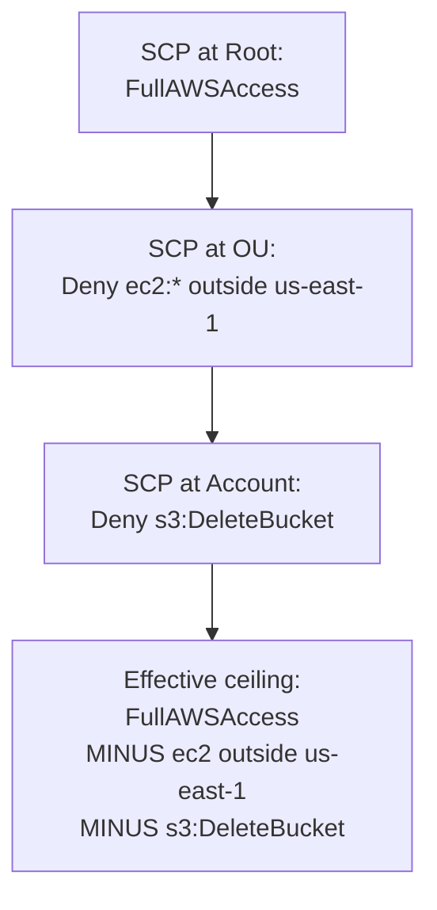
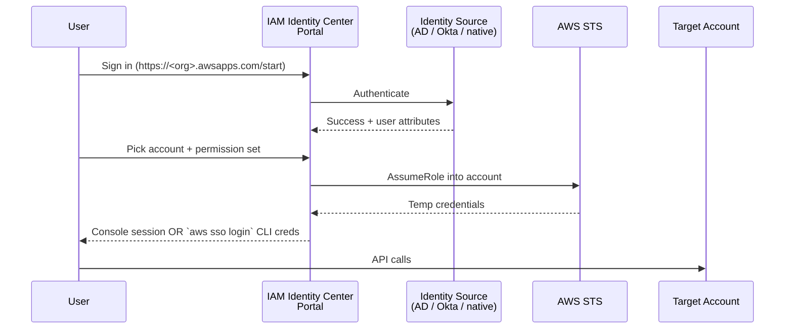
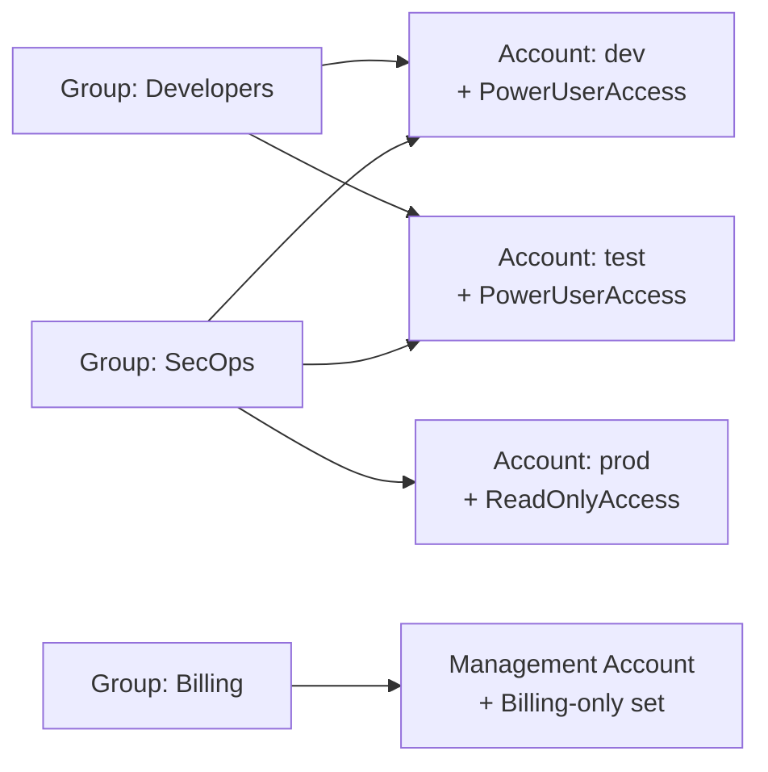

# IAM Identity Center & AWS Organizations

> Managing many AWS accounts under one umbrella, governing them with **Service Control Policies (SCPs)**, and letting humans sign into all of them with one corporate identity. This is the modern "AWS at scale" pattern - and the exam tests it constantly in the Security domain (30 % of marks).

See also: [01 - IAM Intro bits & bytes](01%20-%20IAM%20Intro%20bits%20%26%20bytes.md) · [05 - IAM Scenarios](05%20-%20IAM%20Scenarios.md) · [13 - STS & Federation](13%20-%20STS%20%26%20Federation.md)

---

## Table of Contents

- [1. Why Multi-Account?](#1-why-multi-account)
- [2. AWS Organizations](#2-aws-organizations)
- [3. Organizational Units (OUs)](#3-organizational-units-ous)
- [4. Service Control Policies (SCPs)](#4-service-control-policies-scps)
- [5. Other Organization Policies](#5-other-organization-policies)
- [6. Consolidated Billing](#6-consolidated-billing)
- [7. AWS Control Tower](#7-aws-control-tower)
- [8. IAM Identity Center](#8-iam-identity-center)
- [9. Permission Sets](#9-permission-sets)
- [10. Identity Sources](#10-identity-sources)
- [11. Identity Center vs IAM Users](#11-identity-center-vs-iam-users)
- [12. Exam Tips (SAA-C03)](#12-exam-tips-saa-c03)
- [Summary](#summary)

---

## 1. Why Multi-Account?

A single AWS account doesn't scale beyond a small team. Real organizations use **many accounts** to isolate blast radius, billing, and compliance scope.



| Driver | What multi-account gives you |
| :--- | :--- |
| **Blast radius** | A misconfiguration in one account can't burn the others |
| **Billing** | Per-account invoices roll up to the management account |
| **Compliance** | Isolate PCI / HIPAA workloads from everything else |
| **Quotas** | Each account has its own API rate limits and service quotas |
| **Access control** | Stronger boundary than IAM users - physical account separation |

[⬆ Back to top](#table-of-contents)

---

## 2. AWS Organizations

**AWS Organizations** is the umbrella service that links many AWS accounts together.

### Anatomy

- **Management account** (formerly "master account") - the one that *creates* the organization. Holds billing, applies policies, can never be removed without dissolving the org.
- **Member accounts** - every other account. Either invited in or created from the management account.
- **Root** - the top of the org tree (not the "root user" of an account - different thing).
- **OUs** - folders inside the root that group accounts.

### Two feature sets

| Mode | What you get |
| :--- | :--- |
| **Consolidated Billing only** | Just rolled-up billing. No policies. Rare today. |
| **All Features** (default since 2018) | Consolidated billing **plus** SCPs, tag/backup/AI policies, integration with Identity Center, etc. |

### Account creation patterns

- **Create new account** via Organizations API → automatically a member.
- **Invite existing account** → the existing account owner accepts the invitation.
- **Leave organization** → the account becomes standalone (re-enter payment info, etc.).

[⬆ Back to top](#table-of-contents)

---

## 3. Organizational Units (OUs)

OUs are folders. You can nest them up to **5 levels deep** under the root.



Policies (SCPs, tag policies, etc.) attach to **the root**, **an OU**, or **an individual account**, and **flow downward** - every account inherits the union of all policies above it. (Inheritance is *intersection* for SCPs - see below.)

[⬆ Back to top](#table-of-contents)

---

## 4. Service Control Policies (SCPs)

An **SCP is a guardrail**, not a permission grant. It defines the **maximum permissions** any IAM principal in the affected account(s) can ever have. It does **not** by itself give anyone access.

### Inheritance is intersection



If any SCP in the chain *denies* an action, the action is denied for everyone in the account - including the **root user** of that account. The only principal SCPs don't apply to is the **management account itself**, which is why you never run workloads there.

### Allow-list vs deny-list strategies

| Strategy | How it works | When to use |
| :--- | :--- | :--- |
| **Deny list** (most common) | Start with the default `FullAWSAccess` SCP at root, then attach Deny SCPs to OUs to block specific actions | Quick wins: "no one in Sandbox can use EC2 instance types larger than `t3.large`" |
| **Allow list** | Detach `FullAWSAccess`, then *grant* specific services via Allow SCPs at each level | Strict regulated environments - every service must be explicitly enabled |

### Example: Region-lock all non-prod accounts to `us-east-1`

```json
{
  "Version": "2012-10-17",
  "Statement": [{
    "Sid": "RegionLock",
    "Effect": "Deny",
    "Action": "*",
    "Resource": "*",
    "Condition": {
      "StringNotEquals": {
        "aws:RequestedRegion": "us-east-1"
      },
      "ArnNotLike": {
        "aws:PrincipalARN": "arn:aws:iam::*:role/aws-service-role/*"
      }
    }
  }]
}
```

The `ArnNotLike` clause keeps service-linked roles working (they don't honor SCP region locks well).

### SCPs do NOT apply to

- The **management account** itself.
- **Service-linked roles** (e.g. `AWSServiceRoleForOrganizations`).

[⬆ Back to top](#table-of-contents)

---

## 5. Other Organization Policies

SCPs aren't the only policy type. Organizations also supports:

| Policy type | Purpose |
| :--- | :--- |
| **Tag policies** | Enforce a tagging standard (e.g. "every resource must have a `CostCenter` tag with one of: 123, 456, 789") |
| **Backup policies** | Centrally define AWS Backup plans for entire OUs |
| **AI services opt-out policies** | Opt accounts out of having their data used to improve AWS AI services |
| **Chatbot policies** | Govern AWS Chatbot access to Slack/Teams |

[⬆ Back to top](#table-of-contents)

---

## 6. Consolidated Billing

All member accounts' usage rolls up to the **management account's** monthly bill.

**Key benefits:**

- **Volume discounts** - usage across all accounts is summed before tier pricing is applied. A 100 TB of S3 spread across 10 accounts gets the same price tier as 100 TB in one account.
- **Reserved Instances + Savings Plans sharing** - RIs / Savings Plans purchased in one account can apply to matching usage in any other account in the org (must be enabled).
- **Single invoice**, multiple member-level cost reports.

[⬆ Back to top](#table-of-contents)

---

## 7. AWS Control Tower

A managed service that **sets up a multi-account "landing zone"** with best-practice guardrails out of the box.

What it provisions on day one:

- An AWS Organization with a recommended OU structure (Foundational, Custom).
- A dedicated **log archive account** (centralized CloudTrail + Config logs).
- A dedicated **audit account** (cross-account read for SecOps).
- **AWS IAM Identity Center** preconfigured.
- A library of **preventive guardrails** (SCPs) and **detective guardrails** (AWS Config rules).
- **Account Factory** for self-service new-account vending.

Control Tower sits **on top of** Organizations - Organizations is the engine; Control Tower is the curated UX.

[⬆ Back to top](#table-of-contents)

---

## 8. IAM Identity Center

Formerly called **AWS SSO**. The modern way to give human users access to many AWS accounts and external SaaS apps using one corporate identity.



### Why it beats long-term IAM users

- One identity → many accounts.
- **No long-term access keys**. Sessions are temporary STS credentials.
- Centralized add/remove (deprovision once, lose access everywhere).
- Single sign-on to **AWS Console**, **AWS CLI v2** (`aws sso login`), and **external SAML apps** (Salesforce, Tableau, etc.).

### Free service

Identity Center is free; you pay only for the underlying STS calls (also free) and any directory service you attach.

[⬆ Back to top](#table-of-contents)

---

## 9. Permission Sets

A **permission set** is a template that defines *what* a user can do once they assume a role in a target account.

- Defined once in Identity Center.
- Materialized as an **IAM role** in each target account (Identity Center auto-creates / updates it).
- Composed of **AWS-managed policies + customer-managed policies + inline policy + permissions boundary**.
- Has a **session duration** (1 h to 12 h).

### Mapping users → accounts → permissions



A user (or group) is assigned **(permission set, account)** pairs. Identity Center handles role provisioning under the hood.

[⬆ Back to top](#table-of-contents)

---

## 10. Identity Sources

The source of truth for *who exists*. Pick one (and only one per Identity Center instance):

| Source | When to use |
| :--- | :--- |
| **Identity Center directory** (built-in) | Small teams, no existing IdP. Manage users in the Identity Center console. |
| **Active Directory** (AWS Managed Microsoft AD or AD Connector) | Corporate AD is the source of truth. See [16 - Directory Service & RAM](16%20-%20Directory%20Service%20%26%20RAM.md). |
| **External SAML 2.0 IdP** (Okta, Azure AD/Entra ID, Ping, Google Workspace, OneLogin) | Corporate SSO already exists in another tool - federate Identity Center to it. |

Identity Center supports **SCIM 2.0** for automated user/group provisioning from the IdP.

[⬆ Back to top](#table-of-contents)

---

## 11. Identity Center vs IAM Users

| Aspect | IAM User | Identity Center user |
| :--- | :--- | :--- |
| Credential type | Long-term password + access keys | Federated session (STS) |
| Per-account or central | Per account | Centrally managed, used across all accounts in the org |
| MFA | Per-user, opt-in | Enforced at the Identity Center / IdP level |
| CLI access | Static keys in `~/.aws/credentials` | `aws sso login` → rotating temp keys |
| Best for | Service accounts, legacy automation | All human users in a multi-account setup |

**Recommendation since ~2023:** humans use Identity Center; long-term IAM users only for narrow programmatic cases (and even those should prefer IAM Roles + IRSA / instance profiles where possible).

[⬆ Back to top](#table-of-contents)

---

## 12. Exam Tips (SAA-C03)

1. **"Centrally manage many AWS accounts" → AWS Organizations.** "Set up a multi-account environment with guardrails" → **Control Tower**. "Let employees sign in to all of them with corporate creds" → **Identity Center**.
2. **SCPs cap permissions; they don't grant them.** A user with `AdministratorAccess` can still be blocked by an SCP. They affect every IAM principal in the affected account **except** the management account.
3. **Inheritance is intersection.** A Deny anywhere in the chain (root → OU → account) wins.
4. **SCPs and the management account** - SCPs do **not** apply to the management account. Never put workloads there.
5. **Consolidated billing benefits:** volume discounts pool across all accounts. RIs / Savings Plans can be shared across accounts in the org.
6. **Control Tower = opinionated landing zone on top of Organizations.** It's not separate from Organizations.
7. **Identity Center session credentials are temporary.** No long-term access keys for humans.
8. **Identity sources are mutually exclusive** - pick one (built-in, AD, or external SAML). You can change it later but it's disruptive.
9. **AWS-managed AD vs AD Connector:**
   - Need to host a real AD in AWS → **AWS Managed Microsoft AD**.
   - Already have an AD on-prem and want to use it from AWS → **AD Connector** (proxy).
10. **Tag Policies** are enforcement (require compliance), not creation (won't add missing tags by themselves - you still need Config rules or automation for remediation).

[⬆ Back to top](#table-of-contents)

---

## Summary

- **Organizations** is the multi-account backbone - OUs, SCPs, consolidated billing.
- **SCPs** are guardrails (max permissions ceiling), not grants. Deny wins. Management account is exempt.
- **Control Tower** sets up a best-practice landing zone (Organizations + log archive + audit + Identity Center + guardrails).
- **Identity Center** federates humans into many accounts with temporary credentials - replaces the "IAM users in every account" anti-pattern.
- **Permission sets** define what a user can do; **assignments** define where they can do it.
- For the exam: SCPs ≠ Identity policies, Control Tower ≠ Organizations (built on top), Identity Center ≠ IAM users (federated, temporary).

Next in the security path: [13 - STS & Federation](13%20-%20STS%20%26%20Federation.md) · [15 - Cognito User Pools & Identity Pools](15%20-%20Cognito%20User%20Pools%20%26%20Identity%20Pools.md) · [20 - KMS & Envelope Encryption](20%20-%20KMS%20%26%20Envelope%20Encryption.md)

[⬆ Back to top](#table-of-contents)
