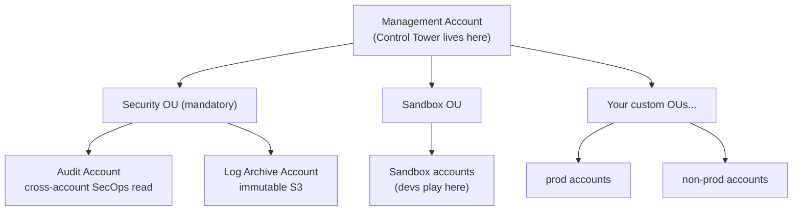
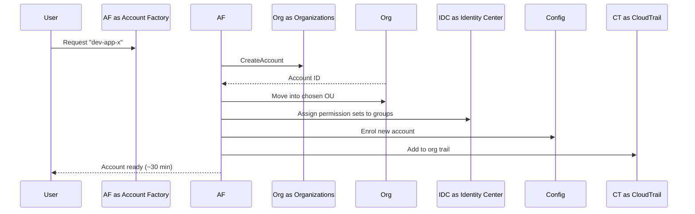

# AWS Control Tower

> AWS's **opinionated, managed landing zone** for setting up and governing a multi-account AWS environment. Sits on top of AWS Organizations and provisions a recommended best-practice baseline in minutes instead of weeks. SAA-C03 frequently tests "how do you set up a new multi-account environment with guardrails."

See also: [06 - IAM Identity Center & Organizations](06%20-%20IAM%20Identity%20Center%20%26%20Organizations.md) · [08 - SCP](08%20-%20SCP.md) · [24 - AWS Config & Audit Manager](24%20-%20AWS%20Config%20%26%20Audit%20Manager.md) · [12 - Data Perimeter Playbook](12%20-%20Data%20Perimeter%20Playbook.md)

---

## Table of Contents

- [1. What Control Tower Is](#1-what-control-tower-is)
- [2. The Landing Zone - What Gets Created](#2-the-landing-zone---what-gets-created)
- [3. Account Factory](#3-account-factory)
- [4. Guardrails - Preventive, Detective, Proactive](#4-guardrails---preventive-detective-proactive)
- [5. Customizations (CfCT) & AFT](#5-customizations-cfct--aft)
- [6. Control Tower vs Just Using Organizations](#6-control-tower-vs-just-using-organizations)
- [7. Exam Tips (SAA-C03)](#7-exam-tips-saa-c03)
- [Summary](#summary)

---

## 1. What Control Tower Is

A managed service that **sets up a multi-account AWS environment** according to AWS best practices, then **continuously enforces guardrails** across the accounts.

| Behind the scenes | Does the work |
| :--- | :--- |
| Account creation, OU moves | AWS Organizations |
| Workforce sign-in | IAM Identity Center |
| Preventive guardrails | Service Control Policies |
| Detective guardrails | AWS Config rules + conformance packs |
| Log centralization | CloudTrail org trail + Config aggregator |

Control Tower doesn't replace Organizations - it's the **opinionated UX + automation** that wires Organizations, Identity Center, Config, and CloudTrail together.

[⬆ Back to top](#table-of-contents)

---

## 2. The Landing Zone - What Gets Created

Created on first setup:

- **Audit Account** - cross-account read for security team (GuardDuty, Security Hub aggregation point)
- **Log Archive Account** - centralized, immutable S3 bucket for CloudTrail + Config logs (the "you can never delete this" account)
- **Default OUs** - Security (mandatory) and Sandbox (recommended)
- **IAM Identity Center** - directory + permission sets
- **CloudTrail organization trail** - every account's events land in Log Archive
- **AWS Config aggregator** - multi-account compliance status visible from the management account

[⬆ Back to top](#table-of-contents)

---

## 3. Account Factory

The **self-service account-vending portal** (console UI, plus API and CloudFormation).

A vended account inherits:

- Every guardrail attached to its OU
- Logging into Log Archive
- Identity Center group-to-permission-set assignments
- An optional Control Tower–baseline VPC (most teams disable this and use a [RAM-shared VPC](16%20-%20Directory%20Service%20%26%20RAM.md) instead)

[⬆ Back to top](#table-of-contents)

---

## 4. Guardrails - Preventive, Detective, Proactive

| Type | Mechanism | Example |
| :--- | :--- | :--- |
| **Preventive** | Implemented as SCPs | "Deny `cloudtrail:DeleteTrail` everywhere" |
| **Detective** | Implemented as AWS Config rules | "Flag any account where root has access keys" |
| **Proactive** | CloudFormation hooks (newer) | "Block a stack that creates an unencrypted EBS volume" |

Three strength levels:

- **Mandatory** - always on, can't disable.
- **Strongly recommended** - AWS's default-on starter set.
- **Elective** - opt-in (region restrictions, S3 BPA, MFA enforcement, etc.).

[⬆ Back to top](#table-of-contents)

---

## 5. Customizations (CfCT) & AFT

| Option | Best for |
| :--- | :--- |
| **Customizations for Control Tower (CfCT)** | Older lifecycle-event–based extension via CodePipeline - push StackSets when accounts enrol |
| **Account Factory for Terraform (AFT)** | Terraform-native account vending - preferred since 2022, IaC-first |
| **CloudFormation StackSets** | Generic - push CFN templates to many accounts, can hook into Control Tower lifecycle events |

[⬆ Back to top](#table-of-contents)

---

## 6. Control Tower vs Just Using Organizations

| You need… | Use… |
| :--- | :--- |
| Multi-account from scratch, batteries-included | **Control Tower** |
| Existing complex org, no desire to rebaseline | **Organizations + custom automation** |
| Just consolidated billing | **Organizations** (without full features) |
| AWS-curated compliance scaffolding (CIS, NIST, PCI) | **Control Tower** + conformance-pack guardrails |

Control Tower can **enrol existing accounts** retroactively, but those accounts inherit all the guardrails on enrolment - preview carefully.

[⬆ Back to top](#table-of-contents)

---

## 7. Exam Tips (SAA-C03)

1. "Multi-account env with guardrails out of the box" → **Control Tower**.
2. "Just consolidated billing" → **Organizations** (not Control Tower).
3. Landing zone trio: **Management + Audit + Log Archive** accounts.
4. **Preventive guardrails = SCPs; Detective guardrails = Config rules; Proactive = CloudFormation hooks.**
5. Control Tower itself is **free** - you pay for the underlying Config, CloudTrail, KMS, Identity Center usage.
6. **Account Factory** is the self-service vending UI; **AFT** is the Terraform flavor.
7. Control Tower runs in the **management account** of the org - orchestration sits there.
8. **Enrolling an existing account** is supported but applies all guardrails - preview impact first.

[⬆ Back to top](#table-of-contents)

---

## Summary

- Control Tower = **Organizations + Identity Center + Config + CloudTrail**, wired together with best-practice defaults.
- Provisions **Management + Audit + Log Archive** accounts and Security/Sandbox OUs.
- **Guardrails:** SCPs (preventive), Config rules (detective), CFN hooks (proactive).
- **Account Factory** vends accounts in clicks; **AFT** does it in Terraform.
- For the exam: any "multi-account landing zone with guardrails" question → Control Tower.

[⬆ Back to top](#table-of-contents)
