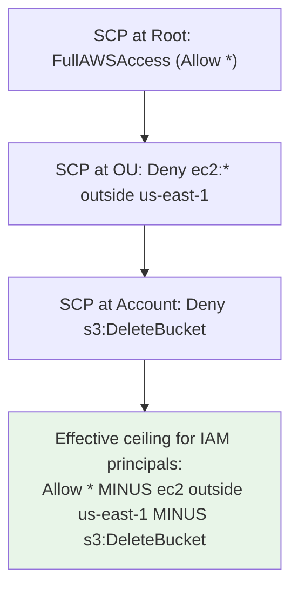

# Service Control Policies (SCPs) - SAA-C03 Deep Dive

> SCPs are **guardrails** that set the maximum permissions for IAM principals across AWS Organizations accounts. They don't grant permissions - they cap them. Critical for the Security domain (30 % of the exam).

See also: [06 - IAM Identity Center & Organizations](06%20-%20IAM%20Identity%20Center%20%26%20Organizations.md) · [09 - RCP](09%20-%20RCP.md) · [10 - Declarative Policies](10%20-%20Declarative%20Policies.md) · [11 - Permissions Boundaries](11%20-%20Permissions%20Boundaries.md) · [23 - IAM Security Tools](23%20-%20IAM%20Security%20Tools.md) · [28 - Ex Qns](28%20-%20Ex%20Qns.md)

---

## Table of Contents

- [Part 1: What Are SCPs? The Core Concept](#part-1-what-are-scps-the-core-concept)
- [Part 2: The Default SCP - FullAWSAccess (Critical Exam Knowledge)](#part-2-the-default-scp---fullawsaccess-critical-exam-knowledge)
- [Part 3: Two Strategy Models (Must Know for Exam)](#part-3-two-strategy-models-must-know-for-exam)
- [Part 4: How SCP Evaluation Works (The Evaluation Logic)](#part-4-how-scp-evaluation-works-the-evaluation-logic)
- [Part 5: Real-World SCP Examples](#part-5-real-world-scp-examples)
- [Part 6: SCPs vs RCPs vs Declarative Policies (New Exam Content)](#part-6-scps-vs-rcps-vs-declarative-policies-new-exam-content)
- [Part 7: Best Practices for the Exam and Real Life](#part-7-best-practices-for-the-exam-and-real-life)
- [Part 8: Exam Scenario Analysis](#part-8-exam-scenario-analysis)
- [Part 9: Creating SCPs (CLI and Terraform)](#part-9-creating-scps-cli-and-terraform)
- [Summary: Key Takeaways for SAA-C03](#summary-key-takeaways-for-saa-c03)

---



---

Service Control Policies (SCPs) are a critical topic on the SAA-C03 exam and a fundamental tool for securing multi-account AWS environments.

---

## Part 1: What Are SCPs? The Core Concept

### Definition

A **Service Control Policy (SCP)** is a type of policy in AWS Organizations that **sets the maximum available permissions** for IAM principals (users and roles) in member accounts.

Think of SCPs as **guardrails** rather than gates. They don't grant permissions themselves, but they define the boundaries within which account administrators can delegate permissions.

### The Critical Analogy

| Layer | What It Does | Who Controls |
| :--- | :--- | :--- |
| **SCP** (Organization) | Sets the *maximum* possible permissions | Organization admin |
| **IAM Policy** (Account) | Grants *actual* permissions within the SCP boundary | Account admin |
| **Effective Permission** | Intersection of SCP allowance + IAM allowance | Both combined |

**Example:**

- SCP allows only S3 and EC2 actions
- IAM policy grants `AdministratorAccess`
- **Effective result:** User can only access S3 and EC2 (not RDS, Lambda, etc.)

### Key Characteristics

| Characteristic | Details |
| :--- | :--- |
| **Scope** | Applies to all IAM principals in member accounts (users, roles, even root users) |
| **What it doesn't affect** | Management account principals, service-linked roles |
| **Cost** | No additional charge for SCPs themselves |
| **Maximum policies per account** | 5 SCPs can be attached at each level (root, OU, account) |
| **Policy size limit** | 5,120 characters (compressed) |

---

## Part 2: The Default SCP - FullAWSAccess (Critical Exam Knowledge)

### What Every Account Starts With

When you create an AWS Organization, AWS automatically attaches a managed SCP called **`FullAWSAccess`** to the root, every OU, and every account. This policy looks like:

```json
{
    "Version": "2012-10-17",
    "Statement": [
        {
            "Effect": "Allow",
            "Action": "*",
            "Resource": "*"
        }
    ]
}
```

**This is the #1 trap on exam questions about SCPs.** Many candidates assume SCPs block everything by default, but actually they allow everything by default.

### The "Implicit Deny" Reality

- **Default state (with FullAWSAccess):** All actions are allowed unless explicitly denied by another SCP
- **Only after removing FullAWSAccess:** All actions become implicitly denied, and you must explicitly allow what you want

**Exam Tip:** If you see a question about why SCPs aren't blocking certain actions, immediately check if `FullAWSAccess` is still attached.

---

## Part 3: Two Strategy Models (Must Know for Exam)

### Deny-List Strategy (Default)

**How it works:** Actions are allowed by default; you specify what to deny.

**Example SCP - Deny DynamoDB access:**

```json
{
    "Version": "2012-10-17",
    "Statement": [
        {
            "Effect": "Deny",
            "Action": "dynamodb:*",
            "Resource": "*"
        }
    ]
}
```

**Characteristics:**

- ✅ Less maintenance - new services automatically allowed
- ✅ Stays within size limits more easily
- ✅ Good for most organizations starting with SCPs

### Allow-List Strategy (Stricter)

**How it works:** Actions are denied by default; you specify what to allow.

**Important Requirements for Allow-List SCPs:**

- Cannot use `Resource` element with anything except `"*"`
- Cannot use `Condition` element at all

**Example SCP - Allow only EC2 and CloudWatch:**

```json
{
    "Version": "2012-10-17",
    "Statement": [
        {
            "Effect": "Allow",
            "Action": [
                "ec2:*",
                "cloudwatch:*"
            ],
            "Resource": "*"
        }
    ]
}
```

**Characteristics:**

- ✅ More secure (explicit allow required)
- ❌ More maintenance (must update when new services needed)
- ❌ Must remove `FullAWSAccess` from all levels

**Exam Tip:** The question may ask "An organization wants to ensure only approved services can be used." This points to an allow-list strategy.

---

## Part 4: How SCP Evaluation Works (The Evaluation Logic)

### The Evaluation Hierarchy

When a request is made from a member account, AWS evaluates **all** SCPs attached to:

1. The organization root
2. Every OU in the path
3. The specific account

### The Override Rule (Critical for Exam)

> **An explicit `Deny` in any SCP overrides all `Allow` statements from any policy.**

**Visualizing the logic:**

```
SCP at Root: Allow ec2:*
SCP at OU: Allow ec2:RunInstances, Deny ec2:TerminateInstances
SCP at Account: Allow ec2:*

Effective = Can RunInstances, Cannot TerminateInstances
(The explicit Deny at OU overrides any Allow elsewhere)
```

### Combining SCPs with IAM Policies

This is the most important concept for the exam:

| Policy Type | Effect | Override Rule |
| :--- | :--- | :--- |
| SCP (Deny) | Blocks action regardless of IAM permissions | ✅ Explicit Deny overrides all |
| SCP (Allow) | Permits action only if IAM also allows | Intersection with IAM |
| IAM Policy (Allow) | Permits action only if SCP allows | Intersection with SCP |
| IAM Policy (Deny) | Blocks action within SCP boundary | Overrides SCP Allow |

**The formula for effective permissions:**

```
Effective = (Allowed by SCP ∩ Allowed by IAM) OR (Denied by SCP OR Denied by IAM)
```

**In plain English:** An action is allowed **only if** every SCP in the path AND the IAM policy allow it.

---

## Part 5: Real-World SCP Examples

### Example 1: Restrict to Specific Regions

This SCP blocks all actions in any region except us-east-1 and us-west-2:

```json
{
    "Version": "2012-10-17",
    "Statement": [
        {
            "Effect": "Deny",
            "Action": "*",
            "Resource": "*",
            "Condition": {
                "StringNotEquals": {
                    "aws:RequestedRegion": ["us-east-1", "us-west-2"]
                }
            }
        }
    ]
}
```

**Use case:** Prevent developers from accidentally launching resources in unintended regions.

### Example 2: Block AI Service Access

This SCP denies access to Bedrock services (AWS's AI platform) except in approved regions:

```json
{
    "Version": "2012-10-17",
    "Statement": [
        {
            "Effect": "Deny",
            "Action": [
                "bedrock:*",
                "bedrock-mantle:*"
            ],
            "Resource": "*",
            "Condition": {
                "StringNotEquals": {
                    "aws:RequestedRegion": ["us-east-1", "us-west-2"]
                }
            }
        }
    ]
}
```

### Example 3: Block MCP Server Access (Latest Feature)

AWS now has managed MCP (Model Context Protocol) servers. This SCP blocks AI agents from making AWS API calls through these services:

```json
{
    "Version": "2012-10-17",
    "Statement": [
        {
            "Sid": "DenyWhenAccessedViaMCP",
            "Effect": "Deny",
            "Action": "*",
            "Resource": "*",
            "Condition": {
                "Bool": {
                    "aws:ViaAWSMCPService": "true"
                }
            }
        }
    ]
}
```

### Example 4: Prevent Deletion of CloudTrail Logs

```json
{
    "Version": "2012-10-17",
    "Statement": [
        {
            "Effect": "Deny",
            "Action": [
                "cloudtrail:DeleteTrail",
                "cloudtrail:StopLogging",
                "s3:DeleteObject"
            ],
            "Resource": "*",
            "Condition": {
                "StringLike": {
                    "s3:prefix": "cloudtrail-logs/"
                }
            }
        }
    ]
}
```

---

## Part 6: SCPs vs RCPs vs Declarative Policies (New Exam Content)

AWS has added two additional policy types that work alongside SCPs. This is **new exam content** appearing in SAA-C03.

| Policy Type | Governs | What It Controls |
| :--- | :--- | :--- |
| **SCP** | IAM principals (users/roles) | Maximum permissions for identities |
| **RCP** (Resource Control Policy) | AWS resources | Who can access your resources |
| **Declarative Policy** | Service configuration | Enforces specific configurations (like block public access) |

### When to Use Each

**Use SCP when you need to:**

- Restrict what IAM principals can do across your organization
- Prevent access to specific services or actions
- Enforce conditions on how principals can make requests

**Use RCP when you need to:**

- Restrict who can access your resources (even external principals)
- Enforce requirements on how resources can be accessed

**Use Declarative Policy when you need to:**

- Enforce consistent service configurations (when available for that service)
- Automatically maintain configurations even after API changes

### The Data Perimeter Concept

SCPs and RCPs work together to create a **data perimeter**:

- **SCPs** restrict which resources your identities can access
- **RCPs** restrict who can access your resources

---

## Part 7: Best Practices for the Exam and Real Life

### 1. Always Start with Deny-List

Unless the scenario specifically mentions "allow-list" or "strict control," assume deny-list is the approach.

### 2. Test Before Deploying

Use a separate test OU before applying SCPs to production.

### 3. Use Service Last Accessed Data

Review which services principals actually use before restricting them.

### 4. Remember the Management Account Exception

**SCPs do NOT apply to the management account of the organization**. This is a common exam trap.

### 5. Consider Policy Size Limits

- Maximum 5 SCPs per level (root, OU, account)
- Maximum 5,120 characters per SCP

### 6. Use Conditions Appropriately

Conditions in SCPs are powerful but have limitations. Allow-list SCPs cannot use conditions at all.

---

## Part 8: Exam Scenario Analysis

### Scenario 1: The "Not Working" SCP

**Question:** An organization attached an SCP to deny `s3:DeleteBucket`, but users can still delete buckets. Why?

**Answer:** The `FullAWSAccess` SCP (allowing everything) is still attached to the account or an ancestor OU. The explicit Deny should still work, but if the Deny syntax is wrong OR if users are in the management account (SCPs don't apply), that could also be the answer.

### Scenario 2: Cross-Account Access Restriction

**Question:** How do you prevent principals in Account A from accessing any resources in Account B?

**Answer:** Attach an SCP to Account A (or its OU/root) that denies actions on resources outside a specific organization or account using `aws:ResourceOrgID` or `aws:ResourceAccount` condition keys.

### Scenario 3: New Service Introduction

**Question:** An organization uses deny-list SCPs. A new AWS service launches. Can users access it?

**Answer:** Yes. Deny-list allows all by default. No SCP update is needed.

---

## Part 9: Creating SCPs (CLI and Terraform)

### Using AWS CLI

```bash
# Create a policy from JSON file
aws organizations create-policy \
    --content file://policy.json \
    --name "DenyUnapprovedRegions" \
    --type SERVICE_CONTROL_POLICY \
    --description "Blocks all actions in unapproved regions"

# Attach to an OU
aws organizations attach-policy \
    --policy-id p-example123 \
    --target-id ou-exampleroot123
```

### Using Terraform

```hcl
resource "aws_organizations_policy" "deny_dynamodb" {
  name        = "DenyDynamoDB"
  description = "Prevents DynamoDB access across organization"
  type        = "SERVICE_CONTROL_POLICY"
  
  content = jsonencode({
    Version = "2012-10-17"
    Statement = [
      {
        Effect = "Deny"
        Action = "dynamodb:*"
        Resource = "*"
      }
    ]
  })
}

resource "aws_organizations_policy_attachment" "attach_to_root" {
  policy_id = aws_organizations_policy.deny_dynamodb.id
  target_id = var.organization_root_id
}
```

---

## Summary: Key Takeaways for SAA-C03

| Concept | What You Must Know |
| :--- | :--- |
| **Default SCP** | `FullAWSAccess` allows everything by default |
| **Deny override** | Explicit Deny in any SCP overrides all Allows |
| **Management account** | SCPs don't apply here |
| **Effective permissions** | Intersection of SCP + IAM policies |
| **Two strategies** | Deny-list (default) vs Allow-list (requires removing FullAWSAccess) |
| **Limitations** | Cannot grant permissions, only restrict them |
| **Size limits** | 5 policies per level, 5,120 characters per policy |
