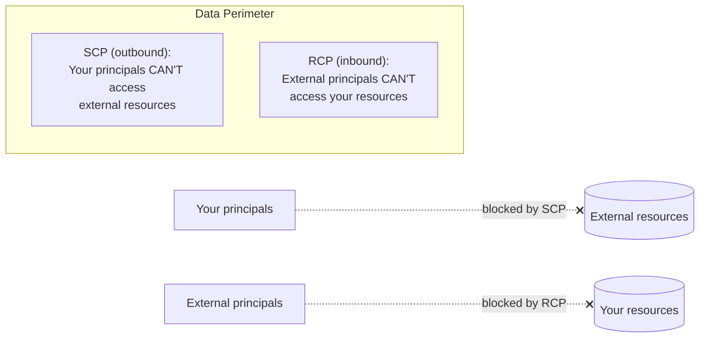

# Resource Control Policies (RCPs) - SAA-C03 Deep Dive

> RCPs cap who can **access your resources** (mirror image of SCPs, which cap what your principals can **do**). Together they form the **data perimeter** pattern. New exam content from 2025 onward - Security domain.

See also: [08 - SCP](08%20-%20SCP.md) · [10 - Declarative Policies](10%20-%20Declarative%20Policies.md) · [11 - Permissions Boundaries](11%20-%20Permissions%20Boundaries.md) · [19 - IAM Cross Account Access](19%20-%20IAM%20Cross%20Account%20Access.md) · [23 - IAM Security Tools](23%20-%20IAM%20Security%20Tools.md) · [28 - Ex Qns](28%20-%20Ex%20Qns.md)

---

## Table of Contents

- [Part 1: What Are RCPs? The Core Concept](#part-1-what-are-rcps-the-core-concept)
- [Part 2: RCP vs SCP vs IAM vs Declarative Policy (The Complete Picture)](#part-2-rcp-vs-scp-vs-iam-vs-declarative-policy-the-complete-picture)
- [Part 3: How RCPs Work (Evaluation Logic)](#part-3-how-rcps-work-evaluation-logic)
- [Part 4: The Two RCP Strategies](#part-4-the-two-rcp-strategies)
- [Part 5: Real-World RCP Examples for SAA-C03](#part-5-real-world-rcp-examples-for-saa-c03)
- [Part 6: RCPs vs SCPs - The Comparison Table](#part-6-rcps-vs-scps---the-comparison-table)
- [Part 7: The Data Perimeter (SCP + RCP Together)](#part-7-the-data-perimeter-scp--rcp-together)
- [Part 8: Exam Scenario Analysis](#part-8-exam-scenario-analysis)
- [Part 9: RCP Limitations (Exam Critical)](#part-9-rcp-limitations-exam-critical)
- [Part 10: Creating RCPs (CLI and Terraform)](#part-10-creating-rcps-cli-and-terraform)
- [Summary: RCPs for SAA-C03](#summary-rcps-for-saa-c03)

---



---

Resource Control Policies (RCPs) are the **newest** addition to AWS's policy family (announced late 2024, appearing in exams from 2025 onward). They represent a fundamental shift in how AWS handles cross-account and external access.

---

## Part 1: What Are RCPs? The Core Concept

### Definition

A **Resource Control Policy (RCP)** is a policy in AWS Organizations that **sets maximum permissions for AWS resources** in member accounts. While SCPs control what *principals* can do, RCPs control what *resources* can be accessed and by whom.

**The Simple Analogy:**

- **SCP:** "What can my users do?"
- **RCP:** "Who can access my resources?"

### Why RCPs Were Created (The Pre-RCP Problem)

Before RCPs, securing resources across an organization was asymmetric:

| What You Wanted to Block | How You Had to Do It |
| :--- | :--- |
| Principal in Account A accessing Resource in Account B | SCP on Account A (deny cross-account) |
| Principal outside your organization accessing any resource | Resource policy on every resource (e.g., S3 bucket policy) OR SCP with `aws:PrincipalOrgID` condition |

**The problem with the old approach:** Resource policies had to be attached to *every single resource*. With thousands of S3 buckets, this was nearly impossible to enforce.

**RCP solves this** by allowing you to apply the policy once at the organization level.

---

## Part 2: RCP vs SCP vs IAM vs Declarative Policy (The Complete Picture)

| Policy Type | Attached To | Controls | Who It Restricts |
| :--- | :--- | :--- | :--- |
| **SCP** | Organization, OU, Account | What principals can do | Principals in member accounts |
| **RCP** | Organization, OU, Account | Who can access resources | Principals outside the resource's account (including cross-account and external) |
| **IAM Policy** | IAM principal (user/role) | What that specific principal can do | That specific principal |
| **Resource Policy** | Specific resource (S3 bucket, SQS queue, etc.) | Who can access that resource | All principals |
| **Declarative Policy** | Organization, OU, Account | Service configuration | Service behavior |

**Critical distinction:** RCPs apply to **resources**, not to principals. An RCP attached to an OU affects all resources in accounts within that OU.

---

## Part 3: How RCPs Work (Evaluation Logic)

### The Four-Layer Evaluation

When a principal tries to access a resource, AWS evaluates **all four** of these layers:

```
Layer 1: RCP (Resource's account) ─────────────┐
Layer 2: Resource Policy (attached to resource) ├── Must ALLOW the request
Layer 3: SCP (Principal's account) ─────────────┤
Layer 4: IAM Policy (Principal's identity) ─────┘
```

**The Rule:** All four layers must Allow the request. Any Deny at any layer = Deny.

### RCP-Specific Evaluation Details

| Principal Location | Resource Location | Does RCP Apply? |
| :--- | :--- | :--- |
| Same account as resource | Same account | ✅ Yes (but often irrelevant since resource policies inside account are already allowed) |
| Different account (same organization) | Member account | ✅ Yes |
| Different AWS account (external) | Member account | ✅ Yes |
| On-premises (IAM Roles Anywhere) | Member account | ✅ Yes |
| Management account | Member account | ⚠️ SCPs don't apply, but RCPs **do** apply |

**Exam Tip:** RCPs apply to the management account accessing resources in member accounts. This is different from SCPs.

---

## Part 4: The Two RCP Strategies

### Strategy 1: Deny-List RCP (Default)

**How it works:** External access is allowed by default; you specify what to deny.

**Example RCP - Deny access from outside your organization:**

```json
{
    "Version": "2012-10-17",
    "Statement": [
        {
            "Effect": "Deny",
            "Principal": "*",
            "Action": "*",
            "Resource": "*",
            "Condition": {
                "StringNotEquals": {
                    "aws:PrincipalOrgID": "o-your-organization-id"
                }
            }
        }
    ]
}
```

**Effect:** Any principal not in your organization is denied access to *every resource* in accounts under this RCP.

### Strategy 2: Allow-List RCP (Stricter)

**How it works:** External access is denied by default; you specify what to allow.

**Requirements for Allow-List RCPs:**

- Cannot use `Principal` element (implied to be any principal)
- Must remove any default allow policies

**Example RCP - Allow only specific external accounts:**

```json
{
    "Version": "2012-10-17",
    "Statement": [
        {
            "Effect": "Allow",
            "Action": "*",
            "Resource": "*",
            "Condition": {
                "StringEquals": {
                    "aws:PrincipalAccount": [
                        "222222222222",
                        "333333333333"
                    ]
                }
            }
        }
    ]
}
```

---

## Part 5: Real-World RCP Examples for SAA-C03

### Example 1: Data Perimeter - Block All External Access

**Scenario:** Your organization has sensitive data in S3. No principal outside your organization should access any resource.

**RCP:**

```json
{
    "Version": "2012-10-17",
    "Statement": [
        {
            "Effect": "Deny",
            "Principal": "*",
            "Action": "*",
            "Resource": "*",
            "Condition": {
                "StringNotEquals": {
                    "aws:PrincipalOrgID": "o-xxxxxxxxxx"
                }
            }
        }
    ]
}
```

**What this does:**

- Principals in your organization: Can access resources (subject to SCPs and IAM)
- Principals outside your organization: Cannot access *any* resource in affected accounts

**Exam Tip:** This pattern appears frequently. The condition `aws:PrincipalOrgID` is the key to identifying organization-only access.

### Example 2: Allow Only VPC-Based Access

**Scenario:** All access to your resources must come from within your managed VPCs (no internet access).

**RCP:**

```json
{
    "Version": "2012-10-17",
    "Statement": [
        {
            "Effect": "Deny",
            "Principal": "*",
            "Action": "*",
            "Resource": "*",
            "Condition": {
                "StringNotEqualsIfExists": {
                    "aws:SourceVpc": "vpc-12345678"
                },
                "BoolIfExists": {
                    "aws:ViaAWSService": "false"
                }
            }
        }
    ]
}
```

### Example 3: Block Specific Actions on S3 Across All Accounts

**Scenario:** No one (internal or external) should be able to delete S3 version data.

**RCP:**

```json
{
    "Version": "2012-10-17",
    "Statement": [
        {
            "Effect": "Deny",
            "Principal": "*",
            "Action": [
                "s3:DeleteObjectVersion",
                "s3:DeleteBucket"
            ],
            "Resource": "arn:aws:s3:::*"
        }
    ]
}
```

**Key difference from SCP:** This RCP blocks *even the resource owner* if they try to delete version data. An SCP could be bypassed if the principal is in the management account, but RCP cannot.

### Example 4: MCP Service Protection (2026 Exam Content)

AWS now has managed MCP (Model Context Protocol) servers for AI agents. This RCP prevents AI agents from accessing resources through MCP servers:

```json
{
    "Version": "2012-10-17",
    "Statement": [
        {
            "Effect": "Deny",
            "Principal": "*",
            "Action": "*",
            "Resource": "*",
            "Condition": {
                "Bool": {
                    "aws:ViaAWSMCPService": "true"
                }
            }
        }
    ]
}
```

---

## Part 6: RCPs vs SCPs - The Comparison Table

| Aspect | SCP | RCP |
| :--- | :--- | :--- |
| **Primary purpose** | Restrict what principals can do | Restrict who can access resources |
| **Applies to** | Principals in member accounts | Resources in member accounts |
| **Controls** | Service actions (EC2, S3, etc.) | Access to resources |
| **Can block resource owner?** | No (owner in same account bypasses? Actually no, SCP applies to all principals including root in member accounts) | Yes (applies to ALL access to the resource) |
| **Management account** | Not affected | Affected (when accessing member account resources) |
| **External principals** | Can block (via conditions) | Primary use case |
| **Key condition key** | `aws:PrincipalAccount` | `aws:PrincipalOrgID` |

---

## Part 7: The Data Perimeter (SCP + RCP Together)

The concept of a **data perimeter** combines SCPs and RCPs to create complete control over data flow.

### Data Perimeter Components

| Direction | Control | Policy Type |
| :--- | :--- | :--- |
| **Outbound** (your principals accessing external resources) | Restrict which external resources your principals can access | SCP with `aws:ResourceAccount` condition |
| **Inbound** (external principals accessing your resources) | Restrict who can access your resources | RCP with `aws:PrincipalOrgID` condition |

### Complete Data Perimeter Example

**SCP (on all accounts) - Restrict outbound:**

```json
{
    "Effect": "Deny",
    "Action": "*",
    "Resource": "*",
    "Condition": {
        "StringNotEquals": {
            "aws:ResourceOrgID": "o-your-organization-id"
        }
    }
}
```

**RCP (on all accounts) - Restrict inbound:**

```json
{
    "Effect": "Deny",
    "Principal": "*",
    "Action": "*",
    "Resource": "*",
    "Condition": {
        "StringNotEquals": {
            "aws:PrincipalOrgID": "o-your-organization-id"
        }
    }
}
```

**Together:** Your principals cannot access resources outside your organization, and external principals cannot access resources inside your organization.

---

## Part 8: Exam Scenario Analysis

### Scenario 1: The "RCP Not Working" Question

**Question:** An organization attached an RCP to deny access from external principals, but a principal from another AWS account can still access an S3 bucket. Why?

**Possible answers (exam traps):**

1. The bucket has an explicit `Allow` in its resource policy - ✅ **Correct answer:** Resource policy Allow overrides RCP Deny? No - Deny always wins. Actually, RCP Deny should override. If it's not working, the RCP might be attached at the wrong level or the condition is wrong.
2. The RCP was attached at the organization root, but a more permissive RCP at the account level overrides - ❌ Wrong - RCPs, like SCPs, have explicit Deny that overrides any Allow
3. The principal is in the management account accessing a member account resource - ✅ **Correct answer:** This is tricky. RCPs DO apply to management account accessing member resources. But the question might be testing that you know this.

**Correct diagnostic approach:** Check if `FullAWSResourceAccess` (the RCP equivalent of `FullAWSAccess`) is still attached. By default, all accounts have an allow-all RCP.

### Scenario 2: Cross-Account vs External Principal

**Question:** An RCP denies access from `aws:PrincipalOrgID` values not matching the organization. A principal in a different AWS account that is NOT in the organization attempts access. What happens?

**Answer:** Denied. The condition `StringNotEquals` with `aws:PrincipalOrgID` will fail for any principal whose organization ID doesn't match.

### Scenario 3: RCP + Resource Policy Conflict

**Question:** An S3 bucket has a resource policy explicitly allowing `"Principal": "*"`. An RCP attached to the bucket's account denies access from external principals. Can an external principal access the bucket?

**Answer:** No. RCP evaluation happens **before** resource policy evaluation? Actually evaluation order isn't strictly defined, but explicit Deny at any layer = Deny. The RCP's Deny overrides the resource policy's Allow.

---

## Part 9: RCP Limitations (Exam Critical)

| Limitation | Details |
| :--- | :--- |
| **Service support** | Not all services support RCPs. Supported: S3, SQS, SNS, Lambda (in some configurations), KMS, DynamoDB, ECR |
| **Resource types** | Only specific resource types within supported services |
| **Management account** | RCPs **do** apply when management account accesses member resources (unlike SCPs) |
| **Size limits** | Same as SCPs: 5 policies per level, 5,120 characters per policy |
| **Cannot grant permissions** | Like SCPs, RCPs only restrict, never grant |

---

## Part 10: Creating RCPs (CLI and Terraform)

### Using AWS CLI

```bash
# Create an RCP
aws organizations create-policy \
    --content file://data-perimeter-rcp.json \
    --name "DataPerimeterRCP" \
    --type RESOURCE_CONTROL_POLICY \
    --description "Blocks all external access to resources"

# Attach to an OU
aws organizations attach-policy \
    --policy-id p-rcp12345 \
    --target-id ou-abc12345
```

### Using Terraform

```hcl
resource "aws_organizations_policy" "data_perimeter_rcp" {
  name        = "DataPerimeterRCP"
  description = "Blocks external access to all resources"
  type        = "RESOURCE_CONTROL_POLICY"
  
  content = jsonencode({
    Version = "2012-10-17"
    Statement = [
      {
        Effect = "Deny"
        Principal = "*"
        Action = "*"
        Resource = "*"
        Condition = {
          StringNotEquals = {
            "aws:PrincipalOrgID" = var.organization_id
          }
        }
      }
    ]
  })
}
```

---

## Summary: RCPs for SAA-C03

| Concept | Key Takeaway |
| :--- | :--- |
| **What RCPs control** | Who can access resources (not what principals can do) |
| **Default policy** | `FullAWSResourceAccess` allows all access by default |
| **Key condition** | `aws:PrincipalOrgID` for organization-level access control |
| **RCP vs SCP** | RCP on resources, SCP on principals |
| **Data perimeter** | RCP + SCP together |
| **Management account** | RCPs apply (unlike SCPs) |
| **Deny overrides** | Explicit Deny in RCP overrides any Allow in resource policies |

---

## Quick Reference: Which Policy to Use?

| You Want To... | Use... |
| :--- | :--- |
| Prevent users from launching expensive EC2 instances | SCP |
| Prevent anyone (including resource owners) from deleting CloudTrail logs | RCP |
| Force all S3 buckets to be private | Declarative Policy |
| Block external principals from accessing any resource in your organization | RCP |
| Block your principals from accessing external resources | SCP |
| Give a specific user read-only access to a specific bucket | IAM policy |
