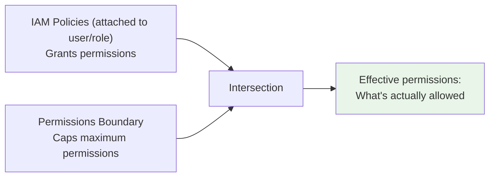

# Permissions Boundaries - The Delegation Safety Net

> Permissions Boundaries cap the **maximum permissions** a single IAM user or role can have. They don't grant - they ceiling. The "if you give a junior admin the ability to create IAM users, here's how you stop them from creating a god-mode user" tool. Critical for the SAA-C03 Security domain.

See also: [08 - SCP](08%20-%20SCP.md) · [09 - RCP](09%20-%20RCP.md) · [10 - Declarative Policies](10%20-%20Declarative%20Policies.md) · [02 - IAM Components](02%20-%20IAM%20Components.md) · [23 - IAM Security Tools](23%20-%20IAM%20Security%20Tools.md) · [28 - Ex Qns](28%20-%20Ex%20Qns.md)

---

## Table of Contents

- [Part 1: What Are Permissions Boundaries? The Core Concept](#part-1-what-are-permissions-boundaries-the-core-concept)
- [Part 2: How Permissions Boundaries Work (The Evaluation Logic)](#part-2-how-permissions-boundaries-work-the-evaluation-logic)
- [Part 3: Permissions Boundaries vs SCPs vs IAM Policies](#part-3-permissions-boundaries-vs-scps-vs-iam-policies)
- [Part 4: The Primary Use Case - Delegating IAM Administration](#part-4-the-primary-use-case---delegating-iam-administration)
- [Part 5: Real-World Exam Scenarios](#part-5-real-world-exam-scenarios)
- [Part 6: Advanced Boundary Patterns](#part-6-advanced-boundary-patterns)
- [Part 7: Boundaries vs Service Control Policies (SCPs) vs Resource Control Policies (RCPs)](#part-7-boundaries-vs-service-control-policies-scps-vs-resource-control-policies-rcps)
- [Part 8: Implementing Permissions Boundaries](#part-8-implementing-permissions-boundaries)
- [Part 9: Limitations and Gotchas (Exam Critical)](#part-9-limitations-and-gotchas-exam-critical)
- [Part 10: Common Exam Questions Pattern](#part-10-common-exam-questions-pattern)
- [Summary: Key Takeaways for SAA-C03](#summary-key-takeaways-for-saa-c03)
- [Quick Reference: When to Use What](#quick-reference-when-to-use-what)

---



> **Mental model:** Boundary acts as a height-limit bar at the parking garage entrance - your specific IAM policy is your assigned parking spot. You can only park if **both** allow.

---

Permissions Boundaries are one of the most **misunderstood but powerful** IAM features. They're absolutely critical for the SAA-C03 exam when the scenario involves **delegating IAM administration** or **controlling maximum permissions** for specific users/roles.

---

## Part 1: What Are Permissions Boundaries? The Core Concept

### Definition

A **Permissions Boundary** is an advanced IAM feature that sets the **maximum permissions** an IAM entity (user or role) can have. It acts as a **ceiling** - no policy attached to the entity can grant permissions beyond what the boundary allows.

### The Simple Analogy

Think of permissions like a **parking garage**:

| Layer | Analogy | Who Sets It |
| :--- | :--- | :--- |
| **Permissions Boundary** | Height limit bar at entrance (max 6'6") | Organization security team |
| **IAM Policy** | Your specific parking spot assignment | Manager/delegated admin |
| **Effective Permission** | Can you park? Only if your vehicle height is ≤ 6'6" AND you have a spot | Both together |

A monster truck (user wanting admin access) hits the height limit bar regardless of what spot they're assigned.

### Key Characteristics

| Characteristic | Details |
| :--- | :--- |
| **What it restricts** | Maximum permissions for a specific user or role |
| **What it doesn't do** | Grant any permissions by itself |
| **Where it attaches** | Directly to an IAM user or role (not groups) |
| **Evaluation order** | Intersection of Boundary AND identity-based policy |
| **SCP relationship** | SCPs apply at organization level; Boundaries apply to specific entities |

---

## Part 2: How Permissions Boundaries Work (The Evaluation Logic)

### The Three-Layer Evaluation

When a principal makes a request, AWS evaluates:

```
Layer 1: SCP (Organization level) ────────────┐
Layer 2: Permissions Boundary (User/Role level) ├── ALL must allow
Layer 3: Identity-Based Policy (User/Role/Group) ┘
```

**The Formula:**

```
Effective Permission = (SCP Allow) ∩ (Boundary Allow) ∩ (IAM Policy Allow)
```

**If any layer denies = Deny. If any layer doesn't allow (implicit deny) = Deny.**

### The Critical Insight

A permissions boundary **never grants permissions**. It only **limits** what identity-based policies can grant.

**Example:**

- Permissions Boundary allows: `["s3:*", "ec2:Describe*"]`
- IAM Policy allows: `["ec2:*", "rds:*"]`
- **Effective:** User can do `s3:*` + `ec2:Describe*` (EC2 write actions blocked by boundary; RDS completely blocked)

---

## Part 3: Permissions Boundaries vs SCPs vs IAM Policies

| Aspect | Permissions Boundary | SCP | IAM Policy |
| :--- | :--- | :--- | :--- |
| **Attached to** | Specific IAM user or role | Organization, OU, or account | User, group, or role |
| **Scope** | Single entity | All principals in account/OU | Specific entities |
| **Purpose** | Limit maximum permissions | Set organization guardrails | Grant actual permissions |
| **Can grant permissions?** | No (only limits) | No (only limits) | Yes |
| **Use case** | Delegating IAM admin | Compliance across accounts | Day-to-day access |

**Exam Tip:** The exam loves asking the difference between these three. Remember:

- **SCP:** "No one in this account can do X"
- **Boundary:** "This specific delegated admin cannot give permissions beyond Y"
- **IAM Policy:** "This user can do Z"

---

## Part 4: The Primary Use Case - Delegating IAM Administration

This is **the most important exam scenario** for permissions boundaries.

### The Problem Without Boundaries

You want to give a developer (Alice) the ability to **create IAM users** for her team. But you don't want her to:

- Create admin users
- Give permissions she doesn't have herself
- Escalate her own privileges

**Without boundaries:** If Alice can create IAM users, she could create a user with `AdministratorAccess` and escalate her privileges.

### The Solution With Boundaries

You create a permissions boundary that limits **any user or role Alice creates** to a specific set of permissions.

**Step 1: Create the Permissions Boundary Policy**

This boundary will be applied to **every IAM entity Alice creates**:

```json
{
    "Version": "2012-10-17",
    "Statement": [
        {
            "Effect": "Allow",
            "Action": [
                "s3:GetObject",
                "s3:PutObject",
                "s3:ListBucket",
                "ec2:DescribeInstances",
                "ec2:StartInstances",
                "ec2:StopInstances",
                "cloudwatch:GetMetricData",
                "logs:GetLogEvents"
            ],
            "Resource": "*"
        },
        {
            "Effect": "Deny",
            "Action": [
                "iam:CreateUser",
                "iam:DeleteUser",
                "iam:CreateRole",
                "iam:AttachUserPolicy",
                "iam:AttachRolePolicy"
            ],
            "Resource": "*"
        }
    ]
}
```

**Step 2: Create Alice's IAM Policy (What she can do)**

```json
{
    "Version": "2012-10-17",
    "Statement": [
        {
            "Effect": "Allow",
            "Action": [
                "iam:CreateUser",
                "iam:CreateAccessKey",
                "iam:CreateLoginProfile",
                "iam:AttachUserPolicy"
            ],
            "Resource": "*",
            "Condition": {
                "ArnEquals": {
                    "iam:PermissionsBoundary": "arn:aws:iam::123456789012:policy/DeveloperBoundary"
                }
            }
        }
    ]
}
```

**Step 3: Apply the Boundary to Alice Herself (Optional but Recommended)**

Attach the same boundary directly to Alice's user. This ensures Alice herself cannot exceed the boundary.

**Step 4: Alice Creates a New User**

When Alice runs:

```bash
aws iam create-user --user-name bob
aws iam attach-user-policy --user-name bob --policy-arn arn:aws:iam::aws:policy/AmazonS3ReadOnlyAccess
aws iam put-user-permissions-boundary --user-name bob --policy-arn arn:aws:iam::123456789012:policy/DeveloperBoundary
```

**What Bob can actually do:**

- Bob's S3 read-only policy is limited by the boundary
- Bob cannot access EC2 (boundary allows EC2 describe, but his policy doesn't grant it)
- Bob cannot create IAM users (boundary explicitly denies this)

---

## Part 5: Real-World Exam Scenarios

### Scenario 1: The Delegation Question (Most Common)

**Question:** A company wants to allow junior administrators to create IAM roles for developers. These roles should only be able to read from S3 and write to CloudWatch Logs. What should the company do?

**Answer:**

1. Create a permissions boundary policy allowing only `s3:GetObject` and `logs:CreateLogGroup`, `logs:CreateLogStream`, `logs:PutLogEvents`
2. Grant junior admins permission to `iam:CreateRole` and `iam:AttachRolePolicy` **with a condition** requiring they attach the boundary
3. Apply the boundary to every role they create

**Condition in junior admin's policy:**

```json
"Condition": {
    "ArnEquals": {
        "iam:PermissionsBoundary": "arn:aws:iam::123456789012:policy/DeveloperBoundary"
    }
}
```

### Scenario 2: The Privilege Escalation Prevention

**Question:** An IAM user has a permissions boundary that allows only S3 read access. They have an IAM policy that allows `iam:CreateUser` and `iam:AttachUserPolicy`. Can they create a new user with AdministratorAccess?

**Answer:** No, they can create the user, but **any policy they attach to the new user** is still limited by the boundary. The boundary applies to the new user just like it applies to the creator. This prevents privilege escalation.

### Scenario 3: SCP + Boundary Interaction

**Question:** An SCP denies all DynamoDB actions. A user has a permissions boundary that allows DynamoDB actions. The user's IAM policy allows DynamoDB actions. Can the user access DynamoDB?

**Answer:** No. SCP Deny overrides everything. The SCP is evaluated first and denies the request before the boundary or IAM policy are considered.

---

## Part 6: Advanced Boundary Patterns

### Pattern 1: Project-Based Isolation

Allow a delegated admin to create users for specific projects, but each project's users can only access project-specific resources:

```json
{
    "Version": "2012-10-17",
    "Statement": [
        {
            "Effect": "Allow",
            "Action": [
                "s3:*",
                "dynamodb:*"
            ],
            "Resource": [
                "arn:aws:s3:::project-${aws:PrincipalTag/project}",
                "arn:aws:s3:::project-${aws:PrincipalTag/project}/*",
                "arn:aws:dynamodb:us-east-1:123456789012:table/project-${aws:PrincipalTag/project}"
            ]
        }
    ]
}
```

**How it works:** The delegated admin applies the boundary and sets a tag `project=alpha` on the new user. That user can only access resources with `project-alpha` in the name.

### Pattern 2: Temporary Elevated Access

Create a boundary that allows admin permissions but with an expiration condition:

```json
{
    "Version": "2012-10-17",
    "Statement": [
        {
            "Effect": "Allow",
            "Action": "*",
            "Resource": "*",
            "Condition": {
                "DateLessThan": {
                    "aws:CurrentTime": "2025-12-31T23:59:59Z"
                }
            }
        }
    ]
}
```

**Use case:** Break-glass emergency access that expires automatically.

### Pattern 3: Service Control for Contractors

Apply a boundary that limits contractors to specific IP ranges and requires MFA:

```json
{
    "Version": "2012-10-17",
    "Statement": [
        {
            "Effect": "Allow",
            "Action": "*",
            "Resource": "*",
            "Condition": {
                "IpAddress": {
                    "aws:SourceIp": "203.0.113.0/24"
                },
                "Bool": {
                    "aws:MultiFactorAuthPresent": "true"
                }
            }
        }
    ]
}
```

---

## Part 7: Boundaries vs Service Control Policies (SCPs) vs Resource Control Policies (RCPs)

This comparison is **critical for the exam**:

| Aspect | Permissions Boundary | SCP | RCP |
| :--- | :--- | :--- | :--- |
| **Scope** | Single IAM user or role | All principals in OU/account | All resources in OU/account |
| **Who creates** | Account admin (or delegated admin with permission) | Organization management account | Organization management account |
| **Can be bypassed by management account?** | Yes (management account not affected by boundaries applied to others? Actually boundaries apply regardless of account) | No (but management account principals are exempt) | No (applies to all access to resources) |
| **Use case** | Delegating user/role creation | Organization-wide compliance | Data perimeter |
| **Attach to groups?** | No (users/roles only) | Yes (to OUs/accounts) | Yes (to OUs/accounts) |

**Exam Trick:** The question may describe a scenario where a delegated admin needs to create roles with restrictions. The answer will involve permissions boundaries, not SCPs (because SCPs apply to everyone, not just the created roles).

---

## Part 8: Implementing Permissions Boundaries

### Using AWS CLI

```bash
# Create the boundary policy
aws iam create-policy \
    --policy-name DeveloperBoundary \
    --policy-document file://boundary.json

# Apply boundary to an existing user
aws iam put-user-permissions-boundary \
    --user-name alice \
    --policy-arn arn:aws:iam::123456789012:policy/DeveloperBoundary

# Apply boundary to a role
aws iam put-role-permissions-boundary \
    --role-name LambdaExecutionRole \
    --policy-arn arn:aws:iam::123456789012:policy/LambdaBoundary

# Remove boundary
aws iam delete-user-permissions-boundary --user-name alice
```

### Using Terraform

```hcl
# Create the boundary policy
resource "aws_iam_policy" "developer_boundary" {
  name        = "DeveloperBoundary"
  description = "Maximum permissions for developer-created users"
  policy = jsonencode({
    Version = "2012-10-17"
    Statement = [
      {
        Effect = "Allow"
        Action = [
          "s3:GetObject",
          "s3:PutObject",
          "ec2:DescribeInstances"
        ]
        Resource = "*"
      }
    ]
  })
}

# Apply boundary to a user
resource "aws_iam_user_policy_attachment" "alice_boundary" {
  user       = aws_iam_user.alice.name
  policy_arn = aws_iam_policy.developer_boundary.arn
}

# Note: This attaches the policy AS a boundary
# In Terraform, use aws_iam_user_permissions_boundary resource
resource "aws_iam_user_permissions_boundary" "alice" {
  user       = aws_iam_user.alice.name
  permissions_boundary = aws_iam_policy.developer_boundary.arn
}
```

---

## Part 9: Limitations and Gotchas (Exam Critical)

| Limitation | Details |
| :--- | :--- |
| **No group boundaries** | Cannot attach boundaries to IAM groups (only users and roles) |
| **No automatic application** | Delegated admin must explicitly apply boundary when creating users/roles |
| **Cannot exceed boundary** | Even the root user in a member account cannot exceed a boundary attached to their user |
| **Management account exception** | Management account users are NOT exempt from boundaries (different from SCPs) |
| **Evaluation order** | SCP → Boundary → IAM policy. Deny at any level = final deny. |
| **Maximum policies** | One boundary per user/role (can attach multiple? No, one boundary policy per entity) |

**Exam Trap:** "Can a user with a boundary delete the boundary?" Only if the boundary allows `iam:DeleteUserPermissionsBoundary` AND the identity-based policy allows it. Most boundaries explicitly deny this.

---

## Part 10: Common Exam Questions Pattern

### Pattern 1: "What prevents privilege escalation?"

**Question:** A company allows developers to create IAM roles for their applications. What prevents a developer from creating a role with administrative permissions?

**Answer:** A permissions boundary attached to every role the developer creates, limiting the maximum permissions of those roles.

### Pattern 2: "Boundary vs IAM policy"

**Question:** A user has a permissions boundary allowing only S3 actions. Their IAM policy allows EC2 actions. Can they launch EC2 instances?

**Answer:** No. The boundary limits effective permissions to the intersection of both policies. EC2 actions are not allowed by the boundary, so they are denied.

### Pattern 3: "Boundary vs SCP"

**Question:** An SCP allows only S3 actions at the organization level. A user has a permissions boundary allowing EC2 actions and an IAM policy allowing EC2 actions. Can they launch EC2 instances?

**Answer:** No. SCPs are evaluated first and deny EC2 actions before the boundary or IAM policy are considered.

---

## Summary: Key Takeaways for SAA-C03

| Concept | What You Must Know |
| :--- | :--- |
| **What boundaries do** | Set maximum permissions for a specific user/role |
| **What boundaries don't do** | Grant any permissions by themselves |
| **Primary use case** | Delegating IAM administration safely |
| **Key condition** | `iam:PermissionsBoundary` in delegated admin policies |
| **Evaluation order** | SCP → Boundary → IAM Policy |
| **Cannot attach to** | IAM groups (users/roles only) |
| **Relationship to SCP** | Boundaries are more specific (single entity vs all principals) |

---

## Quick Reference: When to Use What

| You Need To... | Use... |
| :--- | :--- |
| Prevent anyone in an account from using a service | SCP |
| Allow a delegated admin to create restricted IAM users/roles | Permissions Boundary |
| Block external principals from accessing your resources | RCP |
| Give a specific user access to S3 | IAM Policy |
| Set a ceiling for a specific contractor's permissions | Permissions Boundary |
| Enforce that all S3 buckets are encrypted | Declarative Policy |
