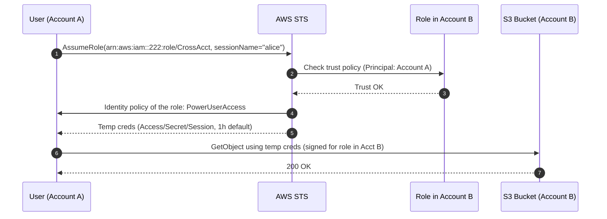
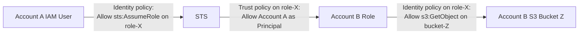
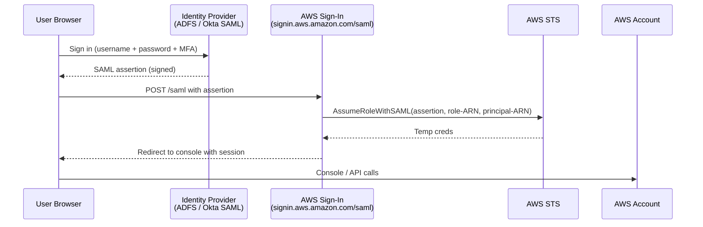
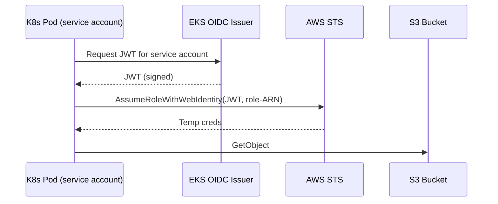

# AWS STS & Federation

> AWS Security Token Service (**STS**) hands out **short-lived credentials** for every "I'm not a long-term IAM user" scenario - cross-account roles, SAML federation, OIDC web identity, MFA-wrapped sessions. Every "the company has on-prem Active Directory…" or "users sign in with Google…" exam question routes through here.

See also: [01 - IAM Intro bits & bytes](01%20-%20IAM%20Intro%20bits%20%26%20bytes.md) · [05 - IAM Scenarios](05%20-%20IAM%20Scenarios.md) · [06 - IAM Identity Center & Organizations](06%20-%20IAM%20Identity%20Center%20%26%20Organizations.md) · [15 - Cognito User Pools & Identity Pools](15%20-%20Cognito%20User%20Pools%20%26%20Identity%20Pools.md)

---

## Table of Contents

- [1. What STS Is](#1-what-sts-is)
- [2. The STS API Family](#2-the-sts-api-family)
- [3. AssumeRole - Cross-Account Access](#3-assumerole---cross-account-access)
- [4. Trust Policy vs Identity Policy](#4-trust-policy-vs-identity-policy)
- [5. ExternalID & the Confused Deputy Problem](#5-externalid--the-confused-deputy-problem)
- [6. AssumeRoleWithSAML - Corporate Federation](#6-assumerolewithsaml---corporate-federation)
- [7. AssumeRoleWithWebIdentity - OIDC / Web Identity](#7-assumerolewithwebidentity---oidc--web-identity)
- [8. GetSessionToken - MFA Session Wrapping](#8-getsessiontoken---mfa-session-wrapping)
- [9. GetFederationToken - Legacy Federation Proxy](#9-getfederationtoken---legacy-federation-proxy)
- [10. Session Duration & Role Chaining](#10-session-duration--role-chaining)
- [11. STS Regional Endpoints](#11-sts-regional-endpoints)
- [12. Exam Tips (SAA-C03)](#12-exam-tips-saa-c03)
- [Summary](#summary)

---

## 1. What STS Is

AWS STS is the **global service** that issues temporary security credentials. Every credential set has three components:

```
AccessKeyId       (ASIA... prefix means "temporary")
SecretAccessKey
SessionToken     (the part that distinguishes temp from long-term creds)
+ Expiration timestamp
```

If you've ever seen an access key starting with `AKIA` - that's a **long-term** IAM user key. `ASIA` → **temporary** STS key.

Why temporary?

- Stolen credentials self-expire (minutes to hours).
- No rotation pipeline needed.
- Each session can carry **session policies** that further restrict its permissions.

[⬆ Back to top](#table-of-contents)

---

## 2. The STS API Family

| API | Caller's identity | Typical use |
| :--- | :--- | :--- |
| `AssumeRole` | An IAM user, IAM role, or another assumed role | Cross-account access, EC2 → other-account S3, role-switching |
| `AssumeRoleWithSAML` | An anonymous caller with a **SAML assertion** | Corporate AD / ADFS federation |
| `AssumeRoleWithWebIdentity` | Anonymous caller with an **OIDC token** | Cognito Identity Pools, OIDC providers (Google, Facebook, GitHub Actions) |
| `GetSessionToken` | An IAM user (usually with MFA) | Wrap your own long-term keys into a session that satisfies an MFA condition |
| `GetFederationToken` | An IAM user (typically for an identity broker) | Legacy custom federation - mostly superseded by AssumeRole patterns |
| `GetCallerIdentity` | Anyone | "Who am I right now?" - the AWS equivalent of `whoami`. Free to call. |
| `DecodeAuthorizationMessage` | Anyone | Decode the obfuscated error AWS returns when an API call is denied |

[⬆ Back to top](#table-of-contents)

---

## 3. AssumeRole - Cross-Account Access

The bread-and-butter STS flow. The exam tests this in dozens of variations.



### Two sides of the policy

| Side | Lives in | Says |
| :--- | :--- | :--- |
| **Trust policy** (resource-based, on the role) | Account B | *"I trust principals from Account A to assume me."* |
| **Identity policy** (on the caller in Account A) | Account A | *"This user is allowed to call `sts:AssumeRole` on that role's ARN."* |

**Both sides must Allow.** This is the famous two-handshake of cross-account IAM.

### Minimum trust policy example

```json
{
  "Version": "2012-10-17",
  "Statement": [{
    "Effect": "Allow",
    "Principal": { "AWS": "arn:aws:iam::111111111111:root" },
    "Action": "sts:AssumeRole",
    "Condition": {
      "StringEquals": { "sts:ExternalId": "unique-string-here" },
      "Bool": { "aws:MultiFactorAuthPresent": "true" }
    }
  }]
}
```

### Minimum identity policy (in Account A)

```json
{
  "Version": "2012-10-17",
  "Statement": [{
    "Effect": "Allow",
    "Action": "sts:AssumeRole",
    "Resource": "arn:aws:iam::222222222222:role/CrossAcct"
  }]
}
```

[⬆ Back to top](#table-of-contents)

---

## 4. Trust Policy vs Identity Policy

Easy to confuse - here's the durable mental model:



| Question | Answer |
| :--- | :--- |
| Where does a role's **identity policy** live? | On the role itself, in the target account |
| Where does a role's **trust policy** live? | On the role itself, in the target account (but it names *who* can assume) |
| Where does the **caller's permission to assume** live? | On the caller's user/role, in the caller's account |

[⬆ Back to top](#table-of-contents)

---

## 5. ExternalID & the Confused Deputy Problem

A **classic exam scenario:** you give a third-party SaaS vendor (DataDog, Splunk, etc.) a role they can assume to read your CloudWatch metrics.

### The risk

If the vendor's role ARN leaks, a *different* customer could ask the vendor to assume your role on their behalf. The vendor's call would succeed against any customer's role that trusts the vendor's account - the vendor is unknowingly acting as a "confused deputy."

### The fix: `ExternalID`

A shared secret in the role's trust policy. The vendor must pass it when assuming.

```json
"Condition": {
  "StringEquals": { "sts:ExternalId": "f29a-3e8d-customer-42" }
}
```

Only your trust policy contains *your* ExternalID; the vendor records the ExternalID per-customer. A confused-deputy attack across customers fails because the wrong ExternalID is sent.

**Always use ExternalID for cross-account roles assumed by third-party SaaS.**

[⬆ Back to top](#table-of-contents)

---

## 6. AssumeRoleWithSAML - Corporate Federation

The "user is in corporate Active Directory / ADFS / Okta SAML" pattern. AWS doesn't talk to AD directly - the IdP produces a SAML assertion that AWS trusts.



### Setup steps

1. In IAM → **Identity providers** → upload the IdP's metadata XML.
2. Create an IAM role with a **trust policy** naming `saml.amazonaws.com` (or `cognito-identity.amazonaws.com` for the web-identity flavor).
3. Configure the IdP to issue a SAML assertion that maps the user to the role.

> Modern guidance: prefer **IAM Identity Center with an external SAML IdP** over raw `AssumeRoleWithSAML` - same security, far less setup. The exam still covers the raw flow because it's the underpinning. See [06 - IAM Identity Center & Organizations](06%20-%20IAM%20Identity%20Center%20%26%20Organizations.md).

[⬆ Back to top](#table-of-contents)

---

## 7. AssumeRoleWithWebIdentity - OIDC / Web Identity

For end-user apps where the IdP is an OIDC-compliant provider - Cognito Identity Pools, Google, Facebook, Apple, or any custom OIDC provider (GitHub Actions, EKS pods via IRSA).

### EKS IRSA example (very common in the exam)



**Why this matters for the exam:** "How does a pod in EKS access S3 without storing credentials?" → **IRSA** (IAM Roles for Service Accounts), powered by `AssumeRoleWithWebIdentity`.

### Cognito Identity Pool flavor

Same API, but the JWT comes from a **Cognito Identity Pool**, which itself federated to a Cognito User Pool or external IdP. See [15 - Cognito User Pools & Identity Pools](15%20-%20Cognito%20User%20Pools%20%26%20Identity%20Pools.md).

[⬆ Back to top](#table-of-contents)

---

## 8. GetSessionToken - MFA Session Wrapping

You have an IAM user with long-term keys. A policy says "writes require MFA." How do you actually pass MFA from the CLI?

**Answer:** Call `sts:GetSessionToken` with the MFA serial + code. STS hands back temporary credentials that *carry* the `aws:MultiFactorAuthPresent = true` context.

```bash
aws sts get-session-token \
  --serial-number arn:aws:iam::111:mfa/alice \
  --token-code 123456 \
  --duration-seconds 43200
```

The resulting `ASIA…` keys + session token satisfy MFA-conditional policies for the next 12 h (default 12 h, max 36 h for IAM users; 1 h for root).

> Many "I get Access Denied even though my IAM policy looks right" scenarios are fixed here: the policy required MFA but the user used long-term keys. See [05 - IAM Scenarios > Scenario 3 - MFA Conditions - "No MFA, No Sensitive Actions"](05%20-%20IAM%20Scenarios.md#scenario-3---mfa-conditions---no-mfa-no-sensitive-actions).

[⬆ Back to top](#table-of-contents)

---

## 9. GetFederationToken - Legacy Federation Proxy

Lets an IAM user **broker** temporary credentials for external (non-AWS) users. Used in custom identity broker designs before SAML / Identity Center took over.

| Aspect | Limit |
| :--- | :--- |
| Session duration | 15 min – 36 h |
| Cannot call IAM or STS APIs with the resulting creds | (by design) |
| Need an IAM user as the proxy | (yes, can't be a role) |

Rare in modern designs. Mentioned for completeness - the exam usually points you at **AssumeRoleWithSAML** or **Identity Center** instead.

[⬆ Back to top](#table-of-contents)

---

## 10. Session Duration & Role Chaining

### Duration matrix

| Operation | Default | Max |
| :--- | :--- | :--- |
| `AssumeRole` | 1 h | **12 h** (capped by role's `MaxSessionDuration`) |
| `AssumeRoleWithSAML` | 1 h | 12 h |
| `AssumeRoleWithWebIdentity` | 1 h | 12 h |
| `GetSessionToken` (IAM user) | 12 h | 36 h |
| `GetSessionToken` (root) | 1 h | 1 h |
| `GetFederationToken` | 12 h | 36 h |

### Role chaining

When an *already-assumed* role calls `AssumeRole` again to a different role, that's **role chaining**.

```
user → AssumeRole → role-A → AssumeRole → role-B
```

**Hard cap when chaining:** **1 hour**, regardless of `MaxSessionDuration`. Watch for this in "the credentials keep expiring after an hour" scenarios.

[⬆ Back to top](#table-of-contents)

---

## 11. STS Regional Endpoints

STS is a *logically* global service, but it has **regional endpoints** (`sts.eu-west-1.amazonaws.com`, etc.) and one **global endpoint** (`sts.amazonaws.com` → resolves to `us-east-1`).

### Why use the regional endpoint?

- **Lower latency** for clients in that region.
- **Resilience** - if `us-east-1` STS is impaired (e.g. during the famous Dec-2021 outage), regional STS is unaffected.

### Enabling regional endpoints in an AWS account

By default, STS in non-`us-east-1` regions is **disabled** for a brand-new account. Enable per-region in IAM → Account settings → STS. SDKs default to the regional endpoint where it's enabled.

[⬆ Back to top](#table-of-contents)

---

## 12. Exam Tips (SAA-C03)

1. **STS = temporary credentials.** Every "the user is in AD / Cognito / Google" or "cross-account" question goes through here.
2. **AssumeRole needs both sides** - caller has `sts:AssumeRole` allowed on the target ARN, and the target role's trust policy names the caller's principal/account.
3. **ExternalID is for third-party SaaS** - confused-deputy mitigation.
4. **SAML federation = `AssumeRoleWithSAML`** with an IAM Identity Provider configured to trust the SAML IdP.
5. **Web Identity Federation = `AssumeRoleWithWebIdentity`** - Cognito Identity Pools, OIDC providers, **EKS IRSA**, **GitHub Actions OIDC**.
6. **No more long-term keys in mobile apps.** Use **Cognito Identity Pools** to issue STS creds - never bundle access keys in your iOS / Android app.
7. **Role chaining caps at 1 hour.** Watch for "credentials expire too soon" scenarios.
8. **Use regional STS endpoints** for latency and resilience, especially outside `us-east-1`.
9. **`GetSessionToken` is for adding MFA context** to existing long-term keys. Not for cross-account - for that, use `AssumeRole`.
10. **`sts:GetCallerIdentity` always works** - even with no permissions. Useful for debugging "who am I right now?"

[⬆ Back to top](#table-of-contents)

---

## Summary

- **STS** issues temporary credentials. `ASIA…` prefix + session token = temp.
- **`AssumeRole`** is the workhorse - cross-account access, role switching, EC2-via-instance-profile.
- **`AssumeRoleWithSAML`** for corporate AD / ADFS / Okta-SAML federation.
- **`AssumeRoleWithWebIdentity`** for OIDC - Cognito Identity Pools, EKS IRSA, GitHub Actions, social IdPs.
- **`GetSessionToken`** wraps your own long-term keys into an MFA-bearing session.
- **Trust policy** lives on the role, names *who* can assume; **identity policy** on the caller says *what they can call*. Both must Allow.
- **ExternalID** - always use it for third-party cross-account roles.
- **Role chaining is capped at 1 hour.** Plan around it.
- **Regional STS endpoints** beat the global one for latency and outage isolation.

Next in the security path: [15 - Cognito User Pools & Identity Pools](15%20-%20Cognito%20User%20Pools%20%26%20Identity%20Pools.md) · [20 - KMS & Envelope Encryption](20%20-%20KMS%20%26%20Envelope%20Encryption.md) · [23 - IAM Security Tools](23%20-%20IAM%20Security%20Tools.md)

[⬆ Back to top](#table-of-contents)
