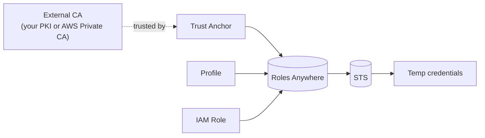
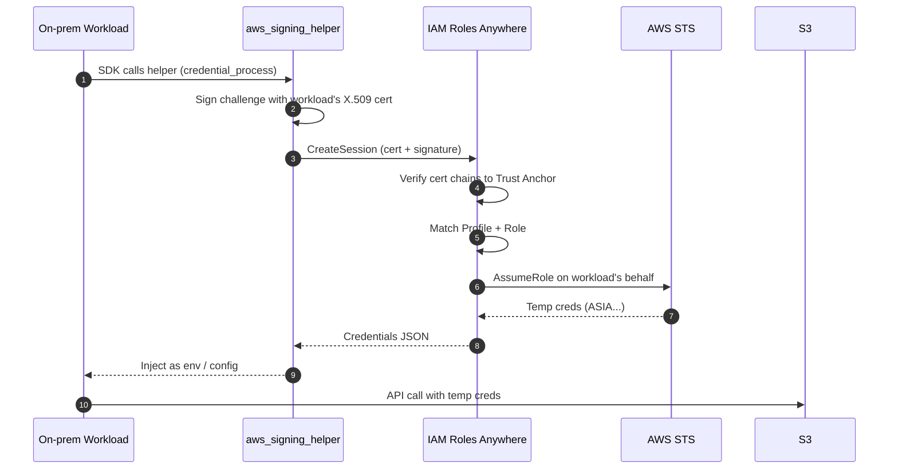

# IAM Roles Anywhere

> Lets **workloads outside AWS** (on-prem servers, containers in another cloud, CI runners) obtain **temporary AWS credentials** using **X.509 certificates** instead of long-term access keys. The modern replacement for "we hardcoded an IAM user's keys in the on-prem application." High-yield SAA-C03 topic when the question says **"on-premises"** + **"access AWS APIs without storing keys."**

See also: [01 - IAM Intro bits & bytes](01%20-%20IAM%20Intro%20bits%20%26%20bytes.md) · [13 - STS & Federation](13%20-%20STS%20%26%20Federation.md) · [20 - KMS & Envelope Encryption](20%20-%20KMS%20%26%20Envelope%20Encryption.md) · [16 - Directory Service & RAM](16%20-%20Directory%20Service%20%26%20RAM.md)

---

## Table of Contents

- [1. What Problem It Solves](#1-what-problem-it-solves)
- [2. The Three Building Blocks](#2-the-three-building-blocks)
- [3. Authentication Flow](#3-authentication-flow)
- [4. Certificate Sources](#4-certificate-sources)
- [5. The `aws_signing_helper` Credential Helper](#5-the-aws_signing_helper-credential-helper)
- [6. IAM Roles Anywhere vs Alternatives](#6-iam-roles-anywhere-vs-alternatives)
- [7. Exam Tips (SAA-C03)](#7-exam-tips-saa-c03)
- [Summary](#summary)

---

## 1. What Problem It Solves

Before IAM Roles Anywhere (launched mid-2022), an on-prem app needing AWS API access had two options:

1. **Embed an IAM user's access key** somewhere on disk - long-lived secret = phishing/exfiltration risk.
2. **Build a custom federation broker** with `AssumeRoleWithSAML` or `AssumeRoleWithWebIdentity` - complex.

Roles Anywhere replaces both with a clean PKI-based flow: present a valid certificate from a trust anchor, get STS credentials.

[⬆ Back to top](#table-of-contents)

---

## 2. The Three Building Blocks



| Object | What it is | What it does |
| :--- | :--- | :--- |
| **Trust Anchor** | A reference to an external Certificate Authority (CA) you trust | Tells Roles Anywhere "any cert signed by this CA is OK to consider" |
| **Profile** | A bundle of `(allowed roles, session policies, session duration, attribute mapping)` | Defines *what kind of session* the certificate holder gets |
| **IAM Role** | A regular IAM role whose **trust policy** allows `rolesanywhere.amazonaws.com` to assume it | The actual identity used to call AWS APIs |

Three IDs to remember when troubleshooting:

- Trust Anchor ARN
- Profile ARN
- Role ARN

[⬆ Back to top](#table-of-contents)

---

## 3. Authentication Flow



A few things to note:

- The session is **at most 12 h** (capped by role's `MaxSessionDuration`).
- **Credentials are refreshed transparently** by the helper as long as the certificate is valid.
- Roles Anywhere logs every `CreateSession` call to **CloudTrail**.

[⬆ Back to top](#table-of-contents)

---

## 4. Certificate Sources

You bring your own PKI - IAM Roles Anywhere doesn't issue certs.

| Option | Notes |
| :--- | :--- |
| **AWS Private CA** | Cleanest if you have no PKI; ACM-managed root + subordinate CAs |
| **Existing on-prem PKI** (Active Directory CS, OpenSSL, HashiCorp Vault PKI, …) | Add your CA's cert as a Trust Anchor |
| **Public CA** | Allowed but discouraged - anyone with a cert from that CA could try |

**Revocation:** Roles Anywhere honors a CRL (Certificate Revocation List) you publish; checked on every session creation.

[⬆ Back to top](#table-of-contents)

---

## 5. The `aws_signing_helper` Credential Helper

AWS publishes a tiny Go binary that:

1. Reads your cert + private key (or pulls them from PKCS #11 / TPM 2.0 / KMS).
2. Calls `CreateSession` and obtains temporary credentials.
3. Hands the credentials back via the **`credential_process`** mechanism in `~/.aws/config`.

Typical config:

```ini
[profile prod]
credential_process = /opt/aws/bin/aws_signing_helper credential-process \
    --certificate /etc/ssl/certs/workload.pem \
    --private-key /etc/ssl/private/workload.key \
    --trust-anchor-arn arn:aws:rolesanywhere:us-east-1:111111111111:trust-anchor/... \
    --profile-arn arn:aws:rolesanywhere:us-east-1:111111111111:profile/... \
    --role-arn arn:aws:iam::111111111111:role/OnPremReadOnly
```

The SDK and CLI use `credential_process` transparently. No code changes in your app.

[⬆ Back to top](#table-of-contents)

---

## 6. IAM Roles Anywhere vs Alternatives

| Scenario | Best fit |
| :--- | :--- |
| On-prem Linux server needs S3 access | **IAM Roles Anywhere** |
| Container in another cloud (GCP, Azure) needs AWS | **IAM Roles Anywhere** (or OIDC federation if the platform has it - e.g. GitHub Actions, EKS-anywhere) |
| EC2 in AWS | **Instance Profile / IAM Role** (don't use Roles Anywhere) |
| EKS pod | **IRSA** with `AssumeRoleWithWebIdentity` ([13 - STS & Federation](13%20-%20STS%20%26%20Federation.md)) |
| Lambda | **Execution Role** |
| Human signing into AWS Console | **IAM Identity Center** ([06 - IAM Identity Center & Organizations](06%20-%20IAM%20Identity%20Center%20%26%20Organizations.md)) |

[⬆ Back to top](#table-of-contents)

---

## 7. Exam Tips (SAA-C03)

1. "On-prem server needs AWS API access **without storing access keys**" → **IAM Roles Anywhere**.
2. The three objects: **Trust Anchor + Profile + IAM Role**. Don't confuse the IAM role (lives in IAM) with the Roles Anywhere objects (live in `rolesanywhere`).
3. Trust policy on the role must allow **`rolesanywhere.amazonaws.com`** as the service principal.
4. Sessions are **up to 12 h**, refreshed transparently by `aws_signing_helper`.
5. Bring your own PKI - either **AWS Private CA** or an existing CA.
6. **CRL** is honored - publish revocations so compromised certs can't get sessions.
7. Free service - you pay only for the underlying AWS Private CA (if used) and for the STS calls (also free).
8. Logs every session in **CloudTrail** (`CreateSession` event in `rolesanywhere.amazonaws.com`).

[⬆ Back to top](#table-of-contents)

---

## Summary

- IAM Roles Anywhere lets **non-AWS workloads** obtain **STS credentials** via X.509 certificates.
- Trust Anchor + Profile + IAM Role are the three objects you create.
- The `aws_signing_helper` + `credential_process` pattern integrates with every SDK without code changes.
- Bring your own PKI; revocation via CRL.
- The right answer whenever the exam says "on-prem" + "no long-term keys."

[⬆ Back to top](#table-of-contents)
