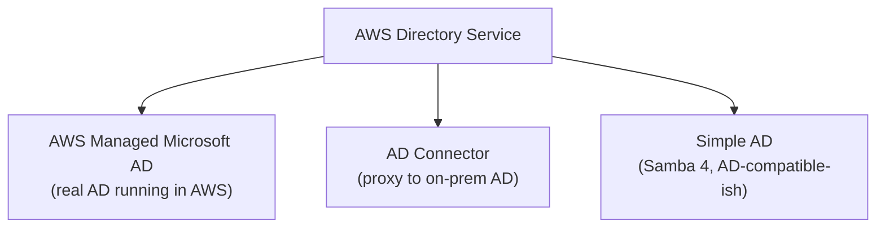
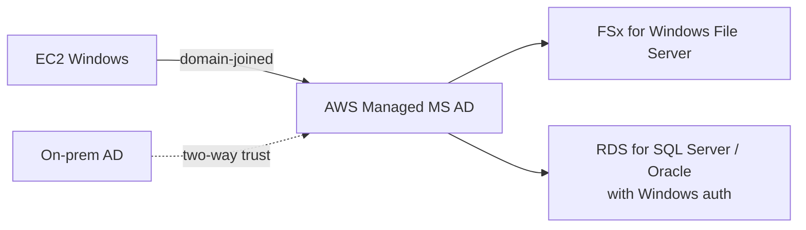
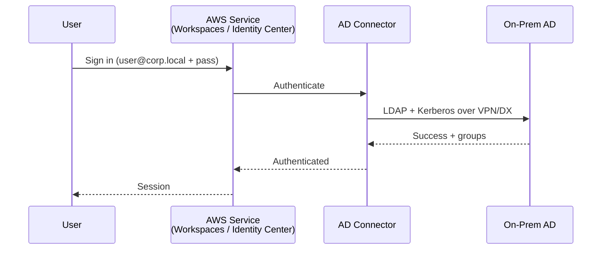
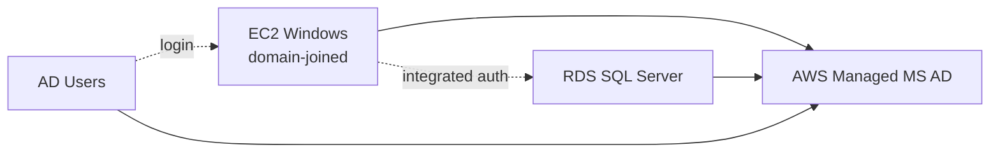
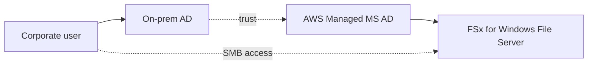
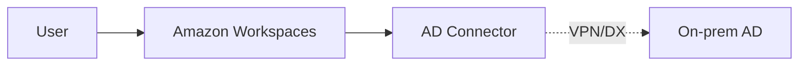
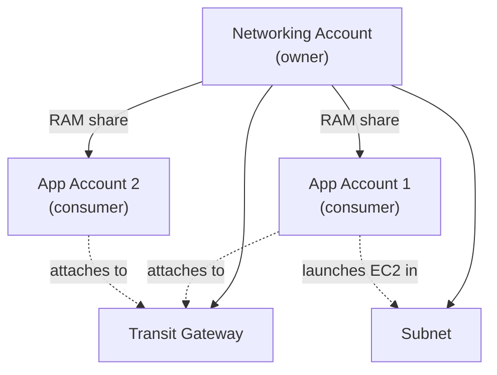
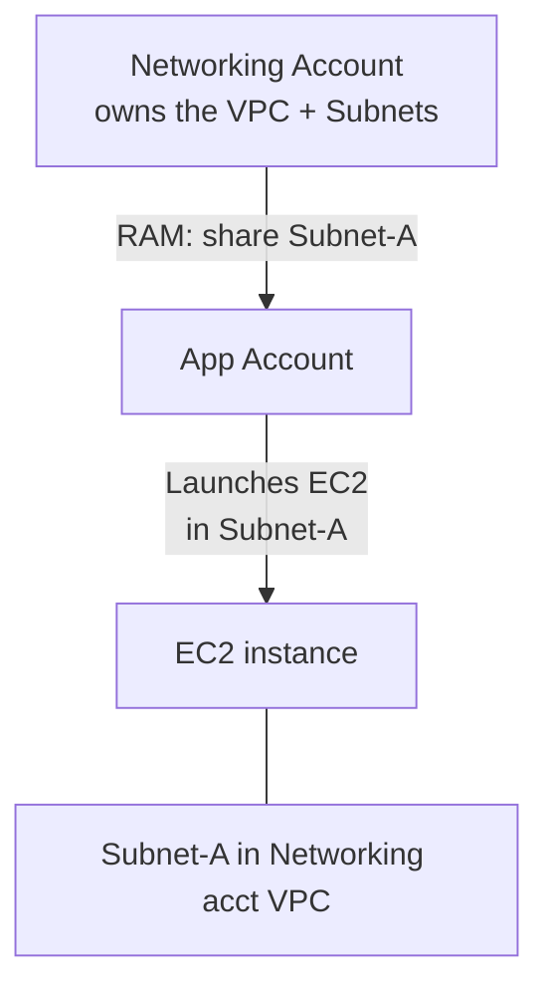

# AWS Directory Service & Resource Access Manager (RAM)

> **Directory Service** is "AWS plays nice with corporate Active Directory." **RAM (Resource Access Manager)** is "share AWS resources between accounts without copying them." Two related but distinct services often paired in real-world multi-account architectures.

See also: [06 - IAM Identity Center & Organizations](06%20-%20IAM%20Identity%20Center%20%26%20Organizations.md) · [13 - STS & Federation](13%20-%20STS%20%26%20Federation.md) · [01 - IAM Intro bits & bytes](01%20-%20IAM%20Intro%20bits%20%26%20bytes.md)

---

## Table of Contents

- [1. Directory Service Overview](#1-directory-service-overview)
- [2. AWS Managed Microsoft AD](#2-aws-managed-microsoft-ad)
- [3. AD Connector](#3-ad-connector)
- [4. Simple AD](#4-simple-ad)
- [5. Choosing a Directory Type](#5-choosing-a-directory-type)
- [6. Common Directory Service Use Cases](#6-common-directory-service-use-cases)
- [7. AWS Resource Access Manager (RAM)](#7-aws-resource-access-manager-ram)
- [8. What Can Be Shared via RAM](#8-what-can-be-shared-via-ram)
- [9. RAM vs Organizations Sharing](#9-ram-vs-organizations-sharing)
- [10. Exam Tips (SAA-C03)](#10-exam-tips-saa-c03)
- [Summary](#summary)

---

## 1. Directory Service Overview

AWS Directory Service is the umbrella for three different directory implementations. They all support **LDAP queries**, **Kerberos auth**, and **DNS** - the standard AD/LDAP feature set - but differ in where the real directory lives and what you can do with it.

[⬆ Back to top](#table-of-contents)

---

## 2. AWS Managed Microsoft AD

A **real Microsoft Active Directory** running inside AWS, managed for you.

| Aspect | Detail |
| :--- | :--- |
| Backend | Actual Windows Server with AD DS, deployed across 2 AZs by default |
| Editions | **Standard** (5 k users, 1 GB sysvol) or **Enterprise** (500 k users, 17 GB) |
| Domain trust | Two-way / one-way / external / forest trusts with on-prem AD |
| Schema | Extensible (add custom attributes) |
| Group Policy | Full GPO support |
| Use cases | Domain-join EC2 Windows / Linux instances, SQL Server Windows auth, FSx for Windows File Server auth, SharePoint, .NET apps relying on AD |
| Patching / backups | AWS handles |
| Cost | ~$0.15/hr (Standard) / ~$1.30/hr (Enterprise) |

[⬆ Back to top](#table-of-contents)

---

## 3. AD Connector

A **proxy / gateway** that forwards directory requests from AWS services to your **existing on-premises AD**. No directory lives in AWS - it just relays.

| Aspect | Detail |
| :--- | :--- |
| Backend | No directory in AWS - pure proxy |
| Connectivity | Requires VPN or Direct Connect to on-prem |
| Sizing | Small (≤ 500 users) or Large (≤ 5 000 users) |
| Use cases | Sign in to AWS Console / Workspaces / Workmail using on-prem AD credentials; integrate with IAM Identity Center |
| Domain-join EC2 | ❌ Not supported (use AWS Managed MS AD for that) |
| Cost | Cheaper than Managed MS AD, but requires on-prem AD |

[⬆ Back to top](#table-of-contents)

---

## 4. Simple AD

A **Samba 4-based** standalone directory that mimics a subset of AD features. Cheap, but limited.

| Aspect | Detail |
| :--- | :--- |
| Backend | Samba 4 (not real AD; no trust with real AD) |
| Sizes | Small (≤ 500) / Large (≤ 5 000) |
| Schema | **NOT extensible** |
| Trusts | **NOT supported** |
| Group Policy | Basic only |
| Use cases | Small workloads needing a directory without Microsoft licensing; basic domain-join, basic LDAP |
| Cost | Cheapest of the three |

**Mostly avoid for the exam** unless the question explicitly mentions "no need for real AD compatibility" and "lowest cost."

[⬆ Back to top](#table-of-contents)

---

## 5. Choosing a Directory Type

| If the question says… | Pick |
| :--- | :--- |
| "Domain-join EC2 Windows instances", "SQL Server Windows auth", "SharePoint", "trust with on-prem AD" | **AWS Managed Microsoft AD** |
| "We already have AD on-prem and want users to sign in to AWS apps with it" | **AD Connector** |
| "Small business, low cost, basic LDAP / Samba compatibility, no on-prem" | **Simple AD** |
| "Federate corporate IdP to AWS Console across many accounts" | **IAM Identity Center** with SAML/AD source (see [06 - IAM Identity Center & Organizations](06%20-%20IAM%20Identity%20Center%20%26%20Organizations.md)) |

[⬆ Back to top](#table-of-contents)

---

## 6. Common Directory Service Use Cases

### A. EC2 Windows with domain join + RDS SQL Server with Windows auth

User signs into EC2 with their AD account, the app on EC2 connects to RDS using the user's Kerberos ticket - no password in connection string.

### B. FSx for Windows File Server with corporate users

Trust relationship lets on-prem users see FSx as a network share with their existing identity.

### C. Workspaces using on-prem AD

Cheapest pattern for "corporate VDI with existing AD."

[⬆ Back to top](#table-of-contents)

---

## 7. AWS Resource Access Manager (RAM)

A **free** service that lets you **share AWS resources between accounts** (typically within an AWS Organization) **without duplicating them**.

The alternative - copying or recreating in each account - wastes money and causes drift. RAM lets one account *own* the resource while others *use* it as if it were their own.

### How it works

1. Owner account creates a **Resource Share** - a named container.
2. Owner adds **resources** (e.g. specific subnets, a TGW) and **principals** (account IDs, OUs, the whole Org).
3. Consumer accounts receive an invitation (or auto-accept if in the same Org with sharing enabled).
4. From the consumer's perspective, the shared resource appears in their console / API as if they owned it (with limits - e.g. they can't delete it).

[⬆ Back to top](#table-of-contents)

---

## 8. What Can Be Shared via RAM

A non-exhaustive list of high-yield exam items:

| Resource | Why share it |
| :--- | :--- |
| **VPC subnets** | Centralized network account, app accounts launch EC2 into shared subnets |
| **Transit Gateway** | One TGW connects many accounts' VPCs |
| **Route 53 Resolver rules** | Centralize DNS forwarding |
| **License Manager configurations** | Track BYOL licenses across accounts |
| **AWS Outposts** | Use one Outpost from many accounts |
| **Amazon S3 on Outposts** | Cross-account access to on-prem S3 |
| **ACM Private Certificate Authority** | Issue private certs to many accounts from one CA |
| **Aurora DB clusters (read replicas)** | Cross-account read access |
| **Network Firewall rule groups** | Share managed rule sets |
| **Glue Data Catalog** | Cross-account data lakes |

### VPC subnet sharing - a high-yield exam pattern

Critical rules:

- VPC **must be in the same AZ ID** as where the consumer wants to use the subnet (so use [AZ IDs](AWS%20Global%20Infrastructure.md#3-availability-zones-azs), not names).
- Consumer can launch EC2 / ALB / RDS into shared subnets but **can't modify the VPC or subnet config**.
- Owner sees and is billed for the VPC's data transfer, NAT GW, etc.; consumers are billed for their EC2 / RDS resources.
- Default VPCs **cannot** be shared.

[⬆ Back to top](#table-of-contents)

---

## 9. RAM vs Organizations Sharing

| Mechanism | What it does | Example |
| :--- | :--- | :--- |
| **AWS Organizations** by itself | Governance (SCPs, billing, account hierarchy) - does NOT share resources | "Apply SCP to OU" |
| **RAM** | Share specific resources between accounts | "Use the Networking team's TGW in your app account" |
| **Service-native cross-account sharing** | Some services have their own sharing (e.g. S3 bucket policies, Secrets Manager resource policies) | "Allow Account B to read this S3 bucket" |

You typically use **all three** in a mature multi-account setup:

- Organizations to corral accounts.
- RAM for shared infrastructure (network, certs, catalogs).
- Resource-based policies on individual resources (S3 buckets, KMS keys) for app-level sharing.

> **Enable RAM sharing with the Organization** (one-time setting in the management account) so shares to OUs/the org are auto-accepted by member accounts. Without it, every consumer must manually accept every invitation.

[⬆ Back to top](#table-of-contents)

---

## 10. Exam Tips (SAA-C03)

1. **"Domain-join Windows EC2 / SQL Server / FSx" → AWS Managed Microsoft AD.** Always.
2. **"On-prem AD already exists, sign in to AWS services with it"** → **AD Connector**.
3. **Simple AD is the cheap, limited option** - pick only when the question says "small workload, no AD compatibility needed, lowest cost."
4. **AD Connector cannot domain-join EC2** - common trap.
5. **AWS Managed MS AD supports trusts** with on-prem AD; Simple AD doesn't.
6. **RAM is free** to use; you only pay for the underlying shared resources.
7. **Sharing a VPC subnet via RAM** = one of the biggest cost / sanity savers in multi-account designs.
8. **Default VPCs cannot be shared.** Always custom VPC for shared networking.
9. **VPC subnet AZ:** match by **AZ ID** between owner and consumer, not name.
10. **Enable sharing within the Organization** so consumer accounts don't have to accept invitations one by one.
11. **RAM ≠ cross-account IAM roles.** RAM shares *resources* (use them as-is); roles let *principals* assume identity in another account.
12. **For multi-account Workspaces / Workmail with corp identity:** AD Connector + on-prem AD is the pattern. For broader workforce SSO into many AWS accounts: **IAM Identity Center**.

[⬆ Back to top](#table-of-contents)

---

## Summary

- **AWS Managed Microsoft AD** - a real AD running in AWS, full features, domain joins, trusts.
- **AD Connector** - a proxy to your on-prem AD. No directory in AWS; can't domain-join EC2.
- **Simple AD** - a cheap Samba 4 directory; limited; rarely the right answer on the exam.
- **RAM** - share AWS resources (subnets, TGW, certs, etc.) across accounts without duplication.
- **VPC sharing via RAM** is a big cost-saver and the foundation of "networking account / app accounts" patterns.
- **Enable Organization-wide sharing in RAM** so consumer accounts auto-accept.

Next in the security path: [23 - IAM Security Tools](23%20-%20IAM%20Security%20Tools.md)

[⬆ Back to top](#table-of-contents)
