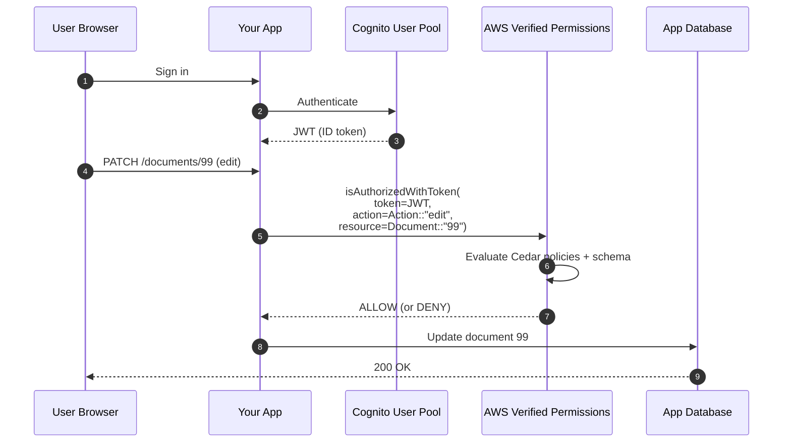

# AWS Verified Permissions & Cedar

> **Cedar** is AWS's open-source **policy language** for application-level authorization (think: "can user X edit document Y in our SaaS?"). **AWS Verified Permissions** is the managed service that hosts Cedar policies, evaluates authorization requests, and integrates with Cognito. Newer (2023+) and increasingly tested on SAA-C03 as the modern alternative to home-grown authz in your application code.

See also: [01 - IAM Intro bits & bytes](01%20-%20IAM%20Intro%20bits%20%26%20bytes.md) · [15 - Cognito User Pools & Identity Pools](15%20-%20Cognito%20User%20Pools%20%26%20Identity%20Pools.md) · [17 - ABAC (Attribute-Based Access Control)](17%20-%20ABAC%20%28Attribute-Based%20Access%20Control%29.md)

---

## Table of Contents

- [1. Why Not Just Use IAM?](#1-why-not-just-use-iam)
- [2. Cedar - The Policy Language](#2-cedar---the-policy-language)
- [3. The Three Cedar Concepts](#3-the-three-cedar-concepts)
- [4. AWS Verified Permissions - The Service](#4-aws-verified-permissions---the-service)
- [5. Architecture & API Flow](#5-architecture--api-flow)
- [6. Integration With Cognito](#6-integration-with-cognito)
- [7. Cedar vs IAM vs OPA vs Custom](#7-cedar-vs-iam-vs-opa-vs-custom)
- [8. Exam Tips (SAA-C03)](#8-exam-tips-saa-c03)
- [Summary](#summary)

---

## 1. Why Not Just Use IAM?

IAM is great for "can this AWS principal call this AWS API?" But applications need authz at a *finer* grain:

- Can **user 42** edit **document 99**?
- Can **user 42** view her own profile but not anyone else's?
- Can the **manager group** approve a request only if its amount is under €5,000?
- Can a **viewer** download a PDF only between 9 AM–5 PM in the customer's local timezone?

Stuffing all this into IAM policies on AWS principals doesn't fit - these decisions are about **application objects**, not AWS resources. Historically each team built its own auth code. Cedar replaces that.

[⬆ Back to top](#table-of-contents)

---

## 2. Cedar - The Policy Language

**Cedar** is an open-source, formally-verified policy language released by AWS in 2023.

```cedar
permit (
    principal in Group::"Managers",
    action == Action::"approveRequest",
    resource in Department::"Finance"
)
when {
    resource.amount < 5000
};
```

Key features:

- **Human-readable** (closer to English than JSON)
- **Statically analyzable** - can be mathematically checked for "does this policy ever grant X?" before deployment
- **Open source** under Apache 2.0; usable outside AWS via the Cedar SDK
- **Supports ABAC, RBAC, and ReBAC (Relationship-Based Access Control)**

[⬆ Back to top](#table-of-contents)

---

## 3. The Three Cedar Concepts

| Concept | Meaning | Example |
| :--- | :--- | :--- |
| **Entity** | A typed object in your domain | `User::"alice"`, `Document::"99"`, `Group::"Editors"` |
| **Policy** | A `permit` or `forbid` rule | "Allow Managers to approve requests under €5 k" |
| **Schema** | Type declarations for entities and actions | "A `User` has attributes `dept` (String) and `clearance` (Long)" |

Authorization is a function:

```
isAuthorized(principal, action, resource, context, entities)
  → ALLOW or DENY
```

Same evaluation model as IAM - explicit Deny wins, otherwise Allow if any policy permits, else implicit Deny.

[⬆ Back to top](#table-of-contents)

---

## 4. AWS Verified Permissions - The Service

The managed AWS service that hosts Cedar policies and answers `isAuthorized` calls.

Three top-level objects:

| Object | What it holds |
| :--- | :--- |
| **Policy Store** | A bucket of policies + their schema. One per app (or one per tenant in multi-tenant apps). |
| **Policy** | An individual Cedar policy (static or template-based) |
| **Identity Source** | Optional - link a Cognito User Pool so JWT tokens identify the principal automatically |

[⬆ Back to top](#table-of-contents)

---

## 5. Architecture & API Flow



Three callable APIs:

- `IsAuthorized` - pass principal + action + resource directly
- `IsAuthorizedWithToken` - pass a Cognito JWT; AVP extracts the principal
- `BatchIsAuthorized` - evaluate many requests in one call (efficient for UI "what can I see?" rendering)

[⬆ Back to top](#table-of-contents)

---

## 6. Integration With Cognito

Connect a Cognito User Pool as an Identity Source in your Policy Store. Then:

- Cedar policies can reference user attributes from the JWT (`principal.email`, `principal.groups`).
- Group memberships in Cognito map to Cedar `Group::"…"` entities.
- One less integration to write yourself.

[⬆ Back to top](#table-of-contents)

---

## 7. Cedar vs IAM vs OPA vs Custom

| Use case | Pick |
| :--- | :--- |
| "Can this AWS principal call this AWS API?" | **IAM** |
| "Can this app user perform this app action on this app object?" | **Cedar / AVP** |
| "I'm not on AWS / want a self-hosted policy engine" | **OPA** (Open Policy Agent) or self-hosted Cedar |
| Tiny app, no scale concerns | **Custom code** - but accumulates tech debt fast |

| Aspect | IAM | Cedar / AVP |
| :--- | :--- | :--- |
| Subject | AWS principals | App users (any) |
| Object | AWS resources (ARNs) | App entities (`Document::"99"`) |
| Language | JSON | Cedar (purpose-built) |
| Formal analysis | Limited (IAM Access Analyzer policy validation) | First-class (Cedar is formally verified) |
| Cost | Free | Per-request (~$0.00015 per `isAuthorized` call) |

[⬆ Back to top](#table-of-contents)

---

## 8. Exam Tips (SAA-C03)

1. **"Fine-grained app authz" → AWS Verified Permissions + Cedar.** Don't try to force-fit into IAM.
2. Cedar is **open source** - you can also use it outside AWS.
3. **Policy Store** holds policies + schema for one application/tenant.
4. **`isAuthorizedWithToken`** integrates directly with Cognito JWTs - common pattern.
5. Cedar supports **RBAC + ABAC + ReBAC** patterns in the same language.
6. **Formally verifiable** - biggest exam talking point versus home-grown authz.
7. **Per-request pricing** - be aware in cost-optimization questions; `BatchIsAuthorized` reduces calls.
8. **IAM ≠ Verified Permissions.** IAM = who-can-call-AWS. Verified Permissions = who-can-do-things-in-my-app.

[⬆ Back to top](#table-of-contents)

---

## Summary

- **Cedar** = open-source policy language for application authz.
- **AWS Verified Permissions** = managed service that hosts Cedar policies and answers `isAuthorized`.
- **Three concepts:** entities, policies, schema.
- Native integration with **Cognito** via Identity Sources.
- Replaces home-grown authz code; supports RBAC, ABAC, and ReBAC in one language.
- For the exam: any "fine-grained, application-level authorization" question → Cedar / Verified Permissions.

[⬆ Back to top](#table-of-contents)
