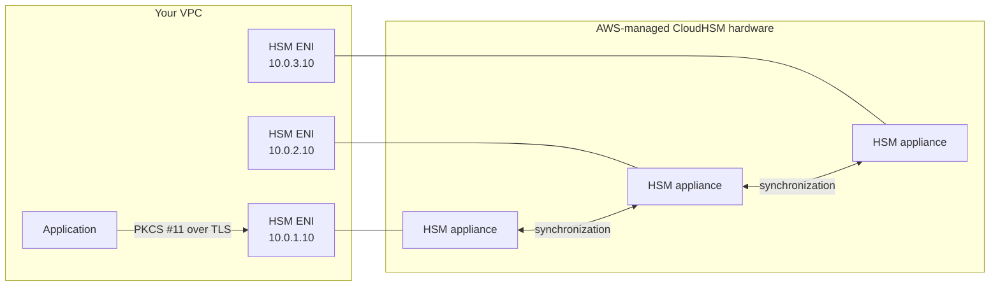

# AWS CloudHSM

> A **single-tenant, dedicated** Hardware Security Module that AWS hosts for you. Unlike KMS (multi-tenant, AWS-managed software keys backed by HSMs), CloudHSM gives you **complete control over keys** with standard industry interfaces (PKCS #11, JCE, KSP). The exam picks CloudHSM when the question demands **"customer-controlled HSM,"** **"PKCS #11,"** or **FIPS 140-2 Level 3** with a single-tenant guarantee.

See also: [20 - KMS & Envelope Encryption](20%20-%20KMS%20%26%20Envelope%20Encryption.md) · [22 - Secrets Manager vs SSM Parameter Store](22%20-%20Secrets%20Manager%20vs%20SSM%20Parameter%20Store.md)

---

## Table of Contents

- [1. What CloudHSM Is](#1-what-cloudhsm-is)
- [2. CloudHSM vs KMS - When to Pick Which](#2-cloudhsm-vs-kms---when-to-pick-which)
- [3. Architecture](#3-architecture)
- [4. Cluster Mode & High Availability](#4-cluster-mode--high-availability)
- [5. Industry-Standard APIs](#5-industry-standard-apis)
- [6. Common Use Cases](#6-common-use-cases)
- [7. Backup, Disaster Recovery & Cost](#7-backup-disaster-recovery--cost)
- [8. Exam Tips (SAA-C03)](#8-exam-tips-saa-c03)
- [Summary](#summary)

---

## 1. What CloudHSM Is

A **physical HSM appliance** dedicated to you, running in your VPC, that you operate via standard cryptographic APIs (PKCS #11, JCE, KSP for Windows). AWS provisions and maintains the hardware; **AWS cannot see your keys**.

| Aspect | Detail |
| :--- | :--- |
| Tenancy | **Single-tenant** (whole appliance is yours) |
| Compliance | **FIPS 140-2 Level 3** |
| Key visibility | Only you - even AWS staff have no access |
| API | PKCS #11, JCE (Java), Microsoft KSP/CNG |
| Tenancy isolation | Runs inside your VPC as a network appliance |
| Cost | ~$1.45 / hour per HSM (≈ $1 050 / month) - **far** more than KMS |

[⬆ Back to top](#table-of-contents)

---

## 2. CloudHSM vs KMS - When to Pick Which

| Need | Pick |
| :--- | :--- |
| Default at-rest encryption for S3 / EBS / RDS | **KMS** |
| You need **single-tenant** HSM by regulation | **CloudHSM** |
| You need **PKCS #11 / JCE / KSP** APIs (e.g. SQL Server TDE with PKCS #11) | **CloudHSM** |
| You need to **export key material** | **CloudHSM** (KMS keeps keys inside) |
| Sign certs with an industry HSM (PKI / mTLS) | **CloudHSM** |
| Just integrate with AWS services natively | **KMS** (CloudHSM doesn't natively integrate with most services) |
| Lowest cost | **KMS** by a wide margin |

| Aspect | KMS | CloudHSM |
| :--- | :--- | :--- |
| Tenancy | Multi-tenant | Single-tenant |
| FIPS | 140-2 Level 3 (HSM module) | 140-2 Level 3 (whole appliance) |
| Native AWS integration | ✅ 100+ services | Limited (custom integrations) |
| Cost | $1 / month per CMK | $1.45 / hour per HSM |
| Key custody | AWS-managed envelope | Customer-only |

[⬆ Back to top](#table-of-contents)

---

## 3. Architecture

- Each HSM in your cluster exposes itself in **your VPC** as an Elastic Network Interface (ENI).
- Clients connect to **any one** ENI via the CloudHSM client SDK; the SDK load-balances and synchronizes operations across the cluster.
- All key material is **synchronized** between cluster members (so any HSM can answer any request).

[⬆ Back to top](#table-of-contents)

---

## 4. Cluster Mode & High Availability

- Always deploy **at least 2 HSMs** in a cluster - across **different AZs**.
- A 3-HSM cluster across 3 AZs is the SAA-C03 reference architecture.
- The cluster handles failover transparently - application sees one logical HSM endpoint.
- **Backups** are stored encrypted in an AWS-managed S3 bucket per region; you can restore into a fresh cluster.

[⬆ Back to top](#table-of-contents)

---

## 5. Industry-Standard APIs

The defining differentiator vs KMS.

| API | Use case |
| :--- | :--- |
| **PKCS #11** | OpenSSL engines, Java, NGINX TLS, OpenSwan IPSec, Oracle TDE, SQL Server EKM |
| **JCE / JSSE** | Java apps doing signing, encryption, TLS |
| **KSP / CNG** | Windows apps, Active Directory Certificate Services, SQL Server TDE |

Practical patterns:

- **SQL Server TDE with customer-controlled keys** - TDE EKM provider points to CloudHSM via KSP.
- **Active Directory CA on CloudHSM** - sign certificates with HSM-protected root key.
- **NGINX with HSM-stored TLS private keys** - keys never touch the web server's disk.

[⬆ Back to top](#table-of-contents)

---

## 6. Common Use Cases

| Scenario | Why CloudHSM |
| :--- | :--- |
| Payment / FinTech (PCI HSM, FIPS 140-2 L3 single-tenant) | Regulators demand single-tenant HSM |
| Issue and store TLS / mTLS certs at scale | PKCS #11 + private CA chain |
| AWS Private CA root key custody | Private CA can use CloudHSM as its key store |
| Cryptocurrency / blockchain custody | Keys must never be exported in plaintext |
| Healthcare or government with HSM mandate | Compliance |
| Code signing with hardware-protected keys | Authenticode + KSP |

[⬆ Back to top](#table-of-contents)

---

## 7. Backup, Disaster Recovery & Cost

- **Automatic encrypted backups** every 24 h, retained until cluster deletion + grace period.
- **Cross-region copies** for DR are manual but supported (copy backup to another region, restore into a new cluster).
- **Cost reminder:** ~$1.45 / HSM / hour. A 2-HSM HA cluster is ~$2 100 / month. Don't pick CloudHSM unless you actually need it.

[⬆ Back to top](#table-of-contents)

---

## 8. Exam Tips (SAA-C03)

1. "Single-tenant HSM" or "PKCS #11" or "KSP" in the question → **CloudHSM**.
2. Default at-rest encryption for AWS services → **KMS**, not CloudHSM.
3. CloudHSM is **FIPS 140-2 Level 3** (so is KMS now), but CloudHSM offers **single-tenant** isolation.
4. CloudHSM runs **inside your VPC** via ENIs - needs network reachability from clients.
5. Always **multi-AZ cluster** (2+ HSMs in different AZs) for production.
6. AWS **cannot decrypt** your CloudHSM keys - losing them = losing your data.
7. **AWS Private CA** can use CloudHSM for its root key - common combo question.
8. CloudHSM is **expensive** - about $1 050 / month per HSM. Cost-sensitive question + need just one or two keys → almost always **KMS**.
9. CloudHSM does **not** auto-integrate with most AWS services. KMS does.

[⬆ Back to top](#table-of-contents)

---

## Summary

- **CloudHSM = single-tenant, customer-controlled HSM** with industry-standard APIs (PKCS #11 / JCE / KSP).
- Use when **regulations demand single-tenant**, you need **PKCS #11 / KSP**, or you want **AWS to have no access**.
- Default for everything else is **KMS** - cheaper, integrated, FIPS-validated too.
- Always multi-AZ for HA; backups are automatic but cluster restore is manual.
- High cost (~$1.45 / hour per HSM) - picked only when the requirements demand it.

[⬆ Back to top](#table-of-contents)
