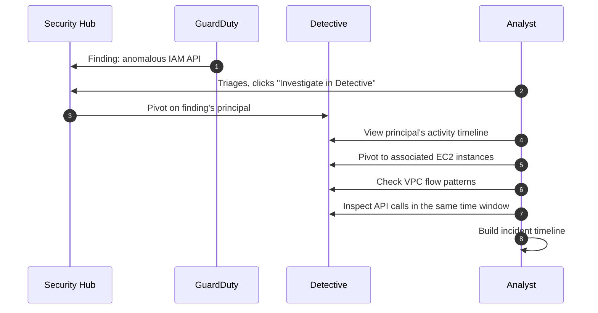
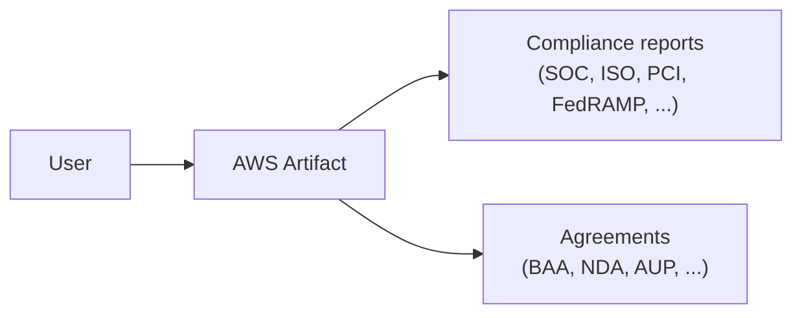

# AWS Detective & AWS Artifact

> Two tools that live near the end of a security workflow but solve very different problems:
>
> - **Detective** - *forensics*: a GuardDuty finding popped, now what happened, who else is affected, what's the timeline?
> - **Artifact** - *compliance reports & agreements*: download AWS's SOC, ISO, PCI attestations + sign BAAs / NDAs.
>
> Both show up periodically on the SAA-C03 in incident-response and audit scenarios.

See also: [25 - GuardDuty Inspector Macie Security Hub](25%20-%20GuardDuty%20Inspector%20Macie%20Security%20Hub.md) · [24 - AWS Config & Audit Manager](24%20-%20AWS%20Config%20%26%20Audit%20Manager.md) · [23 - IAM Security Tools](23%20-%20IAM%20Security%20Tools.md)

---

## Table of Contents

- [1. AWS Detective - What It Does](#1-aws-detective---what-it-does)
- [2. Data Sources & Behavior Graph](#2-data-sources--behavior-graph)
- [3. The Detective Investigation Workflow](#3-the-detective-investigation-workflow)
- [4. Detective vs Security Hub vs CloudTrail](#4-detective-vs-security-hub-vs-cloudtrail)
- [5. AWS Artifact - What It Provides](#5-aws-artifact---what-it-provides)
- [6. Common Artifact Documents](#6-common-artifact-documents)
- [7. Exam Tips (SAA-C03)](#7-exam-tips-saa-c03)
- [Summary](#summary)

---

## 1. AWS Detective - What It Does

A managed **security-investigation** service. When a finding fires in GuardDuty (or you have a hunch), Detective lets you **pivot through linked entities** and reconstruct the timeline.

```mermaid
graph LR
    GD[GuardDuty Finding] -.click "Investigate".-> D[Detective]
    D --> Graph[Behavior Graph]
    Graph --> IAM[IAM Principals]
    Graph --> EC2[EC2 Instances]
    Graph --> IP[IP Addresses]
    Graph --> EKS[EKS Pods]
    Graph --> Bucket[S3 Buckets]
    Click("Pivot by entity") --> Timeline[Reconstructed timeline & relationships]
```

You're answering questions like:

- "This IAM key was used from a suspicious IP - what else did it touch?"
- "This EC2 instance had crypto-mining traffic - who's logged into it, what role does it have?"
- "Two findings in two accounts, are they related?"

[⬆ Back to top](#table-of-contents)

---

## 2. Data Sources & Behavior Graph

Detective ingests **at no extra cost from these sources** (you pay Detective per GB of data, not per source):

- **VPC Flow Logs**
- **CloudTrail management events**
- **GuardDuty findings**
- **EKS audit logs** (optional)
- **EKS network activity** (optional)

It builds a **behavior graph** per account (or per org-wide aggregated view) - basically a relationship database where nodes are entities (principals, hosts, IPs, containers) and edges are observed interactions.

Up to **1 year of history** is queryable.

[⬆ Back to top](#table-of-contents)

---

## 3. The Detective Investigation Workflow



Typical pivots:

1. **Finding** → involved entities (principal, IPs, hosts).
2. **Entity** → all observed activities + linked entities.
3. **Time window** → narrow / widen to see context.
4. **Compare** activity patterns to baseline.

You **don't deploy agents**. Detective gets everything from existing logs.

[⬆ Back to top](#table-of-contents)

---

## 4. Detective vs Security Hub vs CloudTrail

| Question | Best tool |
| :--- | :--- |
| "Show me all open findings across all accounts" | **Security Hub** |
| "Show me a timeline + relationships of entities involved in this finding" | **Detective** |
| "Who called `iam:CreateAccessKey` last Tuesday at 3 PM?" | **CloudTrail** |
| "Was the security group already permissive *before* the attack?" | **AWS Config** timeline |
| "Generate auditor evidence for PCI 10.2" | **Audit Manager** |

Detective complements Security Hub - Security Hub triages, Detective investigates.

[⬆ Back to top](#table-of-contents)

---

## 5. AWS Artifact - What It Provides

A **self-service portal** for downloading AWS's compliance reports and signing agreements with AWS.



| Section | Contains |
| :--- | :--- |
| **Reports** | Read-only PDFs of AWS's compliance certifications/attestations |
| **Agreements** | Documents you sign with AWS (Business Associate Addendum for HIPAA, NDA, etc.) |

It's about **AWS's** compliance, not yours. Don't confuse with **Audit Manager** which collects evidence about *your* environment.

[⬆ Back to top](#table-of-contents)

---

## 6. Common Artifact Documents

| Document | Why you'd want it |
| :--- | :--- |
| **SOC 1 / SOC 2 / SOC 3 reports** | Your auditor needs proof of AWS's controls for SOC compliance |
| **ISO 27001 / 27017 / 27018 certificates** | Info-sec management system, cloud-specific, PII-specific |
| **PCI DSS Attestation of Compliance (AoC)** | You handle card data on AWS |
| **FedRAMP authorizations** | US federal workloads |
| **CSA STAR** | Cloud Security Alliance certification |
| **HIPAA BAA** (Agreements, not Reports) | Required before storing PHI on AWS |
| **AWS NDAs** | Pre-discussing roadmap with AWS reps |

Reports require accepting AWS's Terms of Use before download - they're shareable only with your auditors under NDA.

[⬆ Back to top](#table-of-contents)

---

## 7. Exam Tips (SAA-C03)

1. **"Investigate a security finding / build a timeline" → Detective.**
2. **"Download AWS's SOC 2 report for our auditor" → Artifact.**
3. **"Sign a Business Associate Addendum for HIPAA" → Artifact (Agreements).**
4. Detective is **agent-less** - it uses CloudTrail, VPC Flow, GuardDuty, EKS logs.
5. Detective stores up to **1 year** of history.
6. **GuardDuty → Detective** is the canonical investigation pivot - both must be enabled for the deep-link to appear.
7. **Artifact ≠ Audit Manager.** Artifact = AWS's compliance. Audit Manager = your environment's compliance evidence.
8. Artifact reports are usually **under NDA** - share with auditors only, not publicly.

[⬆ Back to top](#table-of-contents)

---

## Summary

- **Detective** = managed security investigation; builds a behavior graph from existing logs; pivots from a GuardDuty finding into entity timelines.
- **Artifact** = self-service downloads of AWS's own compliance reports and agreements (BAA / NDA).
- Detective complements Security Hub (triage) and CloudTrail (raw API events).
- Artifact is for **AWS's** compliance; Audit Manager is for **yours**.

[⬆ Back to top](#table-of-contents)
