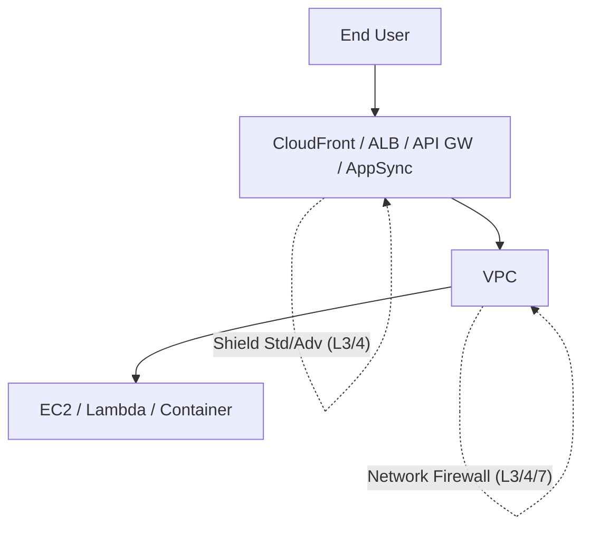
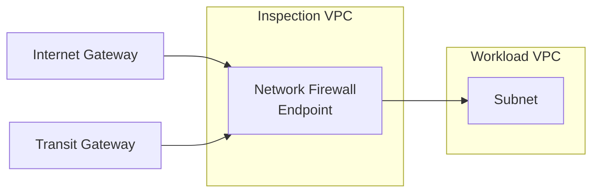
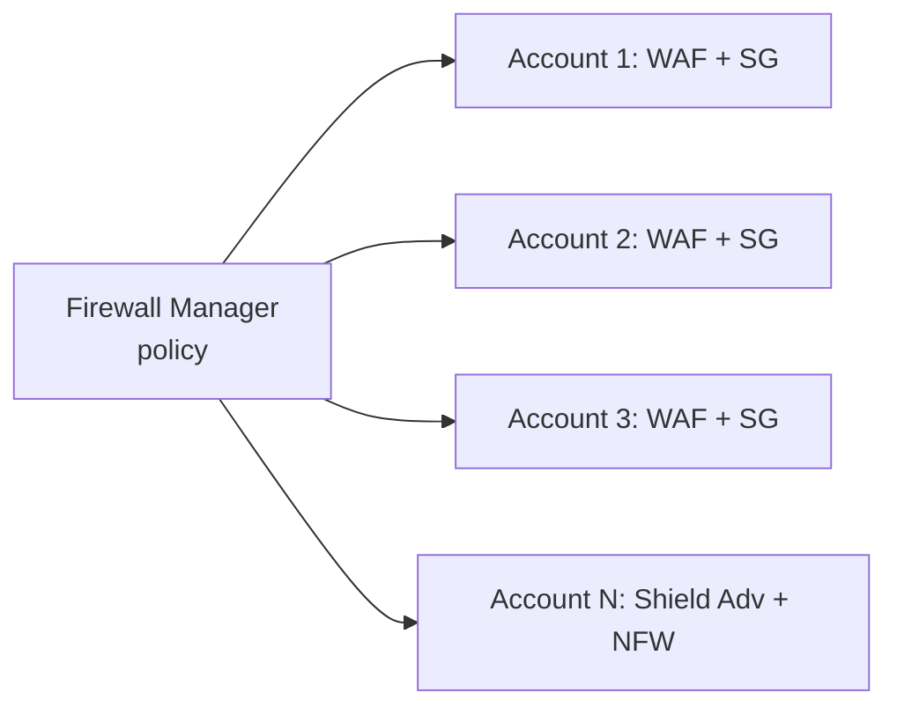

# AWS WAF, Shield & Network Firewall

> AWS's **network-layer security trio**. Each operates at a different OSI layer and a different scope:
>
> - **AWS WAF** - Layer 7 (HTTP/S) filtering at CloudFront / ALB / API Gateway / AppSync
> - **AWS Shield** - Layer 3/4 DDoS protection (Standard is free + auto; Advanced is paid + tuned)
> - **AWS Network Firewall** - Layer 3/4/7 stateful inspection at the VPC level
>
> Plus **AWS Firewall Manager** to govern all of these org-wide. These appear frequently in SAA-C03 questions about exposing apps to the internet.

See also: [12 - Data Perimeter Playbook](12%20-%20Data%20Perimeter%20Playbook.md) · [06 - IAM Identity Center & Organizations](06%20-%20IAM%20Identity%20Center%20%26%20Organizations.md) · [25 - GuardDuty Inspector Macie Security Hub](25%20-%20GuardDuty%20Inspector%20Macie%20Security%20Hub.md)

---

## Table of Contents

- [1. The Layer / Scope Cheat Sheet](#1-the-layer--scope-cheat-sheet)
- [2. AWS WAF](#2-aws-waf)
- [3. AWS Shield Standard vs Advanced](#3-aws-shield-standard-vs-advanced)
- [4. AWS Network Firewall](#4-aws-network-firewall)
- [5. AWS Firewall Manager](#5-aws-firewall-manager)
- [6. Picking the Right Tool - Decision Table](#6-picking-the-right-tool---decision-table)
- [7. Exam Tips (SAA-C03)](#7-exam-tips-saa-c03)
- [Summary](#summary)

---

## 1. The Layer / Scope Cheat Sheet

| Tool | OSI Layer | Deploys at | What it blocks |
| :--- | :--- | :--- | :--- |
| **AWS WAF** | 7 (HTTP) | CloudFront, ALB, API Gateway, AppSync, App Runner | Bad HTTP requests (SQLi, XSS, bots, geo, rate, custom rules) |
| **Shield Standard** | 3 / 4 | All AWS edge + Elastic IPs, ALB, CloudFront, Route 53 | Common DDoS (free + automatic) |
| **Shield Advanced** | 3 / 4 / 7 | Same + WAF + Global Accelerator | Sophisticated DDoS + 24×7 DRT + cost protection |
| **Network Firewall** | 3 / 4 / 7 | VPC (with dedicated subnets, Gateway Load Balancer endpoints) | Stateful traffic filtering inside the VPC; Suricata IPS rules |

[⬆ Back to top](#table-of-contents)

---

## 2. AWS WAF

A **web application firewall** that inspects HTTP/S requests reaching CloudFront, ALB, API Gateway, AppSync, or App Runner - and Allows / Blocks / Counts / CAPTCHAs / Challenges them.

### Building blocks

| Object | What it is |
| :--- | :--- |
| **Web ACL** | The top-level container of rules; attached to one or more resources |
| **Rule** | One condition + action (e.g. "block if URI contains `../`") |
| **Rule Group** | A bundle of rules - reusable |
| **Managed Rule Group** | AWS- or Marketplace-provided (e.g. **AWS Managed Rules - Core Rule Set**, **Known Bad Inputs**, **SQLi**, **Linux**, **WordPress**) |
| **IP Set / Regex Pattern Set** | Reusable lists referenced by rules |

### Rule actions

- **Allow** - let through
- **Block** - drop, optional custom response page
- **Count** - log only (used to dry-run new rules)
- **CAPTCHA** - bot challenge
- **Challenge** - silent challenge (no UI)

### Rate-based rules

Block a client when it exceeds N requests in 5-minute windows - your DDoS / brute-force defense at L7.

### Where WAF lives

Resource-attached. To protect CloudFront, the Web ACL must be in **Global / us-east-1**. For regional resources (ALB, API GW), in the same region.

[⬆ Back to top](#table-of-contents)

---

## 3. AWS Shield Standard vs Advanced

| Aspect | **Shield Standard** | **Shield Advanced** |
| :--- | :--- | :--- |
| Cost | **Free** | **$3,000 / month** + data transfer |
| Coverage | Most common L3/4 DDoS (SYN floods, UDP reflection) | Standard + larger / multi-vector L3/4 + L7 (when combined with WAF) |
| Scope | All AWS customers automatically | Opt-in per protected resource |
| Resources protected | Edge services (CloudFront, Route 53), ALB, ELB | Same + Global Accelerator, Elastic IPs |
| DDoS Response Team (DRT) | ❌ | ✅ 24×7 |
| Cost protection | ❌ | ✅ Reimburses scaling spikes during attack |
| Real-time dashboards | Limited | Detailed metrics + reports |
| Custom WAF mitigations during attack | ❌ | ✅ DRT writes WAF rules for you |

You typically pair **Shield Advanced + WAF + CloudFront + Route 53** for full DDoS + L7 defense on a high-profile internet-facing app.

[⬆ Back to top](#table-of-contents)

---

## 4. AWS Network Firewall

A **managed VPC firewall** for inspecting traffic between subnets, between VPCs, between VPC and the internet, or between VPC and on-premises.

### Capabilities

| Layer | Use case |
| :--- | :--- |
| L3/L4 stateful filter | "Allow only HTTPS to internet; block everything else" |
| L7 (Suricata IPS rules) | "Detect known C2 channels, malware signatures" |
| Domain-name allow-list | "Only `*.amazonaws.com` allowed outbound" |
| Encrypted-traffic SNI inspection | Allow/Deny by TLS SNI without decrypting body |

Deployment pattern:

- Create a **firewall** in a dedicated **inspection subnet** in a dedicated VPC.
- Route traffic through it via **Transit Gateway** (centralized inspection) or **Gateway Load Balancer endpoints** (per-VPC).

### Pricing

Per-endpoint-hour + per-GB processed. Expensive - usually only for regulated workloads needing centralized egress filtering.

[⬆ Back to top](#table-of-contents)

---

## 5. AWS Firewall Manager

A **central policy management service** (part of Organizations) that pushes WAF, Shield Advanced, Network Firewall, and security group rules across many accounts.

### What it manages

- **AWS WAF policies** - automatically attach a Web ACL to every ALB / CloudFront in scope
- **Shield Advanced** - enrol every resource in scope automatically
- **Network Firewall** - central rule groups, applied org-wide
- **Security Group rules** - audit and remediate non-compliant SGs
- **Route 53 Resolver DNS Firewall** - central DNS rule groups

### Prereqs

- AWS Organizations + all features enabled
- AWS Config enabled in all accounts in scope
- Firewall Manager designated as a service in Organizations

### Cost

Free service; you pay for the underlying WAF / Shield / NFW resources it creates.

[⬆ Back to top](#table-of-contents)

---

## 6. Picking the Right Tool - Decision Table

| Requirement | Pick |
| :--- | :--- |
| Block SQLi / XSS / common HTTP attacks at CloudFront / ALB | **WAF** + AWS Managed Rules - Core Rule Set |
| Rate-limit / mitigate L7 DDoS | **WAF** rate-based rule (or Shield Adv + WAF) |
| Get default L3/4 DDoS protection for free | **Shield Standard** (automatic) |
| Protect a major site against advanced DDoS, with 24/7 response | **Shield Advanced** + WAF + CloudFront |
| Filter egress traffic out of VPC by domain / SNI | **Network Firewall** |
| Centralized internet-egress inspection across many VPCs | **Network Firewall** behind TGW |
| Enforce one WAF policy across 30 AWS accounts | **Firewall Manager** |
| Block known-bad IPs globally | **WAF IP Set** (or Network Firewall) |
| Geographically block requests | **WAF geo-match rule** |

[⬆ Back to top](#table-of-contents)

---

## 7. Exam Tips (SAA-C03)

1. **WAF = L7 (HTTP). Network Firewall = L3/4/7 inside VPC. Shield = L3/4 DDoS at edge.** Three different layers, three different scopes.
2. **WAF for CloudFront must be in `us-east-1` (Global).** For ALB / API GW, regional.
3. **AWS Managed Rules** save weeks: Core Rule Set, Known Bad Inputs, SQLi, IP reputation, Anonymous IP, Bot Control.
4. **Rate-based WAF rule** is the canonical answer for "limit one IP to N req/5min."
5. **Shield Standard is free + automatic.** You can't disable it.
6. **Shield Advanced = $3 000/month** + cost protection + DRT - pick only for high-visibility apps.
7. **Network Firewall** for "centralized egress filtering / inspect traffic between VPCs / IPS rules."
8. **Firewall Manager** for "apply the same WAF / Shield / SG rules across all accounts in the Org."
9. **Security groups vs Network Firewall:** SGs are per-ENI stateful; Network Firewall is centralized stateful inspection of cross-subnet / cross-VPC / egress traffic.
10. **Route 53 Resolver DNS Firewall** (briefly): blocks DNS queries to known-bad domains; can also be managed via Firewall Manager.

[⬆ Back to top](#table-of-contents)

---

## Summary

- **WAF** at L7 on CloudFront / ALB / API GW / AppSync - managed rule groups + custom + rate-based.
- **Shield Standard (free)** + **Shield Advanced ($3 k/mo)** for L3/4 DDoS + (with WAF) L7.
- **Network Firewall** for stateful traffic filtering at the VPC level - egress inspection, IPS.
- **Firewall Manager** governs all of the above org-wide.
- For the exam: match the keyword to the layer - HTTP filter → WAF; DDoS → Shield; VPC egress/IPS → Network Firewall; org-wide → Firewall Manager.

[⬆ Back to top](#table-of-contents)
