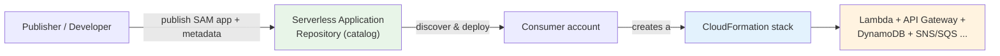
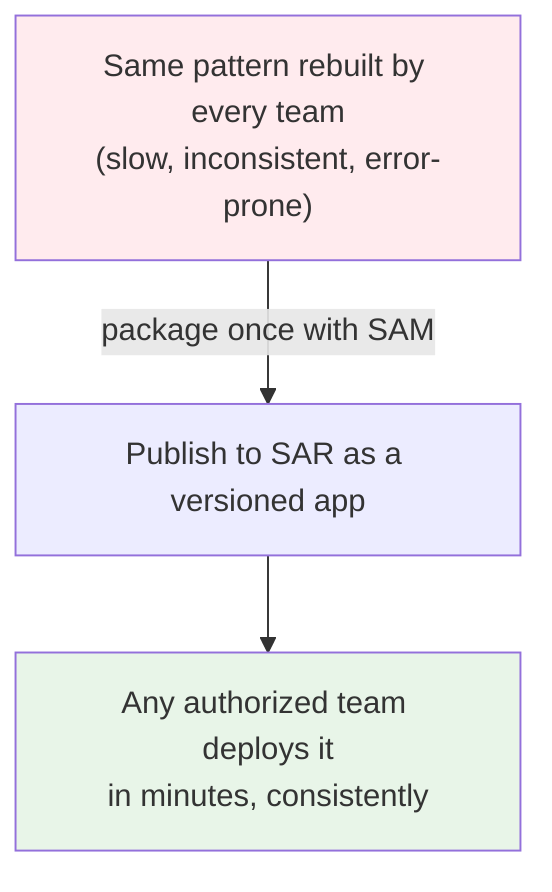
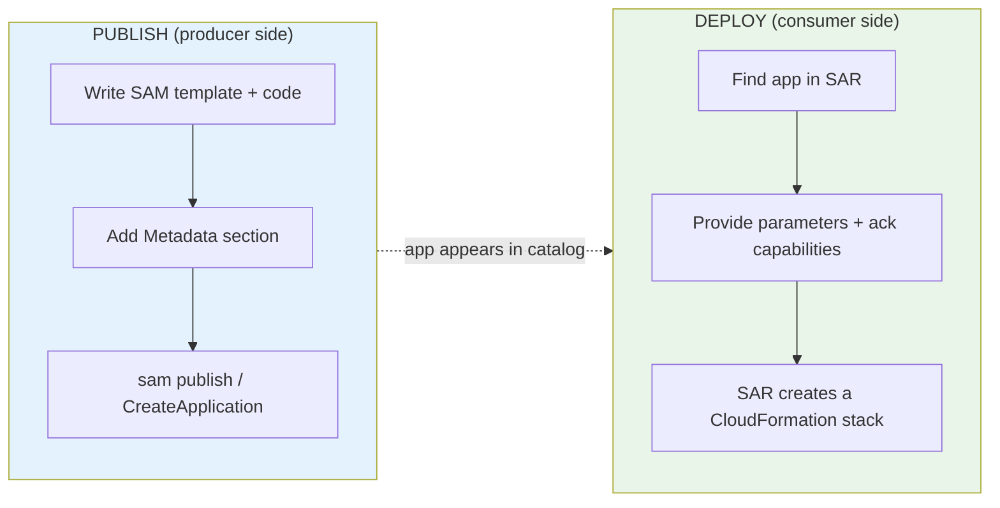
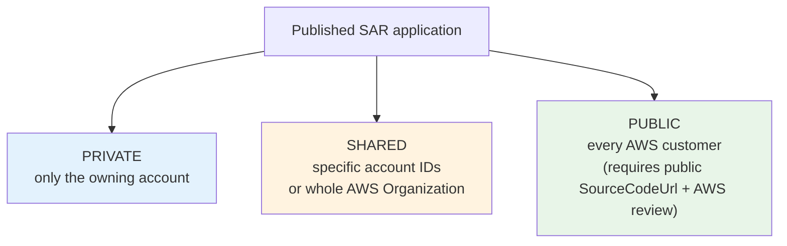
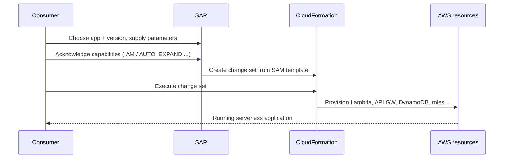
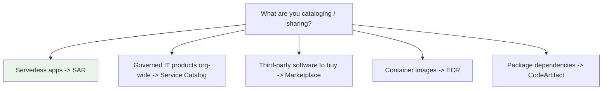

# AWS Serverless Application Repository (SAR) - SAA-C03 Intro

> The **Serverless Application Repository (SAR)** is a **managed catalog of reusable serverless applications**. Think of it as an *"app store for serverless"*: developers **publish** ready-made apps (built on AWS SAM), and anyone with permission can **discover and deploy** them in a few clicks. Deployment is just a **CloudFormation stack** under the hood, and **SAR itself is free** — you only pay for the resources the app creates (Lambda, API Gateway, DynamoDB, etc.).

See also: [02 - SAR Architecture & Publishing Deep Dive](02%20-%20SAR%20Architecture%20%26%20Publishing%20Deep%20Dive.md) · [03 - SAR Sharing, Nested Apps & Governance Deep Dive](03%20-%20SAR%20Sharing%2C%20Nested%20Apps%20%26%20Governance%20Deep%20Dive.md) · [04 - SAR Examples & Patterns](04%20-%20SAR%20Examples%20%26%20Patterns.md) · [05 - SAR Scenario Questions](05%20-%20SAR%20Scenario%20Questions.md) · [06 - SAR Important Facts & Cheat Sheet](06%20-%20SAR%20Important%20Facts%20%26%20Cheat%20Sheet.md)

Related serverless/compute topics: [Lambda intro](Lambda%20intro.md) · [00 - Containers Overview & Service Comparison](00%20-%20Containers%20Overview%20%26%20Service%20Comparison.md)

---

## Table of Contents

- [Core Concept: What is the Serverless Application Repository?](#core-concept-what-is-the-serverless-application-repository)
- [The Reuse Problem SAR Solves](#the-reuse-problem-sar-solves)
- [Key Building Blocks](#key-building-blocks)
- [Publish vs Deploy (Two Directions)](#publish-vs-deploy-two-directions)
- [Sharing Models: Private, Shared, Public](#sharing-models-private-shared-public)
- [How a Deployment Actually Works](#how-a-deployment-actually-works)
- [Pricing](#pricing)
- [When to Use SAR](#when-to-use-sar)
- [SAR vs Service Catalog vs Marketplace vs ECR vs CodeArtifact (Exam Favorite)](#sar-vs-service-catalog-vs-marketplace-vs-ecr-vs-codeartifact-exam-favorite)
- [SAR Across the Four Exam Domains](#sar-across-the-four-exam-domains)

---

---

## Core Concept: What is the Serverless Application Repository?

The **AWS Serverless Application Repository (SAR)** is a **managed repository for serverless applications**. It lets teams, organizations, and individual developers **store, share, discover, and deploy** reusable serverless applications, so you can assemble architectures from pre-built pieces instead of rebuilding the same thing every time.

Three facts define SAR:

1. **It is built on AWS SAM** (Serverless Application Model). Every application in SAR is described by a **SAM template** (an extension of CloudFormation for serverless).
2. **Deploying an app = launching a CloudFormation stack** in your account. SAR is essentially a discovery + governance layer on top of CloudFormation.
3. **SAR itself costs nothing.** You pay only for the underlying resources the deployed app provisions and runs.

> [!note] One-line mental model
> SAR is the **"app store for serverless."** Publishers list apps; consumers deploy them with a click; the actual provisioning is CloudFormation; AWS doesn't charge for the storefront.

[⬆ Back to top](#table-of-contents)

---

## The Reuse Problem SAR Solves

Without SAR, every team rebuilds the same serverless plumbing: an S3-thumbnail generator, a CloudWatch-alarm-to-Slack notifier, a DynamoDB stream processor, an Alexa skill skeleton. That's wasted effort and inconsistent quality.

SAR turns those into **reusable, versioned, deployable units**:

- **For an organization** — publish vetted, standardized components (logging, security guardrails, common integrations) once and let every team deploy the approved version.
- **For the community** — AWS, partners, and individuals publish **public** apps anyone can deploy (chatbots, image processing, monitoring tools, sample architectures).
- **For a vendor** — distribute a deployable serverless product to customers without shipping them code to wire up manually.

[⬆ Back to top](#table-of-contents)

---

## Key Building Blocks

| Building block | What it is |
| :--- | :--- |
| **Application** | The published, named unit (e.g., `my-org/image-resizer`). Has an **ApplicationId** (ARN) and metadata. |
| **SAM template** | The CloudFormation/SAM document describing the app's resources (`Transform: AWS::Serverless-2016-10-31`). |
| **Semantic version** | Each published version (e.g., `1.2.0`) is **immutable** — you can't overwrite it, only publish a new version. |
| **Metadata** | Name, description, author, labels, `SemanticVersion`, `SourceCodeUrl`, `LicenseUrl`, `ReadmeUrl`, `HomePageUrl`. |
| **Application policy** | A **resource-based policy** controlling *who* (which accounts / org / everyone) can find and deploy the app. |
| **Nested application** | A SAR app referenced *inside another* SAM template via `AWS::Serverless::Application` — composition of apps. |

> **Exam nugget:** Published **versions are immutable**. To "update" a published app you publish a **new semantic version**; consumers choose which version to deploy.

[⬆ Back to top](#table-of-contents)

---

## Publish vs Deploy (Two Directions)

SAR has two distinct flows, and the exam expects you to keep them separate:

| Direction | Who | Tools | Result |
| :--- | :--- | :--- | :--- |
| **Publish** | The producer | `sam publish`, Console, `CreateApplication` / `CreateApplicationVersion` API | A versioned app listed in SAR |
| **Deploy** | The consumer | Console "Deploy", `sam deploy`, `CreateCloudFormationChangeSet` API | A CloudFormation stack of resources in the consumer's account |

Deep dive on publishing: [02 - SAR Architecture & Publishing Deep Dive](02%20-%20SAR%20Architecture%20%26%20Publishing%20Deep%20Dive.md).

[⬆ Back to top](#table-of-contents)

---

## Sharing Models: Private, Shared, Public

Visibility is controlled by the **application's resource-based policy**, not by copying the app around.

| Model | Who can deploy | How it's set |
| :--- | :--- | :--- |
| **Private** | Only the publishing account (default) | No sharing policy added |
| **Shared** | Named AWS account IDs, **or an entire AWS Organization** | Application policy granting those principals / org ID |
| **Public** | Anyone with an AWS account | Policy with principal `*`; app must have a **public `SourceCodeUrl`** and passes AWS review |

> **Exam nugget:** To share a private app **org-wide**, you don't make it public — you grant deploy permission to the **AWS Organization** in the application policy. Full mechanics in [03 - SAR Sharing, Nested Apps & Governance Deep Dive](03%20-%20SAR%20Sharing%2C%20Nested%20Apps%20%26%20Governance%20Deep%20Dive.md).

[⬆ Back to top](#table-of-contents)

---

## How a Deployment Actually Works

When a consumer deploys, SAR hands the SAM template to **CloudFormation**, which provisions everything as a stack:

- Because it's a **CloudFormation stack**, the deployed app is fully **managed, updatable, and deletable** as one unit.
- If the app creates **IAM roles/policies**, you must acknowledge **`CAPABILITY_IAM`** (or `CAPABILITY_NAMED_IAM`).
- If the app **nests other apps**, you must acknowledge **`CAPABILITY_AUTO_EXPAND`**.

[⬆ Back to top](#table-of-contents)

---

## Pricing

> **There is no charge for the Serverless Application Repository itself** — not for publishing, not for storing, not for deploying.

You pay only for the **AWS resources the deployed application uses** (Lambda invocations/duration, API Gateway requests, DynamoDB capacity, S3 storage, etc.) — exactly as if you'd built it yourself.

| Action | SAR charge |
| :--- | :--- |
| Publishing an application | Free |
| Storing applications/versions | Free |
| Searching / discovering | Free |
| Deploying | Free (the *deployed resources* incur normal AWS charges) |

[⬆ Back to top](#table-of-contents)

---

## When to Use SAR

| Trigger in a scenario | SAR is a fit because... |
| :--- | :--- |
| "Share a **standardized serverless component** across many teams/accounts" | Publish once, share via org policy, deploy consistently |
| "Quickly deploy a **common pattern** (image resize, log shipping, chatbot)" | Browse a public/private app and deploy in minutes |
| "**Distribute** a serverless app to other AWS customers" | Publish a public app with a verified author badge |
| "Compose an app from **reusable building blocks**" | Reference others as **nested applications** |
| "Maintain **versioned, immutable** releases of internal serverless tooling" | Semantic versioning, immutable versions |

> Not the answer when: you need a registry for **container images** (→ Amazon ECR), software **packages/dependencies** (→ CodeArtifact), or governed **non-serverless IT products** across an org (→ Service Catalog). See the comparison below.

[⬆ Back to top](#table-of-contents)

---

## SAR vs Service Catalog vs Marketplace vs ECR vs CodeArtifact (Exam Favorite)

These "repository/catalog" services are a classic source of distractor answers. Memorize what each one *stores*.

| Service | What it stores / catalogs | Deploys via | Typical exam trigger |
| :--- | :--- | :--- | :--- |
| **Serverless Application Repository** | **Serverless apps** (SAM templates: Lambda, API GW, etc.) | CloudFormation stack | "Reusable/shareable **serverless application**" |
| **AWS Service Catalog** | Approved **IT products** (CloudFormation products), any service | CloudFormation, with org **governance/constraints** | "Curated, **governed self-service** catalog of approved products" |
| **AWS Marketplace** | **Third-party software** (AMIs, SaaS, containers, ML models) | Subscribe / launch | "**Buy/subscribe** to third-party/partner software" |
| **Amazon ECR** | **Container images** | Pull into ECS/EKS/etc. | "Store/scan **Docker/OCI images**" |
| **AWS CodeArtifact** | **Software packages** (npm, pip, Maven, NuGet, etc.) | Package managers pull dependencies | "Private **package/dependency** repository" |

> **Exam trap:** SAR ↔ Service Catalog. If the scenario is about **serverless reusable apps** built on Lambda/SAM → **SAR**. If it's about **org-wide governance of approved products with launch constraints/portfolios** (any resource type, not just serverless) → **Service Catalog**.

[⬆ Back to top](#table-of-contents)

---

## SAR Across the Four Exam Domains

| Domain | SAR angle |
| :--- | :--- |
| **Secure architectures** | Resource-based **application policy** controls who can deploy; deploy-time **capability acknowledgements** (`CAPABILITY_IAM`, `CAPABILITY_AUTO_EXPAND`) gate IAM/nested resources; share **org-wide** without going public |
| **Resilient architectures** | Apps deploy as **CloudFormation stacks** → repeatable, version-pinned, easily re-deployed in another account/Region for recovery |
| **High-performing architectures** | Reuse pre-built, tuned serverless patterns instead of hand-rolling; compose via **nested applications** |
| **Cost-optimized architectures** | **No charge for SAR**; pay only for the deployed serverless resources (which themselves scale to zero with Lambda) |

[⬆ Back to top](#table-of-contents)

---

> Next: [02 - SAR Architecture & Publishing Deep Dive](02%20-%20SAR%20Architecture%20%26%20Publishing%20Deep%20Dive.md) — the SAM `Metadata` section, the publish workflow, semantic versioning, and how SAR drives CloudFormation under the hood.
