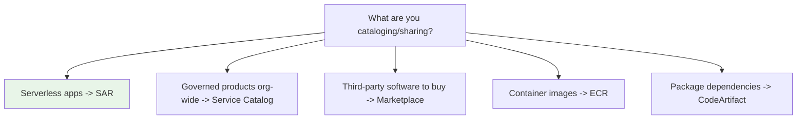

# AWS SAR - Important Facts & Cheat Sheet

> One-page cram: the high-yield facts, gotchas, comparison tables, and trigger words for SAA-C03. If you review only one SAR file before the exam, make it this one.

See also: [01 - SAR Intro](01%20-%20SAR%20Intro.md) · [02 - SAR Architecture & Publishing Deep Dive](02%20-%20SAR%20Architecture%20%26%20Publishing%20Deep%20Dive.md) · [03 - SAR Sharing, Nested Apps & Governance Deep Dive](03%20-%20SAR%20Sharing%2C%20Nested%20Apps%20%26%20Governance%20Deep%20Dive.md) · [04 - SAR Examples & Patterns](04%20-%20SAR%20Examples%20%26%20Patterns.md) · [05 - SAR Scenario Questions](05%20-%20SAR%20Scenario%20Questions.md)

---

## The 12 facts most likely to be tested

1. **SAR = managed repository/catalog for reusable serverless applications** — the "app store for serverless."
2. **Built on AWS SAM**; every app is a **SAM template** (`Transform: AWS::Serverless-2016-10-31`).
3. **Deploying = a CloudFormation stack** (via a change set) in the consumer's account.
4. **SAR is free** — you pay only for the **deployed resources** (Lambda, API GW, DynamoDB, …).
5. **Published versions are immutable** — to change, publish a **new semantic version**.
6. **Sharing via the application policy** (resource-based): **private** (default) → **shared** (accounts/**Organization**) → **public**.
7. **Org sharing** distributes internally **without going public**; new member accounts inherit access.
8. **Public apps** require a **publicly readable `SourceCodeUrl`** + license + **AWS review**; **verified author** badge builds trust.
9. **Nested applications** = `AWS::Serverless::Application` with `Location.ApplicationId` + pinned **`SemanticVersion`**; needs **`CAPABILITY_AUTO_EXPAND`**.
10. Apps creating IAM need **`CAPABILITY_IAM`** / **`CAPABILITY_NAMED_IAM`** at deploy.
11. `sam package` uploads code to **S3**; SAR is **regional**.
12. Granting **`Deploy`** in the application policy is what lets another principal launch the app.

---

## SAR vs the other "repository/catalog" services (the big differentiator table)

| Service | Stores / catalogs | Pick it when... |
| :--- | :--- | :--- |
| **SAR** | **Serverless apps** (SAM templates) | Reusable/shareable **serverless application** |
| **Service Catalog** | Approved **IT products** (any type), portfolios, constraints | **Governed org-wide self-service** of approved products |
| **Marketplace** | **Third-party software** (AMIs/SaaS/containers/ML) | **Buy/subscribe** to commercial software |
| **ECR** | **Container images** | Store/scan **Docker/OCI images** |
| **CodeArtifact** | **Software packages** (npm/pip/Maven/NuGet) | Private **package/dependency** repo |

---

## Sharing models cheat sheet

| Model | Principal in policy | Visibility | Use when |
| :--- | :--- | :--- | :--- |
| **Private** | none (owner only) | Owner account | Default / not yet shared |
| **Shared (accounts)** | specific account IDs | Those accounts | A few known consumers |
| **Shared (org)** | `*` + `OrganizationId` | Whole org, **not public** | Internal standardized component |
| **Public** | `*` (unscoped) | Every AWS customer | External distribution |

---

## Capabilities cheat sheet

| Capability | Needed when the app... |
| :--- | :--- |
| `CAPABILITY_IAM` | Creates IAM roles/policies |
| `CAPABILITY_NAMED_IAM` | Creates **named** IAM resources |
| `CAPABILITY_RESOURCE_POLICY` | Creates resource-based policies |
| `CAPABILITY_AUTO_EXPAND` | Contains **nested applications** / macros |

---

## Publish vs Deploy

| | Publish (producer) | Deploy (consumer) |
| :--- | :--- | :--- |
| Tool | `sam publish` / `CreateApplication(Version)` | Console "Deploy" / `sam deploy` / `CreateCloudFormationChangeSet` |
| Result | App listed (private by default) | **CloudFormation stack** of resources |
| Versioning | New **immutable** `SemanticVersion` | Choose/pin a version |

---

## Per-topic gotchas

| Topic | Gotcha |
| :--- | :--- |
| **Immutability** | Can't edit/overwrite a version — publish a **new** one |
| **Org vs public** | Internal sharing = **Organization**, not public |
| **Deploy permission** | Must grant **`Deploy`** action explicitly |
| **Nested apps** | Need **`CAPABILITY_AUTO_EXPAND`** + pin `SemanticVersion` |
| **Cost** | SAR is **free**; deployed resources are billed normally |
| **Engine** | Deploy = **CloudFormation**, not a bespoke deployer |
| **Region** | SAR is **regional**; artifacts staged in **S3** |
| **Public reqs** | Need public **`SourceCodeUrl`** + license + AWS review |

---

## Trigger-word → answer (final cram)

| Question says... | Answer |
| :--- | :--- |
| "Reusable/shareable **serverless application**" | **SAR** |
| "Share serverless app **across the org, not public**" | SAR **shared with Organization** |
| "Distribute serverless app to **external customers** (free)" | **Public** SAR + verified author |
| "**Sell** software with AWS billing" | **Marketplace** |
| "Governed catalog of **all** product types" | **Service Catalog** |
| "Store **container images**" | **ECR** |
| "Store **packages/dependencies**" | **CodeArtifact** |
| "**Update** a published SAR app" | New **semantic version** (immutable) |
| "Deploying a SAR app creates..." | **CloudFormation stack** |
| "Template has **nested apps**" | **`CAPABILITY_AUTO_EXPAND`** |
| "Cost of SAR" | **Free** (pay for deployed resources) |
| "Built on / provisions via" | **SAM** / **CloudFormation** |
| "Consumer can see but not deploy" | Grant **`Deploy`** in app policy |

---

## Domain mapping recap

| Exam domain | SAR angle |
| :--- | :--- |
| Secure | Resource-based **application policy**; deploy **capability** acknowledgements; org-share without public exposure |
| Resilient | Apps deploy as **repeatable, version-pinned CloudFormation stacks** |
| High-performing | Reuse vetted serverless patterns; **nested-app** composition |
| Cost-optimized | **No charge for SAR**; serverless resources scale to zero |

---

> Back to start: [01 - SAR Intro](01%20-%20SAR%20Intro.md)
