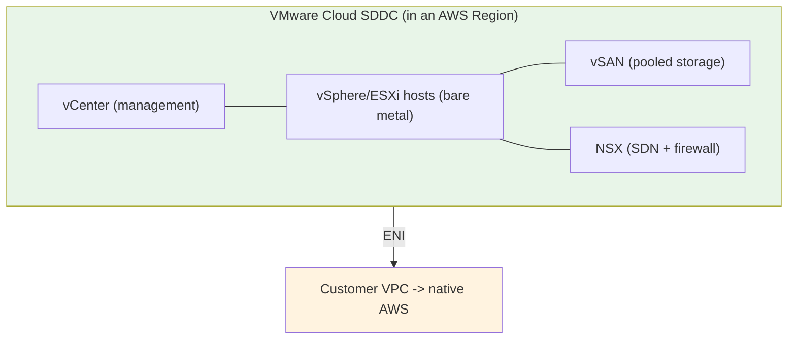
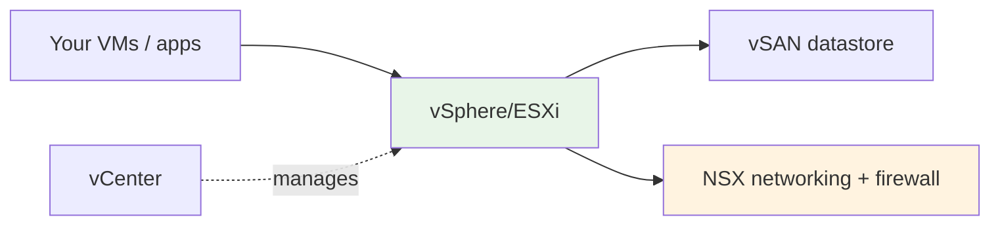
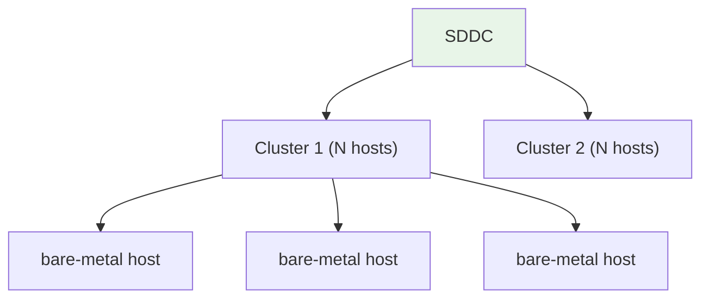
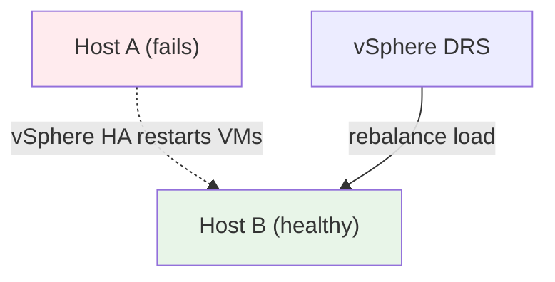
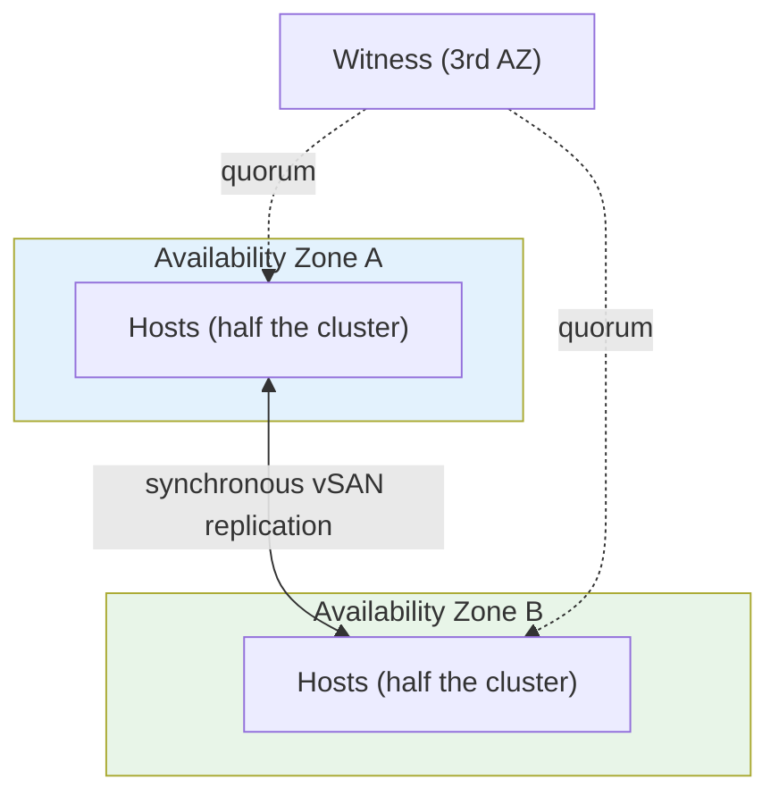
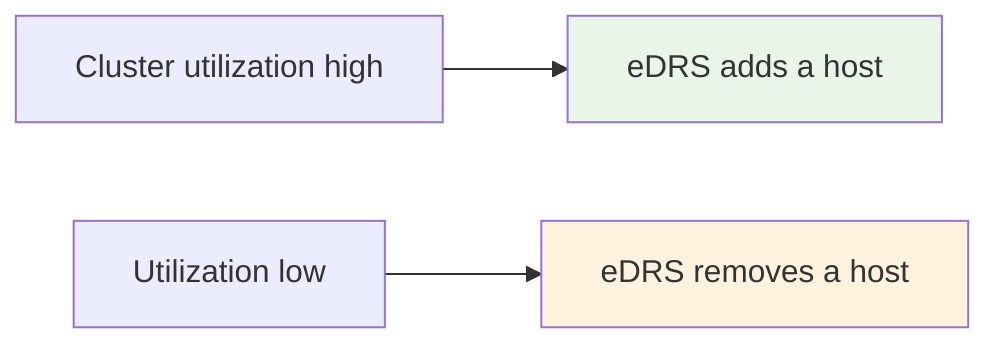
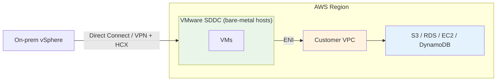

# VMware Cloud on AWS - Architecture Deep Dive

> How the SDDC is actually built: the **vSphere/vSAN/NSX/vCenter** stack, **bare-metal hosts and clusters**, **minimum sizes**, **stretched clusters across two AZs**, **vSphere HA / DRS / Elastic DRS**, and the resilience model. This is where "how do I make it AZ-resilient" and "what am I actually managing" questions are decided.

See also: [01 - VMware Cloud on AWS Intro](01%20-%20VMware%20Cloud%20on%20AWS%20Intro.md) · [03 - VMware Cloud Networking, Migration & Integration Deep Dive](03%20-%20VMware%20Cloud%20Networking%2C%20Migration%20%26%20Integration%20Deep%20Dive.md) · [04 - VMware Cloud Examples & Patterns](04%20-%20VMware%20Cloud%20Examples%20%26%20Patterns.md) · [05 - VMware Cloud Scenario Questions](05%20-%20VMware%20Cloud%20Scenario%20Questions.md) · [06 - VMware Cloud Important Facts & Cheat Sheet](06%20-%20VMware%20Cloud%20Important%20Facts%20%26%20Cheat%20Sheet.md)

---

## Table of Contents

- [Part 1: The SDDC — Logical Building Block](#part-1-the-sddc--logical-building-block)
- [Part 2: The Four SDDC Software Components](#part-2-the-four-sddc-software-components)
- [Part 3: Hosts, Clusters & Sizing](#part-3-hosts-clusters--sizing)
- [Part 4: Storage — vSAN](#part-4-storage--vsan)
- [Part 5: Availability — vSphere HA & DRS](#part-5-availability--vsphere-ha--drs)
- [Part 6: Stretched Clusters Across Two AZs](#part-6-stretched-clusters-across-two-azs)
- [Part 7: Elastic DRS — Auto-Scaling Hosts](#part-7-elastic-drs--auto-scaling-hosts)
- [Part 8: How It Sits Inside an AWS Region](#part-8-how-it-sits-inside-an-aws-region)
- [Summary](#summary)

---

---

## Part 1: The SDDC — Logical Building Block

The unit you provision is an **SDDC (Software-Defined Data Center)** — a complete VMware environment (vCenter + a cluster of ESXi hosts + vSAN + NSX) running on AWS bare-metal in a chosen Region/AZ.

- An SDDC contains **one or more clusters**; each cluster is a set of **bare-metal hosts**.
- You manage everything in the SDDC through its **vCenter Server**, identical to on-prem vSphere.
- The SDDC connects to a **customer VPC** via an [ENI](03%20-%20VMware%20Cloud%20Networking%2C%20Migration%20%26%20Integration%20Deep%20Dive.md) for native-AWS access.

> **Exam nugget:** The provisioned object is the **SDDC**. It's deployed into a specific **AWS Region and AZ** (single-AZ by default; stretched clusters span two AZs — see Part 6).

[⬆ Back to top](#table-of-contents)

---

## Part 2: The Four SDDC Software Components

| Component | Layer | What it does | On-prem analog |
| :--- | :--- | :--- | :--- |
| **vSphere / ESXi** | Compute | Type-1 hypervisor running your VMs on the bare-metal host | Same |
| **vSAN** | Storage | Aggregates host-local NVMe into a shared, software-defined datastore | Same |
| **NSX** | Network | Software-defined networking, routing, **micro-segmentation**, distributed firewall | Same |
| **vCenter Server** | Management | Single console to operate the whole SDDC | Same |

> **Exam nugget:** **NSX** provides **micro-segmentation** and a distributed firewall — the security/network control plane inside the SDDC. **vSAN** is the storage layer; there's no separate SAN to manage.

[⬆ Back to top](#table-of-contents)

---

## Part 3: Hosts, Clusters & Sizing

- Hosts are **dedicated, single-tenant AWS bare-metal EC2 instances** (e.g., the `i3.metal` / `i3en.metal` / `i4i.metal` families historically used for VMC).
- Hosts are grouped into **clusters**; resilience (vSAN + vSphere HA) operates at the cluster level.
- Production clusters have a **minimum host count** (small SDDCs can start with fewer hosts for pilots/test). For the exam: know that **clusters have minimum sizes** and you **scale by adding/removing hosts**.

> **Exam nugget:** Capacity is **per-host, dedicated, single-tenant** bare metal. You **scale horizontally by adding hosts** to a cluster (and **Elastic DRS** can automate that — Part 7).

[⬆ Back to top](#table-of-contents)

---

## Part 4: Storage — vSAN

**vSAN** pools the local NVMe storage of all hosts in a cluster into a single shared datastore.

| Property | Detail |
| :--- | :--- |
| Type | Software-defined, hyper-converged (storage + compute on the same hosts) |
| Resilience | Data is mirrored across hosts per storage policy; survives host failure |
| Scaling | Adding hosts adds both compute **and** storage |
| Extra capacity | Storage-dense host families and external options exist for storage-heavy needs |

> **Exam nugget:** Storage and compute scale **together** when you add a host (hyper-converged). If you're **storage-bound**, use storage-dense host types or supplemental external storage rather than over-provisioning compute.

[⬆ Back to top](#table-of-contents)

---

## Part 5: Availability — vSphere HA & DRS

The SDDC uses native VMware availability features:

| Feature | Role |
| :--- | :--- |
| **vSphere HA** | Restarts VMs on healthy hosts if a host fails |
| **vSphere DRS** | Load-balances VMs across hosts for performance |
| **vSAN policies** | Keep redundant copies of VM data so a host loss doesn't lose data |
| **Host auto-remediation** | AWS/VMware replaces a failed bare-metal host automatically |

> **Exam nugget:** Within a single cluster/AZ, **vSphere HA** handles **host** failure (VM restart). For **Availability-Zone** failure tolerance, you need a **stretched cluster** (Part 6).

[⬆ Back to top](#table-of-contents)

---

## Part 6: Stretched Clusters Across Two AZs

A **stretched cluster** spans **two Availability Zones** with **synchronous vSAN replication**, so the loss of an **entire AZ** does not take down the workload.

| Aspect | Single-AZ cluster | **Stretched cluster** |
| :--- | :--- | :--- |
| Spans | One AZ | **Two AZs** |
| Tolerates | Host failure | **Full AZ failure** |
| Storage replication | Within AZ | **Synchronous across AZs** |
| Use when | Dev/test, cost-sensitive | Production needing **AZ-level HA** |

> **Exam nugget:** "Make the VMware workload survive an **AZ outage**" → **stretched cluster across two AZs** (synchronous vSAN), *not* just vSphere HA (which only covers host failure within one AZ).

[⬆ Back to top](#table-of-contents)

---

## Part 7: Elastic DRS — Auto-Scaling Hosts

**Elastic DRS (eDRS)** automatically **adds or removes hosts** in a cluster based on policies (CPU, memory, or storage utilization), similar in spirit to EC2 Auto Scaling but at the **host** level.

| Policy goal | eDRS behavior |
| :--- | :--- |
| Optimize for **cost** | Scale in aggressively when idle |
| Optimize for **performance** | Scale out quickly under load |
| Optimize for **rapid scale-up** | Add hosts fast for spiky demand |

> **Exam nugget:** **Elastic DRS** right-sizes the **host count** automatically — the cost/performance lever for fluctuating VMware workloads (contrast: EC2 Auto Scaling scales *instances*, not bare-metal SDDC hosts).

[⬆ Back to top](#table-of-contents)

---

## Part 8: How It Sits Inside an AWS Region

- The SDDC lives **inside an AWS Region/AZ** on AWS hardware.
- It connects **southbound to on-prem** via **Direct Connect or VPN** (with **HCX** for migration), and **eastbound to native AWS** via the **ENI**.
- Management is via **vCenter**, optionally joined to on-prem vCenter through **Hybrid Linked Mode** (see [03 - VMware Cloud Networking, Migration & Integration Deep Dive](03%20-%20VMware%20Cloud%20Networking%2C%20Migration%20%26%20Integration%20Deep%20Dive.md)).

[⬆ Back to top](#table-of-contents)

---

## Summary

- The provisioned unit is an **SDDC** = **vCenter + ESXi cluster(s) + vSAN + NSX** on **dedicated bare-metal AWS hosts**, in a chosen **Region/AZ**.
- **vSphere/ESXi** (compute), **vSAN** (hyper-converged storage), **NSX** (SDN + micro-segmentation), **vCenter** (management) — the same stack as on-prem.
- Scale by **adding hosts**; **Elastic DRS** automates host count for cost/performance.
- **vSphere HA** covers **host** failure within an AZ; a **stretched cluster across two AZs** (synchronous vSAN) covers **full-AZ** failure.
- The SDDC bridges **on-prem (DX/VPN + HCX)** and **native AWS (ENI)**.

> Next: [03 - VMware Cloud Networking, Migration & Integration Deep Dive](03%20-%20VMware%20Cloud%20Networking%2C%20Migration%20%26%20Integration%20Deep%20Dive.md) — ENI/connected VPC, VMware Transit Connect, HCX, Hybrid Linked Mode, and DR options.
