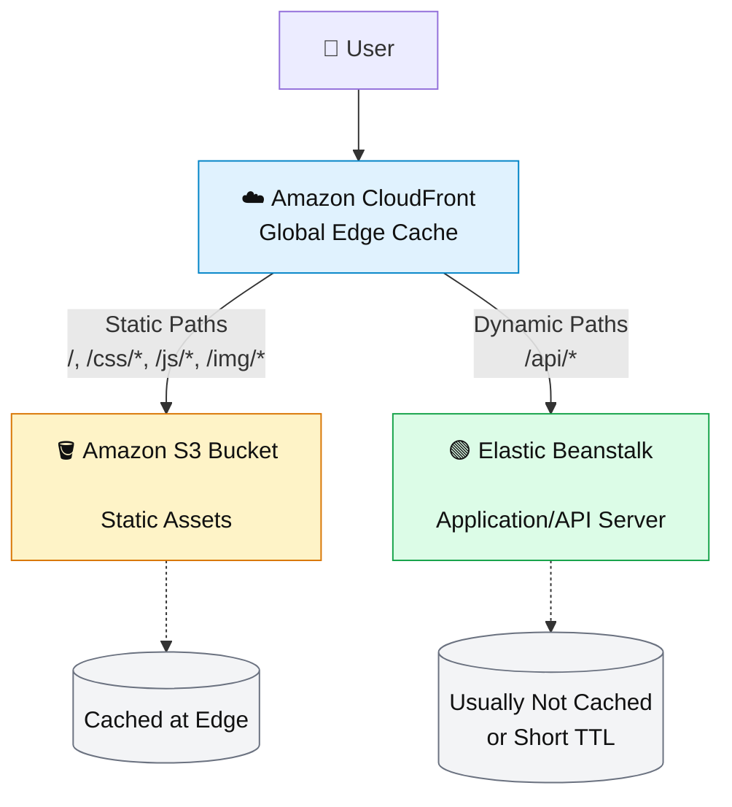
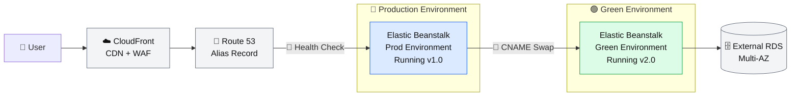

# 📘 AWS Elastic Beanstalk: Advanced Scenarios & Integrations

This section focuses on **fault scenarios**, **recovery procedures**, and **full-stack integrations** with API Gateway, Route 53, and CloudFront/S3. These are high-weight topics for the SAA-C03 exam.

---

## 🔥 Part 1: Fault Scenarios & Solutions

Understanding what breaks in Elastic Beanstalk and how to fix it is critical for architecting resilient applications.

### Scenario 1: The "Invalid State" Lockout (High Exam Probability)

**The Problem**: You try to deploy a new version of your application, but Elastic Beanstalk returns an error: *"Environment is in an invalid state for this operation. Must be ready."*

**Root Cause**: Elastic Beanstalk creates an underlying AWS CloudFormation stack for every environment. If this CloudFormation stack enters a `FAILED` or `ROLLBACK_COMPLETE` state, Elastic Beanstalk blocks all further operations (deploy, config updates, etc.) until the root cause is fixed .

**Common Causes Exam Loves**:

1. **Permission Issues (Most Common)**: The service role lacks permissions to create resources like EC2, RDS, or S3.
2. **Out-of-Band Changes (Anti-Pattern)**: Someone manually deleted or modified an EC2 instance, Security Group, or S3 bucket via the Console/CLI. This causes **resource drift** between what CloudFormation expects and what exists .
3. **Unsupported Configuration**: Trying to attach an invalid instance type or using an unreachable VPC subnet.

**The Solution (Step-by-Step)**:

1. **Identify the Cause**: Check the **CloudFormation Console**. Find the stack named similarly to `awseb-e-{EnvironmentID}-stack`. Look at the "Events" tab to see exactly which resource failed.
2. **Fix the Root Cause**:
    - *For permissions*: Update the Elastic Beanstalk service role (`aws-elasticbeanstalk-service-role`) to include necessary policies.
    - *For out-of-band changes*: Revert the manual change (e.g., re-create the deleted S3 bucket with the exact name) so CloudFormation can find it again.
3. **Resume Operations**: Once the CloudFormation stack status turns to `UPDATE_COMPLETE` or `ROLLBACK_COMPLETE`, Elastic Beanstalk automatically detects the change. You must then resolve any pending issues (like a failed deployment) by submitting a new deployment or environment update .

> **Exam Trick**: If the answer says "Contact AWS Support to reset the environment status" – that is **WRONG**. As of late 2024, you must fix the underlying CloudFormation issue yourself; AWS no longer resets the state manually .

---

### Scenario 2: The Elastic Beanstalk "Unknown" or "No Data" Health Status

**The Problem**: Your environment scaling schedule sets `Min=0` and `Max=0` overnight to save costs. The next morning, you see that the environment health is fluctuating between "Unknown" and "No Data," and users are seeing 4xx errors.

**Root Cause**: When the Auto Scaling group scales to **zero instances**, the Load Balancer has no registered targets. Any incoming request during this window returns a `503` or `4xx` error. Elastic Beanstalk’s enhanced health monitoring system detects that 100% of requests to the Load Balancer are failing, flags it as severe, and throws the health status into confusion .

**The Solutions**:

1. **Customize Health Rules (Best for Exam)**:
    - Elastic Beanstalk allows you to customize the "Enhanced Health" rules.
    - You can configure the environment to **ignore** HTTP 4xx/5xx errors originating from the Load Balancer when there are zero healthy instances.
    - *Exam Keyword*: "Ignore ELB 4xx errors during scheduled downtime."
2. **Adjust Health Check Grace Period**:
    - When scaling up in the morning, instances take time to boot. If the Load Balancer checks them too early, they fail and get terminated.
    - Increase the `Health Check Grace Period` (e.g., 300-600 seconds) to give instances time to warm up .
3. **AWS WAF + Fixed Response (Advanced)**:
    - Configure a WAF rule on the Load Balancer to return a "Maintenance" HTML page or a `503` with `Retry-After` header instead of a hard error, improving user experience during zero-capacity windows.

---

### Scenario 3: Blue/Green Deployment Database Detachment Failure

**The Problem**: You perform a Blue/Green deployment by cloning the production environment. After swapping CNAMEs, the new "Green" environment works perfectly, but the old "Blue" environment loses its data or crashes because the database is suddenly detached.

**Root Cause**: By default, if you terminate an Elastic Beanstalk environment that has a **built-in RDS DB**, Elastic Beanstalk deletes the database along with the environment. When you clone an environment, it tries to clone the DB as well, leading to conflicts .

**The Solution (The "Decouple DB" Pattern)**:

**You MUST decouple the database from the Beanstalk environment lifecyle BEFORE doing Blue/Green.**

**Step-by-Step Fix**:

1. **Snapshot the RDS DB** (if you need to preserve data).
2. **Modify the Environment Configuration**:
    - Go to Configuration > Database.
    - Delete the database connection from Beanstalk. Choose **"Retain"** when prompted (this prevents Beanstalk from deleting the DB).
3. **Manually Point the Application**:
    - Store the RDS endpoint in **AWS Secrets Manager** or **Parameter Store**.
    - Modify the EC2 instance IAM role to read that secret.
    - Update the application code to read the DB host from the environment variable pulled from Secrets Manager, **NOT** from the Beanstalk RDS integration.
4. **Now perform Blue/Green**:
    - Clone the environment. The clone will NOT have a DB attached.
    - Deploy code to the clone. It reads the *same* external DB endpoint.
    - Swap CNAMEs.

> **Exam Trick**: If a scenario involves Blue/Green deployments with a database, the correct answer **always** involves taking the database *out* of the Beanstalk environment management (using "Retain" deletion policy or external RDS).

---

## 🌐 Part 2: Architecting Integrations (API Gateway, Route 53, CDN/S3)

Elastic Beanstalk is rarely alone. Here is how to place it in a professional cloud ecosystem.

### Integration 1: Amazon API Gateway + Elastic Beanstalk (The Security/Internal Pattern)

**Use Case**: You have a backend microservice running on Beanstalk (HTTP/1.1, maybe legacy). You want to expose it as a RESTful API with usage plans, API keys, request validation, and throttling.

**Architecture Diagram**:

```text
Client (Mobile/Web)
     │
     ▼
[API Gateway] (Public Endpoint)
     │ (VPC Link / HTTP Integration)
     ▼
[Network Load Balancer] (Private Subnet)
     │
     ▼
[Elastic Beanstalk] (EC2 Instances)
```

**How to Configure**:

1. **Make Beanstalk Private**: Set the Beanstalk environment's visibility to **Internal** (Load Balancer scheme = `internal`). This prevents direct internet access to the app.
2. **Create a VPC Link**: API Gateway needs a `VPCLink` to connect to your VPC resources (specifically to an NLB or ALB).
3. **Attach to NLB**: Elastic Beanstalk usually creates an Application Load Balancer (ALB). For a VPCLink, you often must attach an internal **Network Load Balancer (NLB)** to the Beanstalk environment or put a NLB in front of it.
4. **API Gateway Integration**: Set the integration endpoint to `http://<Internal-NLB-DNS-Name>`.

**Exam Scenario Question**:
> *"A company needs to expose a legacy HTTP service running on Elastic Beanstalk to external developers via a managed API. The solution must provide rate limiting, API keys, and request validation."*
> **Correct Answer**: "Place API Gateway in front of the Elastic Beanstalk environment. Configure API Gateway to use a VPC Link to connect to an internal Load Balancer attached to the Beanstalk environment."

---

### Integration 2: Route 53 + Elastic Beanstalk (The Custom Domain Pattern)

**The Problem**: Elastic Beanstalk gives you a default URL (`myapp.region.elasticbeanstalk.com`). You need to point `www.mycompany.com` to it.

**Configuration Steps**:

1. **Get the Beanstalk URL**: It is an alias to the Load Balancer. The underlying record is usually a CNAME (or an Alias A record if you check the Regional domain).
2. **Create a DNS Record in Route 53**:
    - Go to the Hosted Zone for `mycompany.com`.
    - Create a new Record.
    - **Name**: `www`.
    - **Record Type**: `A` (Alias).
    - **Alias Target**: Select `Alias to Elastic Beanstalk environment` -> Select your region -> Select your environment.
3. **Why Alias Record?**: Unlike a standard CNAME, an Alias record (A/AAAA) in Route 53 allows you to point the **zone apex** (e.g., `mycompany.com` without `www`) to the Beanstalk load balancer. CNAME records are not allowed at the zone apex.

**Exam Trick**: Route 53 supports direct aliasing to **Elastic Beanstalk environments** just like it does for CloudFront or ELB .

```text
[Route 53] (mycompany.com)
     │ (Alias A Record)
     ▼
[Elastic Beanstalk Environment URL] (myapp.region.elasticbeanstalk.com)
     │
     ▼
[Regional Load Balancer] (actual IPs)
```

---

### Integration 3: CloudFront + S3 Static Assets + Elastic Beanstalk (The Hybrid Architecture)

**Use Case**: A typical modern web app. You want the low latency of S3 for static content (HTML, CSS, JS, Images) and the dynamic logic of Beanstalk for APIs.

**Architecture Diagram**:



**Configuration Strategy**:

1. **Origin 1 (S3)**: Point CloudFront to the S3 bucket containing the static website.
2. **Origin 2 (Beanstalk)**: Point CloudFront to the Elastic Beanstalk environment URL.
3. **Behavior Rules** (The critical exam piece):
    - **Default Behavior (`*`)**: Route to **S3** (for the main website).
    - **Behavior (`/api/*`)**: Route to **Elastic Beanstalk** (for backend logic).
    - **Behavior (`/static/*`)**: Route to S3 or a dedicated S3 origin.

**Benefits**:

- **Cost Optimization**: S3 is massively cheaper than EC2 for serving static bytes.
- **Scalability**: Static content is offloaded from the Beanstalk server.
- **Speed**: CloudFront caches both at the edge.

**Exam Scenario Question**:
> *"A web application served via Elastic Beanstalk is experiencing high EC2 CPU load due to serving images and CSS files. How can this be optimized for cost and performance?"*
> **Correct Answer**: "Configure CloudFront with two origins: an S3 bucket for static content and the Beanstalk environment for dynamic content. Create cache behaviors to route `/static/*` to S3 and the root path (`/*`) to the Beanstalk environment."

---

## 🏗️ Complete Resilient Architecture Example

Here is how you would combine **Health Checks**, **Route 53**, **CDN**, and **Blue/Green** for a production environment:



**Flow Explanation**:

1. **Route 53** uses an **Alias Record** pointing to the Beanstalk URL.
2. It has a **Health Check** on the Beanstalk `/health` endpoint. If the endpoint fails (e.g., 500 error), Route 53 can fail over to a secondary region or just stop serving the IP (faster recovery).
3. **CloudFront** sits in front to cache `/static/*` requests, reducing the load on Beanstalk.
4. When deploying version 2.0, you spin up a **"Green"** environment in parallel.
5. You test the "Green" environment via a temporary URL.
6. You execute a **CNAME Swap**.
7. The database is external, so the swap is instantaneous with no data migration risk .

---

## 📝 Scenario-Based Exam Questions

### Question 1: Blue/Green Database Strategy

**Scenario**: A critical production application on Elastic Beanstalk uses an RDS MySQL database provisioned by the Beanstalk environment. The team wants to perform a Blue/Green deployment to a new platform version without any downtime.

**Question**: What two steps are REQUIRED to ensure a successful swap?

A. Take a snapshot of the RDS database, then delete the environment.
B. Decouple the RDS database by configuring it for deletion with the "Retain" option, then point the new environment to it.
C. Enable Multi-AZ on the RDS database.
D. Clone the environment, deploy the new version, and swap CNAMEs immediately.

**Answer**: B

**Explanation**: If the database is tied to the environment lifecycle, swapping CNAMEs will cause issues because the new environment won't have the data or will try to create a conflicting DB. You must **decouple** it (set lifecycle to "Snapshot" or "Retain") so both environments can read/write to the same DB . Multi-AZ (C) is good for resilience but doesn't solve the Blue/Green detachment requirement.

---

### Question 2: Fault Recovery (Invalid State)

**Scenario**: A developer manually terminated an EC2 instance belonging to an Elastic Beanstalk environment via the EC2 Console. Later, when trying to deploy a new version, they receive the error: *"The stack is in UPDATE_ROLLBACK_FAILED state"*.

**Question**: How should the architect resolve this so deployments can proceed?

A. Contact AWS Support to reset the environment state.
B. Terminate the Elastic Beanstalk environment and launch a new one.
C. Identify the missing resource in CloudFormation and restore it, or roll back the stack via CloudFormation.
D. Increase the instance count in the Auto Scaling group to override the manual termination.

**Answer**: C

**Explanation**: Elastic Beanstalk relies on CloudFormation. Making manual "out-of-band" changes causes Drift, locking the stack. You must fix the issue within CloudFormation (restore the missing resource) or initiate a rollback through CloudFormation for Elastic Beanstalk to regain control . AWS Support no longer simply "resets" the state (A).

---

### Question 3: High Availability Architecture

**Scenario**: A Solutions Architect is designing a high-availability architecture for a Java application on Apache Tomcat using Elastic Beanstalk. The application must survive an Availability Zone outage.

**Question**: Which combination of steps achieves this configuration?

A. Deploy the application to a single instance in one AZ and attach an EBS volume.
B. Configure the environment as "Load Balanced" with a minimum of 2 instances and "Rolling" deployment policy.
C. Configure "Single Instance" environment with a larger instance type and "Immutable" deployment.
D. Deploy the application to a Docker container running on ECS Fargate.

**Answer**: B

**Explanation**: To survive an AZ outage, you need **multi-AZ** coverage. Elastic Beanstalk's "Load Balanced" environment configuration automatically distributes instances across the VPC's subnets (multiple AZs). A minimum of 2 ensures that if one AZ goes down, at least one instance remains in the other AZ . Rolling deployment (B) refers to how updates are applied; it complements HA by ensuring no downtime during upgrades.

---

### Question 4: API Gateway Integration

**Scenario**: A company has an internal Elastic Beanstalk application running on EC2 instances in a private subnet. External partners need to access specific API endpoints securely, with throttling and API keys. The company does not want to expose the Beanstalk application directly to the internet.

**Question**: What is the most secure and manageable way to meet these requirements?

A. Assign a public IP to the Beanstalk instances and attach a Security Group allowing 0.0.0.0/0.
B. Move the Beanstalk application to a public subnet and use Amazon Cognito for authentication.
C. Create an Amazon API Gateway, set up a VPC Link to the internal Load Balancer, and configure the API methods.
D. Set up an Application Load Balancer in front of Beanstalk and enable authentication on the ALB.

**Answer**: C

**Explanation**: API Gateway acts as the secure "front door." A VPC Link allows API Gateway in the cloud to securely route traffic to your internal resources (like an Elastic Beanstalk internal ALB) without going over the public internet. This allows the Beanstalk app to remain in a private subnet while API Gateway handles the external security, throttling, and keys.

---

## 📊 Quick Reference: Fault & Integration Matrix

| Problem | Root Cause | Solution |
| :--- | :--- | :--- |
| **Deployment stuck/Invalid state** | Underlying CloudFormation stack failed | Fix CloudFormation issue (permissions/drift)  |
| **Health "Unknown" after scaling to 0** | ELB reports 100% errors, no healthy instances | Customize health rules to ignore 4xx errors  |
| **Blue/Green fails (DB missing)** | DB tied to environment lifecycle | Decouple DB: Set deletion policy to "Retain"  |
| **Need custom domain (HTTPS)** | Beanstalk URL is long/generic | Route 53 Alias A record to Beanstalk env  |
| **Offload static content** | EC2 serving images/CSS | CloudFront + S3 origin, separate `PathPattern` |
| **Public API with rate limiting** | Beanstalk lacks API management | API Gateway + VPC Link to internal Beanstalk |

---
