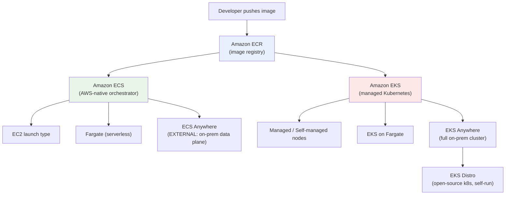

# Containers on AWS - Overview & Service Comparison - SAA-C03 Deep Dive

> The map of the AWS container landscape: the registry (ECR), two orchestrators (ECS, EKS), and their hybrid/on-prem variants (ECS Anywhere, EKS Anywhere, EKS Distro). Start here, then dive into each service folder.

See also: [01 - ECR Fundamentals & Architecture](01%20-%20ECR%20Fundamentals%20%26%20Architecture.md) · [01 - ECS Fundamentals & Architecture](01%20-%20ECS%20Fundamentals%20%26%20Architecture.md) · [01 - EKS Fundamentals & Architecture](01%20-%20EKS%20Fundamentals%20%26%20Architecture.md) · [01 - ECS Anywhere Fundamentals & Architecture](01%20-%20ECS%20Anywhere%20Fundamentals%20%26%20Architecture.md) · [01 - EKS Anywhere Fundamentals & Architecture](01%20-%20EKS%20Anywhere%20Fundamentals%20%26%20Architecture.md) · [01 - EKS Distro Fundamentals & Architecture](01%20-%20EKS%20Distro%20Fundamentals%20%26%20Architecture.md)

---

## Table of Contents

- [1. The AWS Container Landscape](#1-the-aws-container-landscape)
- [2. The Two Orchestrators: ECS vs EKS](#2-the-two-orchestrators-ecs-vs-eks)
- [3. Where Does the Workload Run? (Compute Options)](#3-where-does-the-workload-run-compute-options)
- [4. The Hybrid & On-Premises Family](#4-the-hybrid--on-premises-family)
- [5. Master Decision Table (All Six Services)](#5-master-decision-table-all-six-services)
- [6. Keyword-to-Service Cheat Sheet](#6-keyword-to-service-cheat-sheet)
- [7. Study Order & Folder Map](#7-study-order--folder-map)

---

---

## 1. The AWS Container Landscape

AWS containers break into **three jobs**:

| Job | Service(s) | One-liner |
| :--- | :--- | :--- |
| **Store images** | **ECR** | Private/public OCI registry; integrates with ECS, EKS, Lambda. |
| **Run & orchestrate (in AWS)** | **ECS**, **EKS** | Schedule, scale, heal containers. ECS = AWS-native; EKS = Kubernetes. |
| **Run & orchestrate (hybrid/on-prem)** | **ECS Anywhere**, **EKS Anywhere**, **EKS Distro** | Same tooling, customer-owned infrastructure. |

**The single most important framing for the exam:** every container question is really asking *"which orchestrator, and where does the compute live?"*

[⬆ Back to top](#table-of-contents)

---

## 2. The Two Orchestrators: ECS vs EKS

| Dimension | **Amazon ECS** | **Amazon EKS** |
| :--- | :--- | :--- |
| **Engine** | AWS-proprietary orchestrator | Upstream **Kubernetes** (CNCF-conformant) |
| **Learning curve** | Low — AWS-integrated, simple | Higher — full k8s ecosystem |
| **Control plane cost** | Free | ~$0.10/hr per cluster |
| **Portability** | Locked to AWS concepts | Portable k8s manifests |
| **Best when** | You want simplest path on AWS | You already use k8s / need its ecosystem |
| **Networking IDs** | Tasks, Services, Task Defs | Pods, Deployments, Services |
| **IAM integration** | Task role / execution role | IRSA / EKS Pod Identity |

> **Exam rule of thumb:** "simplest, AWS-native, least operational overhead" → **ECS** (often **Fargate**). "Existing Kubernetes / portability / k8s ecosystem tools" → **EKS**.

See [01 - ECS Fundamentals & Architecture](01%20-%20ECS%20Fundamentals%20%26%20Architecture.md) and [01 - EKS Fundamentals & Architecture](01%20-%20EKS%20Fundamentals%20%26%20Architecture.md) for the deep dives.

[⬆ Back to top](#table-of-contents)

---

## 3. Where Does the Workload Run? (Compute Options)

Both orchestrators decouple the *control plane* from the *data plane* (where containers actually run):

| Compute option | Works with | You manage | AWS manages |
| :--- | :--- | :--- | :--- |
| **EC2 launch type / nodes** | ECS, EKS | EC2 instances, patching, scaling | Orchestration control plane |
| **Fargate** | ECS, EKS | Nothing (serverless) | Servers, patching, scaling |
| **Fargate Spot** | ECS (and EKS via profiles) | Interruption tolerance | Capacity at up to ~70% discount |
| **EXTERNAL (ECS Anywhere)** | ECS | On-prem servers + agents | Control plane in AWS |

> **Trap:** Fargate removes server management but you **cannot** SSH to the host, use DaemonSets the same way, or attach arbitrary EBS in older setups. Fine-grained host control → EC2.

See [02 - ECS Launch Types - EC2 vs Fargate](02%20-%20ECS%20Launch%20Types%20-%20EC2%20vs%20Fargate.md) and [02 - EKS Node Types - Managed, Self-Managed, Fargate](02%20-%20EKS%20Node%20Types%20-%20Managed%2C%20Self-Managed%2C%20Fargate.md).

[⬆ Back to top](#table-of-contents)

---

## 4. The Hybrid & On-Premises Family

This is the most-confused cluster of services. The key question: **where does the control plane live?**

| Service | Orchestrator | Control plane | Data plane | Built on |
| :--- | :--- | :--- | :--- | :--- |
| **ECS Anywhere** | ECS | **In AWS** (managed) | Your on-prem/other-cloud servers | ECS EXTERNAL launch type |
| **EKS Anywhere** | Kubernetes | **On-prem** (you run it) | On-prem | EKS Distro |
| **EKS Distro** | Kubernetes | **You run everything** | Anywhere | Open-source k8s (the build EKS uses) |

**The mental model:**

- **ECS Anywhere** = AWS still orchestrates from the cloud; only your *servers* are on-prem.
- **EKS Anywhere** = an installable product to run a *complete* Kubernetes cluster (control plane included) on-prem, optionally viewable in AWS via the EKS Connector.
- **EKS Distro** = the raw open-source Kubernetes distribution (same versions/patches as EKS) that you assemble and operate entirely yourself. EKS Anywhere is *built on top of* it.

See [01 - ECS Anywhere Fundamentals & Architecture](01%20-%20ECS%20Anywhere%20Fundamentals%20%26%20Architecture.md), [01 - EKS Anywhere Fundamentals & Architecture](01%20-%20EKS%20Anywhere%20Fundamentals%20%26%20Architecture.md), [01 - EKS Distro Fundamentals & Architecture](01%20-%20EKS%20Distro%20Fundamentals%20%26%20Architecture.md).

[⬆ Back to top](#table-of-contents)

---

## 5. Master Decision Table (All Six Services)

| Service | Type | Control plane | Where it runs | AWS-managed? | Typical exam trigger |
| :--- | :--- | :--- | :--- | :--- | :--- |
| **ECR** | Registry | n/a | AWS region | ✅ Fully | "store/scan/replicate container images" |
| **ECS** | Orchestrator | AWS-managed | AWS (EC2/Fargate) | ✅ Control plane | "simple AWS-native containers, low overhead" |
| **ECS Anywhere** | Orchestrator | AWS-managed | On-prem servers | ⚠️ Plane only | "run ECS tasks on existing on-prem servers" |
| **EKS** | Orchestrator | AWS-managed k8s | AWS (nodes/Fargate) | ✅ Control plane | "managed Kubernetes on AWS" |
| **EKS Anywhere** | Orchestrator | On-prem | On-prem (vSphere/bare metal/Snow) | ❌ You run it | "full Kubernetes cluster on-prem / air-gapped" |
| **EKS Distro** | k8s distribution | You run it | Anywhere | ❌ Self-managed | "same k8s AWS uses, run it myself, no AWS dependency" |

[⬆ Back to top](#table-of-contents)

---

## 6. Keyword-to-Service Cheat Sheet

| Phrase in the question | Pick |
| :--- | :--- |
| "no server management", "serverless containers", "least operational overhead" | **ECS on Fargate** |
| "need control over the host / GPU / custom AMI / DaemonSet on every host" | **ECS or EKS on EC2** |
| "already running Kubernetes", "portable manifests", "Helm/operators" | **EKS** |
| "run containers on existing on-premises servers, managed from AWS" | **ECS Anywhere** |
| "operate a complete Kubernetes cluster in our own data center / air-gapped" | **EKS Anywhere** |
| "the exact Kubernetes AWS uses, but we install and run it ourselves" | **EKS Distro** |
| "store, scan for CVEs, and replicate Docker/OCI images" | **ECR** |
| "grant a task/pod permission to call an AWS API" | ECS **task role** / EKS **IRSA or Pod Identity** |

[⬆ Back to top](#table-of-contents)

---

## 7. Study Order & Folder Map

Recommended reading order — registry first, then the AWS-native path, then Kubernetes, then hybrid:

1. **[01 - ECR Fundamentals & Architecture](01%20-%20ECR%20Fundamentals%20%26%20Architecture.md)** → ECR security, lifecycle, exam Q&A
2. **[01 - ECS Fundamentals & Architecture](01%20-%20ECS%20Fundamentals%20%26%20Architecture.md)** → launch types → task defs → networking → IAM → scaling → storage → [08 - ECS Exam Scenarios & Q&A](08%20-%20ECS%20Exam%20Scenarios%20%26%20Q%26A.md)
3. **[01 - ECS Anywhere Fundamentals & Architecture](01%20-%20ECS%20Anywhere%20Fundamentals%20%26%20Architecture.md)** → setup → exam Q&A
4. **[01 - EKS Fundamentals & Architecture](01%20-%20EKS%20Fundamentals%20%26%20Architecture.md)** → node types → networking → IAM/IRSA → storage → scaling → [07 - EKS Exam Scenarios & Q&A](07%20-%20EKS%20Exam%20Scenarios%20%26%20Q%26A.md)
5. **[01 - EKS Anywhere Fundamentals & Architecture](01%20-%20EKS%20Anywhere%20Fundamentals%20%26%20Architecture.md)** → deployment → exam Q&A
6. **[01 - EKS Distro Fundamentals & Architecture](01%20-%20EKS%20Distro%20Fundamentals%20%26%20Architecture.md)** → comparison → exam Q&A

| Folder | Files |
| :--- | :--- |
| `01 - Amazon ECR` | 4 files (fundamentals, security, lifecycle/replication, Q&A) |
| `02 - Amazon ECS` | 8 files (fundamentals → launch types → task defs → networking → IAM → scaling → storage → Q&A) |
| `03 - Amazon ECS Anywhere` | 3 files (fundamentals, setup, Q&A) |
| `04 - Amazon EKS` | 7 files (fundamentals → nodes → networking → IAM/IRSA → storage → scaling → Q&A) |
| `05 - Amazon EKS Anywhere` | 3 files (fundamentals, deployment, Q&A) |
| `06 - Amazon EKS Distro` | 3 files (fundamentals, comparison, Q&A) |

[⬆ Back to top](#table-of-contents)
