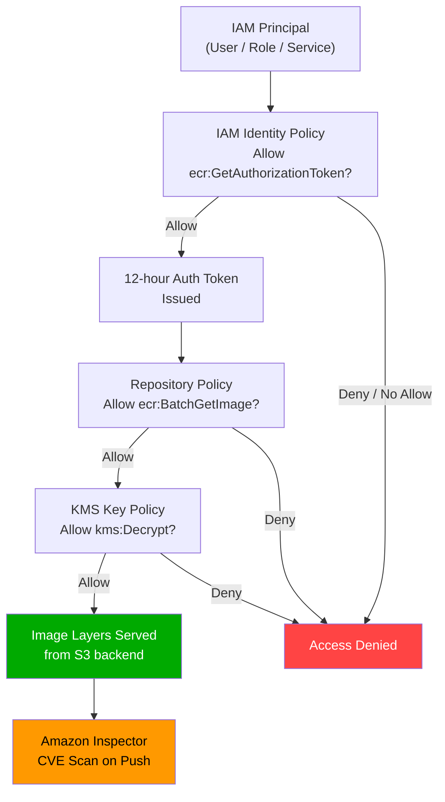
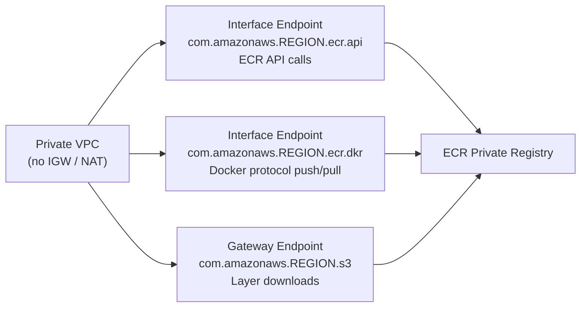

# ECR Security, Encryption & Access - SAA-C03 Deep Dive

> ECR's security model layers **IAM identity policies**, **resource-based repository policies**, **encryption at rest**, **image scanning**, and **PrivateLink** — understanding which layer solves which problem is the key exam skill.

See also: [01 - ECR Fundamentals & Architecture](01%20-%20ECR%20Fundamentals%20%26%20Architecture.md) · [03 - ECR Lifecycle Policies & Replication](03%20-%20ECR%20Lifecycle%20Policies%20%26%20Replication.md) · [04 - ECR Exam Scenarios & Q&A](04%20-%20ECR%20Exam%20Scenarios%20%26%20Q%26A.md) · [20 - KMS & Envelope Encryption](20%20-%20KMS%20%26%20Envelope%20Encryption.md) · [25 - GuardDuty Inspector Macie Security Hub](25%20-%20GuardDuty%20Inspector%20Macie%20Security%20Hub.md)

---

## Table of Contents

- [The ECR Security Model Overview](#the-ecr-security-model-overview)
- [Authentication Token - 12-Hour Expiry](#authentication-token---12-hour-expiry)
- [IAM Policies for ECR](#iam-policies-for-ecr)
- [Repository Resource Policies](#repository-resource-policies)
- [Cross-Account Access](#cross-account-access)
- [VPC Endpoints & PrivateLink](#vpc-endpoints--privatelink)
- [Encryption at Rest](#encryption-at-rest)
- [Image Scanning - Basic vs Enhanced](#image-scanning---basic-vs-enhanced)
- [Pull Through Cache Rules](#pull-through-cache-rules)
- [Security Best Practices Summary](#security-best-practices-summary)

---



---

## The ECR Security Model Overview

ECR access control uses **two independent policy types** that both must allow an action:

| Policy Type | Scope | Controls |
| :--- | :--- | :--- |
| **IAM Identity Policy** | Attached to user/role/group | What that principal can do across all ECR repos |
| **Repository Policy** | Attached to specific repository | Who (any principal) can access that specific repo |

**Both** must permit an action for it to succeed — the standard AWS "Allow in both, Deny in either blocks" rule applies.

Additionally:

- **KMS key policy** must allow the principal if the repo uses customer-managed KMS encryption
- **VPC endpoint policy** can further restrict which API calls are allowed through the endpoint

---

## Authentication Token - 12-Hour Expiry

### Token Lifecycle

```
aws ecr get-login-password  →  base64 token (password)
       │
       ▼
docker login --username AWS --password-stdin <registry-uri>
       │
       ▼
Docker daemon stores credentials in credential store
       │
       ▼
Token valid for 12 hours — after expiry all push/pull fail
       │
       ▼
Re-run get-login-password to refresh
```

### Required IAM Permission

The calling principal **must** have `ecr:GetAuthorizationToken` on `Resource: "*"` (this action does not support resource-level restrictions).

```json
{
  "Effect": "Allow",
  "Action": "ecr:GetAuthorizationToken",
  "Resource": "*"
}
```

> **Exam Trap:** `ecr:GetAuthorizationToken` cannot be scoped to a specific repository ARN. If you try to restrict it with a resource ARN, the policy has no effect and authentication fails.

### Token vs Long-Lived Credentials

| Approach | Security | Use Case |
| :--- | :--- | :--- |
| `get-login-password` | High — short-lived, no static secret | All AWS-native workloads |
| IAM role (EC2/ECS/Lambda) | Highest — no credential storage | ECS tasks, Lambda, EC2 |
| Static IAM access key | Low — long-lived, rotatable manually | Legacy or off-AWS CI systems |

---

## IAM Policies for ECR

### Common ECR IAM Actions

| Action | Purpose |
| :--- | :--- |
| `ecr:GetAuthorizationToken` | Get the 12-hour login token |
| `ecr:BatchCheckLayerAvailability` | Check which layers need uploading |
| `ecr:PutImage` | Write an image manifest (tag) |
| `ecr:InitiateLayerUpload` | Start a layer upload |
| `ecr:UploadLayerPart` | Upload a layer chunk |
| `ecr:CompleteLayerUpload` | Finalize a layer upload |
| `ecr:BatchGetImage` | Download image manifests |
| `ecr:GetDownloadUrlForLayer` | Get pre-signed S3 URL for layers |
| `ecr:DescribeRepositories` | List repositories |
| `ecr:DescribeImages` | List images in a repo |
| `ecr:DeleteRepository` | Delete a repo (admin) |
| `ecr:SetRepositoryPolicy` | Manage repo policy (admin) |

### Managed Policies

| Managed Policy | Actions Included |
| :--- | :--- |
| `AmazonEC2ContainerRegistryReadOnly` | GetAuthorizationToken + read/pull actions |
| `AmazonEC2ContainerRegistryPowerUser` | Read + push/write (no delete, no policy management) |
| `AmazonEC2ContainerRegistryFullAccess` | All ECR actions |

### Pull-Only Policy (Least Privilege for CI/CD)

```json
{
  "Version": "2012-10-17",
  "Statement": [
    {
      "Effect": "Allow",
      "Action": "ecr:GetAuthorizationToken",
      "Resource": "*"
    },
    {
      "Effect": "Allow",
      "Action": [
        "ecr:BatchGetImage",
        "ecr:GetDownloadUrlForLayer",
        "ecr:DescribeImages"
      ],
      "Resource": "arn:aws:ecr:us-east-1:123456789012:repository/myapp"
    }
  ]
}
```

### Push Policy (for build pipelines)

```json
{
  "Version": "2012-10-17",
  "Statement": [
    {
      "Effect": "Allow",
      "Action": "ecr:GetAuthorizationToken",
      "Resource": "*"
    },
    {
      "Effect": "Allow",
      "Action": [
        "ecr:BatchCheckLayerAvailability",
        "ecr:PutImage",
        "ecr:InitiateLayerUpload",
        "ecr:UploadLayerPart",
        "ecr:CompleteLayerUpload"
      ],
      "Resource": "arn:aws:ecr:us-east-1:123456789012:repository/myapp"
    }
  ]
}
```

---

## Repository Resource Policies

Repository policies are **resource-based policies** attached directly to an ECR repository (similar to S3 bucket policies). They allow you to grant access to **any AWS principal** — including principals in other accounts — without modifying that principal's IAM policy.

### Policy Structure

```json
{
  "Version": "2012-10-17",
  "Statement": [
    {
      "Sid": "AllowAccountBPull",
      "Effect": "Allow",
      "Principal": {
        "AWS": "arn:aws:iam::999999999999:root"
      },
      "Action": [
        "ecr:BatchGetImage",
        "ecr:GetDownloadUrlForLayer",
        "ecr:GetAuthorizationToken"
      ]
    }
  ]
}
```

> **Note:** `ecr:GetAuthorizationToken` in a repository policy has no effect — it is an account-level action that can only be granted via IAM identity policies. Always grant it in the IAM policy of the pulling principal.

### Key Differences: IAM Policy vs Repository Policy

| Attribute | IAM Identity Policy | Repository Policy |
| :--- | :--- | :--- |
| **Attached to** | User / role / group | ECR repository |
| **Cross-account** | Requires trust in both accounts | Can grant access unilaterally from repo side |
| **Service access** | Yes (AWS services) | Yes |
| **Supports Deny** | Yes | Yes |
| **Resource-level** | Yes (repo ARNs) | Scoped to the single repo |

---

## Cross-Account Access

Cross-account image access is a common exam scenario. There are two patterns:

### Pattern 1 - Repository Policy (Recommended)

Account A (repo owner) grants Account B pull access via repository policy. Account B principals also need `ecr:GetAuthorizationToken` in their own IAM policies.

```
Account A (123456789012)                   Account B (999999999999)
┌──────────────────────────────┐           ┌──────────────────────────────┐
│  ECR Repository: myapp       │           │  ECS Task Execution Role     │
│  Repository Policy:          │◄──pull────│  IAM Policy:                 │
│    Principal: 999999999999   │           │    ecr:GetAuthorizationToken │
│    Allow: BatchGetImage      │           │    ecr:BatchGetImage         │
│    Allow: GetDownloadUrl...  │           │    ecr:GetDownloadUrlFor...  │
└──────────────────────────────┘           └──────────────────────────────┘
```

### Pattern 2 - Cross-Account Role

Account B assumes a role in Account A that has ECR pull permissions. More complex but useful when granular per-role control is needed.

### Lambda Cross-Account Consideration

Lambda container images **must** be in the same account's ECR **unless** a repository policy explicitly grants `lambda:GetFunctionConfiguration` + pull actions to the Lambda service principal for the other account.

---

## VPC Endpoints & PrivateLink

By default, ECR traffic traverses the **public internet** (even from within a VPC). To keep traffic on the AWS network, configure VPC endpoints.

### Required Endpoints for Fully Private ECR Access



| Endpoint | Type | Purpose |
| :--- | :--- | :--- |
| `ecr.api` | Interface (PrivateLink) | `GetAuthorizationToken`, describe/list calls |
| `ecr.dkr` | Interface (PrivateLink) | Docker push/pull protocol |
| `s3` | Gateway | Image layer downloads (layers stored in S3) |

> **Critical Exam Fact:** The S3 gateway endpoint is **free** and routes S3 traffic through the AWS network — not the internet. Without it, even with both ECR interface endpoints, image pulls fail because the layer data comes from S3 pre-signed URLs.

### Endpoint Policies

Interface endpoints support **endpoint policies** to restrict which API calls can flow through:

```json
{
  "Statement": [
    {
      "Effect": "Allow",
      "Principal": "*",
      "Action": [
        "ecr:GetAuthorizationToken",
        "ecr:BatchGetImage",
        "ecr:GetDownloadUrlForLayer"
      ],
      "Resource": "*"
    }
  ]
}
```

---

## Encryption at Rest

### Default Encryption (SSE-S3)

All ECR images are **encrypted at rest by default** using SSE-S3 (AES-256). This is:

- Automatic, no configuration required
- No additional cost
- Keys managed by AWS

### Customer-Managed KMS (SSE-KMS)

For higher control, you can encrypt a repository with a **customer-managed KMS key** (CMK).

```bash
# Create a repository with KMS encryption
aws ecr create-repository \
  --repository-name myapp \
  --encryption-configuration encryptionType=KMS,kmsKey=arn:aws:kms:us-east-1:123456789012:key/mrk-abc123
```

| Property | SSE-S3 | SSE-KMS |
| :--- | :--- | :--- |
| **Default** | Yes | No — must be configured at repo creation |
| **Key control** | AWS-managed | You manage CMK lifecycle |
| **Audit trail** | No (no KMS API calls) | Yes — CloudTrail logs every decrypt |
| **Key rotation** | Automatic (AWS) | Manual or automatic (annual) |
| **Cross-account** | N/A | CMK policy must grant target account |
| **Cost** | Included | KMS API call charges apply |
| **Changeable after creation** | No | No — encryption config is immutable |

> **Exam Trap:** You **cannot change** the encryption configuration of an existing ECR repository. If you need to switch from SSE-S3 to KMS (or vice versa), you must create a new repository and re-push or replicate images.

### KMS Key Policy Requirement

When using CMK encryption, any principal that pulls or pushes images must have `kms:GenerateDataKey` and `kms:Decrypt` permissions on the key:

```json
{
  "Effect": "Allow",
  "Action": [
    "kms:Decrypt",
    "kms:GenerateDataKey"
  ],
  "Resource": "arn:aws:kms:us-east-1:123456789012:key/mrk-abc123"
}
```

---

## Image Scanning - Basic vs Enhanced

ECR provides two scanning tiers to detect vulnerabilities in container images.

### Basic Scanning (Clair-based)

| Attribute | Detail |
| :--- | :--- |
| **Engine** | Open-source Clair vulnerability scanner |
| **Database** | OS package vulnerability database (CVE) |
| **Trigger** | Manual or on-push (configured per repo) |
| **Scope** | OS packages only (not application dependencies) |
| **Results** | Severity: CRITICAL, HIGH, MEDIUM, LOW, INFORMATIONAL, UNDEFINED |
| **Cost** | Free |
| **API** | `DescribeImageScanFindings` |

```bash
# Enable scan on push for a repository
aws ecr put-image-scanning-configuration \
  --repository-name myapp \
  --image-scanning-configuration scanOnPush=true

# Start a manual scan
aws ecr start-image-scan \
  --repository-name myapp \
  --image-id imageTag=v1.0
```

### Enhanced Scanning (Amazon Inspector)

| Attribute | Detail |
| :--- | :--- |
| **Engine** | Amazon Inspector v2 |
| **Database** | AWS-curated CVE + vendor advisories (more comprehensive) |
| **Trigger** | **Continuous** — rescans automatically when new CVEs published |
| **Scope** | OS packages + **programming language packages** (npm, pip, gem, etc.) |
| **Results** | Inspector findings with CVSS scores + remediation guidance |
| **Cost** | Amazon Inspector charges per image scanned |
| **Integration** | Security Hub, EventBridge, SNS |

> **Key Difference:** Enhanced scanning with Inspector provides **continuous rescanning** — an image that passed a scan today may get flagged tomorrow when a new CVE is published. Basic scanning only runs at push time (or manually).

### Scanning Decision Table

| Need | Use |
| :--- | :--- |
| Free, one-time OS vulnerability check | Basic scanning |
| Detect language/framework vulnerabilities (npm, pip) | Enhanced scanning |
| Continuous monitoring as new CVEs emerge | Enhanced scanning |
| Compliance requiring centralized findings | Enhanced scanning + Security Hub |
| Minimal cost, basic hygiene | Basic scanning on push |

### EventBridge Integration (Enhanced)

Inspector emits findings to EventBridge, enabling automated responses:

```json
{
  "source": ["aws.inspector2"],
  "detail-type": ["Inspector2 Finding"],
  "detail": {
    "severity": ["CRITICAL"],
    "resources": {
      "type": ["AWS_ECR_CONTAINER_IMAGE"]
    }
  }
}
```

Use this pattern to: block deployments, notify security teams, or trigger remediation workflows.

---

## Pull Through Cache Rules

Pull Through Cache allows ECR to act as a **caching proxy** for upstream public registries. Instead of pulling directly from Docker Hub or ECR Public, your VPC pulls from your private ECR registry, which caches the upstream image.

### Supported Upstream Registries

| Registry | Upstream Prefix |
| :--- | :--- |
| ECR Public | `public.ecr.aws` |
| Docker Hub | `registry-1.docker.io` |
| Quay.io | `quay.io` |
| Kubernetes Registry | `registry.k8s.io` |
| GitHub Container Registry | `ghcr.io` |

### How It Works

```
First pull:
  ECS Task → your-account.dkr.ecr.REGION.amazonaws.com/ecr-public/amazonlinux/amazonlinux:2
                                            ↓ cache miss
                              ECR fetches from public.ecr.aws, caches in your repo
                                            ↓
                              Image served to ECS Task (now cached)

Subsequent pulls:
  ECS Task → your-account.dkr.ecr.REGION.amazonaws.com/ecr-public/amazonlinux/amazonlinux:2
                                            ↓ cache hit
                              Served directly from private ECR (faster, no external call)
```

```bash
# Create a pull through cache rule
aws ecr create-pull-through-cache-rule \
  --ecr-repository-prefix ecr-public \
  --upstream-registry-url public.ecr.aws
```

### Benefits of Pull Through Cache

- **Security:** All pulls go through your private registry where lifecycle policies and scanning apply
- **Reliability:** Reduces dependence on external registry availability (Docker Hub rate limits)
- **VPC isolation:** Works with VPC endpoints — no direct internet access needed
- **Audit:** All pulls are logged via CloudTrail

> **Exam Tip:** A question about rate limiting from Docker Hub or reducing external dependencies for a VPC-isolated environment → Pull Through Cache is the answer.

---

## Security Best Practices Summary

| Practice | Mechanism |
| :--- | :--- |
| Least-privilege image pull | Separate read-only IAM policy for task execution roles |
| No public image exposure | Use private registry; avoid public repos for sensitive images |
| Reproducible deployments | Immutable tags + pull by digest |
| Vulnerability awareness | Enable scan on push (Basic) or Enhanced scanning |
| Private network access | VPC endpoints: `ecr.api` + `ecr.dkr` + S3 gateway |
| Regulated data isolation | KMS CMK encryption per repository |
| Cross-account guardrails | Repository policies with explicit principal ARNs |
| Token management | Use IAM roles (never static keys); refresh token before 12h expiry |
| Supply chain security | Store SBOMs + Cosign signatures as OCI artifacts in same repo |
| Centralized findings | Enable Inspector + Security Hub integration |

[⬆ Back to top](#table-of-contents)
