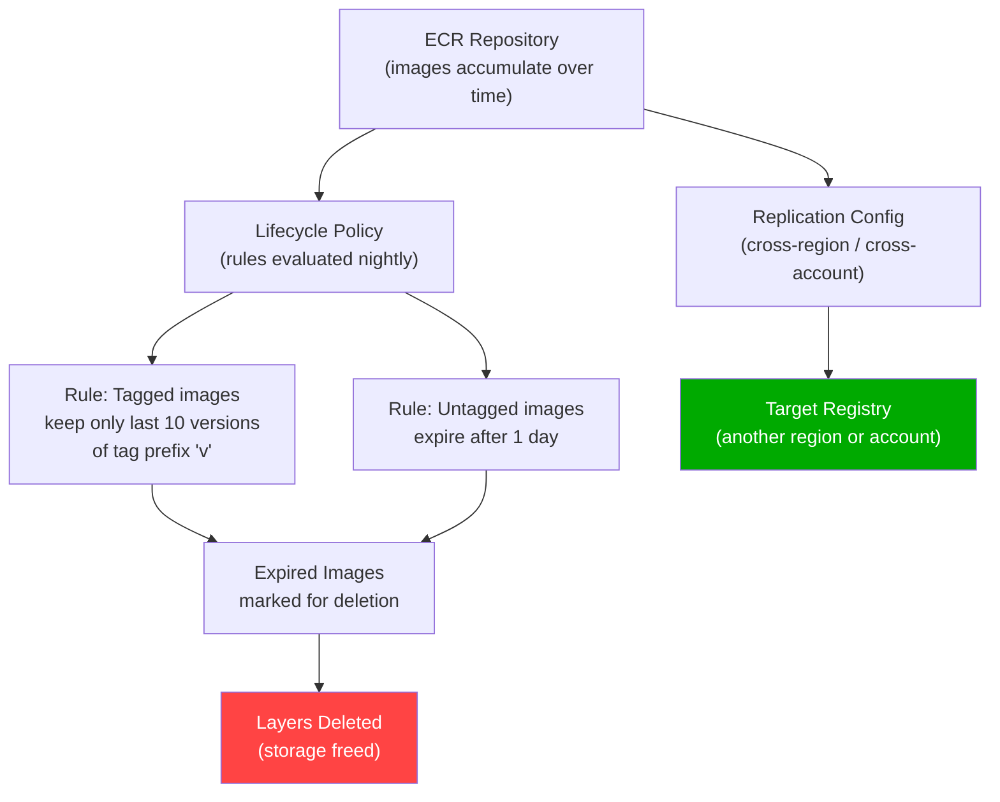
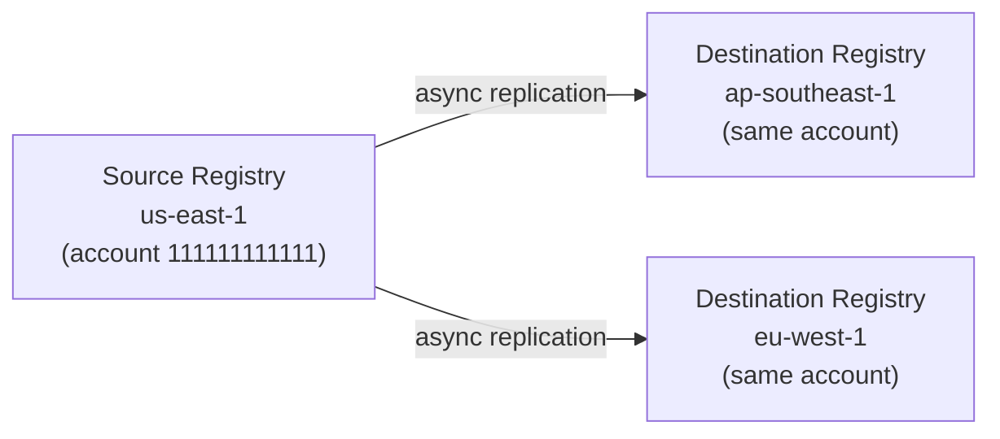

# ECR Lifecycle Policies & Replication - SAA-C03 Deep Dive

> ECR **lifecycle policies** automate image cleanup to control storage costs, while **cross-region and cross-account replication** ensures images are available close to where compute runs — both are critical operational and cost-optimization topics for SAA-C03.

See also: [01 - ECR Fundamentals & Architecture](01%20-%20ECR%20Fundamentals%20%26%20Architecture.md) · [02 - ECR Security, Encryption & Access](02%20-%20ECR%20Security%2C%20Encryption%20%26%20Access.md) · [04 - ECR Exam Scenarios & Q&A](04%20-%20ECR%20Exam%20Scenarios%20%26%20Q%26A.md)

---

## Table of Contents

- [Lifecycle Policies Overview](#lifecycle-policies-overview)
- [Lifecycle Policy Rules & Evaluation](#lifecycle-policy-rules--evaluation)
- [Common Lifecycle Policy Examples](#common-lifecycle-policy-examples)
- [Testing Lifecycle Policies](#testing-lifecycle-policies)
- [Image Tag Immutability & Lifecycle Interaction](#image-tag-immutability--lifecycle-interaction)
- [Cross-Region Replication](#cross-region-replication)
- [Cross-Account Replication](#cross-account-replication)
- [Pull Through Cache - Deep Dive](#pull-through-cache---deep-dive)
- [Cost Optimization Strategies](#cost-optimization-strategies)
- [Replication vs Pull Through Cache - Decision Table](#replication-vs-pull-through-cache---decision-table)

---



---

## Lifecycle Policies Overview

A **lifecycle policy** is a JSON document attached to an ECR repository that defines rules for **automatically expiring** (deleting) images based on age, count, or tag status. AWS evaluates lifecycle rules **once per day** and expires images that match the criteria.

### Why Lifecycle Policies Matter

| Without Lifecycle Policy | With Lifecycle Policy |
| :--- | :--- |
| Images accumulate indefinitely | Old/untagged images automatically removed |
| Storage cost grows unbounded | Predictable, bounded storage cost |
| Security risk: old vulnerable images stay | Stale images eliminated |
| Manual cleanup required | Automated, hands-off |

### Key Facts

| Property | Value |
| :--- | :--- |
| **Evaluation frequency** | Once per day (time not guaranteed) |
| **Maximum rules per policy** | 1000 |
| **Actions supported** | `expire` only (no archive, no move) |
| **Scope** | Per repository (not registry-wide) |
| **Interaction with immutability** | Lifecycle policies CAN delete immutable-tagged images |

> **Exam Trap:** Lifecycle policies and immutable tags are independent. Immutability prevents **overwriting** a tag. It does NOT prevent lifecycle policy expiration from deleting the image entirely.

---

## Lifecycle Policy Rules & Evaluation

### Rule Structure

Each rule has:

- **rulePriority:** Lower number = higher priority (evaluated first)
- **description:** Human-readable label
- **selection:** Which images to consider
- **action:** Always `expire`

### Selection Criteria

| Criterion | Options |
| :--- | :--- |
| **tagStatus** | `tagged`, `untagged`, `any` |
| **tagPatternList** | List of glob patterns matching tag names (e.g., `["v*", "release-*"]`) |
| **countType** | `imageCountMoreThan` OR `sinceImagePushed` |
| **countNumber** | Integer threshold |
| **countUnit** | `days` (only for `sinceImagePushed`) |

### Rule Evaluation Order

```
1. Rules are sorted by rulePriority (ascending — lowest first)
2. For each image, AWS checks rules in priority order
3. The FIRST matching rule determines the image's fate
4. If no rule matches, the image is retained
5. An image can only be matched by ONE rule
```

> **Important:** Lower `rulePriority` value = **evaluated first** = **higher precedence**. Rule priority 1 beats rule priority 100.

### Policy JSON Structure

```json
{
  "rules": [
    {
      "rulePriority": 1,
      "description": "Keep only 5 untagged images",
      "selection": {
        "tagStatus": "untagged",
        "countType": "imageCountMoreThan",
        "countNumber": 5
      },
      "action": {
        "type": "expire"
      }
    },
    {
      "rulePriority": 2,
      "description": "Expire tagged images older than 90 days",
      "selection": {
        "tagStatus": "tagged",
        "tagPatternList": ["v*"],
        "countType": "sinceImagePushed",
        "countNumber": 90,
        "countUnit": "days"
      },
      "action": {
        "type": "expire"
      }
    }
  ]
}
```

---

## Common Lifecycle Policy Examples

### Example 1 — Expire All Untagged Images After 1 Day

```json
{
  "rules": [
    {
      "rulePriority": 1,
      "description": "Remove untagged images after 1 day",
      "selection": {
        "tagStatus": "untagged",
        "countType": "sinceImagePushed",
        "countNumber": 1,
        "countUnit": "days"
      },
      "action": { "type": "expire" }
    }
  ]
}
```

**Use case:** Clean up images where `docker push :latest` has detached the old image from its tag, leaving it untagged.

### Example 2 — Keep Only the Last 10 Production Images

```json
{
  "rules": [
    {
      "rulePriority": 1,
      "description": "Keep last 10 prod-tagged images",
      "selection": {
        "tagStatus": "tagged",
        "tagPatternList": ["prod-*"],
        "countType": "imageCountMoreThan",
        "countNumber": 10
      },
      "action": { "type": "expire" }
    }
  ]
}
```

### Example 3 — Tiered Retention (Recommended Production Pattern)

```json
{
  "rules": [
    {
      "rulePriority": 1,
      "description": "Remove untagged immediately",
      "selection": {
        "tagStatus": "untagged",
        "countType": "sinceImagePushed",
        "countNumber": 1,
        "countUnit": "days"
      },
      "action": { "type": "expire" }
    },
    {
      "rulePriority": 2,
      "description": "Keep last 5 dev builds",
      "selection": {
        "tagStatus": "tagged",
        "tagPatternList": ["dev-*"],
        "countType": "imageCountMoreThan",
        "countNumber": 5
      },
      "action": { "type": "expire" }
    },
    {
      "rulePriority": 3,
      "description": "Keep prod images 180 days",
      "selection": {
        "tagStatus": "tagged",
        "tagPatternList": ["prod-*", "release-*"],
        "countType": "sinceImagePushed",
        "countNumber": 180,
        "countUnit": "days"
      },
      "action": { "type": "expire" }
    }
  ]
}
```

### Applying a Policy via CLI

```bash
aws ecr put-lifecycle-policy \
  --repository-name myapp \
  --lifecycle-policy-text file://lifecycle.json
```

---

## Testing Lifecycle Policies

Before applying a policy live, use **dry-run preview** to see which images would be affected:

```bash
aws ecr start-lifecycle-policy-preview \
  --repository-name myapp \
  --lifecycle-policy-text file://lifecycle.json

# Poll for results
aws ecr get-lifecycle-policy-preview \
  --repository-name myapp
```

The preview output shows:

- `imageDigest` of each image that would be expired
- Which rule matched
- `appliedRulePriority`

> **Best Practice:** Always run a dry preview in a test environment before applying a policy to production repositories. Deleted images cannot be recovered.

---

## Image Tag Immutability & Lifecycle Interaction

| Scenario | Behavior |
| :--- | :--- |
| Push same tag to immutable repo | `ImageTagAlreadyExistsException` — rejected |
| Lifecycle policy expires an immutable-tagged image | **Succeeds** — immutability prevents tag re-use, not deletion |
| Pull by digest after tag is expired | Fails — the manifest is deleted |
| Pull by digest while tag still exists | Always works (digest is canonical) |

The correct mental model:

- **Immutability** = "you cannot point a tag at a different image"
- **Lifecycle policy** = "images (and their tags) can be deleted by expiration rules"

---

## Cross-Region Replication

### How It Works

ECR **replication** asynchronously copies images from a source registry to one or more destination registries. Replication is configured at the **registry level** (not per-repo) and applies to all repositories (or filtered repos) in the source account.



### Configuration

```bash
aws ecr put-replication-configuration \
  --replication-configuration '{
    "rules": [
      {
        "destinations": [
          { "region": "ap-southeast-1", "registryId": "111111111111" },
          { "region": "eu-west-1",      "registryId": "111111111111" }
        ],
        "repositoryFilters": [
          {
            "filter": "myapp",
            "filterType": "PREFIX_MATCH"
          }
        ]
      }
    ]
  }'
```

### Replication Facts

| Property | Detail |
| :--- | :--- |
| **Trigger** | Any `PutImage` event (push of a new tag/digest) |
| **Consistency** | **Eventual consistency** — not immediate |
| **Existing images** | Replication only applies to **new pushes** — existing images are NOT retroactively replicated |
| **Repo creation** | Destination repos are auto-created if they don't exist |
| **Encryption** | Destination repos use the destination region's default encryption |
| **Lifecycle policies** | NOT replicated — you must set lifecycle policies independently in each region |
| **Repository policies** | NOT replicated |
| **Cost** | Standard data transfer out rates apply |

> **Exam Trap:** Replication does NOT copy existing images. If you enable replication today, only images pushed after that point are replicated. To replicate existing images you must re-push them.

---

## Cross-Account Replication

Replicating to a **different account** requires an additional step: the destination account must grant permission to the source account.

### Step 1 — Source account configures replication

```bash
aws ecr put-replication-configuration \
  --replication-configuration '{
    "rules": [
      {
        "destinations": [
          { "region": "us-east-1", "registryId": "999999999999" }
        ]
      }
    ]
  }'
```

### Step 2 — Destination account sets registry policy

The destination account must explicitly allow the source account to replicate into it:

```bash
aws ecr put-registry-policy \
  --policy-text '{
    "Version": "2012-10-17",
    "Statement": [
      {
        "Sid": "AllowReplicationFromAccount111",
        "Effect": "Allow",
        "Principal": {
          "AWS": "arn:aws:iam::111111111111:root"
        },
        "Action": [
          "ecr:CreateRepository",
          "ecr:ReplicateImage"
        ],
        "Resource": "arn:aws:ecr:us-east-1:999999999999:repository/*"
      }
    ]
  }'
```

### Cross-Account Replication vs Cross-Account Repository Policy

| Pattern | When to Use |
| :--- | :--- |
| **Replication** | You want a full copy of the image in another account (disaster recovery, organizational boundaries) |
| **Repository policy** | Other account can pull directly from your repo (no copy needed, lower cost) |

---

## Pull Through Cache - Deep Dive

Pull Through Cache (PTC) is covered in the security file but deserves operational detail here.

### Lifecycle Policies + Pull Through Cache

Pull Through Cache repos (auto-created under your configured namespace) **support lifecycle policies**. Apply them to avoid unbounded cached image accumulation:

```json
{
  "rules": [
    {
      "rulePriority": 1,
      "description": "Expire cached images not pulled in 30 days",
      "selection": {
        "tagStatus": "any",
        "countType": "sinceImagePushed",
        "countNumber": 30,
        "countUnit": "days"
      },
      "action": { "type": "expire" }
    }
  ]
}
```

### PTC + Replication

Pull Through Cache and replication can be combined:

1. Configure PTC in your us-east-1 registry to cache from Docker Hub
2. Configure replication from us-east-1 to ap-southeast-1
3. Result: Docker Hub images cached privately and available in multiple regions without leaving AWS network

### Credential Configuration for Authenticated Upstreams

Docker Hub rate limits anonymous pulls (100/6h per IP). Authenticate to increase limits:

```bash
# Store Docker Hub credentials in Secrets Manager
aws secretsmanager create-secret \
  --name ecr-pullthroughcache/docker \
  --secret-string '{"username":"myuser","accessToken":"dckr_pat_xxxx"}'

# Reference the secret in the PTC rule
aws ecr create-pull-through-cache-rule \
  --ecr-repository-prefix dockerhub \
  --upstream-registry-url registry-1.docker.io \
  --credential-arn arn:aws:secretsmanager:us-east-1:123456789012:secret:ecr-pullthroughcache/docker
```

---

## Cost Optimization Strategies

### Storage Cost Reduction

| Strategy | Impact |
| :--- | :--- |
| **Lifecycle policy: delete untagged after 1 day** | High — untagged images from `:latest` pushes accumulate fast |
| **Lifecycle policy: cap tagged image count** | High — keeps only the most recent N versions |
| **Minimize base image size** | Medium — smaller layers = less storage per image |
| **Multi-stage Docker builds** | High — dev dependencies not included in final image |
| **Shared base image layers** | Medium — same base OS layer used across images = stored once |

### Data Transfer Cost Reduction

| Strategy | Impact |
| :--- | :--- |
| **Pull from same-region ECR** | High — same-region ECR-to-ECS/EKS transfer is free |
| **Cross-region replication** | High — replicate once to each region; compute pulls from local region |
| **VPC endpoints** | Free for S3 gateway; interface endpoints have hourly cost but eliminate NAT gateway charges |
| **Pull Through Cache** | Medium — eliminates per-pull Docker Hub transfer costs |

### Cost Monitoring

```bash
# Check storage usage per repository
aws ecr describe-repositories --query \
  'repositories[*].{name:repositoryName,uri:repositoryUri}'

# Get image count per repo
aws ecr describe-images \
  --repository-name myapp \
  --query 'length(imageDetails)'
```

---

## Replication vs Pull Through Cache - Decision Table

| Scenario | Recommended Solution |
| :--- | :--- |
| Your own images need to be available in eu-west-1 for ECS there | Cross-region replication |
| Multiple AWS accounts in your org all need to pull the same private image | Cross-account replication OR shared repo with repository policy |
| EKS cluster in private VPC needs Docker Hub images without internet | Pull Through Cache + VPC endpoints |
| Docker Hub rate limiting is hitting your CI/CD pipelines | Pull Through Cache with authenticated credentials |
| Disaster recovery — image must survive source region failure | Cross-region replication to 2+ regions |
| Reduce Docker Hub dependency for public base images | Pull Through Cache |
| Different accounts need own copy for compliance/isolation | Cross-account replication |

[⬆ Back to top](#table-of-contents)
