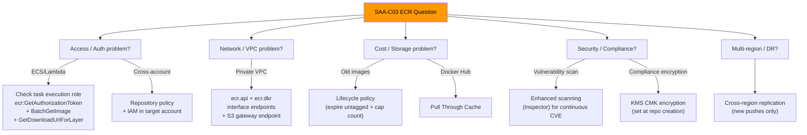

# ECR Exam Scenarios & Q&A - SAA-C03 Deep Dive

> Exam-ready questions, decision tables, and a consolidated cheat sheet covering every major ECR concept tested in SAA-C03 — focus on **access patterns, networking, security, and cost optimization**.

See also: [01 - ECR Fundamentals & Architecture](01%20-%20ECR%20Fundamentals%20%26%20Architecture.md) · [02 - ECR Security, Encryption & Access](02%20-%20ECR%20Security%2C%20Encryption%20%26%20Access.md) · [03 - ECR Lifecycle Policies & Replication](03%20-%20ECR%20Lifecycle%20Policies%20%26%20Replication.md)

---

## Table of Contents

- [How to Use This File](#how-to-use-this-file)
- [Question 1 - ECS Task Cannot Pull Image](#question-1---ecs-task-cannot-pull-image)
- [Question 2 - Private VPC ECR Access](#question-2---private-vpc-ecr-access)
- [Question 3 - Cross-Account Image Access](#question-3---cross-account-image-access)
- [Question 4 - Docker Hub Rate Limiting](#question-4---docker-hub-rate-limiting)
- [Question 5 - Reproducible Production Deployments](#question-5---reproducible-production-deployments)
- [Question 6 - Encryption Requirement](#question-6---encryption-requirement)
- [Question 7 - Image Vulnerability Scanning](#question-7---image-vulnerability-scanning)
- [Question 8 - Storage Cost Optimization](#question-8---storage-cost-optimization)
- [Question 9 - Multi-Region Container Deployment](#question-9---multi-region-container-deployment)
- [Question 10 - Lambda Container Image](#question-10---lambda-container-image)
- [Question 11 - Lifecycle Policy Priority](#question-11---lifecycle-policy-priority)
- [Question 12 - Auth Token Expiry](#question-12---auth-token-expiry)
- [ECR Decision Table](#ecr-decision-table)
- [ECR Cheat Sheet](#ecr-cheat-sheet)

---

---

## How to Use This File

Each question is formatted as a realistic SAA-C03 multiple-choice question. Work through the answers yourself first, then read the explanation and exam tip. The cheat sheet at the bottom is your quick-review reference.

---

## Question 1 - ECS Task Cannot Pull Image

**Scenario:** A company runs ECS tasks on Fargate. The tasks reference an image in a private ECR repository in the same account and region. When the tasks start, they fail with `CannotPullContainerError`. The IAM task role has `AdministratorAccess`. What is the MOST LIKELY cause?

**A.** The ECR repository does not have a repository policy allowing ECS.

**B.** The ECS task execution role is missing `ecr:GetAuthorizationToken`, `ecr:BatchGetImage`, and `ecr:GetDownloadUrlForLayer` permissions.

**C.** The task role needs `ecr:GetAuthorizationToken` added.

**D.** The ECR repository must be in the same VPC as the ECS cluster.

**Answer: B**

**Explanation:**

- ECS uses two separate IAM roles: the **task role** (application-level permissions) and the **task execution role** (infrastructure — pulling images, writing logs).
- `AdministratorAccess` on the **task role** does not help with image pulls. The **task execution role** must have ECR pull permissions.
- ECR is not a VPC resource — it is an AWS service accessed via its public endpoint (or via VPC endpoint), not placed inside a VPC.
- A repository policy is not required for same-account same-region pulls when the execution role has the right IAM permissions.

**Exam Tip/Trap:** The most common distractor is option C (granting permissions to the task role). Always distinguish task role vs task execution role. The execution role handles infrastructure; the task role handles application logic.

[⬆ Back to top](#table-of-contents)

---

## Question 2 - Private VPC ECR Access

**Scenario:** A company's ECS tasks run in a private subnet with no NAT gateway and no internet gateway. The tasks need to pull images from a private ECR repository. An architect creates an `ecr.dkr` interface VPC endpoint. The tasks still fail to pull images. What additional change is REQUIRED?

**A.** Add a NAT gateway to the private subnet.

**B.** Create an `ecr.api` interface VPC endpoint.

**C.** Create an `ecr.api` interface VPC endpoint AND an S3 gateway endpoint.

**D.** Move the ECS tasks to a public subnet.

**Answer: C**

**Explanation:**

- ECR requires three endpoints for fully private image pulls:
  1. `ecr.dkr` — Docker push/pull protocol (already created)
  2. `ecr.api` — ECR API calls including `GetAuthorizationToken`
  3. S3 gateway endpoint — Image layers are stored in S3; the pre-signed S3 URLs generated by ECR must route through the S3 gateway endpoint
- Without the `ecr.api` endpoint, `GetAuthorizationToken` fails (no auth token = no pull).
- Without the S3 gateway endpoint, layer downloads fail even if auth succeeds.
- The S3 gateway endpoint is **free** and does not require a security group or hourly charge.

**Exam Tip/Trap:** This is the most frequently tested ECR networking question. The trap is thinking `ecr.dkr` alone is sufficient, or forgetting the S3 gateway endpoint. Memorize: **ecr.api + ecr.dkr + S3 gateway = fully private ECR**.

[⬆ Back to top](#table-of-contents)

---

## Question 3 - Cross-Account Image Access

**Scenario:** A company has two AWS accounts: Account A (production, owns ECR repo) and Account B (staging, runs ECS tasks). The ECS tasks in Account B need to pull images from Account A's ECR repository. What is the MOST operationally efficient solution?

**A.** Create an IAM user in Account A, generate access keys, and store them in Account B's Secrets Manager. Configure the ECS task execution role in Account B to use these credentials.

**B.** Add a repository policy in Account A's ECR repo granting pull access to Account B's task execution role. Configure the task execution role in Account B with `ecr:GetAuthorizationToken` and pull permissions.

**C.** Enable cross-region replication from Account A to Account B.

**D.** Make the ECR repository in Account A public.

**Answer: B**

**Explanation:**

- The correct pattern is: **repository policy** (grants Account B access) + **IAM policy** in Account B (grants the execution role permission to use ECR).
- Option A uses static credentials (IAM user access keys) — against security best practices; IAM roles are preferred.
- Option C (replication) creates a copy in Account B — overkill and adds storage cost; direct pull is simpler.
- Option D (public repo) exposes proprietary images to the world — security anti-pattern.

**Exam Tip/Trap:** Cross-account ECR access always needs TWO things: (1) repository policy in the source account + (2) IAM policy in the destination account. Either one alone is insufficient. Also note: `ecr:GetAuthorizationToken` can only be granted via IAM identity policy — it cannot be granted via repository policy.

[⬆ Back to top](#table-of-contents)

---

## Question 4 - Docker Hub Rate Limiting

**Scenario:** A company's CI/CD pipeline pulls base images from Docker Hub. The pipeline frequently hits Docker Hub's rate limits (429 Too Many Requests), causing build failures. The company wants to eliminate this dependency with minimal ongoing maintenance. What should they do?

**A.** Upgrade to a Docker Hub paid plan.

**B.** Configure ECR Pull Through Cache rules to proxy Docker Hub images through ECR. Update the pipeline to reference the ECR-prefixed URI.

**C.** Manually pull base images and push them to ECR once per week.

**D.** Use Amazon S3 to store Docker images.

**Answer: B**

**Explanation:**

- Pull Through Cache (PTC) automatically caches upstream registry images in your private ECR on first pull and serves subsequent requests from cache.
- The CI/CD pipeline simply references the ECR URI (e.g., `<account>.dkr.ecr.<region>.amazonaws.com/dockerhub/<image>:<tag>`) instead of Docker Hub directly.
- PTC supports authenticated Docker Hub access (via Secrets Manager) to raise rate limits further.
- Option C (manual weekly push) requires maintenance and may drift.
- Option D is incorrect — S3 is not an OCI-compatible container registry.

**Exam Tip/Trap:** Any question about Docker Hub rate limits, reducing external registry dependency, or VPC-isolated environments pulling public images → **Pull Through Cache** is the answer.

[⬆ Back to top](#table-of-contents)

---

## Question 5 - Reproducible Production Deployments

**Scenario:** A company deploys ECS services referencing the `:latest` tag. A recent outage was caused when a developer pushed a broken image with the `:latest` tag and the rolling deployment picked it up. The company wants to ensure a specific, validated image version is always deployed. What is the BEST solution?

**A.** Use a lifecycle policy to keep only the last image tagged `:latest`.

**B.** Enable immutable tags on the ECR repository and change deployments to reference specific versioned tags or image digests.

**C.** Add an SCP to prevent pushing `:latest` tags to ECR.

**D.** Use ECR Enhanced Scanning to block broken images from being pulled.

**Answer: B**

**Explanation:**

- Immutable tags prevent the same tag from being overwritten, ensuring that once `v1.2.3` is pushed, it always refers to the same image.
- Referencing images by digest (`@sha256:...`) is even more robust — immune to any tag manipulation.
- Option A (lifecycle policy) only limits how many `:latest` images are retained — does not solve the overwrite problem.
- Option C (SCP) cannot target ECR-specific tag names and is not the right tool.
- Option D (Enhanced Scanning) detects vulnerabilities but does not block deployments based on build quality.

**Exam Tip/Trap:** "Reproducible / predictable deployments" + "cannot be overwritten" = **immutable tags**. For maximum reproducibility, combine immutable tags with digest-based references.

[⬆ Back to top](#table-of-contents)

---

## Question 6 - Encryption Requirement

**Scenario:** A financial services company needs all container images in ECR to be encrypted using customer-managed keys in AWS KMS so they can control key rotation and maintain an audit trail of decryption events. An engineer creates a new ECR repository but does not specify encryption settings. A week later, the company needs to enable CMK encryption on this repository. What should they do?

**A.** Enable KMS encryption on the existing repository via `aws ecr put-image-scanning-configuration`.

**B.** Enable KMS encryption in the repository settings in the console — it can be changed at any time.

**C.** Create a new ECR repository with KMS encryption configured at creation time, and migrate images to the new repository.

**D.** Wrap the repository in an encrypted EBS volume.

**Answer: C**

**Explanation:**

- ECR **encryption configuration is immutable** — it is set at repository creation and cannot be changed afterward.
- The only option is to create a new repository with the correct encryption setting and re-push (or replicate) all images there.
- Default encryption (SSE-S3) cannot be upgraded to KMS post-creation through any console or CLI option.
- Option D is not a valid construct — ECR is not EBS-backed from the user's perspective.

**Exam Tip/Trap:** "Cannot change encryption after creation" is the key fact here. Always configure encryption at repository creation time in regulated environments. This is similar to how S3 buckets' encryption can be changed but ECR's cannot.

[⬆ Back to top](#table-of-contents)

---

## Question 7 - Image Vulnerability Scanning

**Scenario:** A security team wants all container images in ECR to be scanned for vulnerabilities, including those in application libraries (npm packages, Python pip packages). They also need to be notified via SNS when new CRITICAL vulnerabilities are found in images that have already been deployed. Which solution meets these requirements?

**A.** Enable ECR Basic Scanning with scan on push. Configure an SNS notification for scan results.

**B.** Enable ECR Enhanced Scanning using Amazon Inspector. Configure EventBridge to trigger an SNS notification for Inspector findings with CRITICAL severity.

**C.** Enable ECR Basic Scanning. Schedule a Lambda function to run daily and check for new CVEs.

**D.** Use Amazon Macie to scan ECR images for vulnerabilities.

**Answer: B**

**Explanation:**

- **Basic Scanning** only covers OS-level packages (Clair engine) and only runs at push time (or manually). It does NOT scan language/framework packages (npm, pip, etc.) and does NOT rescan automatically when new CVEs are published.
- **Enhanced Scanning** (Amazon Inspector) covers both OS packages and programming language packages AND continuously rescans when new vulnerability data is available.
- EventBridge integration allows routing Inspector findings to SNS for real-time notifications.
- Option A misses language package scanning and continuous rescanning.
- Option D (Macie) is for sensitive data discovery in S3 — not vulnerability scanning.

**Exam Tip/Trap:** "Application library vulnerabilities" OR "continuous rescanning as new CVEs emerge" = Enhanced Scanning with Inspector. Basic Scanning is free but limited to OS packages and point-in-time scans.

[⬆ Back to top](#table-of-contents)

---

## Question 8 - Storage Cost Optimization

**Scenario:** A company has hundreds of ECR repositories with years of accumulated images. The monthly ECR storage bill has grown to over $10,000. Most of this comes from old build artifacts and untagged images. What is the MOST cost-effective solution requiring minimal ongoing maintenance?

**A.** Write a Lambda function that runs nightly, lists all images, and deletes those older than 30 days.

**B.** Create ECR lifecycle policies on each repository to expire untagged images after 1 day and retain only the last 10 tagged images.

**C.** Move all ECR repositories to ECR Public Gallery to benefit from free storage.

**D.** Enable ECR image compression to reduce storage size.

**Answer: B**

**Explanation:**

- Lifecycle policies are the native, built-in mechanism for automated image cleanup — no Lambda, no cron, no maintenance.
- They run automatically once per day and handle both untagged cleanup and count-based retention.
- Option A (custom Lambda) works but requires ongoing maintenance, error handling, and IAM setup.
- Option C (ECR Public) is for public images — inappropriate for proprietary company images, and is not free for all use cases.
- Option D — ECR already stores layers compressed; there is no additional compression toggle.

**Exam Tip/Trap:** Lifecycle policies are always the right answer for automated ECR storage cost control. Watch out for options suggesting custom Lambda or scheduled scripts — they work but are not "minimal maintenance" and are never the best answer when a native feature exists.

[⬆ Back to top](#table-of-contents)

---

## Question 9 - Multi-Region Container Deployment

**Scenario:** A company deploys a containerized application across us-east-1, eu-west-1, and ap-southeast-1. The application runs on ECS Fargate in all three regions. Currently, all regions pull images from a single ECR repository in us-east-1, resulting in high cross-region data transfer costs and occasional latency issues. What should the architect recommend?

**A.** Use Amazon CloudFront to cache ECR images globally.

**B.** Configure ECR cross-region replication to replicate the repository to eu-west-1 and ap-southeast-1. Update ECS task definitions in each region to reference the local ECR registry URI.

**C.** Push the same image manually to ECR repositories in all three regions as part of the CI/CD pipeline.

**D.** Use an S3 bucket with Transfer Acceleration to store images globally.

**Answer: B**

**Explanation:**

- Cross-region replication automatically propagates newly pushed images to configured destination regions.
- ECS tasks then pull from the local region's ECR, eliminating cross-region data transfer costs.
- Option A — CloudFront cannot proxy ECR image pulls (ECR uses Docker registry protocol, not HTTP static file serving compatible with CloudFront).
- Option C (manual multi-region push in CI/CD) works but requires explicit configuration for each region push and is more fragile than managed replication.
- Option D — S3 is not an OCI-compatible container registry.

**Exam Tip/Trap:** Cross-region replication only copies **new** images pushed after replication is configured. Pre-existing images must be re-pushed or dealt with separately.

[⬆ Back to top](#table-of-contents)

---

## Question 10 - Lambda Container Image

**Scenario:** A developer creates a Lambda function that uses a container image. The image is stored in an ECR repository in Account A. The Lambda function is in Account B. When the function is invoked, it fails with `AccessDeniedException` when trying to pull the image. What must be configured?

**A.** The Lambda execution role in Account B must have `ecr:GetAuthorizationToken` permission.

**B.** The ECR repository in Account A must have a repository policy granting Lambda in Account B permission to pull the image, and the Lambda execution role needs ECR pull permissions.

**C.** The ECR image must be copied to Account B's ECR before Lambda can use it.

**D.** Lambda container images must always be in the same region and account as the function, with no cross-account access possible.

**Answer: B**

**Explanation:**

- Lambda container image functions **can** use cross-account ECR images, but this requires explicit configuration.
- The repository policy in Account A must allow the Lambda service principal or the Account B execution role to pull.
- The Lambda execution role in Account B also needs the pull permissions.
- Option C is unnecessary when cross-account repository policy is configured.
- Option D is incorrect — cross-account ECR for Lambda is supported with proper policies.

**Exam Tip/Trap:** By default, Lambda container images must be in the same account's ECR. Cross-account access is possible but requires both a repository policy AND the Lambda execution role to have appropriate permissions.

[⬆ Back to top](#table-of-contents)

---

## Question 11 - Lifecycle Policy Priority

**Scenario:** An ECR lifecycle policy has two rules: Rule 1 (priority 10) expires untagged images after 5 days. Rule 2 (priority 1) keeps any image with tag `prod-` for 365 days. An untagged image that is 6 days old — which rule applies?

**A.** Rule 1 (priority 10) — it matches because the image is untagged and older than 5 days.

**B.** Rule 2 (priority 1) — lower priority number means higher precedence, so it is evaluated first.

**C.** Both rules apply simultaneously; the image is expired.

**D.** Neither rule applies because the image does not have a `prod-` tag.

**Answer: A**

**Explanation:**

- Rule 2 (priority 1) is evaluated first because lower number = higher precedence.
- Rule 2's selection is `tagPatternList: ["prod-*"]` with `tagStatus: tagged`. An untagged image does NOT match Rule 2.
- Rule 1 (priority 10) is evaluated next. The image is untagged and > 5 days old — it matches.
- The image is expired by Rule 1.
- Rules are checked in priority order and each image is matched by at most ONE rule (the first one it matches).

**Exam Tip/Trap:** "Lower priority number = evaluated first." An image only matches ONE rule — the first one in priority order that applies. This question tests whether you understand that Rule 2 is evaluated first but doesn't match an untagged image.

[⬆ Back to top](#table-of-contents)

---

## Question 12 - Auth Token Expiry

**Scenario:** A CI/CD pipeline runs for 14 hours. It builds images in the first hour, runs integration tests for 12 hours, then pushes the final image to ECR. The push step fails with `no basic auth credentials`. Why does the push fail?

**A.** The IAM role assumed by the CI/CD system expired.

**B.** The ECR authorization token from `get-login-password` is valid for only 12 hours and has expired by the time the 14-hour pipeline reaches the push step.

**C.** ECR rate-limits pushes after 12 hours of inactivity.

**D.** The repository policy blocked the push because the session was older than 12 hours.

**Answer: B**

**Explanation:**

- The `get-login-password` token is valid for exactly **12 hours**. If the pipeline authenticates at hour 0 and attempts to push at hour 14, the token has been expired for 2 hours.
- IAM role sessions can last up to 12 hours too (configurable), but the error message `no basic auth credentials` specifically indicates a Docker login token expiry, not an IAM role expiry.
- The fix: call `get-login-password` and re-authenticate immediately before the push step, regardless of pipeline length.

**Exam Tip/Trap:** 12-hour token expiry is a classic exam and real-world trap for long-running pipelines. Best practice: always re-authenticate immediately before push, not at the start of the pipeline.

[⬆ Back to top](#table-of-contents)

---

## ECR Decision Table

| Requirement | Solution |
| :--- | :--- |
| ECS Fargate task cannot pull image (same account) | Grant task execution role: `GetAuthorizationToken` + `BatchGetImage` + `GetDownloadUrlForLayer` |
| Private VPC (no NAT) needs ECR access | `ecr.api` + `ecr.dkr` interface endpoints + S3 gateway endpoint |
| Another AWS account needs to pull your image | Repository policy in your account + IAM in their account |
| Docker Hub rate limits hitting CI/CD | Pull Through Cache rules |
| Broken `:latest` pushed to production | Immutable tags + versioned tag or digest references |
| Need CMK encryption for compliance | Configure KMS at repo creation time (immutable afterward) |
| Detect CVEs in npm/pip packages | Enhanced Scanning (Amazon Inspector) |
| Auto-notify on new CRITICAL CVEs in deployed images | Inspector + EventBridge + SNS |
| Reduce storage costs from old build artifacts | Lifecycle policy: expire untagged after 1 day + cap tagged count |
| Images needed in 3 AWS regions | Cross-region replication + task definitions reference local ECR |
| Reduce Docker Hub dependency in air-gapped VPC | Pull Through Cache + VPC endpoints |
| Audit trail of every image decryption | KMS CMK + CloudTrail |
| Reproducible, immutable deployments | Immutable tags or pull by digest |
| Share image across entire AWS organization | Replication to each account OR repository policy for all accounts |
| Lambda needs container image from another account | Repository policy granting Lambda pull + execution role IAM policy |

---

## ECR Cheat Sheet

### Registry & Repository

| Fact | Value |
| :--- | :--- |
| Private registries | 1 per account per region |
| Private registry URI | `<account-id>.dkr.ecr.<region>.amazonaws.com` |
| Public registry URI | `public.ecr.aws` / `gallery.ecr.aws` |
| Max image size (Lambda) | 10 GB |
| Image identifier | SHA-256 digest (immutable) or tag (mutable by default) |

### Authentication

| Fact | Value |
| :--- | :--- |
| Auth token command | `aws ecr get-login-password` |
| Username for Docker login | Always `AWS` (literal) |
| Token validity | **12 hours** |
| `GetAuthorizationToken` resource | `"Resource": "*"` only |
| ECS image pull role | Task **execution** role (not task role) |

### Security

| Fact | Value |
| :--- | :--- |
| Default encryption | SSE-S3 (AES-256, no cost) |
| CMK encryption | Configured at repo creation; **immutable** |
| KMS actions required | `kms:Decrypt` + `kms:GenerateDataKey` |
| Basic scanning engine | Clair (OS packages only) |
| Enhanced scanning engine | Amazon Inspector v2 (OS + language packages) |
| Continuous rescanning | Enhanced scanning only |
| Cross-account pull | Repository policy + IAM in target account |

### Networking (VPC)

| Endpoint | Type | Required for |
| :--- | :--- | :--- |
| `ecr.api` | Interface | `GetAuthorizationToken` + API calls |
| `ecr.dkr` | Interface | Docker push/pull protocol |
| `s3` | Gateway | Layer downloads (free) |

### Lifecycle Policies

| Fact | Value |
| :--- | :--- |
| Evaluation frequency | Once per day |
| Lower rule priority number | Higher precedence (evaluated first) |
| Max rules per policy | 1000 |
| Immutability vs lifecycle | Immutability prevents tag overwrite; lifecycle can still DELETE |
| Dry run command | `start-lifecycle-policy-preview` |

### Replication

| Fact | Value |
| :--- | :--- |
| Scope | Registry-level config; applies to all/filtered repos |
| Existing images replicated? | **No** — only new pushes after config |
| Consistency | Eventual (async) |
| Cross-account requirement | Destination account must set registry policy |
| Lifecycle policies replicated? | **No** — must configure independently in each region/account |

### Pull Through Cache

| Fact | Value |
| :--- | :--- |
| Supported upstreams | ECR Public, Docker Hub, Quay.io, k8s.io, ghcr.io |
| Auth for rate limits | Credentials stored in Secrets Manager |
| Works with VPC endpoints | Yes |
| Lifecycle policies on cached repos | Yes (apply them!) |

[⬆ Back to top](#table-of-contents)
