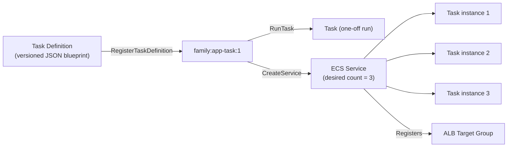
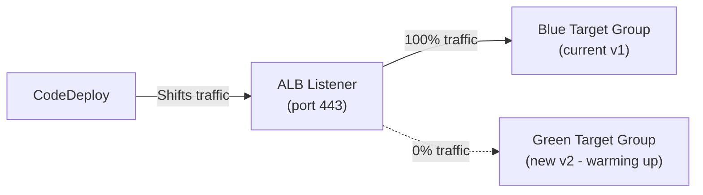
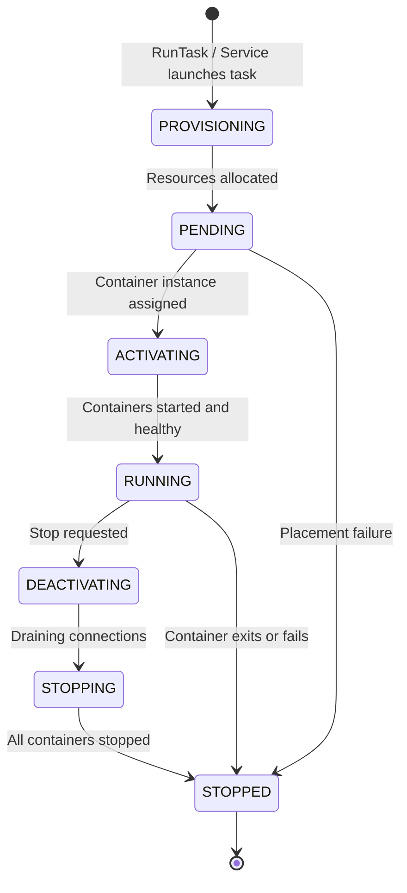

# ECS Task Definitions, Tasks & Services - SAA-C03 Deep Dive

> Task definitions are versioned JSON blueprints that describe every aspect of how containers run — image, CPU/memory, network mode, volumes, IAM roles, and logging. Services wrap task definitions with availability, deployment, and load-balancing logic.

See also: [01 - ECS Fundamentals & Architecture](01%20-%20ECS%20Fundamentals%20%26%20Architecture.md) · [02 - ECS Launch Types - EC2 vs Fargate](02%20-%20ECS%20Launch%20Types%20-%20EC2%20vs%20Fargate.md) · [04 - ECS Networking & Load Balancing](04%20-%20ECS%20Networking%20%26%20Load%20Balancing.md) · [05 - ECS IAM & Security](05%20-%20ECS%20IAM%20%26%20Security.md) · [06 - ECS Auto Scaling & Capacity](06%20-%20ECS%20Auto%20Scaling%20%26%20Capacity.md) · [07 - ECS Storage, Logging & Observability](07%20-%20ECS%20Storage%2C%20Logging%20%26%20Observability.md) · [08 - ECS Exam Scenarios & Q&A](08%20-%20ECS%20Exam%20Scenarios%20%26%20Q%26A.md) · [01 - ECR Fundamentals & Architecture](01%20-%20ECR%20Fundamentals%20%26%20Architecture.md) · [01 - EKS Fundamentals & Architecture](01%20-%20EKS%20Fundamentals%20%26%20Architecture.md) · [01 - ECS Anywhere Fundamentals & Architecture](01%20-%20ECS%20Anywhere%20Fundamentals%20%26%20Architecture.md)

---

## Table of Contents

- [Task Definition Anatomy](#task-definition-anatomy)
- [Task Definition - Full JSON Example](#task-definition---full-json-example)
- [Container Definition Fields Reference](#container-definition-fields-reference)
- [Task Placement Strategies](#task-placement-strategies)
- [Task Placement Constraints](#task-placement-constraints)
- [ECS Services Deep Dive](#ecs-services-deep-dive)
- [Deployment Types](#deployment-types)
- [Service Discovery & Service Connect](#service-discovery--service-connect)
- [Task Lifecycle States](#task-lifecycle-states)

---



---

## Task Definition Anatomy

A **task definition** is an immutable, versioned JSON document. Each new `RegisterTaskDefinition` call with the same family name creates a new revision (`:1`, `:2`, etc.).

### Top-Level Fields

| Field | Required | Description |
| :--- | :--- | :--- |
| `family` | Yes | Name prefix for the task definition (e.g., `web-api`) |
| `containerDefinitions` | Yes | Array of container definitions (the actual containers) |
| `networkMode` | Yes (Fargate) | `awsvpc`, `bridge`, `host`, or `none` |
| `requiresCompatibilities` | Recommended | `["FARGATE"]` or `["EC2"]` or both |
| `cpu` | Yes (Fargate) | Task-level CPU units (256, 512, 1024, 2048, 4096, 8192, 16384) |
| `memory` | Yes (Fargate) | Task-level memory in MiB |
| `executionRoleArn` | Yes (Fargate) | IAM role for ECS Agent to pull images, write logs |
| `taskRoleArn` | Optional | IAM role for application code inside containers |
| `volumes` | Optional | EFS, bind mounts, or Docker volumes |
| `placementConstraints` | Optional | EC2 only — constraints for task placement |
| `tags` | Optional | Resource tags for cost allocation |

### Versioning

```
web-api:1  →  web-api:2  →  web-api:3  (latest)
    ↑              ↑              ↑
  Initial      Added env      Changed image
  version       variable         tag
```

- Old revisions are never deleted (immutable history)
- You can deregister a revision to prevent new task launches from it
- Services pin to a specific revision until you update them

---

[⬆ Back to top](#table-of-contents)

---

## Task Definition - Full JSON Example

```json
{
  "family": "web-api",
  "networkMode": "awsvpc",
  "requiresCompatibilities": ["FARGATE"],
  "cpu": "1024",
  "memory": "2048",
  "executionRoleArn": "arn:aws:iam::123456789012:role/ecsTaskExecutionRole",
  "taskRoleArn":      "arn:aws:iam::123456789012:role/webApiTaskRole",

  "containerDefinitions": [
    {
      "name": "web-api",
      "image": "123456789012.dkr.ecr.us-east-1.amazonaws.com/web-api:v1.2.3",
      "essential": true,
      "cpu": 768,
      "memory": 1536,
      "memoryReservation": 512,
      "portMappings": [
        {
          "containerPort": 8080,
          "protocol": "tcp",
          "name": "http",
          "appProtocol": "http"
        }
      ],
      "environment": [
        { "name": "APP_ENV",    "value": "production" },
        { "name": "LOG_LEVEL",  "value": "info" }
      ],
      "secrets": [
        {
          "name": "DB_PASSWORD",
          "valueFrom": "arn:aws:secretsmanager:us-east-1:123456789012:secret:prod/db-password"
        },
        {
          "name": "API_KEY",
          "valueFrom": "arn:aws:ssm:us-east-1:123456789012:parameter/prod/api-key"
        }
      ],
      "logConfiguration": {
        "logDriver": "awslogs",
        "options": {
          "awslogs-group":         "/ecs/web-api",
          "awslogs-region":        "us-east-1",
          "awslogs-stream-prefix": "ecs"
        }
      },
      "healthCheck": {
        "command":     ["CMD-SHELL", "curl -f http://localhost:8080/health || exit 1"],
        "interval":    30,
        "timeout":     5,
        "retries":     3,
        "startPeriod": 60
      },
      "mountPoints": [
        {
          "sourceVolume":  "shared-data",
          "containerPath": "/app/data",
          "readOnly":      false
        }
      ]
    },
    {
      "name": "log-router",
      "image": "amazon/aws-for-fluent-bit:latest",
      "essential": false,
      "firelensConfiguration": {
        "type": "fluentbit"
      }
    }
  ],

  "volumes": [
    {
      "name": "shared-data",
      "efsVolumeConfiguration": {
        "fileSystemId":     "fs-0abc12345",
        "rootDirectory":    "/app/data",
        "transitEncryption": "ENABLED"
      }
    }
  ]
}
```

---

[⬆ Back to top](#table-of-contents)

---

## Container Definition Fields Reference

### Essential vs Non-Essential Containers

| `essential: true` | `essential: false` |
| :--- | :--- |
| If this container exits, the entire **task** stops | Can exit without stopping the task |
| At least one container per task must be essential | Used for sidecars (log routers, proxies) |

### CPU and Memory

| Field | Meaning | Fargate Behavior |
| :--- | :--- | :--- |
| `cpu` | Hard CPU units (1024 = 1 vCPU) | Container can use up to this much |
| `memory` | Hard memory limit (MiB) — container OOM-killed if exceeded | Container OOM-killed if exceeded |
| `memoryReservation` | Soft limit — used for scheduling, container can exceed it | Not used in Fargate scheduling |

**Exam Trap:** For EC2 launch type, `memory` is a hard limit and `memoryReservation` is the soft reservation used for placement decisions. If you only set `memoryReservation`, the container can burst beyond it. If you only set `memory`, it is both the reservation and hard cap.

### Port Mappings

| Launch Type | Port Mapping Behavior |
| :--- | :--- |
| **bridge** | `hostPort: 0` = dynamic port mapping (random high port on host) |
| **awsvpc** | `hostPort` must equal `containerPort` (or be omitted); each task has its own IP |
| **host** | Container port = host port; no mapping needed |

### Dependency Ordering

Use `dependsOn` to control container startup order within a task:

```json
{
  "name": "app",
  "dependsOn": [
    {
      "containerName": "db-migrator",
      "condition": "SUCCESS"
    }
  ]
}
```

| Condition | Meaning |
| :--- | :--- |
| `START` | Dependent container has started |
| `COMPLETE` | Dependent container has exited (any code) |
| `SUCCESS` | Dependent container exited with code 0 |
| `HEALTHY` | Dependent container passed its health check |

---

[⬆ Back to top](#table-of-contents)

---

## Task Placement Strategies

> Task placement strategies apply to the **EC2 launch type only**. Fargate manages placement internally.

When ECS places a task on an EC2 container instance, it uses the strategy you specify.

### Strategy Types

| Strategy | Description | Best For |
| :--- | :--- | :--- |
| **binpack** | Pack tasks as tightly as possible onto fewest instances | Cost (fewer running instances) |
| **spread** | Spread tasks across instances/AZs | High availability |
| **random** | Place randomly (no specific logic) | Simple scenarios, testing |

### Binpack Strategy

```json
{
  "placementStrategy": [
    { "type": "binpack", "field": "memory" }
  ]
}
```

ECS fills one instance with as many tasks as will fit (by memory) before using the next instance. Minimizes running instance count = lower cost.

### Spread Strategy

```json
{
  "placementStrategy": [
    { "type": "spread", "field": "attribute:ecs.availability-zone" },
    { "type": "spread", "field": "instanceId" }
  ]
}
```

First spread across AZs, then spread across instances within each AZ. Best for fault tolerance.

### Combining Strategies

You can chain multiple strategies. ECS applies them in order:

```json
{
  "placementStrategy": [
    { "type": "spread",  "field": "attribute:ecs.availability-zone" },
    { "type": "binpack", "field": "memory" }
  ]
}
```

Spread across AZs first, then pack tightly within each AZ — balances availability and cost.

---

[⬆ Back to top](#table-of-contents)

---

## Task Placement Constraints

Constraints **filter** which instances are eligible for placement. ECS only places tasks on instances that satisfy ALL constraints.

### Constraint Types

| Type | Description | Example |
| :--- | :--- | :--- |
| `distinctInstance` | Each task must run on a different instance | Ensure no two tasks share a host |
| `memberOf` | Instance must match a cluster query expression | Pin to specific instance types/AZs |

### Cluster Query Language Examples

```json
{
  "placementConstraints": [
    {
      "type": "memberOf",
      "expression": "attribute:ecs.instance-type =~ t3.*"
    }
  ]
}
```

```json
{
  "placementConstraints": [
    {
      "type": "memberOf",
      "expression": "attribute:ecs.availability-zone in [us-east-1a, us-east-1b]"
    }
  ]
}
```

### Custom Attributes

You can set custom attributes on container instances and use them in constraints:

```bash
aws ecs put-attributes \
  --cluster my-cluster \
  --attributes name=stack,value=gpu,targetType=container-instance,targetId=<arn>

# Then in task definition:
# "expression": "attribute:stack == gpu"
```

---

[⬆ Back to top](#table-of-contents)

---

## ECS Services Deep Dive

### Service Configuration

| Parameter | Description |
| :--- | :--- |
| `desiredCount` | Number of task instances to maintain |
| `taskDefinition` | Which task definition (family:revision) to run |
| `launchType` | EC2 or FARGATE (or use capacityProviderStrategy) |
| `loadBalancers` | ALB/NLB target group associations |
| `networkConfiguration` | VPC subnets, security groups (awsvpc mode) |
| `deploymentConfiguration` | Rolling deployment parameters |
| `healthCheckGracePeriodSeconds` | Grace period before ELB health checks count |

### Minimum Healthy Percent & Maximum Percent

These control the rolling deployment behavior:

| Setting | Description | Typical Values |
| :--- | :--- | :--- |
| `minimumHealthyPercent` | Min % of `desiredCount` that must be healthy during deployment | 50–100% |
| `maximumPercent` | Max % of `desiredCount` that can be running (including new + old) | 100–200% |

**Example: Zero-downtime rolling deploy with desiredCount=4:**

```
minimumHealthyPercent = 100  → always keep 4 tasks healthy
maximumPercent        = 200  → can run up to 8 tasks during deploy
→ ECS launches 4 new tasks, then drains 4 old tasks
```

**Example: Budget-conscious deploy with desiredCount=4:**

```
minimumHealthyPercent = 50   → can drop to 2 healthy tasks
maximumPercent        = 100  → cannot exceed 4 total
→ ECS stops 2 old, starts 2 new, stops 2 old, starts 2 new
→ Brief capacity reduction but no extra instance cost
```

---

[⬆ Back to top](#table-of-contents)

---

## Deployment Types

ECS services support three deployment types.

### 1. Rolling Update (Default)

ECS replaces tasks incrementally using `minimumHealthyPercent` and `maximumPercent`.

```mermaid
gantt
    title Rolling Update Timeline (desiredCount=4, min=50%, max=200%)
    dateFormat  X
    axisFormat  t=%s

    section Old Tasks
    Task-v1 (1) :done, 0, 3
    Task-v1 (2) :done, 0, 5
    Task-v1 (3) :done, 2, 7
    Task-v1 (4) :done, 4, 9

    section New Tasks
    Task-v2 (1) :active, 1, 10
    Task-v2 (2) :active, 2, 10
    Task-v2 (3) :active, 4, 10
    Task-v2 (4) :active, 6, 10
```



**Pros:** Simple, no extra infrastructure  
**Cons:** Mixed versions serving traffic during deployment; harder rollback

### 2. Blue/Green Deployment (AWS CodeDeploy)

Two separate sets of tasks (blue = current, green = new) with traffic shifting.



**Traffic shifting options:**

| Strategy | Behavior |
| :--- | :--- |
| `CodeDeployDefault.ECSAllAtOnce` | Shift 100% immediately |
| `CodeDeployDefault.ECSLinear10PercentEvery1Minutes` | Shift 10% per minute |
| `CodeDeployDefault.ECSCanary10Percent5Minutes` | 10% for 5 min, then 100% |

**Rollback:** CodeDeploy shifts traffic back to Blue instantly.

**Requirements:**

- Requires ALB (not NLB or CLB)
- Two target groups must be defined on the ALB listener
- CodeDeploy IAM role with ECS permissions

### 3. External Deployment

You control the deployment with your own orchestration tool (e.g., custom CI/CD pipeline). ECS does not manage the deployment process.

---

[⬆ Back to top](#table-of-contents)

---

## Service Discovery & Service Connect

### Cloud Map-Based Service Discovery (Legacy)

ECS integrates with AWS Cloud Map to register task IPs as DNS records:

```
Service: payments → DNS: payments.prod.local (Route 53 private hosted zone)
Each task registers: 10.0.1.23, 10.0.1.45, 10.0.1.67
```

Calling services do DNS lookup → get healthy task IPs → connect directly (no load balancer needed).

**Limitation:** Client-side DNS caching can route to dead tasks; no built-in circuit breaking.

### ECS Service Connect (Modern, Recommended)

Service Connect is ECS's built-in service mesh, introduced in 2022. It uses Envoy sidecar proxies injected automatically by ECS.

| Feature | Cloud Map (old) | Service Connect (new) |
| :--- | :--- | :--- |
| **Setup** | Manual Cloud Map namespace | Cluster-level namespace config |
| **Proxy** | None (client connects directly) | Envoy sidecar (auto-injected) |
| **Load balancing** | DNS round-robin | Envoy per-connection load balancing |
| **Retries/circuit breaking** | None | Built-in via Envoy |
| **Observability** | Basic | CloudWatch metrics per service-to-service path |
| **Mutual TLS** | No | Yes (optional) |

**Service Connect Configuration in Task Definition:**

```json
{
  "serviceConnectConfiguration": {
    "enabled": true,
    "namespace": "prod",
    "services": [
      {
        "portName":    "http",
        "discoveryName": "payments",
        "clientAliases": [
          { "port": 80, "dnsName": "payments" }
        ]
      }
    ]
  }
}
```

With this configuration, any other Service Connect-enabled service in the `prod` namespace can reach payments at `http://payments:80` — ECS handles routing, retries, and metrics automatically.

---

[⬆ Back to top](#table-of-contents)

---

## Task Lifecycle States

Understanding task states is important for debugging and exam scenarios.



| State | Meaning |
| :--- | :--- |
| **PROVISIONING** | ECS is allocating resources (ENI for awsvpc, Fargate VM) |
| **PENDING** | Waiting for the container instance/Fargate to pull the image and start |
| **ACTIVATING** | Task is starting up; ELB registration in progress |
| **RUNNING** | All essential containers running; ELB health checks passing |
| **DEACTIVATING** | ELB deregistration in progress (connection draining) |
| **STOPPING** | SIGTERM sent to containers; waiting for graceful shutdown |
| **STOPPED** | Task has stopped; reason code available (inspect for debugging) |

### Common STOPPED Reasons

| Stopped Reason | Cause |
| :--- | :--- |
| `Essential container in task exited` | Essential container crashed |
| `CannotPullContainerError` | Image pull failed (auth, network, image not found) |
| `OutOfMemoryError` | Container exceeded memory limit |
| `HealthCheck failed` | Container health check failed after retries |
| `Task failed ELB health checks` | ALB health check never passed |

---

[⬆ Back to top](#table-of-contents)
