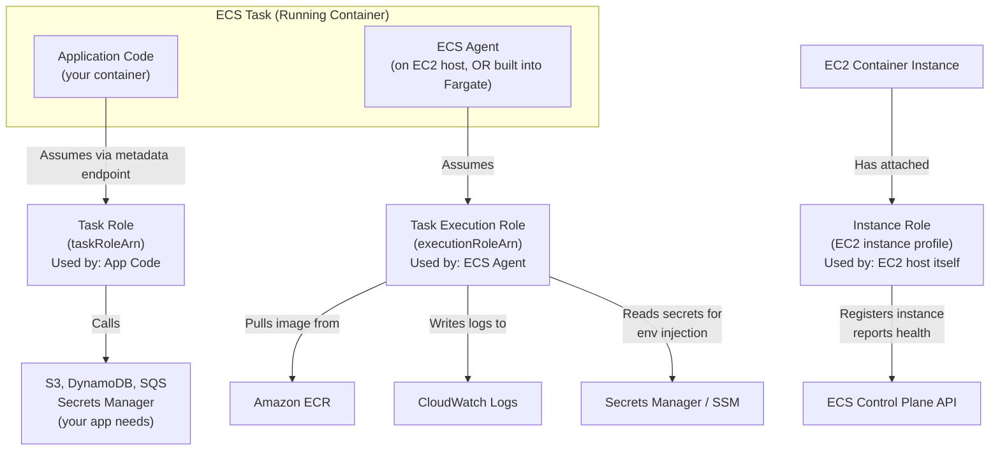

# ECS IAM & Security - SAA-C03 Deep Dive

> The three ECS IAM roles — task execution role (used by the ECS Agent), task role (used by your application code), and container instance role (used by EC2 nodes) — are the most commonly tested ECS topic on SAA-C03. Getting them confused is the #1 exam trap.

See also: [01 - ECS Fundamentals & Architecture](01%20-%20ECS%20Fundamentals%20%26%20Architecture.md) · [02 - ECS Launch Types - EC2 vs Fargate](02%20-%20ECS%20Launch%20Types%20-%20EC2%20vs%20Fargate.md) · [03 - ECS Task Definitions, Tasks & Services](03%20-%20ECS%20Task%20Definitions%2C%20Tasks%20%26%20Services.md) · [04 - ECS Networking & Load Balancing](04%20-%20ECS%20Networking%20%26%20Load%20Balancing.md) · [06 - ECS Auto Scaling & Capacity](06%20-%20ECS%20Auto%20Scaling%20%26%20Capacity.md) · [07 - ECS Storage, Logging & Observability](07%20-%20ECS%20Storage%2C%20Logging%20%26%20Observability.md) · [08 - ECS Exam Scenarios & Q&A](08%20-%20ECS%20Exam%20Scenarios%20%26%20Q%26A.md) · [01 - ECR Fundamentals & Architecture](01%20-%20ECR%20Fundamentals%20%26%20Architecture.md) · [01 - EKS Fundamentals & Architecture](01%20-%20EKS%20Fundamentals%20%26%20Architecture.md) · [01 - ECS Anywhere Fundamentals & Architecture](01%20-%20ECS%20Anywhere%20Fundamentals%20%26%20Architecture.md) · [22 - Secrets Manager vs SSM Parameter Store](22%20-%20Secrets%20Manager%20vs%20SSM%20Parameter%20Store.md) · [20 - KMS & Envelope Encryption](20%20-%20KMS%20%26%20Envelope%20Encryption.md)

---

## Table of Contents

- [The Three ECS IAM Roles (Critical Exam Topic)](#the-three-ecs-iam-roles-critical-exam-topic)
- [Task Execution Role Deep Dive](#task-execution-role-deep-dive)
- [Task Role Deep Dive](#task-role-deep-dive)
- [Container Instance Role (EC2 Only)](#container-instance-role-ec2-only)
- [Role Confusion: The #1 Exam Trap](#role-confusion-the-1-exam-trap)
- [Secrets Injection from Secrets Manager & SSM](#secrets-injection-from-secrets-manager--ssm)
- [ECR Authentication](#ecr-authentication)
- [Security Groups Per Task (awsvpc)](#security-groups-per-task-awsvpc)
- [Fargate Security Isolation](#fargate-security-isolation)
- [ECS IAM Policies Reference](#ecs-iam-policies-reference)

---



---

## The Three ECS IAM Roles (Critical Exam Topic)

### Quick Reference

| Role | `arn` Field in Task Def | Used By | What It Does |
| :--- | :--- | :--- | :--- |
| **Task Execution Role** | `executionRoleArn` | ECS Agent | Pull images, write logs, fetch secrets at startup |
| **Task Role** | `taskRoleArn` | Your app code | Make AWS API calls from inside the container |
| **Container Instance Role** | EC2 instance profile | EC2 host OS | Register with ECS cluster, report health |

**Exam Trap #1:** "My ECS task cannot write to S3" → Fix the **Task Role** (not the execution role).

**Exam Trap #2:** "ECS cannot pull my ECR image" → Fix the **Task Execution Role** (not the task role).

**Exam Trap #3:** "ECS agent cannot register the instance" → Fix the **Container Instance Role** (EC2 launch type only).

---

[⬆ Back to top](#table-of-contents)

---

## Task Execution Role Deep Dive

The **task execution role** is assumed by the ECS infrastructure (Agent or Fargate runtime), NOT by your application code. It is used only during task **setup** — before your container actually starts.

### What the Task Execution Role Does

| Action | When | AWS Service Involved |
| :--- | :--- | :--- |
| Pull Docker image | Task startup | Amazon ECR (or public registries via NAT) |
| Create CloudWatch log group | First log entry | CloudWatch Logs |
| Write log entries | Container running | CloudWatch Logs |
| Retrieve secrets for env injection | Task startup | AWS Secrets Manager |
| Retrieve parameters for env injection | Task startup | AWS Systems Manager Parameter Store |
| Decrypt secrets | Task startup | AWS KMS |

### Managed Policy

AWS provides a managed policy for this role:

```
AmazonECSTaskExecutionRolePolicy
```

Covers ECR image pulls and CloudWatch log writes. You must add **additional** inline policies for Secrets Manager or SSM access.

### Task Execution Role — Minimum Policy

```json
{
  "Version": "2012-10-17",
  "Statement": [
    {
      "Effect": "Allow",
      "Action": [
        "ecr:GetAuthorizationToken",
        "ecr:BatchCheckLayerAvailability",
        "ecr:GetDownloadUrlForLayer",
        "ecr:BatchGetImage"
      ],
      "Resource": "*"
    },
    {
      "Effect": "Allow",
      "Action": [
        "logs:CreateLogStream",
        "logs:PutLogEvents"
      ],
      "Resource": "arn:aws:logs:us-east-1:123456789012:log-group:/ecs/*:*"
    }
  ]
}
```

### Adding Secrets Manager Access to Execution Role

```json
{
  "Effect": "Allow",
  "Action": [
    "secretsmanager:GetSecretValue",
    "kms:Decrypt"
  ],
  "Resource": [
    "arn:aws:secretsmanager:us-east-1:123456789012:secret:prod/db-password*",
    "arn:aws:kms:us-east-1:123456789012:key/your-kms-key-id"
  ]
}
```

**Note:** If the secret uses the default AWS-managed KMS key, you do not need the `kms:Decrypt` permission. Only needed for customer-managed keys.

### Trust Policy for Execution Role

```json
{
  "Version": "2012-10-17",
  "Statement": [
    {
      "Effect": "Allow",
      "Principal": {
        "Service": "ecs-tasks.amazonaws.com"
      },
      "Action": "sts:AssumeRole"
    }
  ]
}
```

---

[⬆ Back to top](#table-of-contents)

---

## Task Role Deep Dive

The **task role** is the IAM role your application code uses to make AWS API calls. It is analogous to the EC2 instance profile role, but scoped to the task level.

### How the Task Role Works

ECS provides credentials via a **metadata endpoint** local to the task:

1. ECS injects the environment variable `AWS_CONTAINER_CREDENTIALS_RELATIVE_URI` into the container
2. The AWS SDK automatically calls `http://169.254.170.2$AWS_CONTAINER_CREDENTIALS_RELATIVE_URI` to get temporary credentials
3. Credentials are scoped to the task role and rotated automatically by ECS
4. No long-lived access keys needed inside the container

```bash
# Inside a Fargate task, you can manually test:
curl "http://169.254.170.2${AWS_CONTAINER_CREDENTIALS_RELATIVE_URI}"
# Returns: {"AccessKeyId":"ASIA...","SecretAccessKey":"...","Token":"...","Expiration":"..."}
```

### Task Role — Least Privilege Example

```json
{
  "Version": "2012-10-17",
  "Statement": [
    {
      "Sid": "AllowS3ReadWrite",
      "Effect": "Allow",
      "Action": [
        "s3:GetObject",
        "s3:PutObject"
      ],
      "Resource": "arn:aws:s3:::my-app-bucket/*"
    },
    {
      "Sid": "AllowSQSConsume",
      "Effect": "Allow",
      "Action": [
        "sqs:ReceiveMessage",
        "sqs:DeleteMessage",
        "sqs:GetQueueAttributes"
      ],
      "Resource": "arn:aws:sqs:us-east-1:123456789012:my-queue"
    },
    {
      "Sid": "AllowDynamoDB",
      "Effect": "Allow",
      "Action": [
        "dynamodb:GetItem",
        "dynamodb:PutItem",
        "dynamodb:Query"
      ],
      "Resource": "arn:aws:dynamodb:us-east-1:123456789012:table/my-table"
    }
  ]
}
```

### Task Role vs IAM User Access Keys

| Approach | Security | Rotation | Recommended |
| :--- | :--- | :--- | :--- |
| **Task Role (IAM role)** | High — short-lived temp credentials | Automatic | Yes |
| **IAM user keys in env vars** | Low — long-lived, stored in plain text | Manual | Never |
| **IAM user keys in Secrets Manager** | Medium — still long-lived | Manual or Lambda rotation | Avoid if possible |

**Exam Rule:** If an application in an ECS task needs to access AWS services, ALWAYS use a task role. Never put IAM access keys in environment variables or container images.

---

[⬆ Back to top](#table-of-contents)

---

## Container Instance Role (EC2 Only)

The **container instance role** is an EC2 instance profile attached to your EC2 container instances. It is used by the **ECS Agent** running on the host — not by your application containers.

### What the Instance Role Does

| Action | Why Needed |
| :--- | :--- |
| `ecs:RegisterContainerInstance` | Register EC2 as cluster member |
| `ecs:DeregisterContainerInstance` | Graceful removal from cluster |
| `ecs:DiscoverPollEndpoint` | Find the ECS API endpoint to poll |
| `ecs:Submit*` | Report task start/stop/health |
| `ecs:Poll` | Long-poll for task assignments |
| `ecr:GetAuthorizationToken` | Pull images (when not using execution role) |
| `logs:CreateLogStream`, `PutLogEvents` | Write logs (when using EC2 launch type without execution role) |

### Managed Policy

```
AmazonEC2ContainerServiceforEC2Role
```

AWS provides this managed policy. Attach it to your container instance profile.

### Important Boundary

The container instance role is for the **host OS / ECS Agent**. If a task needs AWS access, that comes from the **task role** — even on EC2 launch type.

**Exam Trap:** On EC2 launch type, if you DON'T set a task role, containers can "inherit" the container instance role credentials unless you explicitly block it with `ECS_DISABLE_PRIVILEGED=true` or `ECS_ENABLE_TASK_IAM_ROLE=true` (which creates isolated endpoints per task). With `awsvpc` mode, task credentials are isolated by default.

---

[⬆ Back to top](#table-of-contents)

---

## Role Confusion: The #1 Exam Trap

Here is the definitive decision table for role-related exam questions:

| Symptom / Error | Broken Role | Fix |
| :--- | :--- | :--- |
| Cannot pull ECR image | Task Execution Role | Add ECR pull permissions to `executionRoleArn` role |
| CloudWatch logs not appearing | Task Execution Role | Add `logs:CreateLogStream` / `PutLogEvents` to execution role |
| Secrets Manager value not injected into env | Task Execution Role | Add `secretsmanager:GetSecretValue` to execution role |
| S3 upload fails from within container | Task Role | Add S3 permissions to `taskRoleArn` role |
| DynamoDB access denied from container | Task Role | Add DynamoDB permissions to `taskRoleArn` role |
| ECS Agent cannot register instance | Instance Role | Add `AmazonEC2ContainerServiceforEC2Role` to EC2 instance profile |
| Task placement fails on EC2 | Instance Role or agent config | Verify agent started, ECS_CLUSTER set, instance profile correct |

### Mnemonic

```
Execution Role = ECS "infrastructure" actions (pull, log, inject secrets) — BEFORE your code runs
Task Role      = Your APPLICATION'S actions (S3, DynamoDB, SQS) — WHILE your code runs
Instance Role  = EC2 HOST actions (register, report, poll) — EC2 launch type only
```

---

[⬆ Back to top](#table-of-contents)

---

## Secrets Injection from Secrets Manager & SSM

ECS can inject secrets directly as **environment variables** into your containers at task startup — without any application-level code changes.

### How Secrets Injection Works

1. ECS Agent (using the execution role) calls Secrets Manager or SSM at task start
2. Secret value retrieved and decrypted
3. Value set as an environment variable in the container
4. Container starts with the secret available as `$DB_PASSWORD`, etc.

**Security benefit:** Secret value is never stored in the task definition, never visible in `docker inspect`, and never logged.

### Secrets Manager Configuration

```json
{
  "secrets": [
    {
      "name": "DB_PASSWORD",
      "valueFrom": "arn:aws:secretsmanager:us-east-1:123456789012:secret:prod/db-password"
    },
    {
      "name": "DB_USERNAME",
      "valueFrom": "arn:aws:secretsmanager:us-east-1:123456789012:secret:prod/db-creds:username::"
    }
  ]
}
```

**JSON secret field extraction:** Use the syntax `secret-arn:json-key::` to extract a specific key from a JSON secret.

### SSM Parameter Store Configuration

```json
{
  "secrets": [
    {
      "name": "API_KEY",
      "valueFrom": "arn:aws:ssm:us-east-1:123456789012:parameter/prod/api-key"
    }
  ]
}
```

### Secrets Manager vs SSM Parameter Store for ECS

| Feature | Secrets Manager | SSM Parameter Store (SecureString) |
| :--- | :--- | :--- |
| **Automatic rotation** | Yes (Lambda-powered) | No (manual update) |
| **Cost** | $0.40/secret/month | Free (standard) / $0.05/adv param |
| **Cross-account access** | Yes | Yes (with resource policy) |
| **Versioning** | Yes (stages: AWSCURRENT, AWSPREVIOUS) | Yes (parameter history) |
| **Best for** | DB passwords, OAuth tokens, rotating secrets | Config values, feature flags, non-rotating secrets |

**Exam Rule:** If the scenario mentions **automatic rotation** of credentials, use **Secrets Manager**. If cost is the primary concern and rotation is not needed, SSM Parameter Store is sufficient.

---

[⬆ Back to top](#table-of-contents)

---

## ECR Authentication

Pulling images from Amazon ECR requires authentication. The mechanism differs by launch type.

### Fargate + ECR (Recommended Setup)

1. Task execution role has ECR permissions
2. ECS automatically calls `ecr:GetAuthorizationToken` before pulling
3. No manual `docker login` needed

```
Task Execution Role → ecr:GetAuthorizationToken → get 12-hour token → pull image
```

### EC2 Launch Type + ECR

Same flow as Fargate — the ECS Agent handles authentication using the task execution role.

**However**, if you use EC2 launch type WITHOUT a task execution role (legacy setups), the container instance role must have ECR permissions.

### Cross-Account ECR

To pull an image from ECR in a different AWS account:

1. Attach an **ECR repository resource policy** in the source account allowing the target account's execution role
2. The execution role in the target account needs `ecr:GetAuthorizationToken` (which is account-scoped, not resource-scoped)

```json
{
  "Version": "2012-10-17",
  "Statement": [
    {
      "Sid": "AllowCrossAccountPull",
      "Effect": "Allow",
      "Principal": {
        "AWS": "arn:aws:iam::TARGET_ACCOUNT_ID:role/ecsTaskExecutionRole"
      },
      "Action": [
        "ecr:BatchGetImage",
        "ecr:GetDownloadUrlForLayer"
      ]
    }
  ]
}
```

---

[⬆ Back to top](#table-of-contents)

---

## Security Groups Per Task (awsvpc)

One of the key security advantages of `awsvpc` network mode is **per-task security groups**.

### Security Group Lifecycle

```
Task PROVISIONING → ENI created → Security groups attached to ENI
Task RUNNING      → Security groups enforced on all inbound/outbound traffic
Task STOPPED      → ENI deleted → Security groups released
```

### Best Practices

| Practice | Implementation |
| :--- | :--- |
| **Principle of least privilege** | Only allow ports your app actually uses |
| **Service-to-service via SGs** | Allow inbound from the ALB's SG only |
| **Database access** | RDS SG allows inbound only from specific task SGs |
| **Outbound** | Default allow all outbound; restrict if compliance requires it |
| **No broad 0.0.0.0/0 inbound** | Always use specific SG-to-SG or CIDR rules |

### Example: Tiered Application Security Groups

```
Internet → ALB (sg-alb): inbound 443 from 0.0.0.0/0
ALB → Web Task (sg-web): inbound 8080 from sg-alb
Web Task → API Task (sg-api): inbound 3000 from sg-web
API Task → RDS (sg-rds): inbound 5432 from sg-api
```

Each layer only allows traffic from the upstream layer's security group. No lateral movement possible.

---

[⬆ Back to top](#table-of-contents)

---

## Fargate Security Isolation

Fargate provides additional layers of security isolation compared to EC2 launch type.

### Isolation Layers

| Layer | Fargate Isolation | EC2 Launch Type Isolation |
| :--- | :--- | :--- |
| **Compute** | Dedicated Firecracker micro-VM per task | Shared host OS (containers on same instance share kernel) |
| **Kernel** | Task-specific kernel | Shared host kernel |
| **Storage** | Ephemeral storage per task (not shared) | Potential for host path volume sharing |
| **Network** | Dedicated ENI per task | Shared instance ENI (bridge mode) or dedicated ENI (awsvpc) |
| **IAM** | Task role scoped to task | Task role scoped to task (if awsvpc; otherwise may inherit instance role) |

### Fargate Security Features

| Feature | Description |
| :--- | :--- |
| **No SSH access** | Cannot SSH into Fargate tasks (use ECS Exec for debugging) |
| **Read-only root filesystem** | Set `readonlyRootFilesystem: true` in container def |
| **User namespacing** | Fargate runs containers as non-root by default |
| **Seccomp profiles** | Default seccomp filtering applied |
| **No privileged containers** | `privileged: true` not supported on Fargate |

### ECS Exec (Debugging Without SSH)

ECS Exec uses AWS Systems Manager Session Manager to open an interactive shell into a running Fargate task:

```bash
# Enable on the service
aws ecs update-service \
  --cluster my-cluster \
  --service my-service \
  --enable-execute-command

# Open a shell
aws ecs execute-command \
  --cluster my-cluster \
  --task <task-id> \
  --container my-container \
  --command "/bin/sh" \
  --interactive
```

**Required permissions on task role:**

```json
{
  "Effect": "Allow",
  "Action": [
    "ssmmessages:CreateControlChannel",
    "ssmmessages:CreateDataChannel",
    "ssmmessages:OpenControlChannel",
    "ssmmessages:OpenDataChannel"
  ],
  "Resource": "*"
}
```

---

[⬆ Back to top](#table-of-contents)

---

## ECS IAM Policies Reference

### Complete Trust Relationships

All three ECS roles use `ecs-tasks.amazonaws.com` or `ec2.amazonaws.com` as the trust principal:

```json
{
  "task_execution_role_trust": {
    "Principal": { "Service": "ecs-tasks.amazonaws.com" },
    "Action": "sts:AssumeRole"
  },
  "task_role_trust": {
    "Principal": { "Service": "ecs-tasks.amazonaws.com" },
    "Action": "sts:AssumeRole"
  },
  "instance_role_trust": {
    "Principal": { "Service": "ec2.amazonaws.com" },
    "Action": "sts:AssumeRole"
  }
}
```

### AWS Managed Policies Summary

| Policy Name | Attach To | Covers |
| :--- | :--- | :--- |
| `AmazonECSTaskExecutionRolePolicy` | Task Execution Role | ECR pull, CloudWatch log writes |
| `AmazonEC2ContainerServiceforEC2Role` | Container Instance Role | ECS Agent operations, ECR pull |
| `AmazonECSServiceRolePolicy` | ECS Service-Linked Role | ALB/NLB registration (auto-created by ECS) |
| `AmazonECS_FullAccess` | Admin users | Full ECS management |
| `AmazonECSReadOnlyAccess` | Read-only users | ECS describe/list operations |

---

[⬆ Back to top](#table-of-contents)
