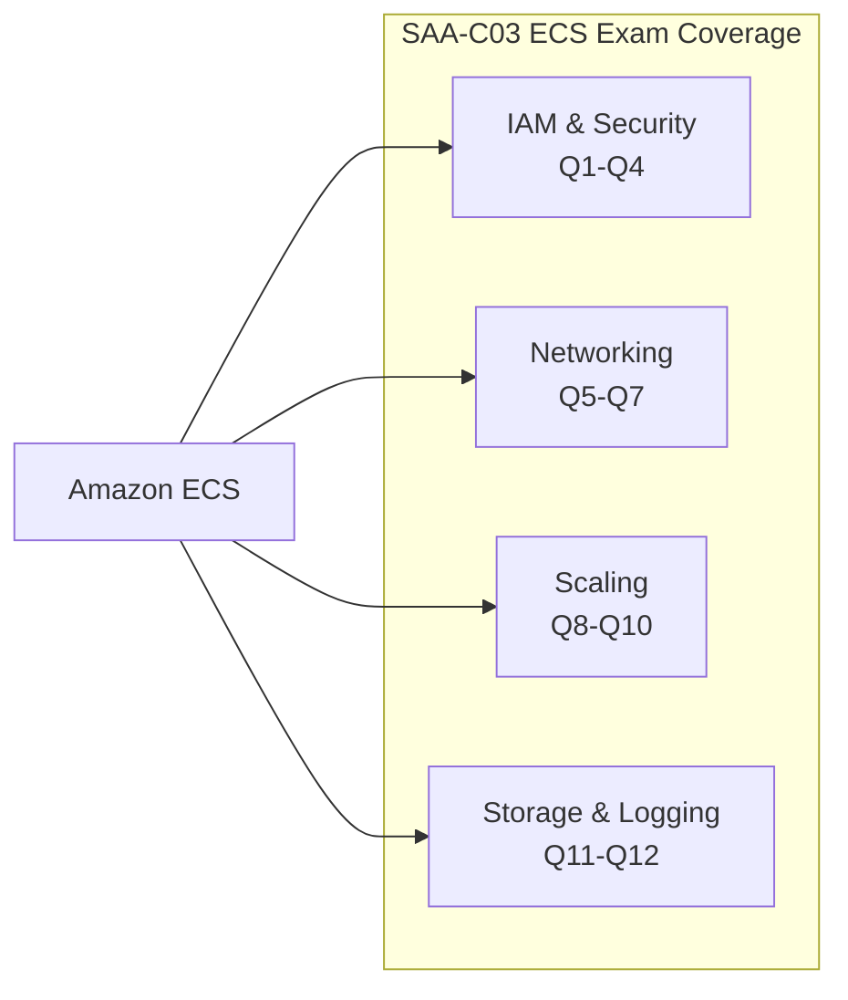
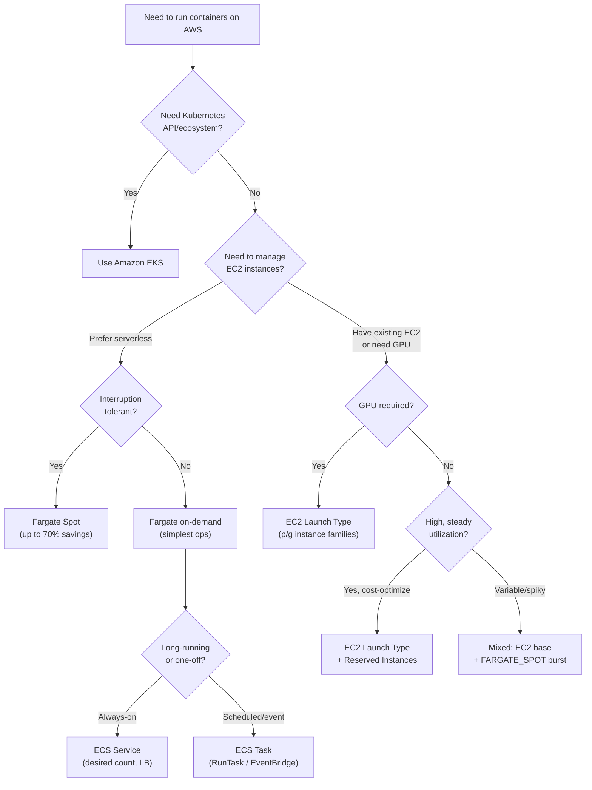

# ECS Exam Scenarios & Q&A - SAA-C03 Deep Dive

> Twelve exam-style MCQs covering every critical ECS domain — IAM roles, launch types, networking, scaling, storage, logging, and deployment — with detailed answer explanations, exam traps, and a full decision tree + cheat sheet.

See also: [01 - ECS Fundamentals & Architecture](01%20-%20ECS%20Fundamentals%20%26%20Architecture.md) · [02 - ECS Launch Types - EC2 vs Fargate](02%20-%20ECS%20Launch%20Types%20-%20EC2%20vs%20Fargate.md) · [03 - ECS Task Definitions, Tasks & Services](03%20-%20ECS%20Task%20Definitions%2C%20Tasks%20%26%20Services.md) · [04 - ECS Networking & Load Balancing](04%20-%20ECS%20Networking%20%26%20Load%20Balancing.md) · [05 - ECS IAM & Security](05%20-%20ECS%20IAM%20%26%20Security.md) · [06 - ECS Auto Scaling & Capacity](06%20-%20ECS%20Auto%20Scaling%20%26%20Capacity.md) · [07 - ECS Storage, Logging & Observability](07%20-%20ECS%20Storage%2C%20Logging%20%26%20Observability.md) · [01 - ECR Fundamentals & Architecture](01%20-%20ECR%20Fundamentals%20%26%20Architecture.md) · [01 - EKS Fundamentals & Architecture](01%20-%20EKS%20Fundamentals%20%26%20Architecture.md) · [01 - ECS Anywhere Fundamentals & Architecture](01%20-%20ECS%20Anywhere%20Fundamentals%20%26%20Architecture.md)

---

## Table of Contents

- [Exam Questions 1–4: IAM & Security](#exam-questions-14-iam--security)
- [Exam Questions 5–7: Networking & Load Balancing](#exam-questions-57-networking--load-balancing)
- [Exam Questions 8–10: Scaling & Capacity](#exam-questions-810-scaling--capacity)
- [Exam Questions 11–12: Storage & Logging](#exam-questions-1112-storage--logging)
- [ECS Decision Tree](#ecs-decision-tree)
- [ECS Cheat Sheet](#ecs-cheat-sheet)

---

---

## Exam Questions 1–4: IAM & Security

---

### Question 1

A developer deployed a Fargate task that needs to write objects to an S3 bucket. The task is failing with `AccessDenied` errors when calling `s3:PutObject`. The task definition has an `executionRoleArn` set to a role with `AmazonECSTaskExecutionRolePolicy`. What is the MOST LIKELY cause and fix?

**A.** The execution role is missing S3 permissions — add `s3:PutObject` to the execution role.

**B.** The task has no `taskRoleArn` — create an IAM role for the application and set it as the task role.

**C.** Fargate does not support S3 access — use the EC2 launch type.

**D.** The ECS Agent needs `s3:PutObject` — add it to the container instance role.

---

**Answer: B**

**Explanation:**

- The `executionRoleArn` (task execution role) is used by the ECS infrastructure to pull images and write logs. It does NOT grant permissions to application code.
- The `taskRoleArn` (task role) is the IAM role that the application code inside the container uses to make AWS API calls.
- Since no task role was set, the application has no AWS credentials for S3 access.

**Option A** is wrong — adding S3 to the execution role grants it to the ECS Agent/infrastructure, not the application.

**Option C** is wrong — Fargate fully supports S3 access via the task role.

**Option D** is wrong — there is no container instance role in Fargate (that concept applies only to EC2 launch type).

**Exam Tip:** Execution role = ECS infrastructure (pull images, write logs). Task role = your application code. This distinction appears in 1–2 questions per exam.

---

### Question 2

An ECS service on EC2 launch type fails to start tasks. The ECS console shows the tasks stuck in PENDING state, and the events log shows: `unable to place a task because no container instance met all of its requirements`. The cluster has 3 running EC2 instances. The task definition requests 2 vCPU and 4 GB memory. Which action will MOST LIKELY resolve this?

**A.** Increase the task definition CPU to 4 vCPU.

**B.** Add more EC2 instances to the cluster by scaling out the Auto Scaling Group.

**C.** Change the launch type to Fargate.

**D.** Enable managed scaling on the capacity provider.

**E.** B or C would both resolve this issue.

---

**Answer: E**

**Explanation:**
The error means the scheduler cannot find a container instance with sufficient available CPU + memory to place the task. This happens when:

- All instances are fully packed with existing tasks
- The task definition's CPU/memory requirements exceed any single instance's available resources

**Option B** — adding more EC2 instances gives the scheduler eligible placement targets.

**Option C** — switching to Fargate removes the cluster capacity constraint entirely (Fargate has elastic compute).

**Option A** is wrong — increasing CPU makes the problem worse (harder to place).

**Option D** is partially right long-term (managed scaling auto-scales the ASG) but alone does not immediately resolve the immediate placement failure unless the ASG actually scales out.

**Exam Tip:** PENDING tasks = placement problem = either insufficient EC2 capacity or placement constraints not satisfied. The fix is more capacity (scale ASG, or switch to Fargate).

---

### Question 3

A company stores database credentials in AWS Secrets Manager and wants to inject them into an ECS Fargate task as environment variables — without any code changes to the application. The task execution role has `AmazonECSTaskExecutionRolePolicy` attached. The deployment fails with a permissions error during task startup. What is missing?

**A.** The task role needs `secretsmanager:GetSecretValue` permission.

**B.** The task execution role needs `secretsmanager:GetSecretValue` permission (and `kms:Decrypt` if using a customer-managed key).

**C.** ECS Fargate does not support Secrets Manager injection — use SSM Parameter Store instead.

**D.** The container definition must use `environment` (not `secrets`) to inject Secrets Manager values.

---

**Answer: B**

**Explanation:**
Secrets Manager injection happens at **task startup**, performed by the **ECS infrastructure (Agent / Fargate runtime)** — which assumes the **task execution role**.

- `AmazonECSTaskExecutionRolePolicy` covers ECR image pulls and CloudWatch log writes, but NOT Secrets Manager access.
- You must add `secretsmanager:GetSecretValue` to the execution role.
- If the secret is encrypted with a customer-managed KMS key (not the default AWS-managed key), also add `kms:Decrypt`.

**Option A** is wrong — the task role is for the application code at runtime, not for ECS infrastructure actions at startup.

**Option C** is wrong — Fargate supports both Secrets Manager and SSM Parameter Store injection.

**Option D** is wrong — the `secrets` field in the container definition is specifically for Secrets Manager/SSM injection. The `environment` field is for plain-text values only.

**Exam Tip:** Secrets Manager injection → execution role. Application reading from Secrets Manager at runtime → task role.

---

### Question 4

An ECS task running on Fargate needs to access a DynamoDB table. A security audit finds that access keys are being passed as plain-text environment variables in the task definition. Which solution provides the BEST security?

**A.** Move the access keys to Secrets Manager and inject them as secrets in the task definition.

**B.** Create an IAM role with DynamoDB permissions, set it as the `taskRoleArn` in the task definition, and remove the access keys.

**C.** Encrypt the access keys with KMS before adding them to the task definition environment variables.

**D.** Store the access keys in SSM Parameter Store as SecureString and inject them at task startup.

---

**Answer: B**

**Explanation:**
IAM roles with temporary credentials (via task role) are **always** the preferred solution over long-lived access keys. The task role mechanism:

- Automatically provides short-lived, rotating credentials
- No access keys to rotate, leak, or audit
- No credentials stored anywhere (not in task definitions, not in Secrets Manager)

**Option A** is better than plain-text environment variables but still involves long-lived access keys that need rotation.

**Option C** is security theater — the access keys are still long-lived and now you have an additional KMS key management problem.

**Option D** is also better than plain text but still involves long-lived access keys.

**Exam Trap:** Whenever a question involves AWS service access from an ECS task, the answer is almost always a **task role (IAM role)**, not access keys in any form.

---

[⬆ Back to top](#table-of-contents)

---

## Exam Questions 5–7: Networking & Load Balancing

---

### Question 5

A company runs multiple ECS services on EC2 launch type using the `bridge` network mode. They want to enforce fine-grained network security so that individual tasks of different services cannot communicate with each other, and only specific services can reach the database. What is the MOST EFFECTIVE solution?

**A.** Create separate security groups for each service and attach them to the EC2 container instances.

**B.** Change the network mode from `bridge` to `awsvpc` — each task gets its own ENI and security group.

**C.** Use NACLs to block cross-task communication at the subnet level.

**D.** Deploy each service in a separate ECS cluster with separate VPCs.

---

**Answer: B**

**Explanation:**
With `bridge` network mode, security groups are at the **EC2 instance level** — all tasks on the same instance share the instance's security group. You cannot apply per-task security groups.

`awsvpc` mode gives each task its own ENI with its own security group(s), enabling:

- Task-level firewall rules
- Service-to-service network isolation
- Specific services to allow DB access without blanket instance-level rules

**Option A** is insufficient — multiple services on the same instance all share the instance's security group in bridge mode.

**Option C** — NACLs are stateless and operate at subnet level; they cannot distinguish between tasks on the same instance.

**Option D** — separating into multiple VPCs works but is massively over-engineered and operationally complex for this use case.

**Exam Tip:** Per-task security groups → `awsvpc` network mode. This is the recommended mode for both EC2 and Fargate.

---

### Question 6

An ECS service uses the EC2 launch type with `bridge` network mode. Multiple tasks of the same service run on the same EC2 instances. A new Application Load Balancer needs to distribute traffic across all tasks. The team is concerned about port conflicts since all tasks use container port 8080. What should they configure?

**A.** Set a unique `hostPort` for each task (e.g., 8081, 8082, 8083).

**B.** Set `hostPort: 0` in the container definition to enable dynamic port mapping; the ALB target group will receive registered ports automatically.

**C.** Switch to the `host` network mode so each task binds directly to the host's port 8080.

**D.** Use an NLB instead of an ALB — NLBs support port multiplexing.

---

**Answer: B**

**Explanation:**
Dynamic port mapping (`hostPort: 0`) solves the port conflict problem. When `hostPort` is 0:

- Docker assigns a random available high port (32768–65535) on the host for each task
- ECS automatically registers the assigned host port with the ALB target group
- ALB forwards requests to each task's unique assigned host port

**Option A** is operationally unmanageable and doesn't scale with multiple tasks.

**Option C** is wrong — `host` mode means only one task can bind to port 8080 on a given host (you can't run multiple tasks of the same service on the same host with `host` mode).

**Option D** is wrong — the load balancer type doesn't solve the port conflict; it's a Docker networking concern.

**Exam Tip:** EC2 + bridge + multiple tasks per host = dynamic port mapping (`hostPort: 0`) + ALB.

---

### Question 7

A company has multiple ECS microservices that communicate with each other. They are experiencing issues with DNS caching causing requests to go to stopped tasks, and they want built-in load balancing and retry logic between services without managing a separate service mesh. What AWS feature should they use?

**A.** AWS Cloud Map with Route 53 private hosted zones.

**B.** An internal ALB for each service pair that needs to communicate.

**C.** ECS Service Connect with a cluster namespace.

**D.** AWS App Mesh with Envoy proxies deployed as sidecar containers.

---

**Answer: C**

**Explanation:**
ECS Service Connect is specifically designed to solve inter-service communication challenges within an ECS cluster:

- Automatically injects Envoy sidecar proxies — no manual configuration
- Provides per-request load balancing (not DNS round-robin)
- Built-in retry and circuit breaking via Envoy
- CloudWatch metrics per service-to-service path
- Solves DNS caching issues (proxy handles routing, not DNS TTL)

**Option A** — Cloud Map uses DNS, which is exactly the DNS caching problem described.

**Option B** — Internal ALBs for every pair is not scalable (N×(N-1)/2 ALBs for N services).

**Option D** — App Mesh also uses Envoy sidecars and provides a full service mesh, but it requires significantly more configuration than Service Connect for this use case. Service Connect is the simpler, ECS-native answer.

**Exam Tip:** Service Connect is the modern answer for ECS-to-ECS service communication. Cloud Map (DNS-based) is the older approach with DNS caching limitations.

---

[⬆ Back to top](#table-of-contents)

---

## Exam Questions 8–10: Scaling & Capacity

---

### Question 8

An ECS service using the EC2 launch type has Service Auto Scaling configured to add tasks when CPU exceeds 70%. During a traffic spike, CloudWatch triggers scale-out and the ECS service increases `desiredCount` from 5 to 10. However, the new tasks stay in PENDING state for 10 minutes before starting. What is the MOST LIKELY cause?

**A.** The ALB health check grace period is too short.

**B.** The EC2 Auto Scaling Group is not adding new instances fast enough to accommodate the additional tasks.

**C.** The task definition's CPU limit is too high.

**D.** The Service Auto Scaling cooldown period is preventing task placement.

---

**Answer: B**

**Explanation:**
PENDING tasks indicate the ECS scheduler cannot find eligible placement targets — typically because there is insufficient EC2 capacity in the cluster. The scenario describes a 10-minute delay, which is consistent with waiting for:

1. CloudWatch alarm → ASG scale-out trigger
2. ASG launching new EC2 instances (~3–5 minutes)
3. New instances booting, ECS Agent registering (~2–3 minutes)
4. ECS placing pending tasks on new instances

**Fix:** Use an **ASG Capacity Provider with managed scaling** so ECS proactively scales the ASG when tasks are pending, rather than relying on separate EC2 Auto Scaling policies that may react slower.

**Option A** — ALB health check grace period affects task health transitions, not PENDING state.

**Option C** — High CPU limit makes placement harder but the symptom would be an error message, not a 10-minute delay.

**Option D** — Service Auto Scaling cooldown affects scaling policy triggers, not task placement.

**Exam Tip:** PENDING for extended periods = cluster capacity problem = needs more EC2 instances. Use ASG Capacity Provider with managed scaling for automatic coordination.

---

### Question 9

A company wants to reduce ECS infrastructure costs. Their API service runs on Fargate with a consistent base load of 10 tasks and occasionally spikes to 50 tasks during business hours. Which capacity strategy achieves the BEST cost optimization?

**A.** Use only FARGATE capacity provider with target tracking scaling.

**B.** Use only FARGATE_SPOT capacity provider — configure the application to handle interruptions gracefully.

**C.** Use a capacity provider strategy: `base=10` on FARGATE, `weight=4` on FARGATE_SPOT for additional tasks beyond the base.

**D.** Switch to EC2 launch type with Reserved Instances to reduce per-vCPU cost.

---

**Answer: C**

**Explanation:**
This is the optimal hybrid strategy:

- The base 10 tasks run on FARGATE (on-demand) — guaranteed availability for the core load
- All additional tasks beyond the base run primarily on FARGATE_SPOT — up to 70% cheaper
- Spot interruptions only affect the burst tasks, not the core 10 tasks

**Option A** — All on-demand Fargate, no cost optimization.

**Option B** — All Spot risks interruptions of the base load, which could cause service degradation even at normal traffic.

**Option D** — EC2 Reserved Instances requires upfront commitment and adds operational overhead for managing EC2 instances, while Fargate's managed infrastructure eliminates that complexity.

**Exam Tip:** The `base` parameter in a capacity provider strategy = the minimum number of tasks that always run on a specific provider. Tasks beyond the base are distributed by `weight`.

---

### Question 10

An ECS service is configured with EC2 launch type and an ASG Capacity Provider with managed scaling. During scale-in, the ASG terminates an EC2 instance that has a task processing a 30-minute batch job, causing the job to fail. How should this be prevented?

**A.** Set a longer `ScaleInCooldown` on the Service Auto Scaling policy.

**B.** Enable `managedTerminationProtection` on the capacity provider.

**C.** Set the ASG's instance protection flag manually via the EC2 console.

**D.** Increase the task definition's `stopTimeout` to 1800 seconds (30 minutes).

---

**Answer: B**

**Explanation:**
`managedTerminationProtection` on the capacity provider tells ECS to:

1. Set EC2 instance scale-in protection on any instance that has running tasks
2. Remove the protection only when no tasks are running on the instance
3. Then allow the ASG to terminate it

This is the purpose-built mechanism for this exact scenario.

**Option A** — Scale-in cooldown affects Service Auto Scaling (task count), not EC2 instance termination.

**Option C** — Manual instance protection would work but must be managed manually — not automated. The capacity provider's managed termination protection does this automatically.

**Option D** — `stopTimeout` gives the container more time to gracefully shut down after receiving SIGTERM, but if the ASG terminates the EC2 instance directly, SIGTERM may never be sent to the container.

**Exam Tip:** Managed termination protection = capacity provider feature = prevents EC2 termination while tasks run. Scale-in protection (application-level) = prevents ECS from stopping a specific task via Service Auto Scaling.

---

[⬆ Back to top](#table-of-contents)

---

## Exam Questions 11–12: Storage & Logging

---

### Question 11

A machine learning company runs ECS Fargate tasks that train models. Each task needs to read a 50 GB shared dataset and write model checkpoints that persist across task restarts. The dataset is read-only and accessed by up to 100 concurrent tasks. Which storage solution meets these requirements?

**A.** Configure 100 GB Fargate ephemeral storage on each task and pre-load the dataset at startup.

**B.** Mount an Amazon EFS filesystem with the dataset stored under an access point; tasks write checkpoints to a separate EFS path.

**C.** Use an S3 bucket — tasks download the dataset at startup and upload checkpoints on completion.

**D.** Use an EBS volume with Multi-Attach enabled.

---

**Answer: B**

**Explanation:**
The requirements are:

- 50 GB shared dataset accessible by 100 concurrent Fargate tasks simultaneously
- Persistent checkpoints across task restarts

**Amazon EFS** is the perfect fit:

- Supports concurrent access by hundreds of Fargate tasks across multiple AZs
- Persistent — checkpoints survive task stops and restarts
- Shared — one copy of the dataset, not duplicated per task
- Supports separate access points for read-only dataset vs read-write checkpoints

**Option A** — Downloading 50 GB per task at startup wastes time and data transfer costs; ephemeral storage is lost when the task stops (checkpoints lost).

**Option C** — S3 works but downloading 50 GB per task at startup is slow and expensive; S3 is not a filesystem mount.

**Option D** — EBS Multi-Attach is limited to 16 instances, does not support Fargate, and requires cluster-aware filesystem (like OCFS2) for shared writes.

**Exam Rule:** EFS = shared, persistent, multi-AZ filesystem for ECS (both EC2 and Fargate). This is the canonical answer for "persistent shared storage" questions.

---

### Question 12

A company runs ECS Fargate services and needs to send logs to both Amazon CloudWatch Logs (for operations team alerting) AND to a third-party SIEM (Splunk). The solution must not require application code changes. What is the BEST approach?

**A.** Configure the `awslogs` log driver in the container definition — CloudWatch can forward to Splunk via a Lambda function.

**B.** Write application code to publish logs to both CloudWatch and a Splunk HTTP Event Collector endpoint.

**C.** Configure FireLens with Fluent Bit as a sidecar container, using the `awsfirelens` log driver with destinations for both CloudWatch and Splunk.

**D.** Use CloudWatch Logs subscription filters to stream all logs to a Lambda function that forwards to Splunk.

---

**Answer: C**

**Explanation:**
**FireLens** is purpose-built for multi-destination log routing with no application code changes:

- Fluent Bit sidecar is auto-configured by ECS
- `awsfirelens` log driver in the container definition routes all stdout/stderr to Fluent Bit
- Fluent Bit configuration sends simultaneously to CloudWatch Logs and Splunk HEC
- No application changes needed

**Option A** — `awslogs` sends to CloudWatch only. Adding Lambda for Splunk forwarding adds latency, cost, and operational complexity.

**Option B** — Application code changes are explicitly prohibited by the requirement.

**Option D** — CloudWatch Logs subscription filters → Lambda → Splunk is a valid fallback but introduces Lambda cost and latency. FireLens is the more direct solution.

**Exam Tip:** Multi-destination logging without code changes = FireLens. Single-destination to CloudWatch = `awslogs` (simpler, no sidecar needed).

---

[⬆ Back to top](#table-of-contents)

---

## ECS Decision Tree

---

[⬆ Back to top](#table-of-contents)

---

## ECS Cheat Sheet

### IAM Roles — The Non-Negotiable Summary

| Role | Field in Task Def | Used By | Typical Permissions |
| :--- | :--- | :--- | :--- |
| **Task Execution Role** | `executionRoleArn` | ECS infrastructure | ECR pull, CloudWatch logs, Secrets Manager (at startup) |
| **Task Role** | `taskRoleArn` | Application code | S3, DynamoDB, SQS, any service your app uses |
| **Instance Role** | EC2 instance profile | ECS Agent (EC2 only) | `AmazonEC2ContainerServiceforEC2Role` |

### Network Modes

| Mode | Fargate | Per-task SG | ALB Integration | Best For |
| :--- | :--- | :--- | :--- | :--- |
| `awsvpc` | Required | Yes | Yes (direct IP) | Recommended for all new workloads |
| `bridge` | No | No (instance SG) | Yes (dynamic port mapping) | Legacy EC2 workloads |
| `host` | No | No | Yes | High performance, single task per port |
| `none` | No | N/A | No | Isolated batch processing |

### Launch Type Signals

| If the exam says... | Answer |
| :--- | :--- |
| "Serverless containers" | Fargate |
| "No EC2 to manage" | Fargate |
| "Cost-optimize batch jobs" | Fargate Spot |
| "GPU for ML" | EC2 launch type |
| "Dedicated hardware / compliance" | EC2 on Dedicated Hosts |
| "Maximize EC2 utilization" | EC2 + ASG Capacity Provider |

### Scaling Quick Reference

| Scaling Concern | Solution |
| :--- | :--- |
| Add/remove tasks based on load | Service Auto Scaling (Application Auto Scaling) |
| Add/remove EC2 instances based on task demand | ASG Capacity Provider with managed scaling |
| Prevent EC2 termination while tasks run | Managed Termination Protection |
| Protect a specific task during long job | ECS Task Scale-In Protection |
| Pre-scale for known traffic event | Scheduled Scaling |

### Storage Quick Reference

| Need | Solution |
| :--- | :--- |
| Temp files within a task | Ephemeral storage (default 20 GB Fargate) |
| Share files between containers in same task | Bind mount |
| Persistent storage, single AZ | Docker volume (EC2 only) |
| Persistent shared storage, multi-task, multi-AZ | Amazon EFS |
| Windows SMB shared storage | Amazon FSx for Windows |

### Logging Quick Reference

| Need | Solution |
| :--- | :--- |
| CloudWatch Logs only | `awslogs` log driver |
| Multi-destination (CW + S3 + Splunk etc.) | FireLens (Fluent Bit sidecar) |
| Cluster/service performance metrics | CloudWatch Container Insights |
| Query structured logs | CloudWatch Logs Insights |

### Deployment Type Signals

| If the exam says... | Deployment Type |
| :--- | :--- |
| "Canary deployment", "gradually shift traffic" | Blue/Green via CodeDeploy |
| "Instant rollback", "two target groups" | Blue/Green via CodeDeploy |
| "Rolling update", "minimumHealthyPercent" | Rolling Update (default) |
| "Custom CI/CD tool controls deployment" | External deployment controller |

### Top 5 Exam Traps

1. **Execution role vs Task role** — Application cannot access S3/DynamoDB? Fix the **task role**, not the execution role.
2. **PENDING tasks** — Tasks stuck in PENDING = insufficient **cluster capacity**, not a task definition problem.
3. **Bridge mode security groups** — In bridge mode, security groups apply at the **EC2 instance level**, not per-task. Use `awsvpc` for per-task security groups.
4. **Fargate ephemeral storage** — Default 20 GB; large images or large working files require configuring `ephemeralStorage.sizeInGiB` up to 200 GB.
5. **Managed termination protection** — Without it, the ASG can terminate an EC2 instance mid-task. Enable it on the capacity provider to prevent data loss.

---

[⬆ Back to top](#table-of-contents)
