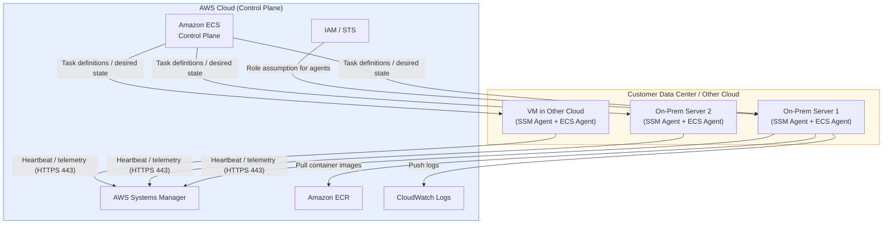
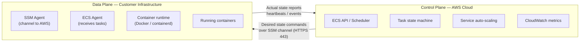
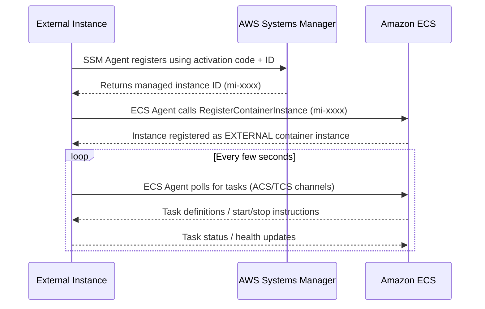
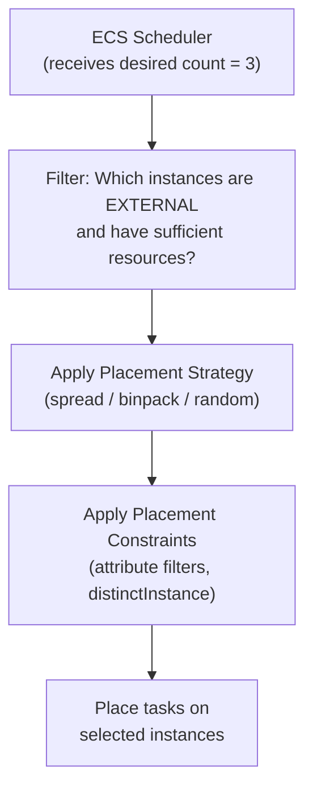

# ECS Anywhere Fundamentals & Architecture - SAA-C03 Deep Dive

> ECS Anywhere extends the Amazon ECS control plane to **customer-managed infrastructure** — on-premises servers, VMs, or instances in other clouds — using the **EXTERNAL launch type**, with AWS SSM Agent and ECS Agent providing the bridge between your hardware and AWS.

See also: [01 - ECS Fundamentals & Architecture](01%20-%20ECS%20Fundamentals%20%26%20Architecture.md) · [02 - ECS Anywhere Setup, Networking & Use Cases](02%20-%20ECS%20Anywhere%20Setup%2C%20Networking%20%26%20Use%20Cases.md) · [03 - ECS Anywhere Exam Scenarios & Q&A](03%20-%20ECS%20Anywhere%20Exam%20Scenarios%20%26%20Q%26A.md) · [01 - EKS Anywhere Fundamentals & Architecture](01%20-%20EKS%20Anywhere%20Fundamentals%20%26%20Architecture.md)

---

## Table of Contents

- [Part 1: What Is ECS Anywhere?](#part-1-what-is-ecs-anywhere)
- [Part 2: The EXTERNAL Launch Type](#part-2-the-external-launch-type)
- [Part 3: Architecture — Control Plane vs Data Plane](#part-3-architecture--control-plane-vs-data-plane)
- [Part 4: Agent Stack — SSM Agent + ECS Agent](#part-4-agent-stack--ssm-agent--ecs-agent)
- [Part 5: Instance Registration Flow](#part-5-instance-registration-flow)
- [Part 6: AWS Manages vs Customer Manages](#part-6-aws-manages-vs-customer-manages)
- [Part 7: EXTERNAL Task Placement](#part-7-external-task-placement)
- [Part 8: Key Concepts Summary](#part-8-key-concepts-summary)

---



---

ECS Anywhere is a natural extension of ECS that removes the constraint of running containers exclusively on AWS-managed compute. It is particularly important for the SAA-C03 exam's hybrid architecture and edge computing scenarios.

---

## Part 1: What Is ECS Anywhere?

### Definition

**Amazon ECS Anywhere** is a feature of Amazon ECS that allows you to run and manage ECS tasks on **infrastructure you own and manage**, outside of AWS. This includes:

- Physical on-premises servers
- Virtual machines in your data centre
- Instances running in other cloud providers (GCP, Azure, etc.)
- Edge devices (industrial, retail, etc.)

The key insight: **the ECS control plane stays entirely in AWS**. AWS does not own, provision, or pay for the underlying compute — you do.

### Why It Exists

Before ECS Anywhere, ECS required EC2, Fargate, or AWS Outposts. Customers with:

- Data residency requirements (data cannot leave their building)
- Existing hardware investments
- Low-latency requirements (processing at the edge)
- Regulatory / compliance constraints

...had no ECS-native option. ECS Anywhere fills that gap.

### Relationship to Standard ECS

| Dimension | Standard ECS | ECS Anywhere |
| :--- | :--- | :--- |
| **Launch type** | EC2 or FARGATE | EXTERNAL |
| **Compute owner** | AWS | Customer |
| **Control plane** | AWS | AWS |
| **Data plane** | AWS-managed | Customer-managed |
| **Hardware provisioning** | AWS | Customer |
| **OS patching** | AWS (Fargate) / Customer (EC2) | Customer |

[⬆ Back to top](#table-of-contents)

---

## Part 2: The EXTERNAL Launch Type

### Overview

ECS supports three launch types. The EXTERNAL launch type is exclusive to ECS Anywhere.

| Launch Type | Where Tasks Run | Who Manages Compute |
| :--- | :--- | :--- |
| **FARGATE** | AWS-managed serverless infrastructure | AWS |
| **EC2** | EC2 instances in your VPC | Customer (within AWS) |
| **EXTERNAL** | Any registered external instance | Customer (outside AWS) |

### Specifying the Launch Type

When registering a service or running a standalone task, you specify `--launch-type EXTERNAL`:

```bash
# Run a standalone task on external infrastructure
aws ecs run-task \
    --cluster my-hybrid-cluster \
    --task-definition my-app:3 \
    --launch-type EXTERNAL

# Create a service on external infrastructure
aws ecs create-service \
    --cluster my-hybrid-cluster \
    --service-name my-onprem-service \
    --task-definition my-app:3 \
    --launch-type EXTERNAL \
    --desired-count 5
```

### Constraints of the EXTERNAL Launch Type

The EXTERNAL launch type does **not** support several features available to EC2 or Fargate:

- No Application Load Balancer or Network Load Balancer integration
- No Fargate-managed networking (awsvpc with ENIs is not supported for EXTERNAL)
- No automatic EBS or EFS volume attachment via ECS volume management
- No capacity providers backed by EC2 Auto Scaling groups

These constraints are **exam-critical** — expect scenario questions where a distractor incorrectly applies these features to ECS Anywhere.

[⬆ Back to top](#table-of-contents)

---

## Part 3: Architecture — Control Plane vs Data Plane

### Two-Plane Model

ECS Anywhere follows the same two-plane model used by managed Kubernetes services. Understanding the split is fundamental.



### What the Control Plane Does

- Stores task definitions
- Schedules tasks and services
- Tracks desired vs actual state
- Triggers CloudWatch alarms and auto-scaling actions
- Issues SSM commands to register, start, stop tasks
- Provides the ECS console and API experience

### What the Data Plane Does

- Executes container workloads on actual hardware
- Polls ECS control plane via the ECS Agent
- Communicates with AWS via SSM Agent channel
- Pulls container images (from ECR or any registry)
- Sends logs to CloudWatch Logs (via CloudWatch Agent or awslogs driver)
- Reports instance and task health

### Network Traffic Direction

A critical architecture detail: **all outbound connections are initiated by the external instance toward AWS**. There is no inbound connection from AWS into your data centre. This means:

- You need **outbound HTTPS (port 443)** from your instances to AWS service endpoints
- No need to open inbound firewall rules from AWS
- Compatible with NAT gateways and corporate proxies

[⬆ Back to top](#table-of-contents)

---

## Part 4: Agent Stack — SSM Agent + ECS Agent

### Why Two Agents?

ECS Anywhere requires two software agents on each external instance. They serve distinct purposes.

| Agent | Purpose | Manages |
| :--- | :--- | :--- |
| **AWS Systems Manager Agent (SSM Agent)** | Secure, managed channel to AWS | Authentication, session management, run commands |
| **Amazon ECS Agent** | Container orchestration instructions | Task lifecycle, health reporting, resource tracking |

### SSM Agent Role

The SSM Agent is the foundational layer. It:

1. Authenticates the instance to AWS using the SSM activation (managed instance registration)
2. Maintains a persistent, outbound-only HTTPS channel to AWS Systems Manager
3. Allows ECS control plane to send commands securely without VPN or Direct Connect
4. Provides the `mi-xxxxxxxxxx` managed instance ID used in ECS registration

### ECS Agent Role

The ECS Agent is installed on top of the SSM foundation. It:

1. Registers the instance as a **container instance** in an ECS cluster using `RegisterContainerInstance`
2. Polls the ECS control plane for tasks to start or stop
3. Manages container lifecycle on the local container runtime
4. Reports resource utilisation (CPU, memory) back to ECS

### Agent Communication Flow



[⬆ Back to top](#table-of-contents)

---

## Part 5: Instance Registration Flow

### Step-by-Step Registration

Registering an external instance involves three phases: SSM activation, agent installation, and ECS registration.

#### Phase 1: Create SSM Activation

From the AWS side, you generate an activation code and activation ID. These are short-lived credentials that allow your instance to register as a managed instance.

```bash
# Create SSM activation (run in AWS CLI with appropriate IAM permissions)
aws ssm create-activation \
    --iam-role AmazonEC2RoleforSSM \
    --registration-limit 10 \
    --region us-east-1

# Response
{
    "ActivationId": "e488341d-xxxx-xxxx-xxxx-xxxxxxxxxxxx",
    "ActivationCode": "abc123EXAMPLECODE"
}
```

#### Phase 2: Run Installation Script on External Instance

AWS provides an official installation script (`ecs-anywhere-install.sh`) that handles all agent installation steps in one command:

```bash
# On the external instance (Linux, run as root)
curl -sSL https://amazon-ecs-agent.s3.amazonaws.com/ecs-anywhere-install.sh \
    | sudo bash -s -- \
        --region us-east-1 \
        --cluster my-hybrid-cluster \
        --activation-id e488341d-xxxx-xxxx-xxxx-xxxxxxxxxxxx \
        --activation-code abc123EXAMPLECODE
```

This script:

1. Installs Docker (if not present)
2. Installs and registers the SSM Agent using the activation credentials
3. Installs and starts the ECS Agent with the cluster configuration
4. Calls `RegisterContainerInstance` to add the instance to the ECS cluster

#### Phase 3: Verify Registration

```bash
# Verify the instance appears in the ECS cluster
aws ecs list-container-instances \
    --cluster my-hybrid-cluster \
    --filter "attribute:ecs.os-type==linux"

# Describe to confirm EXTERNAL status
aws ecs describe-container-instances \
    --cluster my-hybrid-cluster \
    --container-instances <instance-arn>
```

A successfully registered external instance will show `agentConnected: true` and `status: ACTIVE`.

### Supported Operating Systems

ECS Anywhere supports the following Linux distributions:

| Distribution | Versions |
| :--- | :--- |
| Amazon Linux 2 | Current |
| Ubuntu | 18.04, 20.04, 22.04 |
| Red Hat Enterprise Linux | 7, 8 |
| CentOS | 7, 8 |
| SUSE Linux Enterprise Server | 15 |
| Debian | 10, 11 |

> **Note:** Windows Server is NOT supported for ECS Anywhere. This is an exam trap.

[⬆ Back to top](#table-of-contents)

---

## Part 6: AWS Manages vs Customer Manages

Understanding the division of responsibilities is central to the SAA-C03 Shared Responsibility Model questions about ECS Anywhere.

### Responsibility Matrix

| Area | AWS Manages | Customer Manages |
| :--- | :--- | :--- |
| **ECS Control Plane** | Availability, patching, scaling | Nothing — fully managed |
| **SSM Service** | Availability, TLS, endpoints | Nothing — fully managed |
| **Hardware** | Nothing | All physical/virtual infrastructure |
| **Operating System** | Nothing | Installation, patching, hardening |
| **Container Runtime** | Nothing | Docker/containerd installation and updates |
| **SSM Agent** | Agent software updates (optional auto) | Installation initiation |
| **ECS Agent** | Agent software updates (optional auto) | Installation initiation |
| **Networking** | Service endpoints (HTTPS 443) | On-prem network, firewall, routing |
| **Physical Security** | Nothing | Data centre physical security |
| **IAM Roles** | IAM service | Creating the required IAM roles |
| **Container Images** | ECR hosting (optional) | Building, scanning, pushing images |

### Exam Phrasing to Watch

When an exam question says "a company wants to use Amazon ECS but the workload **must run on infrastructure they own**", the answer is **ECS Anywhere with the EXTERNAL launch type**. The phrase "infrastructure they own" or "on-premises" combined with "ECS" always points here.

[⬆ Back to top](#table-of-contents)

---

## Part 7: EXTERNAL Task Placement

### How Placement Works

ECS task placement for EXTERNAL instances follows the same placement strategies and constraints as EC2 launch type, but restricted to the pool of registered EXTERNAL container instances.



### Placement Strategies

| Strategy | Behaviour | Use Case |
| :--- | :--- | :--- |
| **spread** | Distribute tasks across instances (or AZ for on-prem zones) | High availability |
| **binpack** | Pack tasks onto fewest instances (by CPU or memory) | Cost / resource efficiency |
| **random** | Place randomly | Simple workloads |

### Placement Constraints

You can use custom attributes on EXTERNAL instances to target specific hardware:

```bash
# Tag an external instance with custom attribute
aws ecs put-attributes \
    --cluster my-hybrid-cluster \
    --attributes "name=rack,value=rack-A,targetId=arn:aws:ecs:..." \
                 "name=datacenter,value=london,targetId=arn:aws:ecs:..."

# Place tasks only on instances in London datacenter
aws ecs create-service \
    --placement-constraints \
        "type=memberOf,expression=attribute:datacenter == london"
```

### Capacity Providers

ECS Anywhere does **not** support capacity providers backed by Auto Scaling groups (those are EC2-only). External instances are registered directly and managed manually or via custom automation.

[⬆ Back to top](#table-of-contents)

---

## Part 8: Key Concepts Summary

| Concept | Value |
| :--- | :--- |
| **Launch type name** | EXTERNAL |
| **Required agents** | SSM Agent + ECS Agent |
| **Control plane location** | AWS Cloud |
| **Data plane location** | Customer-managed |
| **Registration mechanism** | SSM activation code + `ecs-anywhere-install.sh` |
| **Network requirement** | Outbound HTTPS 443 to AWS endpoints |
| **Supported OS** | Linux only (no Windows) |
| **Load balancer support** | None for EXTERNAL instances |
| **Fargate support** | None — EXTERNAL only |
| **EBS / EFS auto-attach** | Not supported |
| **Pricing unit** | Per registered external instance per hour |
| **Primary use cases** | On-prem compliance, data residency, edge, hybrid |

[⬆ Back to top](#table-of-contents)
