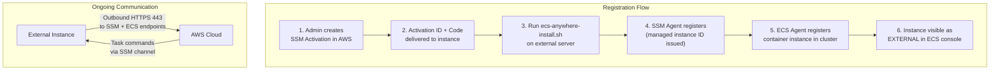
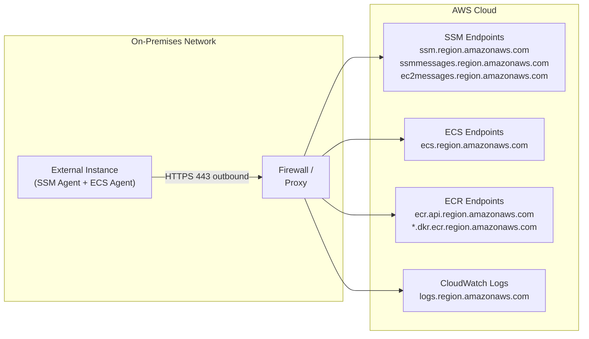
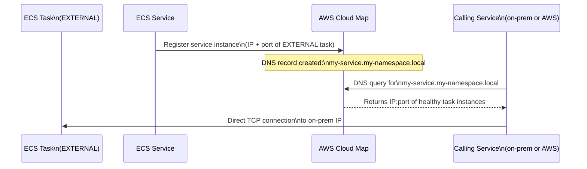
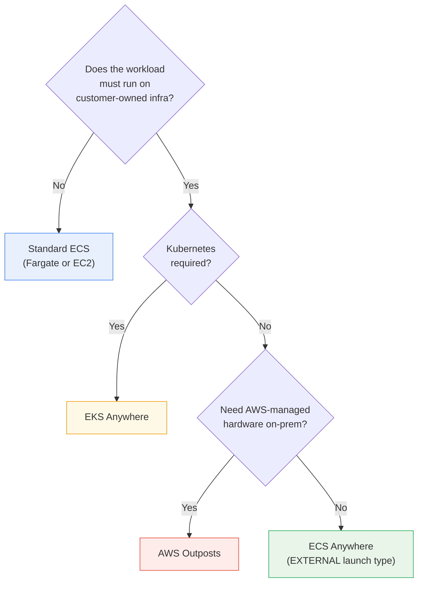

# ECS Anywhere Setup, Networking & Use Cases - SAA-C03 Deep Dive

> A practical deep-dive into how ECS Anywhere instances are registered via SSM activations, how they communicate outbound to AWS, what service discovery replaces load balancers, where pricing applies, and the real-world use cases and limitations you must know for exam scenarios.

See also: [01 - ECS Anywhere Fundamentals & Architecture](01%20-%20ECS%20Anywhere%20Fundamentals%20%26%20Architecture.md) · [03 - ECS Anywhere Exam Scenarios & Q&A](03%20-%20ECS%20Anywhere%20Exam%20Scenarios%20%26%20Q%26A.md) · [01 - ECS Fundamentals & Architecture](01%20-%20ECS%20Fundamentals%20%26%20Architecture.md) · [01 - EKS Anywhere Fundamentals & Architecture](01%20-%20EKS%20Anywhere%20Fundamentals%20%26%20Architecture.md)

---

## Table of Contents

- [Part 1: SSM Activation Codes — Deep Dive](#part-1-ssm-activation-codes--deep-dive)
- [Part 2: Registering External Instances — Full Walkthrough](#part-2-registering-external-instances--full-walkthrough)
- [Part 3: IAM Requirements](#part-3-iam-requirements)
- [Part 4: Networking Architecture](#part-4-networking-architecture)
- [Part 5: Service Discovery via Cloud Map](#part-5-service-discovery-via-cloud-map)
- [Part 6: Pricing](#part-6-pricing)
- [Part 7: Primary Use Cases](#part-7-primary-use-cases)
- [Part 8: Limitations vs Standard ECS](#part-8-limitations-vs-standard-ecs)
- [Part 9: ECS Anywhere vs AWS Outposts](#part-9-ecs-anywhere-vs-aws-outposts)

---



---

## Part 1: SSM Activation Codes — Deep Dive

### What Is an SSM Activation?

An SSM activation is a short-lived credential pair (Activation ID + Activation Code) that authorises a non-EC2 machine to register as an **SSM Managed Instance**. Without this, AWS has no way to trust that the machine is owned by your account.

Think of it as a one-time-use password system: you generate the activation in AWS, hand it to the on-prem machine, and it uses that credential exactly once to bootstrap its identity with AWS. After registration, long-term authentication uses IAM role credentials automatically.

### Creating an Activation

```bash
# Prerequisite: create the IAM role (see Part 3)
# Then create the activation
aws ssm create-activation \
    --iam-role ECSAnywhereInstanceRole \
    --registration-limit 25 \
    --description "ECS Anywhere nodes — London DC rack A" \
    --expiration-date "2025-12-31T23:59:59Z" \
    --region us-east-1

# Output
{
    "ActivationId":   "a1b2c3d4-0000-1111-2222-333333333333",
    "ActivationCode": "ABCDEFexampleCODE1234"
}
```

### Activation Parameters

| Parameter | Description | Default |
| :--- | :--- | :--- |
| `--iam-role` | IAM role assumed by registered instances | Required |
| `--registration-limit` | Max instances that can register with this activation | 1 |
| `--expiration-date` | When the activation code expires (ISO 8601) | 24 hours |
| `--description` | Human-readable label | Optional |

### Security Best Practices for Activations

- Set a short `--expiration-date` (hours, not days) to limit the window of exposure
- Set `--registration-limit` to the exact number of instances you are registering
- Store the activation code in AWS Secrets Manager or SSM Parameter Store, not in plaintext scripts
- Rotate: once all instances are registered, delete the activation code from storage

```bash
# Clean up after all instances registered
aws ssm delete-activation --activation-id a1b2c3d4-0000-1111-2222-333333333333
```

[⬆ Back to top](#table-of-contents)

---

## Part 2: Registering External Instances — Full Walkthrough

### Prerequisites Checklist

Before running the install script, verify:

| Requirement | Details |
| :--- | :--- |
| **OS** | Linux (see supported distros in file 01) |
| **Architecture** | x86_64 or ARM64 |
| **Docker** | 17.06+ (script installs if absent) |
| **Outbound internet** | HTTPS 443 to AWS endpoints |
| **IAM role** | `ECSAnywhereInstanceRole` with correct managed policies |
| **SSM activation** | Valid activation ID + code from step 1 |
| **System resources** | 512 MB RAM minimum; 1 vCPU recommended |

### The Install Script

```bash
#!/bin/bash
# Download and run the ECS Anywhere installation script
# Run as root on the external instance

REGION="us-east-1"
CLUSTER="my-hybrid-cluster"
ACTIVATION_ID="a1b2c3d4-0000-1111-2222-333333333333"
ACTIVATION_CODE="ABCDEFexampleCODE1234"

curl -sSL \
    https://amazon-ecs-agent.s3.amazonaws.com/ecs-anywhere-install.sh \
    | sudo bash -s -- \
        --region          "$REGION" \
        --cluster         "$CLUSTER" \
        --activation-id   "$ACTIVATION_ID" \
        --activation-code "$ACTIVATION_CODE"
```

### What the Script Does Internally

1. Detects OS and package manager
2. Installs Docker (or verifies existing installation)
3. Downloads and installs the SSM Agent package for the detected OS
4. Calls `ssm-register` using the activation ID and code, obtaining `mi-xxxxxxxxxx`
5. Downloads and installs the ECS Agent
6. Creates `/etc/ecs/ecs.config` with cluster name and region
7. Starts `ecs-agent` and `amazon-ssm-agent` as system services
8. ECS Agent then calls `RegisterContainerInstance` API

### Verifying Registration

```bash
# From AWS CLI — confirm instance is registered and connected
aws ecs list-container-instances \
    --cluster my-hybrid-cluster \
    --status ACTIVE \
    --query "containerInstanceArns"

# Get details of a specific instance
aws ecs describe-container-instances \
    --cluster my-hybrid-cluster \
    --container-instances arn:aws:ecs:us-east-1:123456789012:container-instance/xxx

# Key fields to check in the response:
# "agentConnected": true
# "status": "ACTIVE"
# "attributes": [{"name": "ecs.os-type", "value": "linux"}]
# The ARN will contain "container-instance" prefix, not an EC2 instance ID
```

[⬆ Back to top](#table-of-contents)

---

## Part 3: IAM Requirements

### Required IAM Roles

ECS Anywhere requires two IAM constructs:

| IAM Object | Name | Purpose |
| :--- | :--- | :--- |
| **Instance Role** | `ECSAnywhereInstanceRole` | Assumed by SSM Agent on each external instance |
| **Task Execution Role** | `ecsTaskExecutionRole` | Used by ECS Agent to pull images, write logs |

### ECSAnywhereInstanceRole

This role is attached to the SSM activation and is assumed by each registered instance:

```json
{
  "Version": "2012-10-17",
  "Statement": [{
    "Effect": "Allow",
    "Principal": {"Service": "ssm.amazonaws.com"},
    "Action": "sts:AssumeRole"
  }]
}
```

Required managed policies to attach:

| Policy | Why |
| :--- | :--- |
| `AmazonSSMManagedInstanceCore` | SSM channel, session manager, patch manager |
| `AmazonEC2ContainerServiceforEC2Role` | ECS Agent permissions (register, poll, report) |

### ecsTaskExecutionRole

This is the same task execution role used in standard ECS. Required policies:

| Policy | Why |
| :--- | :--- |
| `AmazonECSTaskExecutionRolePolicy` | Pull images from ECR, write to CloudWatch Logs |

### Creating the Instance Role via CLI

```bash
# 1. Create the role with SSM trust policy
aws iam create-role \
    --role-name ECSAnywhereInstanceRole \
    --assume-role-policy-document '{
        "Version":"2012-10-17",
        "Statement":[{
            "Effect":"Allow",
            "Principal":{"Service":"ssm.amazonaws.com"},
            "Action":"sts:AssumeRole"
        }]
    }'

# 2. Attach required managed policies
aws iam attach-role-policy \
    --role-name ECSAnywhereInstanceRole \
    --policy-arn arn:aws:iam::aws:policy/AmazonSSMManagedInstanceCore

aws iam attach-role-policy \
    --role-name ECSAnywhereInstanceRole \
    --policy-arn arn:aws:iam::aws:policy/AmazonEC2ContainerServiceforEC2Role
```

[⬆ Back to top](#table-of-contents)

---

## Part 4: Networking Architecture

### The Outbound-Only Model

The most important networking concept for ECS Anywhere is that **all traffic is initiated outbound from your instances to AWS**. There is no inbound connection from AWS into your network.



### Required Outbound Endpoints

Your firewall must allow HTTPS (port 443) outbound to these endpoints:

| Endpoint | Service | Purpose |
| :--- | :--- | :--- |
| `ssm.{region}.amazonaws.com` | Systems Manager | SSM API |
| `ssmmessages.{region}.amazonaws.com` | Systems Manager | SSM messaging channel |
| `ec2messages.{region}.amazonaws.com` | Systems Manager | Legacy SSM channel |
| `ecs.{region}.amazonaws.com` | ECS | Task lifecycle API |
| `ecr.api.{region}.amazonaws.com` | ECR | Image manifest lookups |
| `*.dkr.ecr.{region}.amazonaws.com` | ECR | Image layer pulls |
| `logs.{region}.amazonaws.com` | CloudWatch Logs | Log streaming |
| `s3.{region}.amazonaws.com` | S3 | ECS Agent updates |

### No VPN or Direct Connect Required

ECS Anywhere does **not** require VPN or AWS Direct Connect. The SSM channel over HTTPS is sufficient. This is a significant cost advantage and a common exam distinction:

| Requirement | ECS Anywhere | Traditional Hybrid (e.g. RDS on-prem) |
| :--- | :--- | :--- |
| VPN / Direct Connect | Not required | Often required |
| Inbound firewall rules | Not required | May be required |
| Public internet | Required (or PrivateLink) | Varies |

### VPC Networking Note

External instances are **not inside a VPC**. They cannot be placed in subnets, security groups, or use VPC-based networking features like interface endpoints from within the instance. If you need private connectivity to AWS services (e.g., no public internet), you must use AWS PrivateLink endpoints reachable from your on-prem network via Direct Connect or VPN.

### No Load Balancer Integration

**This is the #1 networking exam trap for ECS Anywhere.**

EXTERNAL instances **cannot** be registered as targets in an ALB or NLB target group. AWS has no network path to reach them directly. This means:

- No ALB/NLB-based service discovery
- No HTTPS termination at AWS load balancers
- Traffic routing must be handled on-prem (e.g., HAProxy, nginx, your own load balancer)
- Cloud-side service discovery uses **AWS Cloud Map** instead (see Part 5)

[⬆ Back to top](#table-of-contents)

---

## Part 5: Service Discovery via Cloud Map

### Why Cloud Map Instead of ALB

Because AWS cannot route inbound traffic to your on-premises instances, AWS Cloud Map provides **DNS-based service discovery** as the recommended alternative for ECS Anywhere services.

### How It Works



### Configuring Cloud Map with ECS Service

```bash
aws ecs create-service \
    --cluster my-hybrid-cluster \
    --service-name my-onprem-api \
    --task-definition my-app:3 \
    --launch-type EXTERNAL \
    --desired-count 3 \
    --service-registries '[{
        "registryArn": "arn:aws:servicediscovery:us-east-1:123456789012:service/srv-xxx",
        "port": 8080
    }]'
```

### Limitations of Cloud Map for ECS Anywhere

- Cloud Map does health checks via HTTP/TCP — this requires your instances to be reachable from the Cloud Map health checker (which may not be possible if they are fully private)
- DNS TTLs mean brief windows of stale records after a task stops
- Not a replacement for a full load balancer in terms of SSL offload, WAF, or sticky sessions

[⬆ Back to top](#table-of-contents)

---

## Part 6: Pricing

### ECS Anywhere Pricing Model

ECS Anywhere charges for the **registered external container instances**, regardless of whether tasks are running on them.

| Component | Pricing |
| :--- | :--- |
| **Per registered external instance** | $0.01025 per instance-hour |
| **ECS control plane** | No additional charge (same as standard ECS) |
| **SSM Agent** | No charge for managed instance registration |
| **Data transfer to AWS** | Standard AWS data transfer rates apply |
| **CloudWatch Logs** | Standard CloudWatch Logs pricing |

### Monthly Cost Example

| Scenario | Instances | Hours/Month | Monthly Cost |
| :--- | :--- | :--- | :--- |
| Small deployment | 5 | 730 | 5 × 730 × $0.01025 = **$37.41** |
| Medium deployment | 20 | 730 | 20 × 730 × $0.01025 = **$149.65** |
| Large deployment | 100 | 730 | 100 × 730 × $0.01025 = **$748.25** |

### Billing vs EC2 / Fargate

- Unlike EC2, you are not paying AWS for the compute itself — you own the hardware
- The ECS Anywhere fee is purely for the **management/orchestration layer**
- This means total cost depends on your existing hardware OpEx vs. buying EC2

### Exam Note on Pricing

The SAA-C03 rarely asks for exact dollar figures. The key concepts to know:

- ECS Anywhere is billed per **registered instance per hour** (not per task)
- There is no "free tier" for ECS Anywhere registered instances
- Deregistering (stopping) the instance from ECS stops the billing

[⬆ Back to top](#table-of-contents)

---

## Part 7: Primary Use Cases

### Use Case 1: Regulatory and Data Residency

**Scenario:** A financial services firm must process transaction data on servers that physically remain within their country's borders. Cloud processing of raw data is prohibited by regulation.

**Why ECS Anywhere:** The containers run on-premises (data never leaves). ECS orchestration happens through the control plane but no data transits to AWS. CloudWatch Logs can be selectively excluded if log data must also stay local.

### Use Case 2: Low-Latency Edge Processing

**Scenario:** A retail chain needs sub-10ms processing for point-of-sale systems. Internet round-trip to AWS would add unacceptable latency.

**Why ECS Anywhere:** Containerised POS applications run on store servers. ECS provides centralised deployment and monitoring without requiring each store server to be in AWS.

### Use Case 3: Existing Hardware Investment

**Scenario:** A manufacturer has just refreshed their data centre hardware with a 5-year lease. Moving to EC2 would duplicate costs.

**Why ECS Anywhere:** Leverage existing servers with ECS workloads. Gradually migrate to EC2 or Fargate as hardware leases expire.

### Use Case 4: Hybrid Cloud Architecture

**Scenario:** A company runs the database on-prem (too large / stateful to migrate) but wants to modernise the application tier with containers.

**Why ECS Anywhere:** Application containers on-prem (close to the DB), using ECS for orchestration. Consistent tooling with cloud-based ECS tasks running the same task definitions.

### Use Case 5: Disconnected / Occasionally Connected Sites

**Scenario:** A shipping company needs containers running on vessels that may have intermittent satellite internet.

**Why ECS Anywhere:** When connected, the ECS Agent syncs state. When disconnected, already-started containers continue running. The agent reconciles when connectivity resumes.

### Use Case Decision Tree



[⬆ Back to top](#table-of-contents)

---

## Part 8: Limitations vs Standard ECS

This is the most exam-tested section — these limitations frequently appear as wrong answers in ECS Anywhere questions.

| Feature | ECS on EC2 | ECS on Fargate | ECS Anywhere (EXTERNAL) |
| :--- | :--- | :--- | :--- |
| **Launch type** | EC2 | FARGATE | EXTERNAL |
| **ALB / NLB target** | Yes | Yes | **No** |
| **awsvpc networking** | Yes | Yes | **No** |
| **EBS volume auto-attach** | Yes (ECS volume mgmt) | Limited | **No** |
| **EFS volume mount** | Yes | Yes | **Manual only** |
| **Capacity providers** | Yes (ASG-backed) | Yes | **No** |
| **Fargate tasks** | No | Yes | **No** |
| **Windows containers** | Yes | Yes | **No** |
| **GPU task support** | Yes (p3/g4 instances) | No | **Customer provides GPU** |
| **Auto-scaling (AWS)** | Yes | Yes | **No (manual/custom)** |
| **Spot instances** | Yes | Yes | **N/A (customer HW)** |
| **AWS Graviton** | Yes | Yes | **Depends on HW** |
| **VPC placement** | Yes | Yes | **No** |
| **Security groups** | Yes | Yes | **No** |

### Summary of Key Limitations

1. **No load balancer integration** — use Cloud Map or your own LB
2. **No Fargate** — EXTERNAL is the only launch type for on-prem
3. **No Windows** — Linux only
4. **No awsvpc** — bridge or host networking only on external instances
5. **No managed volume attachment** — EFS/EBS must be manually mounted at OS level
6. **No capacity providers** — cannot auto-scale external instance count via ECS

[⬆ Back to top](#table-of-contents)

---

## Part 9: ECS Anywhere vs AWS Outposts

A common exam distractor is confusing ECS Anywhere with AWS Outposts. Both run AWS services on-premises, but they are fundamentally different.

| Dimension | ECS Anywhere | AWS Outposts |
| :--- | :--- | :--- |
| **Hardware owner** | Customer | AWS |
| **Hardware provisioning** | Customer | AWS ships and installs the rack |
| **AWS services available** | ECS orchestration only | EC2, EBS, RDS, EKS, and more |
| **Network integration** | Outbound HTTPS only | Full VPC extension into Outpost |
| **ALB support** | No | Yes (via Outpost-local ALB) |
| **Cost model** | Per external instance/hour | Outpost rack fee (high) |
| **Setup time** | Minutes (install script) | Weeks (AWS delivery and install) |
| **Use case** | Leverage existing hardware | Need full AWS stack on-prem |
| **Physical security** | Customer's responsibility | Customer's facility, AWS's rack |

### When to Choose Which

- **ECS Anywhere** — You have servers you own, you want ECS orchestration, you can tolerate no ALB or VPC features
- **AWS Outposts** — You need the full AWS cloud experience (VPC, EC2, RDS) physically on-prem, willing to pay premium for AWS-managed hardware

[⬆ Back to top](#table-of-contents)
