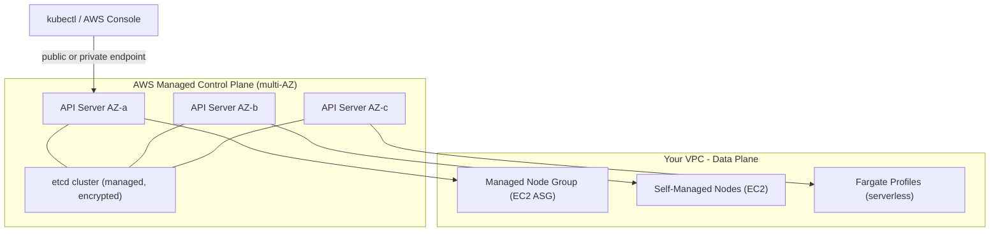

# EKS Fundamentals & Architecture - SAA-C03 Deep Dive

> Amazon EKS is a fully managed Kubernetes control plane service — AWS manages the masters and etcd so you focus on workloads, not cluster plumbing.

See also: [02 - EKS Node Types - Managed, Self-Managed, Fargate](02%20-%20EKS%20Node%20Types%20-%20Managed%2C%20Self-Managed%2C%20Fargate.md) · [03 - EKS Networking - VPC CNI, Load Balancing & Ingress](03%20-%20EKS%20Networking%20-%20VPC%20CNI%2C%20Load%20Balancing%20%26%20Ingress.md) · [04 - EKS IAM, IRSA, Pod Identity & Security](04%20-%20EKS%20IAM%2C%20IRSA%2C%20Pod%20Identity%20%26%20Security.md) · [05 - EKS Storage - EBS, EFS, FSx CSI Drivers](05%20-%20EKS%20Storage%20-%20EBS%2C%20EFS%2C%20FSx%20CSI%20Drivers.md) · [06 - EKS Scaling & Observability](06%20-%20EKS%20Scaling%20%26%20Observability.md) · [07 - EKS Exam Scenarios & Q&A](07%20-%20EKS%20Exam%20Scenarios%20%26%20Q%26A.md)

---

## Table of Contents

- [What Is Amazon EKS?](#what-is-amazon-eks)
- [Managed Control Plane Architecture](#managed-control-plane-architecture)
- [Kubernetes Basics for the Exam](#kubernetes-basics-for-the-exam)
- [Data Plane Options Overview](#data-plane-options-overview)
- [Control Plane Endpoint Access Modes](#control-plane-endpoint-access-modes)
- [EKS vs ECS](#eks-vs-ecs)
- [EKS vs Self-Managed Kubernetes](#eks-vs-self-managed-kubernetes)
- [Key EKS Concepts Cheat Sheet](#key-eks-concepts-cheat-sheet)

---



---

## What Is Amazon EKS?

**Amazon Elastic Kubernetes Service (EKS)** is a managed Kubernetes service that runs the upstream, open-source Kubernetes control plane on AWS. AWS takes responsibility for the availability and scalability of the control plane components so you do not need to install, operate, or maintain Kubernetes masters.

### Core Value Propositions

| Aspect | Details |
| :--- | :--- |
| **Kubernetes compatibility** | 100% upstream Kubernetes — same APIs, same `kubectl`, same manifests as anywhere |
| **Managed control plane** | AWS runs masters, etcd, API servers across 3 AZs |
| **Deep AWS integration** | Native IAM, VPC networking, ALB/NLB, EBS/EFS, CloudWatch, ECR |
| **Multiple data plane options** | Managed nodes, self-managed nodes, Fargate |
| **Certifications** | CNCF-certified conformant Kubernetes |

### What AWS Manages vs What You Manage

| Component | Managed By |
| :--- | :--- |
| API servers | AWS |
| etcd (cluster state store) | AWS |
| Kubernetes version upgrades (control plane) | AWS (you initiate) |
| Worker node OS patching | You (or AWS for Managed Node Groups) |
| Worker node capacity | You (or Karpenter/Cluster Autoscaler) |
| Application manifests, workloads | You |
| Add-ons (CoreDNS, kube-proxy, VPC CNI) | You (can use EKS-managed add-ons) |

[⬆ Back to top](#table-of-contents)

---

## Managed Control Plane Architecture

### Multi-AZ High Availability

EKS deploys control plane infrastructure across **three Availability Zones** within a region. Each AZ runs:

- One or more API server instances
- A portion of the etcd distributed key-value cluster

AWS automatically replaces unhealthy control plane instances and patches them during maintenance windows. An SLA of **99.95% uptime** is provided for the control plane endpoint.

### What Runs in the Control Plane

| Component | Role |
| :--- | :--- |
| **kube-apiserver** | Single entry point for all cluster management; processes REST requests |
| **etcd** | Distributed key-value store holding all cluster state and configuration |
| **kube-scheduler** | Assigns pods to nodes based on resource availability and constraints |
| **kube-controller-manager** | Runs reconciliation loops (node controller, replication controller, etc.) |
| **cloud-controller-manager** | AWS-specific controller — creates ELBs for Services, EBS for PVs |

> **Exam Note:** You never SSH into EKS control plane nodes. There are no master instances visible in your EC2 console. The control plane lives entirely in AWS-managed infrastructure.

### Control Plane Costs

EKS charges **$0.10/hour per cluster** for the managed control plane, regardless of the number of nodes. Worker node EC2 instances are billed separately at standard EC2 rates.

[⬆ Back to top](#table-of-contents)

---

## Kubernetes Basics for the Exam

You do not need deep Kubernetes expertise for SAA-C03, but you must understand the core objects and how they map to AWS constructs.

### Core Objects

| Object | Description | AWS Analogy |
| :--- | :--- | :--- |
| **Pod** | Smallest deployable unit; one or more containers sharing network/storage | Single task in ECS |
| **Deployment** | Declarative management of a set of replica Pods (rolling updates, rollbacks) | ECS Service |
| **Service** | Stable network endpoint (virtual IP) for a set of Pods | Target Group + Load Balancer |
| **Namespace** | Virtual cluster within a cluster; logical isolation | — |
| **ConfigMap** | Non-secret configuration data injected into Pods | SSM Parameter (plain) |
| **Secret** | Sensitive data (passwords, tokens); base64 encoded (not encrypted by default) | Secrets Manager / SSM SecureString |
| **PersistentVolumeClaim (PVC)** | Request for storage; fulfilled by a PersistentVolume (PV) | EBS/EFS volume |
| **Ingress** | L7 HTTP/HTTPS routing rules for external access | ALB listener rules |
| **ServiceAccount** | Kubernetes identity for Pods to call APIs (k8s or AWS) | IAM role via IRSA |

### Pod Lifecycle

```
Pending → Running → Succeeded/Failed
              ↕
          CrashLoopBackOff (repeated failures)
```

### Sample Deployment Manifest

```yaml
apiVersion: apps/v1
kind: Deployment
metadata:
  name: my-app
  namespace: production
spec:
  replicas: 3
  selector:
    matchLabels:
      app: my-app
  template:
    metadata:
      labels:
        app: my-app
    spec:
      containers:
        - name: app
          image: 123456789.dkr.ecr.us-east-1.amazonaws.com/my-app:v1.2
          resources:
            requests:
              cpu: "250m"
              memory: "256Mi"
            limits:
              cpu: "500m"
              memory: "512Mi"
```

### Services and Exposure

| Service Type | Reachability | AWS Integration |
| :--- | :--- | :--- |
| **ClusterIP** | Inside cluster only | None (internal VIP) |
| **NodePort** | Via node IP + port (30000–32767) | Rarely used in production |
| **LoadBalancer** | External; AWS creates an ELB | NLB (via AWS LBC) or CLB (legacy) |
| **ExternalName** | CNAME DNS alias | — |

[⬆ Back to top](#table-of-contents)

---

## Data Plane Options Overview

EKS decouples the control plane from the data plane, giving you flexibility in how you run worker capacity.

| Option | Who manages OS | Auto-scaling | Best for |
| :--- | :--- | :--- | :--- |
| **Managed Node Groups** | AWS (partial) | AWS ASG | Most workloads; reduced ops |
| **Self-Managed Nodes** | You | You configure ASG | Custom AMIs, GPU, specific kernels |
| **Fargate** | AWS (fully) | Automatic | Serverless, bursty, no node ops |

> Full details in [02 - EKS Node Types - Managed, Self-Managed, Fargate](02%20-%20EKS%20Node%20Types%20-%20Managed%2C%20Self-Managed%2C%20Fargate.md).

[⬆ Back to top](#table-of-contents)

---

## Control Plane Endpoint Access Modes

The Kubernetes API server endpoint can be configured in three modes. This is a common exam scenario.

### Access Mode Comparison

| Mode | API Server Reachable From | Use Case |
| :--- | :--- | :--- |
| **Public only** (default) | Internet (restricted by CIDR) | Dev/test; simplest setup |
| **Public + Private** | Internet AND from within VPC | Most common production setup |
| **Private only** | VPC/peered networks only | High-security, air-gapped |

### Architecture Diagrams

**Public endpoint:**

```
kubectl (developer laptop) → public DNS → EKS API server
```

**Private endpoint:**

```
kubectl (from bastion/VPN/Direct Connect) → VPC → ENI in your VPC → EKS API server
```

### Configuring Endpoint Access

```bash
# Create cluster with private endpoint only
eksctl create cluster \
  --name my-cluster \
  --region us-east-1 \
  --endpoint-private-access=true \
  --endpoint-public-access=false

# Update existing cluster
aws eks update-cluster-config \
  --name my-cluster \
  --region us-east-1 \
  --resources-vpc-config endpointPublicAccess=false,endpointPrivateAccess=true
```

> **Exam Trap:** If you disable the public endpoint without a VPN, Direct Connect, or bastion in the VPC, you will lose `kubectl` access entirely. The exam may present a scenario where a team loses access after enabling private-only mode.

### Public Endpoint CIDR Restrictions

Even with a public endpoint, you can restrict which IP CIDRs can reach the API server:

```bash
aws eks update-cluster-config \
  --name my-cluster \
  --resources-vpc-config publicAccessCidrs="203.0.113.0/24"
```

[⬆ Back to top](#table-of-contents)

---

## EKS vs ECS

This is one of the highest-frequency decision questions on SAA-C03.

| Dimension | Amazon EKS | Amazon ECS |
| :--- | :--- | :--- |
| **Orchestrator** | Kubernetes (open-source, CNCF) | AWS proprietary |
| **Portability** | High — runs same manifests on any k8s | AWS-only |
| **Learning curve** | Steeper (Kubernetes concepts) | Gentler (AWS-native) |
| **Control plane cost** | $0.10/hr per cluster | Free |
| **Fargate support** | Yes (via Fargate profiles) | Yes (via task definitions) |
| **Ecosystem** | Massive k8s ecosystem (Helm, Argo CD, Istio) | Limited to AWS integrations |
| **Multi-cluster** | Common pattern | Rare |
| **Service mesh** | App Mesh, Istio, Linkerd | App Mesh |
| **Secrets management** | IRSA + k8s Secrets + external-secrets | Task IAM role + Secrets Manager |
| **Best for** | Existing k8s workloads, multi-cloud, microservices at scale | AWS-native greenfield, simpler ops |

### Decision Rule for the Exam

```
Question mentions "Kubernetes" or "migrate existing k8s" → EKS
Question mentions "simplest AWS-native containers" → ECS
Question mentions "serverless containers, no cluster" → ECS Fargate
Question mentions "team already uses Kubernetes" → EKS
```

[⬆ Back to top](#table-of-contents)

---

## EKS vs Self-Managed Kubernetes

| Dimension | Amazon EKS | Self-Managed k8s on EC2 |
| :--- | :--- | :--- |
| **Control plane ops** | AWS managed | You manage (kubeadm, kops, Rancher) |
| **etcd backups** | AWS managed | You manage |
| **Control plane HA** | Built-in (multi-AZ) | You must configure |
| **Kubernetes version upgrades** | AWS-assisted | Fully manual |
| **AWS integrations** | Native (IAM, VPC CNI, ELB) | Manual configuration |
| **Cost** | $0.10/hr control plane fee | No control plane fee, but ops overhead |
| **Compliance** | SOC, PCI, HIPAA eligible | Depends on your configuration |
| **Best for** | Most production workloads | Specific customization needs |

> **Exam Tip:** The exam will never recommend self-managed Kubernetes over EKS unless there is an extreme customization requirement not met by EKS. When in doubt, EKS is the right answer for "run Kubernetes on AWS."

[⬆ Back to top](#table-of-contents)

---

## Key EKS Concepts Cheat Sheet

| Concept | One-Line Summary |
| :--- | :--- |
| **EKS cluster** | A Kubernetes cluster with AWS-managed control plane |
| **Node group** | A set of EC2 instances acting as Kubernetes worker nodes |
| **Fargate profile** | Rules that determine which pods run on Fargate (serverless) |
| **Add-on** | AWS-managed cluster component (CoreDNS, kube-proxy, VPC CNI) |
| **OIDC provider** | Cluster-level identity provider enabling IRSA |
| **aws-auth ConfigMap** | Maps IAM ARNs to Kubernetes RBAC roles |
| **EKS-optimized AMI** | AWS-published AMI preconfigured for EKS worker nodes |
| **kubeconfig** | Local config file mapping cluster name to API endpoint + credentials |
| **eksctl** | Official CLI for creating/managing EKS clusters (YAML-driven) |
| **Helm** | Kubernetes package manager — deploys "charts" (app bundles) |

[⬆ Back to top](#table-of-contents)
