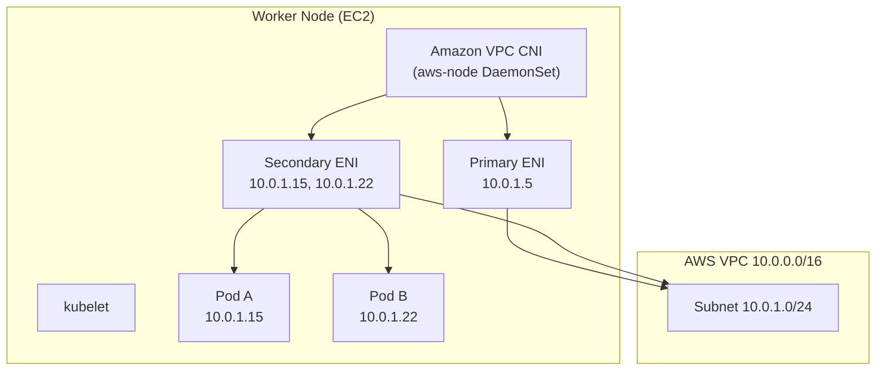
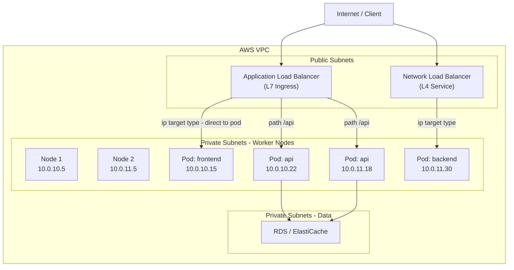

# EKS Networking - VPC CNI, Load Balancing & Ingress - SAA-C03 Deep Dive

> EKS uses the Amazon VPC CNI plugin so every pod gets a real VPC IP address — this enables native AWS security group integration but also means pods consume ENI/IP capacity from your subnets.

See also: [01 - EKS Fundamentals & Architecture](01%20-%20EKS%20Fundamentals%20%26%20Architecture.md) · [02 - EKS Node Types - Managed, Self-Managed, Fargate](02%20-%20EKS%20Node%20Types%20-%20Managed%2C%20Self-Managed%2C%20Fargate.md) · [04 - EKS IAM, IRSA, Pod Identity & Security](04%20-%20EKS%20IAM%2C%20IRSA%2C%20Pod%20Identity%20%26%20Security.md) · [07 - EKS Exam Scenarios & Q&A](07%20-%20EKS%20Exam%20Scenarios%20%26%20Q%26A.md)

---

## Table of Contents

- [Amazon VPC CNI Plugin](#amazon-vpc-cni-plugin)
- [ENI and IP Address Limits](#eni-and-ip-address-limits)
- [IP Exhaustion Considerations](#ip-exhaustion-considerations)
- [CoreDNS](#coredns)
- [kube-proxy](#kube-proxy)
- [Security Groups for Pods](#security-groups-for-pods)
- [AWS Load Balancer Controller](#aws-load-balancer-controller)
- [Service Type LoadBalancer - NLB](#service-type-loadbalancer---nlb)
- [Ingress - ALB](#ingress---alb)
- [Networking Architecture Diagram](#networking-architecture-diagram)

---



---

## Amazon VPC CNI Plugin

### What It Is

The **Amazon VPC Container Network Interface (CNI) plugin** is the default networking plugin for EKS. It assigns **real VPC IP addresses** to pods, meaning:

- Pods are first-class VPC citizens
- Pod IPs are routable across the VPC (no NAT/overlay network)
- Security groups, VPC flow logs, and Network ACLs work normally for pod traffic
- Pod-to-pod communication uses the same routing as EC2-to-EC2

### How It Works

The VPC CNI runs as a DaemonSet called `aws-node` on every worker node. It:

1. Attaches **secondary ENIs** to the EC2 node
2. Assigns **secondary IP addresses** to those ENIs from the subnet
3. Configures local routing so each pod IP routes to the pod's network namespace

```bash
# View the aws-node DaemonSet
kubectl get daemonset aws-node -n kube-system

# Check CNI version (managed add-on)
aws eks describe-addon \
  --cluster-name my-cluster \
  --addon-name vpc-cni \
  --query addon.addonVersion
```

### VPC CNI vs Other CNI Plugins

| CNI Plugin | Pod Networking | AWS Integration |
| :--- | :--- | :--- |
| **Amazon VPC CNI** (default) | Native VPC IPs (no overlay) | Full — SGs, Flow Logs, NACLs |
| Calico | Overlay or VPC-native | Limited |
| Cilium | eBPF-based overlay or VPC-native | Available via add-on |
| Weave | Overlay | None |

> **Exam Rule:** EKS uses VPC CNI by default. Pods get VPC IPs. This is always the correct answer unless the question specifies a custom CNI.

[⬆ Back to top](#table-of-contents)

---

## ENI and IP Address Limits

### The Constraint

Because pod IPs come from VPC subnets through EC2 ENIs, the maximum number of pods per node is bounded by:

```
Max Pods = (Number of ENIs) × (IPs per ENI - 1) + 2
```

The `-1` per ENI reserves one IP for the ENI's primary IP, and `+2` accounts for the node's own IP and a loopback.

### ENI Limits by Instance Type

| Instance Type | Max ENIs | IPs per ENI | Max Pods (approx.) |
| :--- | :--- | :--- | :--- |
| t3.small | 3 | 4 | 11 |
| t3.medium | 3 | 6 | 17 |
| m5.large | 3 | 10 | 29 |
| m5.xlarge | 4 | 15 | 58 |
| m5.4xlarge | 8 | 30 | 234 |
| c5.18xlarge | 15 | 50 | 737 |

### Prefix Delegation (Increased Pod Density)

By default, VPC CNI assigns individual IPs. **Prefix delegation** assigns a /28 prefix (16 IPs) per ENI slot, dramatically increasing pod density:

```
Max Pods with prefix = (Max ENIs) × (Prefixes per ENI) × 16
```

```bash
# Enable prefix delegation
kubectl set env daemonset aws-node -n kube-system ENABLE_PREFIX_DELEGATION=true

# Also update max pods for kubelet
# (done automatically with eksctl or via launch template userdata)
```

> **Exam Note:** If a question asks how to fit more pods on existing nodes without changing instance types, prefix delegation is the answer.

[⬆ Back to top](#table-of-contents)

---

## IP Exhaustion Considerations

Running out of VPC IP addresses is a real operational concern with the VPC CNI model. Each pod consumes a VPC IP.

### Causes of IP Exhaustion

| Cause | Description |
| :--- | :--- |
| Small subnets | /24 = 251 usable IPs; a few large nodes fill it quickly |
| High pod density | Many small pods across many nodes |
| Rapid scale-out | Auto-scaling events consume IPs faster than ENIs detach on scale-in |
| IP warm pool | CNI pre-allocates IPs for fast pod startup (configurable) |

### Solutions

| Solution | How It Helps |
| :--- | :--- |
| **Larger subnets** | Use /19 or /18 for node subnets |
| **Dedicated pod subnets** | Custom networking mode assigns pod IPs from a different CIDR than nodes |
| **Prefix delegation** | 16× more IPs per ENI slot |
| **WARM_IP_TARGET tuning** | Reduce pre-allocated IPs per node |
| **IPv6 clusters** | Near-unlimited addresses |

### Custom Networking (VPC CNI Custom Pod Subnets)

```bash
# Enable custom networking mode
kubectl set env daemonset aws-node -n kube-system AWS_VPC_K8S_CNI_CUSTOM_NETWORK_CFG=true

# Create ENIConfig for each AZ
kubectl apply -f - <<EOF
apiVersion: crd.k8s.amazonaws.com/v1alpha1
kind: ENIConfig
metadata:
  name: us-east-1a
spec:
  subnet: subnet-0abc123def456  # dedicated pod subnet in AZ-a
  securityGroups:
    - sg-0abc123
EOF
```

[⬆ Back to top](#table-of-contents)

---

## CoreDNS

**CoreDNS** is the DNS server for a Kubernetes cluster. It runs as a Deployment (two replicas by default) in the `kube-system` namespace and handles:

- Service discovery: `my-service.my-namespace.svc.cluster.local`
- Pod DNS resolution
- External DNS forwarding

```bash
# Check CoreDNS pods
kubectl get pods -n kube-system -l k8s-app=kube-dns

# CoreDNS runs as EKS managed add-on
aws eks describe-addon --cluster-name my-cluster --addon-name coredns
```

### DNS Resolution Flow in EKS

```
Pod → CoreDNS (ClusterIP 172.20.0.10) → Kubernetes Service DNS
                                       → External DNS (Route 53 Resolver / VPC DNS)
```

> **Exam Tip:** When pods cannot resolve service names inside the cluster, CoreDNS is typically the component to check. On Fargate, CoreDNS pods can be scheduled using a Fargate profile for the `kube-system` namespace.

[⬆ Back to top](#table-of-contents)

---

## kube-proxy

**kube-proxy** runs as a DaemonSet on every node and maintains iptables/IPVS rules that implement Kubernetes Service networking (the ClusterIP virtual IP).

When you create a Service, kube-proxy adds rules so that traffic to the ClusterIP is load-balanced to the backend pods.

```bash
# Check kube-proxy DaemonSet
kubectl get daemonset kube-proxy -n kube-system

# kube-proxy runs as EKS managed add-on
aws eks describe-addon --cluster-name my-cluster --addon-name kube-proxy
```

> **Exam Note:** kube-proxy does NOT handle traffic that goes through an ALB or NLB. Those load balancers send traffic directly to pod IPs (bypassing ClusterIP). kube-proxy is only relevant for in-cluster service-to-service communication.

[⬆ Back to top](#table-of-contents)

---

## Security Groups for Pods

### The Problem VPC CNI SGs Solve

Normally, all pods on a node share the node's security group. This means you cannot apply different network policies per-pod using security groups.

**Security Groups for Pods** (a VPC CNI feature) lets you assign a specific security group to individual pods (or groups of pods via labels).

### How It Works

- Enabled by setting `ENABLE_POD_ENI=true` on the `aws-node` DaemonSet
- Pods with security groups get a dedicated **branch ENI** (not the trunk ENI shared by other pods)
- Each pod with an assigned SG gets its own ENI slot

```yaml
# SecurityGroupPolicy CRD
apiVersion: vpcresources.k8s.aws/v1beta1
kind: SecurityGroupPolicy
metadata:
  name: database-access
  namespace: production
spec:
  podSelector:
    matchLabels:
      app: backend-api     # only backend-api pods get this SG
  securityGroups:
    groupIds:
      - sg-0db123456       # allows access to RDS
```

### Limitations

| Limitation | Details |
| :--- | :--- |
| **Instance types** | Requires Nitro-based instances |
| **Branch ENI limit** | Each node has a maximum branch ENI count (separate from regular ENIs) |
| **Windows** | Not supported |
| **IPv6** | Limited support |

[⬆ Back to top](#table-of-contents)

---

## AWS Load Balancer Controller

The **AWS Load Balancer Controller** (formerly AWS ALB Ingress Controller) is a Kubernetes controller that manages AWS Elastic Load Balancers for EKS workloads.

### What It Creates

| Kubernetes Object | AWS Resource Created |
| :--- | :--- |
| `Service` with `type: LoadBalancer` | **Network Load Balancer (NLB)** |
| `Ingress` | **Application Load Balancer (ALB)** |

### Installation

```bash
# Install via Helm
helm repo add eks https://aws.github.io/eks-charts
helm install aws-load-balancer-controller eks/aws-load-balancer-controller \
  -n kube-system \
  --set clusterName=my-cluster \
  --set serviceAccount.create=false \
  --set serviceAccount.name=aws-load-balancer-controller
```

The controller requires an IAM role with permissions to create/manage ELBs (typically attached via IRSA — see [04 - EKS IAM, IRSA, Pod Identity & Security](04%20-%20EKS%20IAM%2C%20IRSA%2C%20Pod%20Identity%20%26%20Security.md)).

[⬆ Back to top](#table-of-contents)

---

## Service Type LoadBalancer - NLB

When you create a Kubernetes Service with `type: LoadBalancer`, the AWS Load Balancer Controller creates an **NLB** in your VPC.

### NLB Service Manifest

```yaml
apiVersion: v1
kind: Service
metadata:
  name: my-service
  namespace: production
  annotations:
    service.beta.kubernetes.io/aws-load-balancer-type: "external"
    service.beta.kubernetes.io/aws-load-balancer-nlb-target-type: "ip"
    service.beta.kubernetes.io/aws-load-balancer-scheme: "internet-facing"
    service.beta.kubernetes.io/aws-load-balancer-cross-zone-load-balancing-enabled: "true"
spec:
  type: LoadBalancer
  selector:
    app: my-app
  ports:
    - port: 80
      targetPort: 8080
      protocol: TCP
```

### NLB Target Types

| Target Type | Traffic Destination | Notes |
| :--- | :--- | :--- |
| **Instance** (legacy) | Node IP + NodePort | All traffic goes through kube-proxy on the node |
| **IP** (recommended) | Pod IP directly | Bypasses kube-proxy; more efficient; requires VPC CNI |

> **Exam Note:** `ip` target type is preferred with VPC CNI because traffic goes directly to pod IPs, preserving client source IPs and reducing hop count.

[⬆ Back to top](#table-of-contents)

---

## Ingress - ALB

### What an Ingress Is

An **Ingress** is a Kubernetes API object that defines HTTP/HTTPS routing rules. The AWS Load Balancer Controller watches for Ingress objects and creates an **ALB** with matching listener rules.

### ALB Ingress Manifest

```yaml
apiVersion: networking.k8s.io/v1
kind: Ingress
metadata:
  name: my-app-ingress
  namespace: production
  annotations:
    kubernetes.io/ingress.class: alb
    alb.ingress.kubernetes.io/scheme: internet-facing
    alb.ingress.kubernetes.io/target-type: ip
    alb.ingress.kubernetes.io/certificate-arn: arn:aws:acm:us-east-1:123456789:certificate/abc123
    alb.ingress.kubernetes.io/listen-ports: '[{"HTTP": 80}, {"HTTPS": 443}]'
    alb.ingress.kubernetes.io/ssl-redirect: "443"
    alb.ingress.kubernetes.io/waf-acl-id: my-waf-acl
spec:
  rules:
    - host: api.example.com
      http:
        paths:
          - path: /v1
            pathType: Prefix
            backend:
              service:
                name: api-v1
                port:
                  number: 80
          - path: /v2
            pathType: Prefix
            backend:
              service:
                name: api-v2
                port:
                  number: 80
    - host: app.example.com
      http:
        paths:
          - path: /
            pathType: Prefix
            backend:
              service:
                name: frontend
                port:
                  number: 80
```

### ALB Ingress Groups

Multiple Ingress objects can share a single ALB using **IngressGroup** — reduces ALB cost and simplifies management:

```yaml
annotations:
  alb.ingress.kubernetes.io/group.name: production-alb
  alb.ingress.kubernetes.io/group.order: "10"
```

### NLB vs ALB Decision

| Dimension | NLB (Service LoadBalancer) | ALB (Ingress) |
| :--- | :--- | :--- |
| **Layer** | L4 (TCP/UDP) | L7 (HTTP/HTTPS) |
| **Routing** | Port-based | Host/path-based |
| **SSL termination** | At NLB or pass-through | At ALB |
| **WebSockets** | Supported | Supported |
| **gRPC** | Supported | Supported |
| **WAF integration** | No | Yes |
| **Multiple services** | One NLB per Service | One ALB per IngressGroup |
| **Static IP** | Yes (Elastic IP) | No (DNS name) |
| **Use case** | TCP services, games, IoT, low-latency | Web apps, APIs, HTTP microservices |

[⬆ Back to top](#table-of-contents)

---

## Networking Architecture Diagram



[⬆ Back to top](#table-of-contents)
