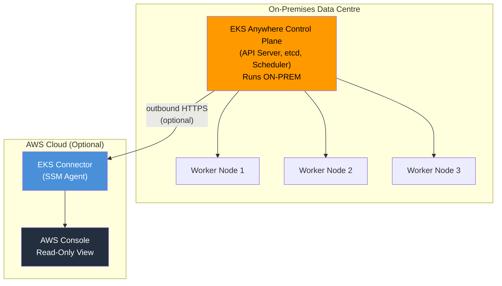
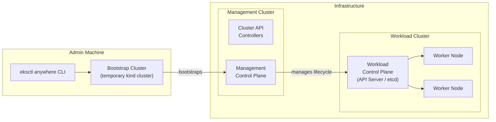
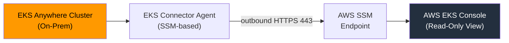

# EKS Anywhere Fundamentals & Architecture - SAA-C03 Deep Dive

> Amazon EKS Anywhere lets you **deploy and operate Kubernetes clusters entirely on your own on-premises infrastructure** using the same EKS Distro that powers cloud EKS — critically, the **control plane runs on-prem too**, unlike cloud EKS or ECS Anywhere.

See also: [02 - EKS Anywhere Deployment, Curated Packages & Support](02%20-%20EKS%20Anywhere%20Deployment%2C%20Curated%20Packages%20%26%20Support.md) · [03 - EKS Anywhere Exam Scenarios & Q&A](03%20-%20EKS%20Anywhere%20Exam%20Scenarios%20%26%20Q%26A.md) · [01 - EKS Fundamentals & Architecture](01%20-%20EKS%20Fundamentals%20%26%20Architecture.md) · [01 - EKS Distro Fundamentals & Architecture](01%20-%20EKS%20Distro%20Fundamentals%20%26%20Architecture.md) · [01 - ECS Anywhere Fundamentals & Architecture](01%20-%20ECS%20Anywhere%20Fundamentals%20%26%20Architecture.md)

---

## Table of Contents

- [Part 1: What Is EKS Anywhere?](#part-1-what-is-eks-anywhere)
- [Part 2: The KEY Architectural Difference — Control Plane On-Prem](#part-2-the-key-architectural-difference--control-plane-on-prem)
- [Part 3: EKS Distro — The Foundation](#part-3-eks-distro--the-foundation)
- [Part 4: Supported Deployment Platforms](#part-4-supported-deployment-platforms)
- [Part 5: Architecture Deep Dive](#part-5-architecture-deep-dive)
- [Part 6: Optional AWS Connectivity — EKS Connector](#part-6-optional-aws-connectivity--eks-connector)
- [Part 7: GitOps Management with Flux](#part-7-gitops-management-with-flux)
- [Part 8: Networking & CNI](#part-8-networking--cni)
- [Part 9: EKS Anywhere vs EKS vs ECS Anywhere — Quick Architecture Contrast](#part-9-eks-anywhere-vs-eks-vs-ecs-anywhere--quick-architecture-contrast)
- [Summary: Key Takeaways for SAA-C03](#summary-key-takeaways-for-saa-c03)

---



---

## Part 1: What Is EKS Anywhere?

EKS Anywhere is an **open-source deployment option for Amazon EKS** that extends the EKS operational model to hardware you own and manage. It was generally available from **September 2021**.

### Core Definition

| Dimension | Detail |
| :--- | :--- |
| **What it is** | A tool + distribution to create and manage Kubernetes clusters on your own infrastructure |
| **Kubernetes distribution** | Built on **EKS Distro** (the exact same k8s distribution AWS runs in the cloud) |
| **Operational model** | Lifecycle management via `eksctl anywhere` CLI |
| **Configuration management** | GitOps via Flux (optional but strongly recommended) |
| **Open source** | Yes — Apache 2.0 licensed |
| **AWS connectivity** | Optional — works fully **disconnected / air-gapped** |

### The One-Line Exam Anchor

> EKS Anywhere = **full Kubernetes on your hardware** (including the control plane). You own everything. AWS provides the software and tooling.

[⬆ Back to top](#table-of-contents)

---

## Part 2: The KEY Architectural Difference — Control Plane On-Prem

This is the **single most important concept** for the exam when comparing EKS Anywhere with other options.

### Control Plane Placement Comparison

| Service | Where Does the Control Plane Run? | Who Manages It? |
| :--- | :--- | :--- |
| **Amazon EKS (cloud)** | AWS managed — runs in AWS Region | AWS |
| **Amazon ECS Anywhere** | No Kubernetes control plane; ECS control plane is in AWS | AWS |
| **Amazon EKS Anywhere** | **Your on-premises infrastructure** | **You** (assisted by EKS Anywhere tooling) |
| **EKS Distro (DIY)** | Wherever you install it (fully manual) | You (no lifecycle tooling) |

### Why This Matters

When a question asks about running Kubernetes **completely on-premises with no AWS dependency**, EKS Anywhere is the answer. The control plane — the API server, etcd, scheduler, controller manager — all run on your hardware.

```
ECS Anywhere:  Worker nodes on-prem  +  ECS control plane IN AWS
EKS (cloud):   Worker nodes in AWS   +  EKS control plane IN AWS
EKS Anywhere:  Worker nodes on-prem  +  K8s control plane ON-PREM  ← KEY
```

**Exam Trap:** Do NOT confuse EKS Anywhere with ECS Anywhere. ECS Anywhere runs an agent on your servers but the **control plane stays in AWS**. EKS Anywhere moves the entire stack on-prem.

[⬆ Back to top](#table-of-contents)

---

## Part 3: EKS Distro — The Foundation

EKS Anywhere is built on top of **Amazon EKS Distro (EKS-D)**.

### What Is EKS Distro?

EKS Distro is the **same Kubernetes distribution** that Amazon EKS uses in the cloud. AWS open-sourced it so you can run an AWS-tested, AWS-patched version of Kubernetes anywhere.

| EKS Distro Component | Description |
| :--- | :--- |
| **Kubernetes core** | Same version AWS runs in production |
| **AWS-maintained container images** | Stored in ECR Public Gallery |
| **Extended support** | Patch releases aligned with AWS EKS extended support windows |
| **SBOM / CVE tracking** | AWS publishes software bill of materials |

### EKS Anywhere vs EKS Distro — Critical Distinction

| | EKS Distro | EKS Anywhere |
| :--- | :--- | :--- |
| **What it provides** | Just the k8s binaries/images | Full cluster lifecycle tooling + EKS Distro |
| **Cluster installation** | Manual / bring-your-own tooling | `eksctl anywhere create cluster` |
| **Day-2 operations** | Manual | Automated upgrades, add-ons |
| **Support** | Community / DIY | AWS Enterprise Subscription available |
| **GitOps integration** | Manual | Built-in Flux integration |

**Exam Tip:** If the question mentions "AWS-supported lifecycle management on-prem," it's EKS Anywhere. If it just mentions "using the same k8s distribution as EKS without the tooling," it could be EKS Distro.

[⬆ Back to top](#table-of-contents)

---

## Part 4: Supported Deployment Platforms

EKS Anywhere supports multiple on-premises and edge infrastructure platforms.

### Platform Matrix

| Platform | GA Status | Use Case |
| :--- | :--- | :--- |
| **VMware vSphere** | GA (first supported platform) | Enterprise on-prem VMware environments |
| **Bare Metal** | GA | Highest performance; no hypervisor overhead |
| **AWS Snow Family** | GA | Edge / disconnected / ruggedized environments |
| **Nutanix** | GA | HCI (hyperconverged infrastructure) environments |
| **CloudStack** | GA | Existing CloudStack on-prem deployments |
| **Docker** | Development/testing only | Local dev & CI pipelines — NOT for production |

### Platform-Specific Notes

**VMware vSphere:**

- Uses vSphere provider via cluster API
- Requires vCenter, vSphere 6.7u3+ or 7.0
- Templates are provided as OVAs

**Bare Metal:**

- Uses Tinkerbell (open-source bare metal provisioning)
- PXE boots and provisions nodes from scratch
- Lowest latency, best for performance-critical workloads

**AWS Snow:**

- EKS Anywhere Snow edition — pre-installed on Snow devices
- Operates fully disconnected; syncs when connectivity available
- Ideal for military, maritime, remote sites

**Docker (dev only):**

```bash
# Quick local cluster for testing — NOT production
eksctl anywhere create cluster -f cluster.yaml
# Uses Docker containers as "nodes" — for development only
```

[⬆ Back to top](#table-of-contents)

---

## Part 5: Architecture Deep Dive

### Cluster Components



### Key Architectural Concepts

**Management Cluster:**

- A dedicated EKS Anywhere cluster that runs Cluster API controllers
- Manages the lifecycle of one or more **workload clusters**
- Recommended for production — separates management from workload

**Workload Cluster:**

- Where your actual applications run
- Can be created and deleted without affecting the management cluster

**Bootstrap Cluster:**

- A **temporary** local cluster (runs in Docker via `kind`)
- Created on the admin machine during initial cluster creation
- Used to bootstrap the management cluster via Cluster API
- **Deleted after cluster creation succeeds**

**Cluster API (CAPI):**

- The upstream project that EKS Anywhere uses for declarative cluster lifecycle management
- Providers exist for each supported platform (vSphere, bare metal, etc.)

### Control Plane HA Options

| Mode | etcd | Suitable For |
| :--- | :--- | :--- |
| **Stacked etcd** | Co-located on control plane nodes | Most deployments |
| **External etcd** | Separate dedicated etcd nodes | High-availability production |

[⬆ Back to top](#table-of-contents)

---

## Part 6: Optional AWS Connectivity — EKS Connector

EKS Anywhere can operate **completely disconnected** from AWS. However, optionally connecting it provides visibility in the AWS console.

### How EKS Connector Works

1. Install the EKS Connector agent (runs as a pod in your cluster)
2. The agent communicates outbound to AWS using **AWS Systems Manager (SSM)**
3. Your cluster appears in the **EKS console** under "EKS Anywhere clusters"
4. From the console you get **read-only visibility**: nodes, workloads, namespaces



### What EKS Connector Provides / Does NOT Provide

| Capability | Available via EKS Connector? |
| :--- | :--- |
| View cluster in AWS console | Yes |
| View node status | Yes |
| View running pods/workloads | Yes |
| Deploy workloads FROM AWS console | No |
| AWS-managed control plane | No — still fully on-prem |
| IAM-based authentication | Yes — for console RBAC |

**Exam Key Point:** EKS Connector is **optional and additive** — it does NOT move the control plane to AWS. The cluster still runs fully on-prem.

[⬆ Back to top](#table-of-contents)

---

## Part 7: GitOps Management with Flux

EKS Anywhere has native, first-class integration with **Flux**, a CNCF GitOps tool.

### What Is GitOps?

GitOps is an operational model where **Git is the single source of truth** for both application and infrastructure configuration. Changes are applied by reconciling the live cluster state to the desired state declared in Git.

### EKS Anywhere + Flux Integration

```yaml
# Enabling GitOps in cluster spec
apiVersion: anywhere.eks.amazonaws.com/v1alpha1
kind: Cluster
metadata:
  name: my-eks-anywhere-cluster
spec:
  gitOpsRef:
    kind: FluxConfig
    name: my-flux-config
---
apiVersion: anywhere.eks.amazonaws.com/v1alpha1
kind: FluxConfig
metadata:
  name: my-flux-config
spec:
  systemNamespace: "flux-system"
  clusterConfigPath: "clusters/my-cluster"
  branch: "main"
  github:
    personal: false
    repository: my-eks-anywhere-configs
    owner: my-org
```

### GitOps Workflow

```
Developer pushes cluster config change to Git
        ↓
Flux detects change (polls every 1 min or webhook)
        ↓
Flux applies change to EKS Anywhere management cluster
        ↓
Cluster API reconciles workload cluster to new desired state
```

**Exam Note:** GitOps with Flux is the **recommended** way to manage EKS Anywhere clusters at scale — especially for environments where change management audit trails are required.

[⬆ Back to top](#table-of-contents)

---

## Part 8: Networking & CNI

### Default CNI: Cilium

EKS Anywhere uses **Cilium** as the default Container Network Interface (CNI) plugin — unlike cloud EKS which uses the AWS VPC CNI.

| CNI | Used In | Key Feature |
| :--- | :--- | :--- |
| **AWS VPC CNI** | Cloud EKS | Each pod gets a VPC IP address |
| **Cilium** | EKS Anywhere | eBPF-based; works on any infrastructure |

### Why Cilium?

- Works across all EKS Anywhere platforms (bare metal, vSphere, etc.)
- No dependency on AWS VPC networking
- Provides NetworkPolicy enforcement, observability via Hubble
- eBPF for high-performance packet processing

### Load Balancer: MetalLB (Bare Metal)

For bare metal deployments without a cloud load balancer, EKS Anywhere curated packages include **MetalLB** for Layer 2 / BGP load balancing.

[⬆ Back to top](#table-of-contents)

---

## Part 9: EKS Anywhere vs EKS vs ECS Anywhere — Quick Architecture Contrast

| Dimension | EKS (Cloud) | ECS Anywhere | EKS Anywhere |
| :--- | :--- | :--- | :--- |
| **Orchestrator** | Kubernetes | ECS | Kubernetes |
| **Control plane location** | AWS (managed) | AWS (managed) | **On-premises** |
| **Worker node location** | AWS | On-prem / anywhere | On-prem / anywhere |
| **AWS dependency** | Required | Required (ECS CP) | Optional (EKS Connector) |
| **Air-gap support** | No | No | **Yes** |
| **Kubernetes API** | Yes | No | Yes |
| **Lifecycle tooling** | AWS managed | AWS managed | `eksctl anywhere` |
| **GitOps built-in** | Via external tools | No | Yes (Flux) |
| **Pricing model** | Per cluster/hour | ECS agent free | Free (SW) + Subscription (support) |

[⬆ Back to top](#table-of-contents)

---

## Summary: Key Takeaways for SAA-C03

| Concept | What You Must Know |
| :--- | :--- |
| **Control plane location** | EKS Anywhere runs the K8s control plane **on your infrastructure** |
| **Built on EKS Distro** | Same k8s binaries AWS uses in cloud EKS |
| **Air-gapped support** | Works fully disconnected — no AWS required |
| **Supported platforms** | VMware vSphere, Bare Metal, Snow, Nutanix, CloudStack, Docker (dev) |
| **EKS Connector** | Optional agent for read-only AWS console visibility — does NOT move control plane |
| **GitOps** | Native Flux integration — Git as source of truth |
| **CNI** | Cilium (not VPC CNI like cloud EKS) |
| **Key differentiator** | Full k8s on-prem including control plane = EKS Anywhere |
| **vs ECS Anywhere** | ECS Anywhere keeps control plane in AWS; EKS Anywhere does NOT |
| **vs EKS Distro** | EKS Distro is just binaries; EKS Anywhere adds full lifecycle tooling |

[⬆ Back to top](#table-of-contents)
