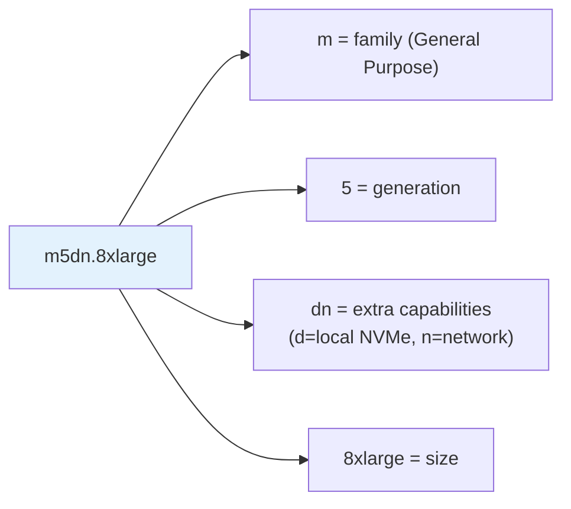
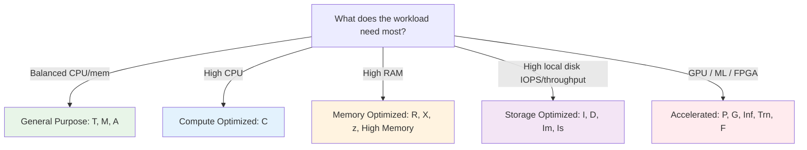
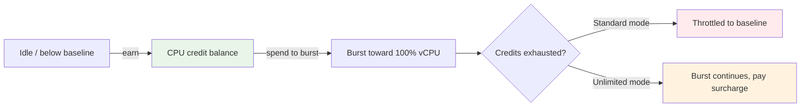
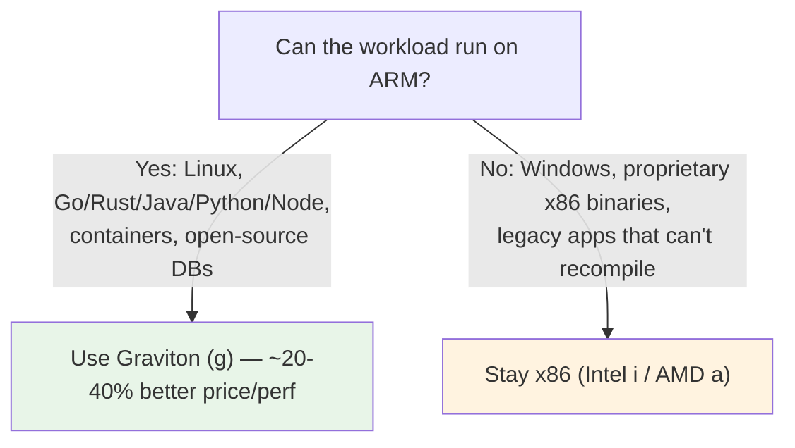
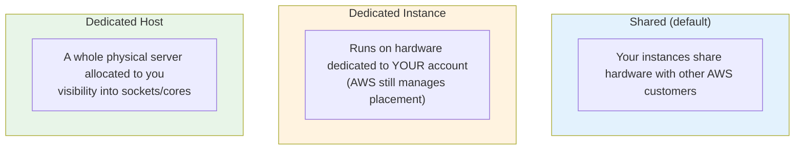
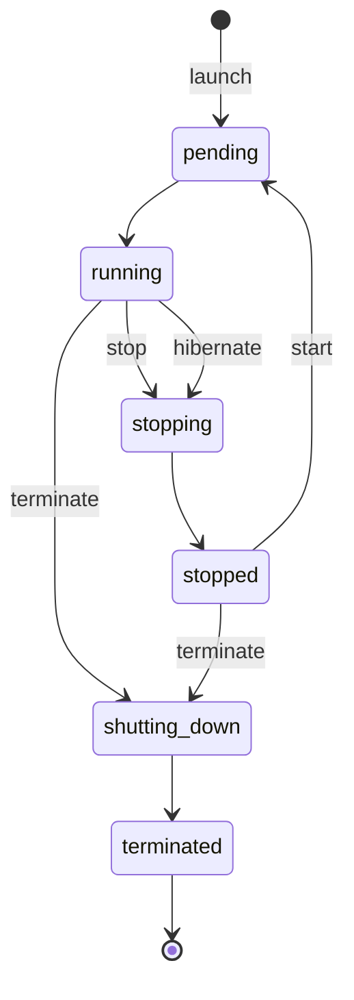
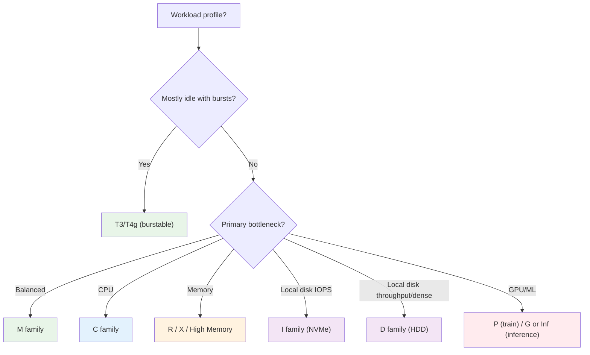

# EC2 Instance Types - Deep Dive (SAA-C03)

> Choosing the **right instance family** for a workload is one of the most common SAA-C03 question patterns. This file decodes the naming convention, walks every family and when to pick it, explains burstable (T-family) CPU credits, AWS Graviton, and tenancy options — with mermaid decision aids.

> **EC2 + ASG series:** [01 - EC2 Intro](01%20-%20EC2%20Intro.md) · [02 - EC2 Instance Types Deep Dive](02%20-%20EC2%20Instance%20Types%20Deep%20Dive.md) · [03 - EC2 Storage Deep Dive](03%20-%20EC2%20Storage%20Deep%20Dive.md) · [04 - EC2 Networking, Placement & Metadata Deep Dive](04%20-%20EC2%20Networking%2C%20Placement%20%26%20Metadata%20Deep%20Dive.md) · [05 - EC2 Pricing & Purchasing Options Deep Dive](05%20-%20EC2%20Pricing%20%26%20Purchasing%20Options%20Deep%20Dive.md) · [06 - EC2 Auto Scaling (ASG)](06%20-%20EC2%20Auto%20Scaling%20%28ASG%29.md) · [07 - ASG Architecture & Advanced Deep Dive](07%20-%20ASG%20Architecture%20%26%20Advanced%20Deep%20Dive.md) · [08 - EC2 & ASG Architecture Patterns & Examples](08%20-%20EC2%20%26%20ASG%20Architecture%20Patterns%20%26%20Examples.md) · [09 - EC2 & ASG Scenario Questions](09%20-%20EC2%20%26%20ASG%20Scenario%20Questions.md) · [10 - EC2 & ASG Important Facts & Cheat Sheet](10%20-%20EC2%20%26%20ASG%20Important%20Facts%20%26%20Cheat%20Sheet.md)

---

## Table of Contents

- [The Naming Convention](#the-naming-convention)
- [The Five Family Categories](#the-five-family-categories)
- [General Purpose (T, M, A)](#general-purpose-t-m-a)
- [Burstable T-Family & CPU Credits](#burstable-t-family--cpu-credits)
- [Compute Optimized (C)](#compute-optimized-c)
- [Memory Optimized (R, X, High Memory, z)](#memory-optimized-r-x-high-memory-z)
- [Storage Optimized (I, D, Im/Is)](#storage-optimized-i-d-imis)
- [Accelerated Computing (P, G, Inf, Trn, F)](#accelerated-computing-p-g-inf-trn-f)
- [AWS Graviton (ARM)](#aws-graviton-arm)
- [Tenancy: Shared, Dedicated Instance, Dedicated Host](#tenancy-shared-dedicated-instance-dedicated-host)
- [Instance Lifecycle & States](#instance-lifecycle--states)
- [Pick-the-Family Decision Aid](#pick-the-family-decision-aid)
- [Exam Triggers](#exam-triggers)

---

## The Naming Convention

Every EC2 instance name encodes four things. Decoding it on sight is an exam skill.

| Element | Meaning | Example |
| :--- | :--- | :--- |
| **Family letter** | The workload category | `m` = general purpose, `c` = compute, `r` = memory |
| **Generation** | Higher = newer/faster/cheaper-per-perf | `m5` → `m6` → `m7` |
| **Additional capabilities** | Optional suffix letters | `g`=Graviton, `d`=local NVMe SSD, `n`=enhanced network, `a`=AMD, `i`=Intel, `e`=extra memory/storage |
| **Size** | vCPU/RAM scale | `nano`→`micro`→...→`large`→`xlarge`→`24xlarge`→`metal` |

> **Exam nugget:** sizes roughly double resources each step (`large` = 2 vCPU, `xlarge` = 4, `2xlarge` = 8, ...). `.metal` = bare metal (no hypervisor) for licensing or hypervisor-level workloads.

[⬆ Back to top](#table-of-contents)

---

## The Five Family Categories

| Category | Families | Ratio bias | Typical workloads |
| :--- | :--- | :--- | :--- |
| **General Purpose** | T, M, A | Balanced | Web/app servers, small-mid DBs, dev/test |
| **Compute Optimized** | C | High vCPU : RAM | Batch, HPC, gaming, ad-serving, media transcode |
| **Memory Optimized** | R, X, High Memory, z | High RAM : vCPU | In-memory DBs, caches, SAP HANA, real-time analytics |
| **Storage Optimized** | I, D, Im, Is | High local disk | NoSQL (Cassandra/Mongo), data warehouse, Elasticsearch, distributed FS |
| **Accelerated Computing** | P, G, Inf, Trn, F | GPU/ASIC/FPGA | ML training/inference, graphics, genomics, video |

[⬆ Back to top](#table-of-contents)

---

## General Purpose (T, M, A)

- **M (e.g., M7g, M6i)** — the balanced default for production web/app servers and small-to-medium databases. When in doubt and the workload is "normal," M is the safe choice.
- **T (e.g., T3, T4g)** — **burstable**, cheapest for bursty/idle workloads (see next section).
- **A (A1)** — first-gen Graviton, low-cost scale-out workloads; mostly superseded by newer `g` variants of M/C/R.

[⬆ Back to top](#table-of-contents)

---

## Burstable T-Family & CPU Credits

T instances run at a **low baseline** and use **CPU credits** to burst. This is the single most-tested instance-type mechanic.

| Concept | Detail |
| :--- | :--- |
| **Baseline** | A guaranteed % of a vCPU (varies by size, e.g. ~10-40%) |
| **1 CPU credit** | 1 vCPU running at 100% for 1 minute |
| **Standard mode** | Burst only while credits last; then **throttle** to baseline. Best for dev/test, truly bursty. |
| **Unlimited mode** | Burst beyond credits indefinitely, paying a surcharge if the average exceeds baseline over 24h. **Default for T3/T4g.** Best when sustained spikes can occur. |
| **T2 vs T3/T4g** | T2 = older, slower credit accrual, Standard by default. T3 = Unlimited by default, faster accrual. T4g = Graviton2, cheapest. |

> [!warning] Exam trap
> "Variable CPU, mostly idle, cost-sensitive, occasional spikes" → **T-family (Unlimited if spikes must not throttle)**. But if a workload is **sustained high CPU**, T in Unlimited mode gets *expensive* — switch to **M or C**. Burstable ≠ free performance.

[⬆ Back to top](#table-of-contents)

---

## Compute Optimized (C)

High vCPU-to-memory ratio and high sustained clock. Pick **C** when CPU is the bottleneck:

- Batch processing, scientific modelling, HPC
- High-performance web servers, ad serving
- Game servers, media/video transcoding
- Machine-learning **inference** that's CPU-bound (no GPU)

> **Trigger:** "compute-intensive," "CPU-bound," "high-performance batch," "transcoding" → **C family**.

[⬆ Back to top](#table-of-contents)

---

## Memory Optimized (R, X, High Memory, z)

| Family | Niche |
| :--- | :--- |
| **R** | General memory-optimized: production databases, in-memory caches (Redis/Memcached), real-time big-data analytics |
| **X / X2** | Very large in-memory: large databases, **SAP HANA**, Apache Spark; high RAM-per-vCPU |
| **High Memory (u-*)** | Up to **24 TB** RAM for the largest **SAP HANA** deployments |
| **z1d** | High **per-core frequency** + high memory: EDA (electronic design automation), relational DBs with per-core licensing |

> **Trigger:** "in-memory database," "SAP HANA," "large cache," "memory-bound analytics" → **R / X / High Memory**. "Per-core license + fast cores" → **z1d**.

[⬆ Back to top](#table-of-contents)

---

## Storage Optimized (I, D, Im/Is)

For high local-disk performance (the storage is **physically attached instance store**, not EBS):

| Family | Storage | Use case |
| :--- | :--- | :--- |
| **I (I3, I4i, I3en)** | Local **NVMe SSD**, very high random IOPS | NoSQL (Cassandra, MongoDB, ScyllaDB), OLTP, Elasticsearch |
| **Im4gn / Is4gen** | Graviton + NVMe, density variants | Same as I, ARM/cost-optimized |
| **D (D2, D3, D3en)** | Local **HDD**, dense, high sequential throughput | HDFS/MapReduce, data warehouses, distributed file systems, log processing |

> [!note] Durability caveat
> Storage-optimized local disks are **instance store** → ephemeral. Data is **lost on stop/terminate/hardware failure**. Use these only for workloads that **replicate data across nodes** (Cassandra, HDFS) or treat local disk as cache. See [03 - EC2 Storage Deep Dive > Instance Store (Ephemeral)](03%20-%20EC2%20Storage%20Deep%20Dive.md#instance-store-ephemeral).

[⬆ Back to top](#table-of-contents)

---

## Accelerated Computing (P, G, Inf, Trn, F)

| Family | Accelerator | Use case |
| :--- | :--- | :--- |
| **P (P3, P4d, P5)** | NVIDIA high-end GPU (A100/H100) | ML **training**, HPC |
| **G (G4dn, G5, G6)** | NVIDIA T4/A10G GPU | ML **inference**, graphics/rendering, game streaming, [5G edge](01%20-%20Wavelength%20Intro%5C.md) |
| **Inf (Inf1/Inf2)** | AWS **Inferentia** ASIC | Cost-optimized ML **inference** at scale |
| **Trn (Trn1)** | AWS **Trainium** ASIC | Cost-optimized ML **training** |
| **F (F1)** | **FPGA** | Genomics, financial analytics, custom hardware acceleration |

> **Trigger:** "ML training" → P or **Trn1**; "ML inference" → G or **Inf1/2**; "graphics/rendering" → G; "FPGA/custom hardware" → F.

[⬆ Back to top](#table-of-contents)

---

## AWS Graviton (ARM)

AWS's own **ARM-based** processors (denoted by `g`, e.g. M7g, C7g, R7g, T4g) deliver **better price/performance** than comparable x86.

- **Use Graviton for:** containerized microservices, web servers, open-source databases, interpreted/recompilable languages.
- **Avoid Graviton for:** Windows Server, closed-source x86-only software, anything you can't recompile/recertify.

> **Trigger:** "lower cost without losing performance," "Linux containers," "modernize compute cost" → **Graviton**.

[⬆ Back to top](#table-of-contents)

---

## Tenancy: Shared, Dedicated Instance, Dedicated Host

| Tenancy | What you get | When the exam picks it |
| :--- | :--- | :--- |
| **Shared (default)** | Multi-tenant hardware, cheapest | Normal workloads |
| **Dedicated Instance** | Hardware isolated to your account; no socket/core visibility | Compliance needing physical isolation, but no licensing detail |
| **Dedicated Host** | A physical server you own the placement of; see sockets/cores; can stay on the same host | **BYOL licensing** tied to physical cores/sockets (Windows Server, Oracle, SQL Server), regulatory "named host" needs |

> [!warning] High-yield distinction
> **"Bring-your-own-license bound to physical cores/sockets"** → **Dedicated Host** (only it exposes the socket/core layout the license needs). Plain "physical isolation for compliance" → **Dedicated Instance** is enough.

[⬆ Back to top](#table-of-contents)

---

## Instance Lifecycle & States

| Action | Billing | Public IP | Instance store | EBS root |
| :--- | :--- | :--- | :--- | :--- |
| **Stop** | No compute charge; EBS still billed | Released (new on start, unless EIP) | **Wiped** | Persists |
| **Hibernate** | No compute charge; EBS billed | Released (unless EIP) | **Wiped** | Persists; **RAM saved to EBS** root |
| **Terminate** | Stops all charges | Released | Wiped | Deleted (if DeleteOnTermination=true) |

> **Hibernate** writes RAM to the encrypted EBS root so the OS/app resumes where it left off — good for long-boot apps. Root volume must be encrypted and large enough for RAM.

[⬆ Back to top](#table-of-contents)

---

## Pick-the-Family Decision Aid

[⬆ Back to top](#table-of-contents)

---

## Exam Triggers

| Question says... | Answer |
| :--- | :--- |
| "Variable/bursty CPU, cost-sensitive" | **T3/T4g** (Unlimited if spikes must not throttle) |
| "Sustained high CPU / compute-intensive batch" | **C family** |
| "Balanced production web/app server" | **M family** |
| "In-memory DB / SAP HANA / large cache" | **R / X / High Memory** |
| "Per-core licensed DB, fast cores" | **z1d** |
| "NoSQL with very high local IOPS" | **I family** (NVMe instance store) |
| "Dense HDD, HDFS/MapReduce" | **D family** |
| "ML training" | **P** or **Trn1** |
| "ML inference at low cost" | **G** or **Inf1/Inf2** |
| "Lower cost, Linux/containers, can recompile" | **Graviton (g)** |
| "BYOL bound to physical sockets/cores" | **Dedicated Host** |
| "Physical isolation for compliance (no licensing detail)" | **Dedicated Instance** |
| "Resume long-boot app without re-init" | **Hibernate** |

> Next: [03 - EC2 Storage Deep Dive](03%20-%20EC2%20Storage%20Deep%20Dive.md) — EBS volume types, instance store, EFS/FSx, multi-attach, snapshots, and encryption.
