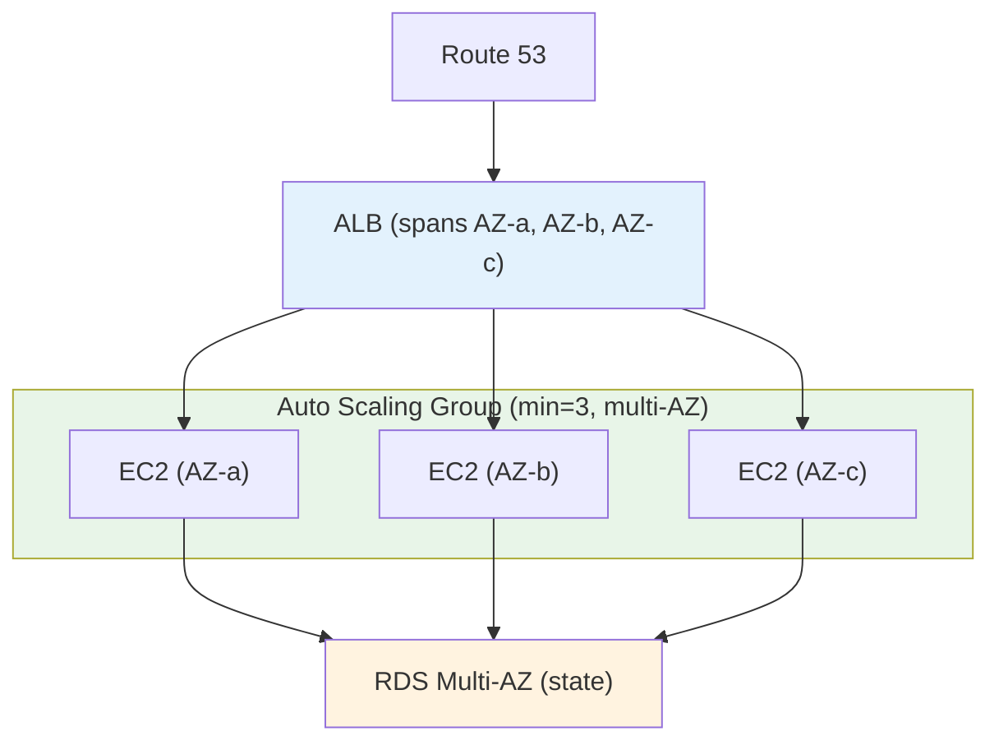
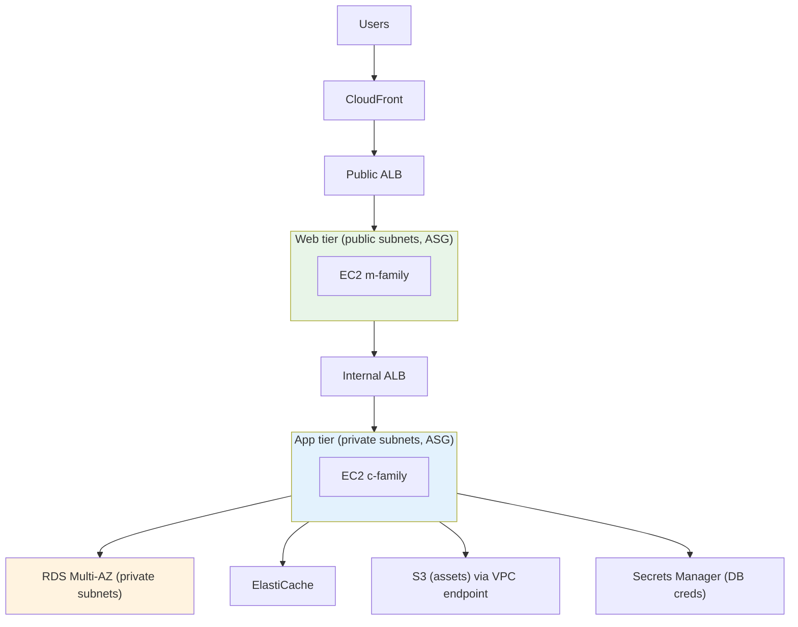
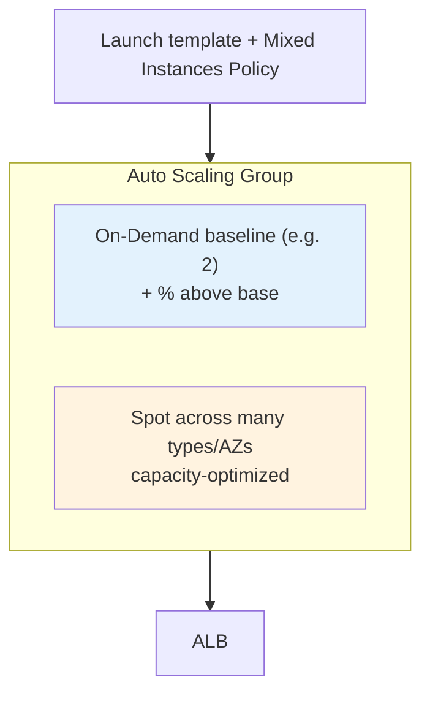
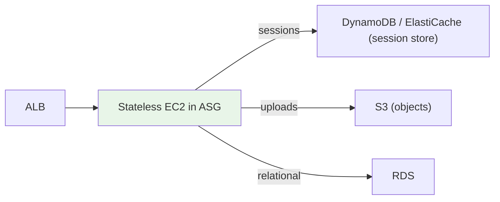
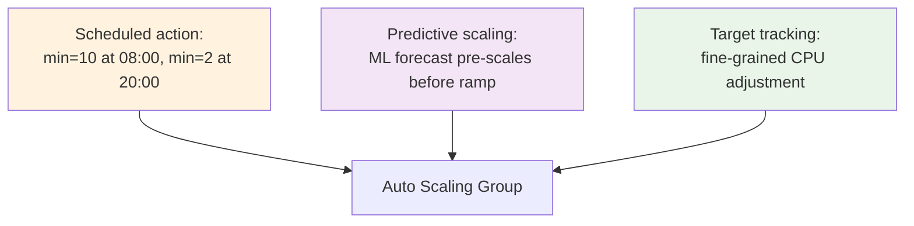
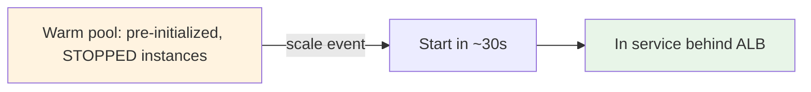
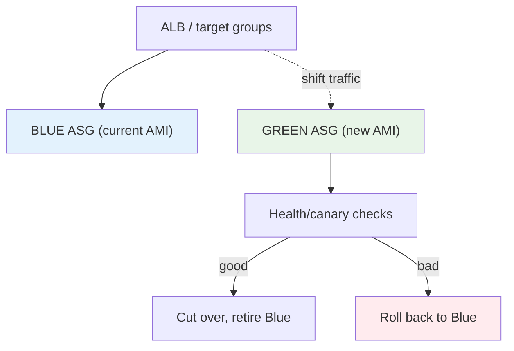
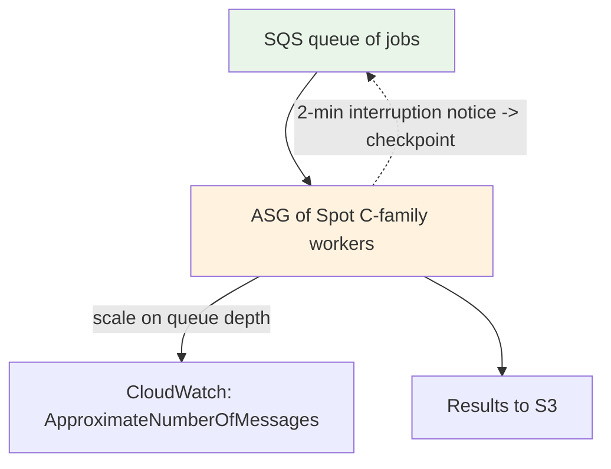
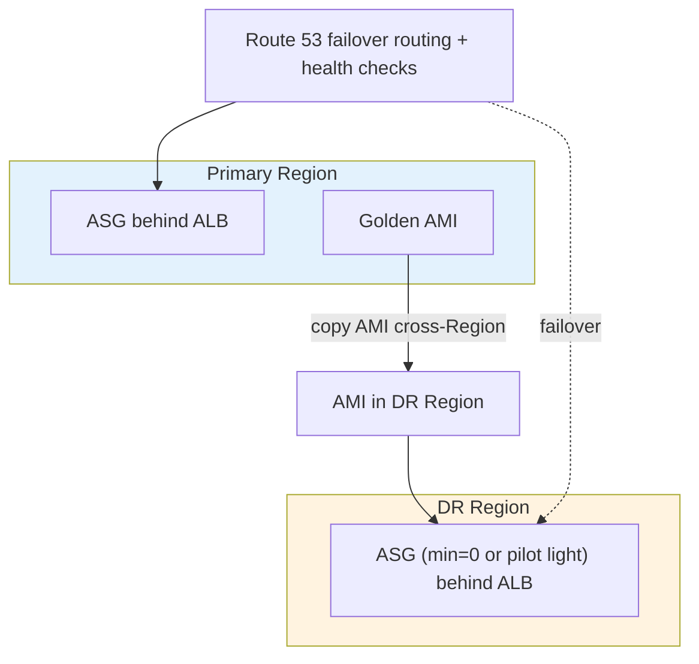

# EC2 & ASG Architecture Patterns & Examples (SAA-C03)

> End-to-end reference architectures the exam draws from — resilient multi-AZ web tiers, cost-optimized mixed-instances ASGs, stateless scaling with externalized state, blue/green deploys, scheduled + predictive scaling, and disaster recovery. Each pattern ties together the building blocks from the earlier files.

> **EC2 + ASG series:** [01 - EC2 Intro](01%20-%20EC2%20Intro.md) · [02 - EC2 Instance Types Deep Dive](02%20-%20EC2%20Instance%20Types%20Deep%20Dive.md) · [03 - EC2 Storage Deep Dive](03%20-%20EC2%20Storage%20Deep%20Dive.md) · [04 - EC2 Networking, Placement & Metadata Deep Dive](04%20-%20EC2%20Networking%2C%20Placement%20%26%20Metadata%20Deep%20Dive.md) · [05 - EC2 Pricing & Purchasing Options Deep Dive](05%20-%20EC2%20Pricing%20%26%20Purchasing%20Options%20Deep%20Dive.md) · [06 - EC2 Auto Scaling (ASG)](06%20-%20EC2%20Auto%20Scaling%20%28ASG%29.md) · [07 - ASG Architecture & Advanced Deep Dive](07%20-%20ASG%20Architecture%20%26%20Advanced%20Deep%20Dive.md) · [08 - EC2 & ASG Architecture Patterns & Examples](08%20-%20EC2%20%26%20ASG%20Architecture%20Patterns%20%26%20Examples.md) · [09 - EC2 & ASG Scenario Questions](09%20-%20EC2%20%26%20ASG%20Scenario%20Questions.md) · [10 - EC2 & ASG Important Facts & Cheat Sheet](10%20-%20EC2%20%26%20ASG%20Important%20Facts%20%26%20Cheat%20Sheet.md)

---

## Table of Contents

- [Pattern: Resilient Multi-AZ Web Tier](#pattern-resilient-multi-az-web-tier)
- [Pattern: Three-Tier Application](#pattern-three-tier-application)
- [Pattern: Cost-Optimized Mixed-Instances ASG](#pattern-cost-optimized-mixed-instances-asg)
- [Pattern: Stateless Scaling (Externalize State)](#pattern-stateless-scaling-externalize-state)
- [Pattern: Scheduled + Predictive Scaling](#pattern-scheduled--predictive-scaling)
- [Pattern: Fast Scale-Out with Warm Pools](#pattern-fast-scale-out-with-warm-pools)
- [Pattern: Blue/Green Deployment with ASGs](#pattern-bluegreen-deployment-with-asgs)
- [Pattern: Spot-Based Batch Processing](#pattern-spot-based-batch-processing)
- [Pattern: Disaster Recovery](#pattern-disaster-recovery)
- [CLI: Minimal ASG Behind an ALB](#cli-minimal-asg-behind-an-alb)

---

## Pattern: Resilient Multi-AZ Web Tier

**Requirement:** A web app must survive an AZ failure and scale with load.



- ASG **spans ≥ 2 AZs** so the loss of one AZ leaves healthy capacity; the ASG relaunches in surviving AZs and rebalances.
- **ELB health checks** (not just EC2 status) so app-level failures trigger replacement.
- State lives in **RDS Multi-AZ** / DynamoDB, **not** on the instances.

[⬆ Back to top](#table-of-contents)

---

## Pattern: Three-Tier Application



- **Security-group chaining:** Web SG ← ALB; App SG ← Web SG; DB SG ← App SG (no hardcoded IPs — see [04 - EC2 Networking, Placement & Metadata Deep Dive > Security Groups vs Network ACLs](04%20-%20EC2%20Networking%2C%20Placement%20%26%20Metadata%20Deep%20Dive.md#security-groups-vs-network-acls)).
- Each tier is its **own ASG** sized to its bottleneck (M for web, C for compute-heavy app).
- DB credentials from **Secrets Manager**, never in user data — instances use an **IAM role**.

[⬆ Back to top](#table-of-contents)

---

## Pattern: Cost-Optimized Mixed-Instances ASG

**Requirement:** Run a large fleet cheaply while staying resilient to Spot interruptions.



- **Mixed instances policy:** a small **On-Demand base** for guaranteed capacity + **Spot** for the elastic remainder at up to 90% off.
- **Diversify across many instance types and AZs** so a single Spot pool reclamation doesn't drop the fleet; use **`capacity-optimized`** allocation + **Capacity Rebalance**.
- Layer a **Compute Savings Plan** under the steady baseline for further savings ([05 - EC2 Pricing & Purchasing Options Deep Dive > Savings Plans](05%20-%20EC2%20Pricing%20%26%20Purchasing%20Options%20Deep%20Dive.md#savings-plans)).

[⬆ Back to top](#table-of-contents)

---

## Pattern: Stateless Scaling (Externalize State)

**Requirement:** Instances can be added/removed freely without losing user data.



- Keep **no durable state on the instance** (instance store and local disk are disposable).
- **Sessions** → ElastiCache/DynamoDB; **files** → S3 or EFS; **data** → RDS/DynamoDB.
- This makes scale-in safe and enables **Spot** and **instance refresh** without data loss.

[⬆ Back to top](#table-of-contents)

---

## Pattern: Scheduled + Predictive Scaling

**Requirement:** Traffic follows known business hours plus a recurring daily ramp.



- **Scheduled scaling** pre-warms before predictable spikes so users don't wait for reactive scale-out.
- **Predictive scaling** handles recurring patterns; **target tracking** smooths the rest. They compose well.

[⬆ Back to top](#table-of-contents)

---

## Pattern: Fast Scale-Out with Warm Pools

**Requirement:** App needs 8 minutes to initialize; flash-sale traffic can't wait.



- **Warm pool** keeps initialized instances **stopped** (cheap) and started in seconds on demand.
- Combine with **scheduled scaling** for predictable peaks. See [06 - EC2 Auto Scaling (ASG) > 🔥 Warm Pools - Reduce Scaling Latency](06%20-%20EC2%20Auto%20Scaling%20%28ASG%29.md#-warm-pools---reduce-scaling-latency).

[⬆ Back to top](#table-of-contents)

---

## Pattern: Blue/Green Deployment with ASGs



- Stand up a **new (green) ASG** on the new launch-template version, validate, then shift ALB traffic; instant rollback by shifting back.
- Lighter-weight alternative: **Instance Refresh** on a single ASG ([07 - ASG Architecture & Advanced Deep Dive > Instance Refresh & Updating the Fleet](07%20-%20ASG%20Architecture%20%26%20Advanced%20Deep%20Dive.md#instance-refresh--updating-the-fleet)).

[⬆ Back to top](#table-of-contents)

---

## Pattern: Spot-Based Batch Processing

**Requirement:** Nightly fault-tolerant batch, cheapest possible, must finish in a window.



- Decouple with **SQS**; scale the ASG on **queue depth** (target tracking on `ApproximateNumberOfMessages` per instance).
- Workers are **Spot** (fault-tolerant) and **checkpoint** progress; on the 2-minute notice, re-queue in-flight work.
- Compute-optimized (**C family**) matches the batch profile ([02 - EC2 Instance Types Deep Dive > Compute Optimized (C)](02%20-%20EC2%20Instance%20Types%20Deep%20Dive.md#compute-optimized-c)).

[⬆ Back to top](#table-of-contents)

---

## Pattern: Disaster Recovery



- **Copy AMIs and EBS snapshots cross-Region** so the DR ASG can launch identical instances ([03 - EC2 Storage Deep Dive > EBS Snapshots, DLM & Fast Snapshot Restore](03%20-%20EC2%20Storage%20Deep%20Dive.md#ebs-snapshots-dlm--fast-snapshot-restore)).
- **Route 53 failover** shifts traffic; the DR ASG scales from a pilot-light `min` on failover.

[⬆ Back to top](#table-of-contents)

---

## CLI: Minimal ASG Behind an ALB

```bash
# 1. Create a launch template (AMI, type, SGs, IAM role, user data)
aws ec2 create-launch-template \
  --launch-template-name web-lt \
  --version-description v1 \
  --launch-template-data '{
    "ImageId":"ami-0abc123",
    "InstanceType":"t3.medium",
    "SecurityGroupIds":["sg-0web"],
    "IamInstanceProfile":{"Name":"web-instance-profile"}
  }'

# 2. Create the ASG across multiple AZ subnets, attached to an ALB target group
aws autoscaling create-auto-scaling-group \
  --auto-scaling-group-name web-asg \
  --launch-template "LaunchTemplateName=web-lt,Version=\$Latest" \
  --min-size 2 --max-size 10 --desired-capacity 2 \
  --vpc-zone-identifier "subnet-0a,subnet-0b,subnet-0c" \
  --target-group-arns arn:aws:elasticloadbalancing:...:targetgroup/web-tg/abc \
  --health-check-type ELB --health-check-grace-period 300

# 3. Add a target-tracking policy: keep average CPU at 50%
aws autoscaling put-scaling-policy \
  --auto-scaling-group-name web-asg \
  --policy-name cpu50 \
  --policy-type TargetTrackingScaling \
  --target-tracking-configuration '{
    "PredefinedMetricSpecification":{"PredefinedMetricType":"ASGAverageCPUUtilization"},
    "TargetValue":50.0
  }'
```

> The ASG now keeps ≥2 healthy instances across 3 AZs, replaces ELB-unhealthy ones after a 300s grace, and scales to hold ~50% CPU.

[⬆ Back to top](#table-of-contents)

> Next: [09 - EC2 & ASG Scenario Questions](09%20-%20EC2%20%26%20ASG%20Scenario%20Questions.md) — exam-style scenarios with full explanations.
