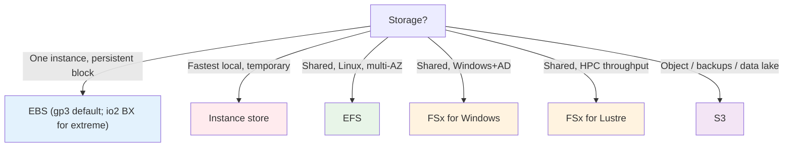

# EC2 & ASG Important Facts & Cheat Sheet (SAA-C03)

> One-page cram for the whole EC2 + Auto Scaling series: the highest-yield facts, comparison tables, hard limits, and trigger words. If you review one file the night before, make it this one.

> **EC2 + ASG series:** [01 - EC2 Intro](01%20-%20EC2%20Intro.md) · [02 - EC2 Instance Types Deep Dive](02%20-%20EC2%20Instance%20Types%20Deep%20Dive.md) · [03 - EC2 Storage Deep Dive](03%20-%20EC2%20Storage%20Deep%20Dive.md) · [04 - EC2 Networking, Placement & Metadata Deep Dive](04%20-%20EC2%20Networking%2C%20Placement%20%26%20Metadata%20Deep%20Dive.md) · [05 - EC2 Pricing & Purchasing Options Deep Dive](05%20-%20EC2%20Pricing%20%26%20Purchasing%20Options%20Deep%20Dive.md) · [06 - EC2 Auto Scaling (ASG)](06%20-%20EC2%20Auto%20Scaling%20%28ASG%29.md) · [07 - ASG Architecture & Advanced Deep Dive](07%20-%20ASG%20Architecture%20%26%20Advanced%20Deep%20Dive.md) · [08 - EC2 & ASG Architecture Patterns & Examples](08%20-%20EC2%20%26%20ASG%20Architecture%20Patterns%20%26%20Examples.md) · [09 - EC2 & ASG Scenario Questions](09%20-%20EC2%20%26%20ASG%20Scenario%20Questions.md) · [10 - EC2 & ASG Important Facts & Cheat Sheet](10%20-%20EC2%20%26%20ASG%20Important%20Facts%20%26%20Cheat%20Sheet.md)

---

## Table of Contents

- [The 20 Facts Most Likely to Be Tested](#the-20-facts-most-likely-to-be-tested)
- [Instance Family Quick Map](#instance-family-quick-map)
- [EBS Volume Type Ceilings](#ebs-volume-type-ceilings)
- [Storage Decision One-Liner](#storage-decision-one-liner)
- [Placement Groups](#placement-groups)
- [Security Groups vs NACLs](#security-groups-vs-nacls)
- [Purchasing Options](#purchasing-options)
- [Auto Scaling Essentials](#auto-scaling-essentials)
- [Hard Numbers to Memorize](#hard-numbers-to-memorize)
- [Master Trigger-Word Table](#master-trigger-word-table)

---

## The 20 Facts Most Likely to Be Tested

1. **T-family bursts on CPU credits**; Unlimited mode (default T3/T4g) avoids throttling for a surcharge. Sustained high CPU → use **M/C**, not T.
2. **C** = compute-bound, **M** = balanced, **R/X/High Memory** = RAM-bound, **I** = local NVMe IOPS, **D** = dense HDD, **P/G/Inf/Trn** = GPU/ML.
3. **Graviton (g)** = ARM, ~20–40% better price/perf, but **no Windows** / no x86-only binaries.
4. **Dedicated Host** = per-socket/core **BYOL** + host visibility; **Dedicated Instance** = isolation only.
5. **EBS is AZ-scoped**; move across AZ/Region via **snapshots**.
6. **gp3** decouples IOPS/throughput from size and is cheaper than gp2 — default SSD.
7. **io2 Block Express** = up to **256,000 IOPS / 64 TiB / 99.999%** — the only choice above 64k IOPS or 16 TiB.
8. **st1/sc1 (HDD) can't be boot volumes**; boot must be SSD.
9. **Instance store is ephemeral** — lost on stop/terminate; use only for cache/replicated data.
10. **EBS Multi-Attach** = io1/io2, ≤16 Nitro instances, **same AZ**, cluster-aware FS only.
11. **EFS** = multi-AZ NFS for Linux; **FSx for Windows** = SMB+AD; **FSx for Lustre** = HPC.
12. **Snapshots are incremental, regional, in S3**; copy cross-Region for DR; **DLM** automates them; **FSR** removes restore latency.
13. **Encrypt existing volume** = snapshot → copy with encryption → new volume.
14. **Cluster PG** = lowest latency (one rack); **Spread PG** = max availability (7/AZ); **Partition PG** = big-data partition-aware.
15. **Security groups: stateful, allow-only**; **NACLs: stateless, allow+deny, ordered**. Only NACLs can **deny**.
16. **Enforce IMDSv2** to stop SSRF credential theft.
17. **Compute Savings Plan** = flexible (any family/Region, +Fargate/Lambda); **EC2 Instance SP / Standard RI** = bigger discount, less flexible; **only Zonal RIs and ODCRs reserve capacity**.
18. **Spot** = up to 90% off, 2-min interruption notice; **capacity-optimized** = fewest interruptions.
19. **ASG needs launch templates** (not launch configs) for mixed instances, multiple types, versioning.
20. **ELB health checks** catch app failures EC2 status checks miss; **lifecycle hooks** are the only way to run code on **terminate**; **warm pools** speed slow scale-out.

[⬆ Back to top](#table-of-contents)

---

## Instance Family Quick Map

| Need | Family |
| :--- | :--- |
| Balanced production | **M** |
| Bursty / cheap / idle | **T** |
| CPU-bound / batch / HPC | **C** |
| RAM-bound / cache / DB | **R** |
| Huge in-memory / SAP HANA | **X / High Memory** |
| Per-core license + fast cores | **z1d** |
| Local NVMe IOPS (NoSQL) | **I** |
| Dense HDD (HDFS/warehouse) | **D** |
| ML training | **P / Trn1** |
| ML inference / graphics | **G / Inf** |
| FPGA | **F** |
| Lower cost on Linux | **Graviton (g)** |

[⬆ Back to top](#table-of-contents)

---

## EBS Volume Type Ceilings

| Type | Max IOPS | Max throughput | Max size | Note |
| :--- | :--- | :--- | :--- | :--- |
| gp3 | 16,000 | 1,000 MB/s | 16 TiB | Default SSD, decoupled perf |
| gp2 | 16,000 | 250 MB/s | 16 TiB | Legacy, 3 IOPS/GB |
| io2 | 64,000 | 1,000 MB/s | 16 TiB | 99.999% durable |
| io2 Block Express | **256,000** | **4,000 MB/s** | **64 TiB** | Largest/most demanding |
| st1 | 500 | 500 MB/s | 16 TiB | Throughput HDD (no boot) |
| sc1 | 250 | 250 MB/s | 16 TiB | Cold HDD, cheapest (no boot) |

[⬆ Back to top](#table-of-contents)

---

## Storage Decision One-Liner

[⬆ Back to top](#table-of-contents)

---

## Placement Groups

| Strategy | Goal | Limit |
| :--- | :--- | :--- |
| **Cluster** | Lowest latency / highest throughput | One AZ, shared failure domain |
| **Spread** | Max availability (distinct hardware) | **7 instances per AZ** |
| **Partition** | Partition-aware big-data | **7 partitions per AZ** |

[⬆ Back to top](#table-of-contents)

---

## Security Groups vs NACLs

| | Security Group | NACL |
| :--- | :--- | :--- |
| Level | Instance/ENI | Subnet |
| State | **Stateful** | **Stateless** |
| Rules | **Allow only** | **Allow + Deny** |
| Eval | All rules | Ordered, first match |
| Refs | Other SGs | CIDR only |

> SGs can't deny; NACLs are stateless (allow both directions incl. ephemeral ports).

[⬆ Back to top](#table-of-contents)

---

## Purchasing Options

| Option | Discount | Commit | Capacity reserved? |
| :--- | :--- | :--- | :--- |
| On-Demand | — | None | No |
| Spot | up to 90% | None (interruptible) | No |
| Standard RI | up to ~72% | 1/3 yr, fixed config | Zonal only |
| Convertible RI | lower | 1/3 yr, changeable | Zonal only |
| Compute Savings Plan | up to ~66% | 1/3 yr $/hr, flexible (+Fargate/Lambda) | No |
| EC2 Instance Savings Plan | up to ~72% | 1/3 yr, family+Region | No |
| On-Demand Capacity Reservation | — | None | **Yes (AZ)** |
| Dedicated Host | — | On-demand or reserved | Host |

[⬆ Back to top](#table-of-contents)

---

## Auto Scaling Essentials

| Topic | Key point |
| :--- | :--- |
| **Launch template vs config** | Use **templates** (versioning, multiple types, mixed Spot/On-Demand) |
| **min/desired/max** | min replaces failures (HA w/o policies); policies move desired within bounds |
| **Target tracking** | Default; keep CPU or `ALBRequestCountPerTarget` at target |
| **Step scaling** | Graduated response to breach size |
| **Scheduled** | Known clock-based patterns |
| **Predictive** | ML for recurring patterns; pair with target tracking |
| **Health checks** | **ELB** catches app failures EC2 status checks miss |
| **Grace period** | Set > app startup or new instances get killed |
| **Lifecycle hooks** | Only way to run code on **terminate** (drain) and launch |
| **Warm pools** | Pre-initialized stopped instances → seconds to scale out |
| **Instance refresh** | Roll new AMI/template in batches, no downtime |
| **Mixed instances policy** | Spot + On-Demand across types; `capacity-optimized` = fewest interruptions |
| **Standby / suspend / scale-in protection** | Pause ASG actions for debug/maintenance |

[⬆ Back to top](#table-of-contents)

---

## Hard Numbers to Memorize

| Thing | Number |
| :--- | :--- |
| gp3/gp2 max IOPS | 16,000 |
| io2 max IOPS | 64,000 |
| io2 Block Express max IOPS / size | 256,000 / 64 TiB |
| EBS Multi-Attach instances | 16 (same AZ) |
| Spread placement group | 7 instances per AZ |
| Partition placement group | 7 partitions per AZ |
| Spot interruption notice | 2 minutes |
| User data size | 16 KB |
| Default health-check grace | 300 s (tune to app) |
| Lifecycle hook default / max timeout | 3,600 s / 172,800 s (48 h) |
| RI / Savings Plan terms | 1 or 3 years |
| Standby reboot | survives; stop/terminate wipes instance store |

[⬆ Back to top](#table-of-contents)

---

## Master Trigger-Word Table

| Question says... | Answer |
| :--- | :--- |
| "Bursty, idle, cost-sensitive" | **T3/T4g** |
| "Compute-intensive batch / HPC" | **C family** |
| "SAP HANA / large in-memory DB" | **X / High Memory** |
| "Cheaper Linux compute" | **Graviton** |
| "BYOL per physical socket" | **Dedicated Host** |
| "Physical isolation only" | **Dedicated Instance** |
| "Default general-purpose SSD, cost-optimized" | **gp3** |
| ">64k IOPS or >16 TiB single volume" | **io2 Block Express** |
| "Highest local IOPS, temp/replicated" | **Instance store** |
| "Same block volume, several instances, one AZ" | **EBS Multi-Attach (io2)** |
| "Shared FS, Linux, multi-AZ" | **EFS** |
| "Windows SMB + AD" | **FSx for Windows** |
| "HPC shared throughput FS" | **FSx for Lustre** |
| "Automate snapshot lifecycle" | **DLM** |
| "Instant full-perf restore" | **Fast Snapshot Restore** |
| "Encrypt existing volume" | **snapshot → encrypted copy → new volume** |
| "Lowest node-to-node latency" | **Cluster PG + EFA** |
| "Max availability, few nodes" | **Spread PG** |
| "Big-data partition-aware" | **Partition PG** |
| "Explicitly block an IP" | **NACL deny** |
| "SSRF on metadata" | **IMDSv2** |
| "Stable public IP across stop/start" | **Elastic IP** (or ALB/Route 53) |
| "Install software at first boot" | **User data + IAM role** |
| "Steady 24/7, max discount, fixed" | **Standard RI** |
| "Committed savings + flexibility (+Fargate)" | **Compute Savings Plan** |
| "Cheapest fault-tolerant batch" | **Spot** |
| "Spot, minimize interruptions" | **capacity-optimized** |
| "Guarantee AZ capacity, no commit" | **On-Demand Capacity Reservation** |
| "Instance up but app down, no replace" | **ELB health check** |
| "No data loss on scale-in" | **Lifecycle hook (terminate)** |
| "App slow to boot, fast scale-out" | **Warm pool** |
| "Mixed Spot + On-Demand, multiple types" | **Launch template + mixed instances policy** |
| "Predictable clock-based scaling" | **Scheduled scaling** |
| "Recurring forecastable load" | **Predictive scaling** |
| "New AMI to whole ASG, no downtime" | **Instance Refresh / blue-green** |
| "HA with no scaling policy" | **ASG min across multiple AZs** |

[⬆ Back to top](#table-of-contents)

> Back to start: [01 - EC2 Intro](01%20-%20EC2%20Intro.md)
