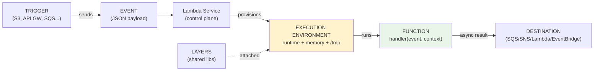
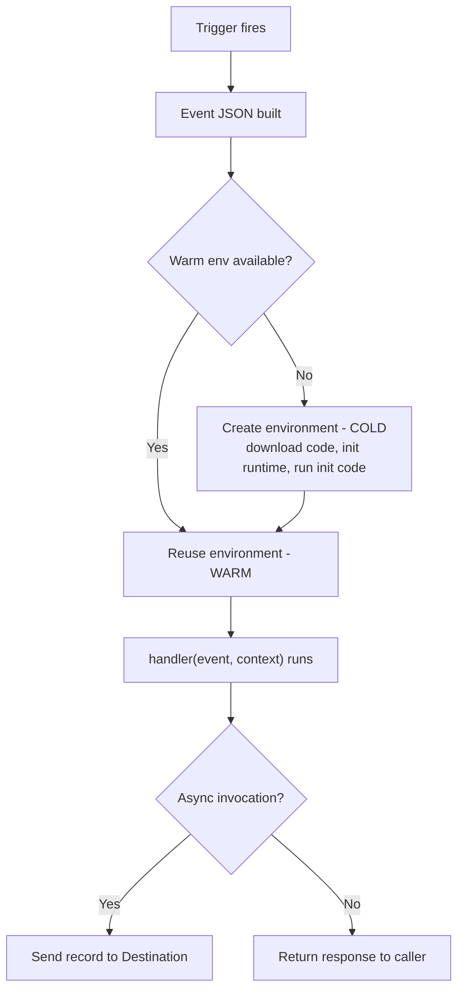
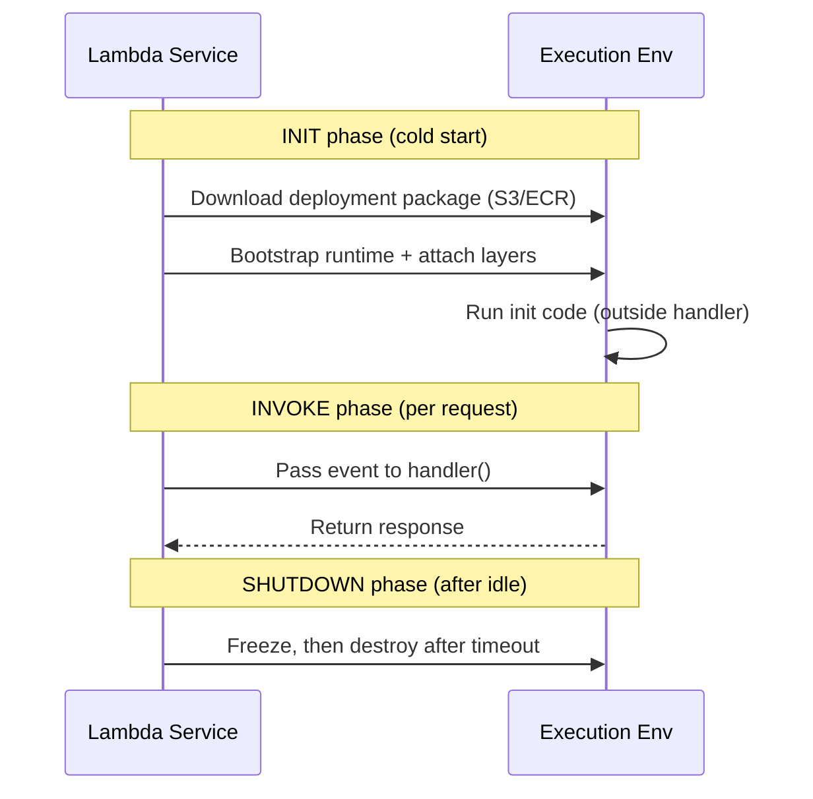
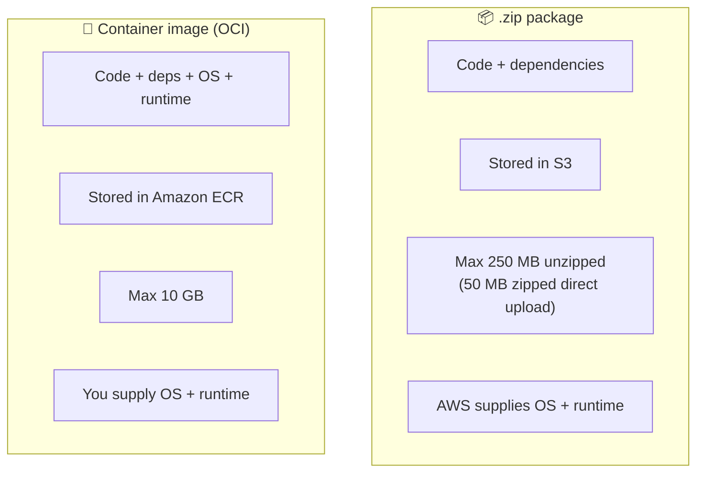
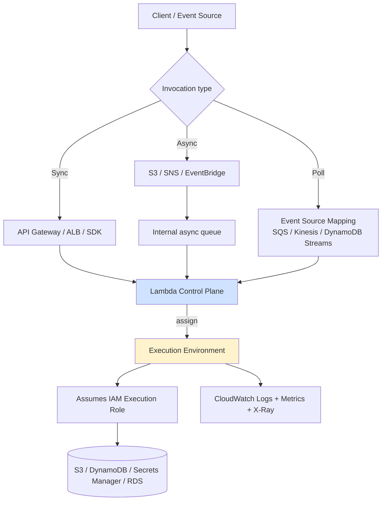

# 📘 Lambda Core Concepts & Architecture - SAA-C03 Deep Dive

> The vocabulary of Lambda — **Function, Trigger, Event, Execution Environment, Deployment Package, Layers, Destination** — plus the backend architecture that makes serverless work. Master these terms first; every other Lambda topic (invocation, scaling, cold starts) builds on them.

See also: [Lambda intro](Lambda%20intro.md) · [Lambda Invocation Modes](Lambda%20Invocation%20Modes.md) · [Lambda Cold Starts & Performance](Lambda%20Cold%20Starts%20%26%20Performance.md) · [Lambda Concurrency & Scaling](Lambda%20Concurrency%20%26%20Scaling.md) · [Lambda Scenario Questions](Lambda%20Scenario%20Questions.md) · [Lambda edge](Lambda%20edge.md)

---

## Table of Contents

- [1. What Lambda Actually Is (Serverless FaaS)](#1-what-lambda-actually-is-serverless-faas)
- [2. The Seven Core Building Blocks](#2-the-seven-core-building-blocks)
- [3. The Execution Environment (Lifecycle Deep Dive)](#3-the-execution-environment-lifecycle-deep-dive)
- [4. Architecture Choice: ARM64 (Graviton) vs x86-64](#4-architecture-choice-arm64-graviton-vs-x86-64)
- [5. Deployment Packages: Zip vs Container Image](#5-deployment-packages-zip-vs-container-image)
- [6. Lambda Layers Deep Dive](#6-lambda-layers-deep-dive)
- [7. Destinations vs DLQ](#7-destinations-vs-dlq)
- [8. End-to-End Architecture (How a Request Flows)](#8-end-to-end-architecture-how-a-request-flows)
- [9. Important Facts & Limits Cheat Sheet](#9-important-facts--limits-cheat-sheet)
- [10. Mini Scenario Drills](#10-mini-scenario-drills)

---



---

## 1. What Lambda Actually Is (Serverless FaaS)

AWS Lambda is a **fully managed, serverless, Function-as-a-Service (FaaS)** compute service. You upload **code**; AWS owns the servers, OS, patching, scaling, and availability.

| You provide | AWS provides |
| :--- | :--- |
| Function code (in a supported runtime) | The server fleet & OS |
| Memory + timeout config | The runtime (for managed runtimes) |
| Trigger/event-source config | Auto-scaling (0 → thousands) |
| IAM execution role | High availability (multi-AZ within a Region) |

**Key mental model:** the backend is **provisioned per-function, per-invocation**. Nothing runs (and nothing is billed) until an event arrives. When idle, Lambda **scales to zero**.

> 🧠 **Exam framing:** Lambda wins when the workload is *event-driven, spiky/sporadic, short (<15 min), and you want zero ops*. It loses when you need long-running, stateful, GPU, or steady 24/7 high-throughput compute.

[⬆ Back to top](#table-of-contents)

---

## 2. The Seven Core Building Blocks

| Term | One-line definition | Exam hook |
| :--- | :--- | :--- |
| **Function** | Your code + config, invoked by a trigger to run specific logic. | The unit of deployment & scaling. |
| **Trigger** | The resource/config that invokes the function (Console, SQS, DynamoDB Streams, Kinesis, EventBridge…). | Determines the **invocation mode**. |
| **Event** | A JSON document passed *into* the function carrying the input (e.g., S3 PutObject record, SNS notification). | Shape is service-specific. |
| **Execution Environment** | The secure, isolated micro-VM (Firecracker) where your function runs. | Source of **cold vs warm** starts. |
| **Deployment Package** | How code ships: **.zip** (≤250 MB unzipped) or **container image** (≤10 GB). | Zip→AWS gives OS/runtime; container→you include OS/runtime. |
| **Layers** | Zipped shared code/libraries attached to functions for reuse. | Smaller bundles, faster init, versioned. |
| **Destination** | A service that receives the invocation **record** after an *async* execution (success **or** failure). | SQS, SNS, Lambda, EventBridge only. |



[⬆ Back to top](#table-of-contents)

---

## 3. The Execution Environment (Lifecycle Deep Dive)

The execution environment is a **secure, isolated micro-VM** that Lambda builds from your inputs: **runtime, memory size, timeout, architecture**. Its lifecycle has three phases — and knowing them explains cold starts, `/tmp` reuse, and connection caching.



### Three phases

1. **Init** — download code, start runtime, attach layers, **run any code outside the handler** (global scope). This is the cold start cost.
2. **Invoke** — the handler runs for each event. A frozen-then-thawed environment reuses everything from Init → **warm start**.
3. **Shutdown** — after a period of inactivity, the environment is frozen and eventually destroyed. The **max execution time per invoke is 15 minutes**; when the timeout elapses, Lambda kills the invocation.

### Why this matters (practical rules)

- **Put expensive setup in the init/global scope** (DB connection pools, SDK clients, secrets fetch). It runs once per environment, not once per request — huge perf win.
- **`/tmp` (512 MB–10 GB) persists across warm invocations** in the same environment. Great as a cache; never rely on it for durable state.
- **Background work is frozen** between invocations — don't spawn threads expecting them to run after `return`.
- **Don't assume same environment** — concurrent requests each get their own environment; state is not shared between them.

> 💡 The init-code optimization (caching SDK clients, secrets, DB pools in global scope) is the single highest-leverage Lambda performance pattern, and a frequent "best practice" exam answer.

[⬆ Back to top](#table-of-contents)

---

## 4. Architecture Choice: ARM64 (Graviton) vs x86-64

Lambda offers two instruction-set architectures:

| Architecture | Processor | When to pick |
| :--- | :--- | :--- |
| **ARM64** | AWS Graviton2 | **Default recommendation** — up to ~20% cheaper and often better price/performance; faster cold starts for many runtimes. |
| **x86-64** | Intel/AMD x86 | Pick when a dependency has **native x86-only binaries** or you need x86 parity with other systems. |

> 🧠 **Exam keyword:** "reduce Lambda cost with minimal effort / no code change" → **switch to ARM64 (Graviton)**. Caveat: re-test if you use compiled native dependencies.

[⬆ Back to top](#table-of-contents)

---

## 5. Deployment Packages: Zip vs Container Image



| | **.zip** | **Container image** |
| :--- | :--- | :--- |
| **Max size** | 250 MB (unzipped); 50 MB zipped via direct upload, larger via S3 | **10 GB** |
| **Stored in** | Amazon S3 | Amazon ECR |
| **OS / runtime** | Provided by Lambda (managed runtime) | You bundle it (must be OCI-compatible) |
| **Best for** | Most functions, fastest to ship | Large dependencies (ML models, big libs), existing container tooling/CI |

> 🧠 **Exam trick:** "deployment package / dependencies exceed Lambda's zip limit" → **container image (up to 10 GB)** or move libs to **Layers**. If it's *huge* ML artifacts, container image is the intended answer.

[⬆ Back to top](#table-of-contents)

---

## 6. Lambda Layers Deep Dive

A **Layer** is a `.zip` of common code (libraries, utilities, custom runtimes) attached to functions instead of duplicating it in each package.

**Benefits**
- **Code sharing** across many functions (one update, many consumers).
- **Smaller deployment packages** → faster Init / cold start.
- **Versioned** — multiple versions coexist for backward compatibility.

**Limits & facts**
- Up to **5 layers** per function.
- Unzipped layers **count toward the 250 MB** unzipped function size limit.
- Layers are mounted under `/opt`.

```
my-layer.zip
└── python/            # runtime-specific path (python, nodejs, etc.)
    ├── requests/
    ├── pandas/
    └── numpy/
```

> 🧠 **Exam keyword:** "share common libraries across many functions" or "reduce package size / cold start" → **Lambda Layers**.

[⬆ Back to top](#table-of-contents)

---

## 7. Destinations vs DLQ

For **asynchronous** invocations, Lambda can route the invocation **record** to a destination on success *and/or* failure.

| | **Destinations** (modern) | **Dead Letter Queue (DLQ)** (legacy) |
| :--- | :--- | :--- |
| **Triggers on** | Success **and** failure | Failure only |
| **Targets** | SQS, SNS, **Lambda**, **EventBridge** | SQS or SNS only |
| **Payload detail** | Rich record (request + response/error context) | Original event only |
| **Recommendation** | Preferred for new designs | Still tested; older pattern |

```mermaid
graph LR
    Async["Async invoke (S3/SNS/EventBridge)"] --> Fn[Lambda]
    Fn -->|OnSuccess| S[SQS / SNS / Lambda / EventBridge]
    Fn -->|OnFailure| F[SQS / SNS / Lambda / EventBridge]
    Fn -.legacy.->|after retries fail| DLQ[(DLQ: SQS/SNS)]
```

> 🧠 **Exam framing:** "capture failed async events for later analysis" → **OnFailure Destination** (or DLQ). "react to *both* success and failure" → **Destinations** (DLQ can't do success).

[⬆ Back to top](#table-of-contents)

---

## 8. End-to-End Architecture (How a Request Flows)



**Reading the diagram:**
- The **invocation type** (sync / async / poll) is decided by the **trigger**, not by you toggling a switch — see [Lambda Invocation Modes](Lambda%20Invocation%20Modes.md).
- Async events land in an **internal, Lambda-managed queue** (this is what enables automatic retries + destinations).
- Poll-based sources use an **Event Source Mapping**: Lambda polls *for you* and you're **not billed for polling**, only for invocations.
- The function uses its **IAM execution role** to call other AWS services (least privilege).
- Logs/metrics/traces flow to **CloudWatch** + **X-Ray** automatically (role needs the permissions).

[⬆ Back to top](#table-of-contents)

---

## 9. Important Facts & Limits Cheat Sheet

| Item | Value |
| :--- | :--- |
| Max execution timeout | **15 minutes** (900 s) |
| Memory range | **128 MB – 10,240 MB** (CPU scales with memory) |
| `/tmp` ephemeral storage | **512 MB – 10,240 MB** |
| Deployment package (zip) | 50 MB zipped (direct), **250 MB unzipped** |
| Deployment package (container) | **10 GB** (ECR) |
| Layers per function | 5 (count toward 250 MB) |
| Default account concurrency | **1,000** concurrent executions (soft limit) |
| Sync payload limit | **6 MB** |
| Async payload limit | **256 KB** |
| Env variables | **4 KB** total (not for secrets) |
| Architectures | ARM64 (Graviton2) / x86-64 |
| Async retries (default) | 2 retries (3 total attempts) |

> ⚠️ If a scenario blows past any limit (e.g., 20-min job, 50 GB model in a zip, steady 24/7 load), the intended answer is usually **Fargate, AWS Batch, or EC2** — not Lambda. See [Lambda intro](Lambda%20intro.md).

[⬆ Back to top](#table-of-contents)

---

## 10. Mini Scenario Drills

**Q1.** A function imports a 180 MB ML library that, with the runtime, exceeds the zip limit. Lowest-effort fix?
*A:* Package as a **container image (up to 10 GB)** stored in ECR. (Layers help but the 250 MB unzipped ceiling still applies.)

**Q2.** Each invocation reconnects to RDS, adding latency. Best practice?
*A:* **Open the connection in init/global scope** so it's reused across warm invocations (and consider **RDS Proxy** for connection pooling at scale).

**Q3.** You need every failed *and* successful async invocation routed to different targets for an audit pipeline.
*A:* Configure **Lambda Destinations** (`OnSuccess` + `OnFailure`). A DLQ can't capture successes.

**Q4.** "Reduce Lambda bill ~20% with no code change."
*A:* Switch the function **architecture to ARM64 (Graviton2)**.

**Q5.** Ten functions all bundle the same logging/util library, bloating each package.
*A:* Extract it into a **Lambda Layer** and attach to all ten.

[⬆ Back to top](#table-of-contents)
