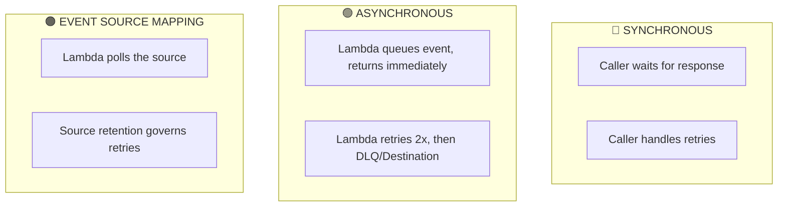
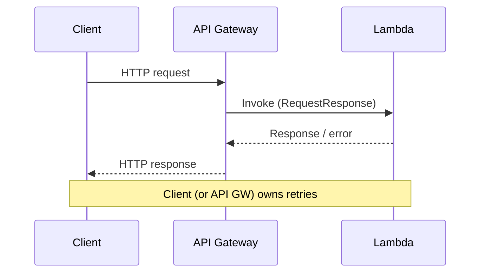
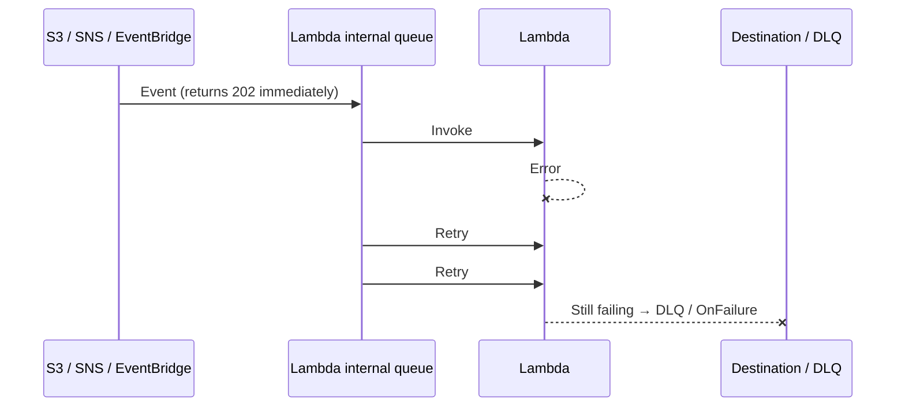
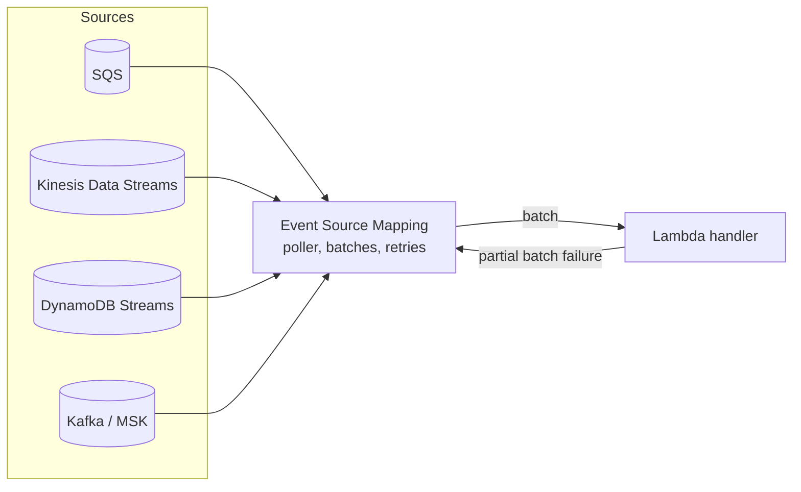
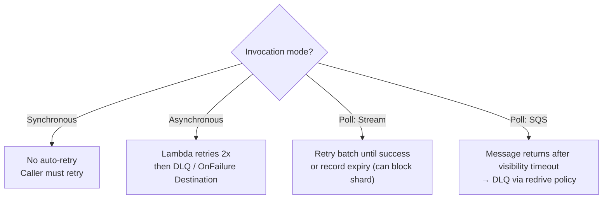
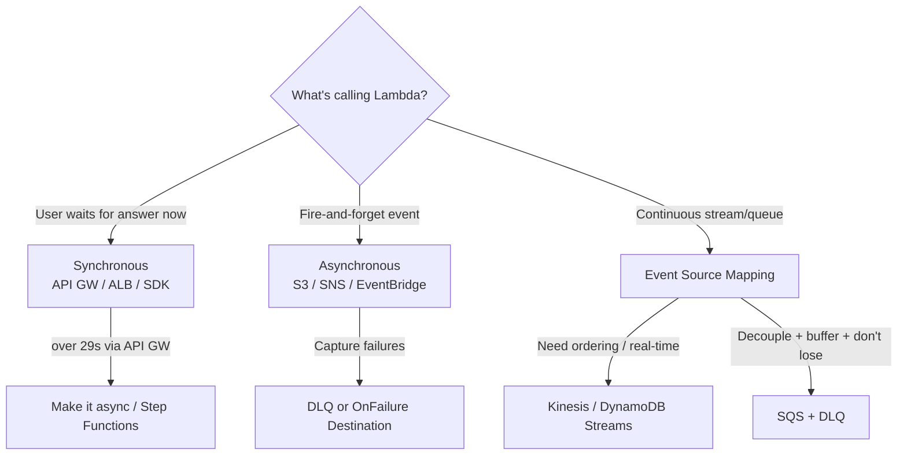

# 📘 Lambda Invocation Modes - SAA-C03 Deep Dive

> Lambda has exactly **three invocation modes — Synchronous, Asynchronous, and Event Source Mapping (poll-based)**. The mode is dictated by the *trigger*, and it changes everything: who waits, who retries, where failures go, and how you're billed. This is one of the highest-yield Lambda topics on the exam.

See also: [Lambda Core Concepts & Architecture](Lambda%20Core%20Concepts%20%26%20Architecture.md) · [Lambda intro](Lambda%20intro.md) · [Lambda Concurrency & Scaling](Lambda%20Concurrency%20%26%20Scaling.md) · [Lambda Cold Starts & Performance](Lambda%20Cold%20Starts%20%26%20Performance.md) · [Lambda Scenario Questions](Lambda%20Scenario%20Questions.md)

---

## Table of Contents

- [1. The Three Modes at a Glance](#1-the-three-modes-at-a-glance)
- [2. Synchronous Invocation](#2-synchronous-invocation)
- [3. Asynchronous Invocation](#3-asynchronous-invocation)
- [4. Event Source Mapping (Poll-Based)](#4-event-source-mapping-poll-based)
- [5. Retry Behaviour by Mode (Critical)](#5-retry-behaviour-by-mode-critical)
- [6. Error Handling: DLQ vs Destinations vs Failure Records](#6-error-handling-dlq-vs-destinations-vs-failure-records)
- [7. Which Service Uses Which Mode?](#7-which-service-uses-which-mode)
- [8. Exam Decision Tree](#8-exam-decision-tree)
- [9. Mini Scenario Drills](#9-mini-scenario-drills)

---

---

## 1. The Three Modes at a Glance

| | **Synchronous** | **Asynchronous** | **Event Source Mapping (Poll)** |
| :--- | :--- | :--- | :--- |
| **Who waits?** | Caller waits for result | Caller gets immediate `202` | Lambda polls; no external caller |
| **Retries** | **Caller's responsibility** | Lambda: **2 retries** then DLQ/Destination | Governed by **source retention** |
| **Typical sources** | API Gateway, ALB, CLI/SDK, Cognito, Step Functions | S3, SNS, EventBridge, CodePipeline | SQS, Kinesis, DynamoDB Streams, Kafka/MSK |
| **Billing for polling** | n/a | n/a | **Polling is free**; pay only for invocations |
| **Ordering** | n/a | Not guaranteed | Kinesis/DDB: per-shard order; SQS FIFO: per-group |
| **Failure lands in** | Returned error to caller | DLQ / OnFailure Destination | Stays in source / DLQ on source / partial-batch fail |

[⬆ Back to top](#table-of-contents)

---

## 2. Synchronous Invocation

The caller **blocks until Lambda finishes** and returns the response (or error). Used for **latency-sensitive, request/response** workloads.

**Key points & timeouts**
- Achieved via **API Gateway, ALB, AWS CLI/SDK (`RequestResponse`), Cognito triggers, Step Functions, Lex**.
- Lambda's own max timeout is **15 min**, but the *trigger* often caps it lower:
  - **API Gateway: 29 seconds** integration timeout.
  - **ALB:** bounded by the target group / idle timeout.
- **Retries are NOT automatic** — the client must retry on failure.
- Payload limit: **6 MB**.

> 🧠 **Exam keyword:** "API returns a timeout after ~29s even though my Lambda can run 15 min" → **API Gateway 29-second integration timeout**. Fix: make the work **asynchronous** (return 202, process in background) or use Step Functions / direct invoke.

[⬆ Back to top](#table-of-contents)

---

## 3. Asynchronous Invocation

Lambda **queues the event in an internal queue** and returns `202 Accepted` immediately. Lambda then pulls from the queue and invokes the function — handling retries and routing failures for you.

**Key points**
- Sources: **S3, SNS, EventBridge, CodeCommit/CodePipeline, SES**, etc.
- **Default 2 retries** (3 total attempts), with delays between them. Tunable: **0–2 retries** and **event max age (up to 6 hours)**.
- Because retries happen, your function should be **idempotent** (same event may run more than once).
- Configure **Destinations** (`OnSuccess`/`OnFailure`) or a **DLQ** to capture outcomes.
- Payload limit: **256 KB**.

> 🧠 **Exam trap — duplicate processing:** async (and poll) can deliver an event **more than once** → always design **idempotent** handlers (e.g., conditional writes, dedupe keys).

[⬆ Back to top](#table-of-contents)

---

## 4. Event Source Mapping (Poll-Based)

For **streams and queues**, Lambda runs an **Event Source Mapping (ESM)**: a poller that reads batches from the source and **synchronously invokes** your function with the batch. You are **not charged for the polling**, only for invocations.

### Stream sources (Kinesis, DynamoDB Streams)
- Read **per shard, in order**; one Lambda invocation per shard's batch.
- Scale with **shards** (1 concurrent invoke per shard, more with **parallelization factor** up to 10).
- On error, Lambda **retries the whole batch until success or record expiry** → a "poison pill" can **block the shard**. Mitigate with: **bisect-on-error**, **max retry attempts**, **max record age**, and an **on-failure destination** (SQS/SNS) for discarded batches.
- Tuning knobs: **batch size**, **batch window** (buffer up to 300 s), **starting position**.

### Queue sources (SQS standard / FIFO)
- Lambda polls and deletes messages on success; failures **return to the queue** after the visibility timeout.
- Use a **redrive policy → DLQ** on the SQS queue for poison messages.
- **Report partial batch failures** so only failed messages are retried, not the whole batch.
- Scaling: Lambda adds pollers automatically (up to the concurrency limit). SQS retry window = **source retention (up to 14 days)**.

> 🧠 **Exam keywords:**
> - "ordered, real-time stream processing" → **Kinesis / DynamoDB Streams + Lambda** (per-shard order).
> - "decouple + buffer spikes, don't lose messages" → **SQS + Lambda** (+ DLQ).
> - "one bad record blocks my Kinesis processing" → enable **bisect batch on error / max retry / on-failure destination**.

[⬆ Back to top](#table-of-contents)

---

## 5. Retry Behaviour by Mode (Critical)

| Mode | Auto-retry? | Where unresolved failures go |
| :--- | :--- | :--- |
| Synchronous | ❌ No | Error returned to caller |
| Asynchronous | ✅ 2 retries (tunable 0–2) | DLQ or `OnFailure` Destination |
| Stream (Kinesis/DDB) | ✅ Until success or expiry | On-failure destination after max retries/age |
| SQS | ✅ Until success or retention | SQS DLQ (redrive policy) |

[⬆ Back to top](#table-of-contents)

---

## 6. Error Handling: DLQ vs Destinations vs Failure Records

| Mechanism | Applies to | Captures | Targets |
| :--- | :--- | :--- | :--- |
| **DLQ (Lambda)** | Async only | Failed events after retries | SQS, SNS |
| **Destinations** | Async only | **Success + failure** records (rich) | SQS, SNS, Lambda, EventBridge |
| **SQS redrive → DLQ** | SQS ESM | Messages exceeding maxReceiveCount | SQS DLQ |
| **On-failure destination** | Stream ESM | Discarded batch metadata | SQS, SNS |

> 🧠 **Destinations > DLQ** for new designs: richer payload, success path, more targets. DLQ is the older async-only failure-only mechanism. Both still appear on the exam.

[⬆ Back to top](#table-of-contents)

---

## 7. Which Service Uses Which Mode?

| Service / Trigger | Mode |
| :--- | :--- |
| API Gateway, ALB | Synchronous |
| AWS CLI / SDK (`RequestResponse`) | Synchronous |
| Cognito, Lex, Step Functions (standard) | Synchronous |
| S3 events | Asynchronous |
| SNS | Asynchronous |
| EventBridge (rules / scheduler) | Asynchronous |
| SES, CodePipeline, CloudFormation | Asynchronous |
| SQS (standard & FIFO) | Event Source Mapping (poll) |
| Kinesis Data Streams | Event Source Mapping (poll) |
| DynamoDB Streams | Event Source Mapping (poll) |
| Amazon MSK / self-managed Kafka | Event Source Mapping (poll) |

> ⚠️ **Common confusion:** SNS → Lambda is **async**, but SQS → Lambda is **poll-based (ESM)**. They look similar but behave very differently for retries and ordering.

[⬆ Back to top](#table-of-contents)

---

## 8. Exam Decision Tree

[⬆ Back to top](#table-of-contents)

---

## 9. Mini Scenario Drills

**Q1.** An API Gateway → Lambda call fails at ~29 s though the function needs ~2 min. Fix?
*A:* The **29 s API Gateway integration timeout**. Make it **asynchronous** (return `202`, process in background / via SQS or Step Functions) — don't just raise the Lambda timeout.

**Q2.** S3-triggered image processing occasionally fails and events are lost. Requirement: keep failed events for reprocessing.
*A:* S3 invokes Lambda **asynchronously**; add an **OnFailure Destination (SQS/SNS)** or **DLQ**.

**Q3.** One malformed record stalls a Kinesis consumer; the shard stops progressing.
*A:* Stream ESM retries the batch until expiry. Enable **bisect batch on function error**, set **maximum retry attempts / record age**, and add an **on-failure destination**.

**Q4.** Orders must be decoupled, buffered during spikes, and never lost; some messages occasionally fail permanently.
*A:* **SQS + Lambda (ESM)** with a **redrive policy → DLQ**; enable **partial batch response** so only failed messages retry.

**Q5.** Why is SQS→Lambda cheaper than running a constant poller on EC2?
*A:* With an **Event Source Mapping, polling is free** — you pay only for actual invocations.

[⬆ Back to top](#table-of-contents)
