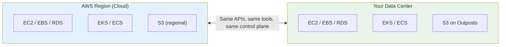
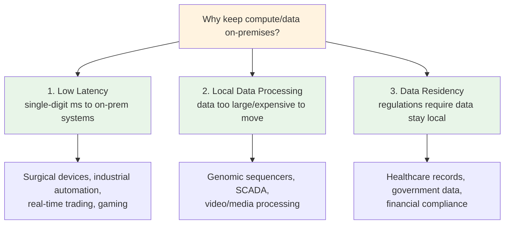
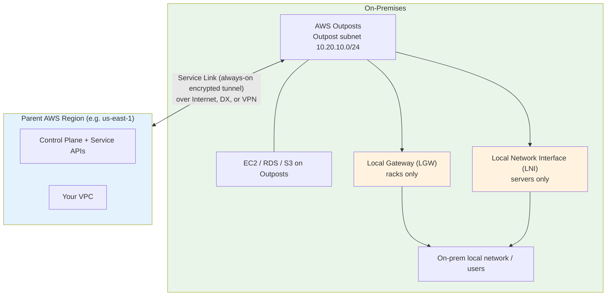

# AWS Outposts - SAA-C03 Intro

> AWS Outposts is a **fully managed service** that extends AWS infrastructure, services, APIs, and tools to virtually any on-premises data center, co-location space, or edge facility. For the exam, think of Outposts as **"AWS coming to your data center"** — the same hardware, APIs, and control plane you use in the cloud, now running locally.

See also: [02 - Outposts Architecture Deep Dive](02%20-%20Outposts%20Architecture%20Deep%20Dive.md) · [03 - Outposts Services Deep Dive](03%20-%20Outposts%20Services%20Deep%20Dive.md) · [04 - Outposts Examples & Patterns](04%20-%20Outposts%20Examples%20%26%20Patterns.md) · [05 - Outposts Scenario Questions](05%20-%20Outposts%20Scenario%20Questions.md) · [06 - Outposts Important Facts & Cheat Sheet](06%20-%20Outposts%20Important%20Facts%20%26%20Cheat%20Sheet.md)

Related edge/hybrid topics: [AWS Global Infrastructure](AWS%20Global%20Infrastructure.md)

---

## Table of Contents

- [Core Concept: What is AWS Outposts?](#core-concept-what-is-aws-outposts)
- [Outposts Physical Form Factors](#outposts-physical-form-factors)
- [When to Use AWS Outposts (Three Core Drivers)](#when-to-use-aws-outposts-three-core-drivers)
- [AWS Services Available on Outposts](#aws-services-available-on-outposts)
- [How Outposts Connects to the AWS Region](#how-outposts-connects-to-the-aws-region)
- [Outposts vs Local Zones vs Wavelength (Exam Favorite)](#outposts-vs-local-zones-vs-wavelength-exam-favorite)
- [Shared Responsibility & Security on Outposts](#shared-responsibility--security-on-outposts)
- [Outposts Across the Four Exam Domains](#outposts-across-the-four-exam-domains)

---

## Core Concept: What is AWS Outposts?

**AWS Outposts is NOT "hardware as a service"** — it is a **fully managed extension of the AWS cloud** into your on-premises environment. AWS builds, ships, installs, monitors, patches, and replaces the hardware. You consume AWS services on it exactly as you would in a Region.

**Three things that make Outposts "Outposts":**

1. You don't touch the hardware — AWS delivers, installs, and maintains it.
2. You run **real AWS services locally** using familiar tools (Console, CLI, SDKs, CloudFormation).
3. Your on-premises Outpost is **logically part of a parent AWS Region** and is associated with a **single Availability Zone** in that Region.

> [!warning] Critical exam framing
> Outposts is **NOT** for making applications highly available *in the cloud* — that is what **Availability Zones** are for. A single Outpost maps to a single AZ and is therefore a single point of failure. Outposts exists to bring the cloud experience **on-premises**.

---

## Outposts Physical Form Factors

AWS offers Outposts in **two families**:

| Family | Sizes | Processor | Use Case |
| :--- | :--- | :--- | :--- |
| **Outposts servers** | 1U and 2U | 1U = AWS Graviton2; 2U = Intel Xeon Scalable | Restaurants, hospitals, retail stores, factories, branch offices — small/edge sites |
| **Outposts racks** | Standard 42U rack, scalable to many racks | Same instance families as Region | Enterprise data centers needing Region-scale compute/storage locally |

**Key distinctions for the exam:**

- **Racks** support the broadest service set (RDS, EMR, ElastiCache, ALB, S3 on Outposts, the Local Gateway) and large capacity.
- **Servers** are for space/power-constrained edge sites. They support EC2, EBS, ECS, and (for connectivity) a **Local Network Interface (LNI)** instead of a Local Gateway.
- Both are **Nitro-based** and use the same APIs — smaller form factors keep full functionality, just less capacity.

> See [02 - Outposts Architecture Deep Dive](02%20-%20Outposts%20Architecture%20Deep%20Dive.md) for the rack-vs-server networking and capacity differences.

---

## When to Use AWS Outposts (Three Core Drivers)

The exam tests your ability to recognize **when Outposts is the right answer**. There are three primary drivers:

### Exam recognition patterns

| If the question mentions... | Think... |
| :--- | :--- |
| "Must keep data on-premises for regulatory reasons" | Outposts (data residency) |
| "Cannot move database to cloud due to compliance" | Outposts |
| "Single-digit millisecond latency to on-prem systems" | Outposts (low latency) |
| "Terabytes generated locally, can't move to cloud" | Outposts (local processing) |
| "Same APIs and tools as the AWS Region" | Outposts |
| "Fully managed by AWS, in my data center" | Outposts |
| "Consistent hybrid experience" | Outposts |

---

## AWS Services Available on Outposts

Outposts runs a growing set of AWS services **locally** on the hardware. Deep dives for each are in [03 - Outposts Services Deep Dive](03%20-%20Outposts%20Services%20Deep%20Dive.md).

### Compute & storage (core)

| Service | On Outposts | Notes |
| :--- | :--- | :--- |
| **Amazon EC2** | Racks & servers | M/C/R general families; G4dn graphics; capacity is fixed at order time |
| **Amazon EBS** | Racks & servers | `gp2` local volumes; snapshots to parent Region or **local snapshots** on S3 on Outposts |
| **Amazon S3 on Outposts** | Racks only | S3-compatible API via **access points**; data stays local; `S3 Outposts` storage class |

### Containers

| Service | On Outposts | Use Case |
| :--- | :--- | :--- |
| **Amazon ECS** | Racks & servers | Run containers on-prem with the Region's control plane |
| **Amazon EKS** | Racks & servers | Managed Kubernetes; **local clusters** survive disconnection, **extended clusters** keep control plane in Region |

### Databases, analytics, networking

| Service | On Outposts | Notes |
| :--- | :--- | :--- |
| **Amazon RDS on Outposts** | Racks only | SQL Server, MySQL, PostgreSQL; backups/snapshots go to parent Region |
| **Amazon ElastiCache** | Racks only | Redis / Memcached |
| **Amazon EMR** | Racks only | Analytics clusters on-prem |
| **Application Load Balancer** | Racks only | Local ALB for on-prem traffic distribution |

> **Exam trick:** the **control plane always lives in the parent Region**. Services like IAM, CloudFormation, and the AWS Console manage Outposts remotely. Only the listed *data-plane* services execute locally.

---

## How Outposts Connects to the AWS Region

Every Outpost is logically **attached to one parent AWS Region**. Two connections matter:

- **Service link** — an always-on, encrypted connection back to the parent Region carrying **control-plane and management traffic**. Runs over the public internet, an AWS Direct Connect (public or private VIF), or a VPN.
- **Local Gateway (LGW)** — *racks only*. Routes traffic between the Outpost subnet and your **on-premises local network** for low-latency local access and ingress.
- **Local Network Interface (LNI)** — *servers only*. Attaches an instance directly to the on-prem network at layer 2 (servers have no LGW).

> [!note] What happens if the service link drops?
> Existing local workloads **keep running** (the data plane is local), but you **cannot launch new instances, make API/management changes, or use services that depend on the Region**. Design for this: use EKS **local clusters** and EBS **local snapshots** for disconnection tolerance. More in [02 - Outposts Architecture Deep Dive](02%20-%20Outposts%20Architecture%20Deep%20Dive.md).

---

## Outposts vs Local Zones vs Wavelength (Exam Favorite)

This comparison appears frequently. Know which service solves which problem.

| Aspect | AWS Outposts | AWS Local Zones | AWS Wavelength |
| :--- | :--- | :--- | :--- |
| **Location** | YOUR data center / co-lo | AWS-owned site in a metro area | Inside a telecom carrier's 5G data center |
| **Hardware owner** | AWS (in your facility) | AWS | AWS (in carrier facility) |
| **Latency target** | Single-digit ms to on-prem systems | Single-digit ms to metro end users | Ultra-low latency over the 5G network |
| **Primary use** | On-prem workloads, data residency, local processing | Latency-sensitive apps for a metro with no Region | 5G edge apps (AR/VR, real-time mobile gaming) |
| **Control plane** | Parent Region | Parent Region | Parent Region |

**Memory aid:**

- **Outposts** = "My building, AWS-owned hardware, my compliance."
- **Local Zones** = "AWS's building near me, not my facility."
- **Wavelength** = "Inside the 5G carrier's network."

> At re:Invent 2020, Andy Jassy framed it as: *Outposts targets on-premises workloads; Local Zones target end users in a geographic area; Wavelength marries 5G networks with AWS edge compute.*

---

## Shared Responsibility & Security on Outposts

Security for services on Outposts is **identical** to the same services in a Region — don't overthink it. The split shifts only for the *physical* layer.

| Aspect | Responsible party |
| :--- | :--- |
| Physical site security (the room/rack) | **Customer** (it's in your facility) |
| Hardware delivery, maintenance, replacement | **AWS** |
| Software updates / firmware patches | **AWS** |
| Service-level security: IAM, SGs, S3 bucket policies, encryption | **Customer** (same as cloud) |
| EBS volume & local snapshot encryption | Encrypted by default |

> **Exam trick:** A misconfigured S3 bucket or over-permissive security group on Outposts is a *customer* problem and behaves exactly like it would in the Region. Outposts adds physical custody responsibility but does not change service-level security.

---

## Outposts Across the Four Exam Domains

| Domain | Outposts application |
| :--- | :--- |
| **Secure architectures** | Customer owns physical custody; IAM/SG/encryption identical to cloud; data residency satisfied by keeping data local |
| **Resilient architectures** | A single Outpost = single AZ = SPOF; pair **two Outposts** for HA; back up to the parent Region; EKS local clusters survive disconnection |
| **High-performing architectures** | Single-digit ms latency to on-prem systems; local data processing avoids round-trips to the Region |
| **Cost-optimized architectures** | 3-year commitment (all/partial/no upfront) covers hardware + install + maintenance; no data-egress charge for local-only processing |

---

> Next: [02 - Outposts Architecture Deep Dive](02%20-%20Outposts%20Architecture%20Deep%20Dive.md) — networking internals, capacity model, resilience, and the disconnection design pattern.
