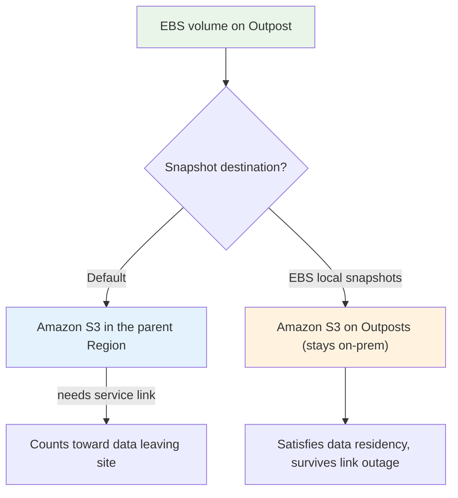
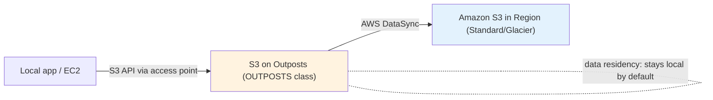
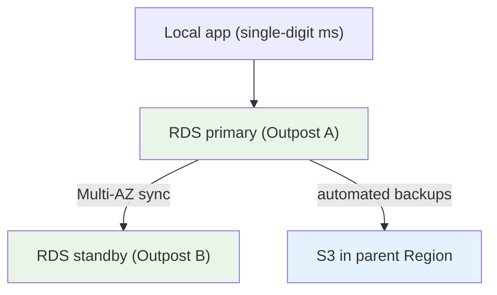
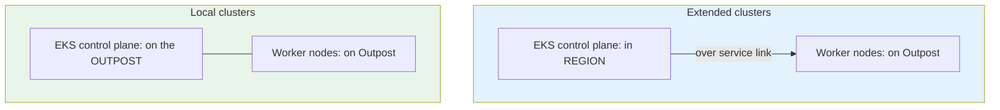

# AWS Outposts - Services Deep Dive

> How each AWS service actually behaves when it runs on an Outpost: EC2, EBS (and local snapshots), S3 on Outposts (access points + DataSync), RDS, ElastiCache/EMR, ECS, and EKS local-vs-extended clusters. The exam tests the *differences* from the Region version, not the basics of each service.

See also: [01 - Outposts Intro](01%20-%20Outposts%20Intro.md) · [02 - Outposts Architecture Deep Dive](02%20-%20Outposts%20Architecture%20Deep%20Dive.md) · [04 - Outposts Examples & Patterns](04%20-%20Outposts%20Examples%20%26%20Patterns.md) · [05 - Outposts Scenario Questions](05%20-%20Outposts%20Scenario%20Questions.md) · [06 - Outposts Important Facts & Cheat Sheet](06%20-%20Outposts%20Important%20Facts%20%26%20Cheat%20Sheet.md)

---

## Table of Contents

- [Part 1: EC2 on Outposts](#part-1-ec2-on-outposts)
- [Part 2: EBS on Outposts & Local Snapshots](#part-2-ebs-on-outposts--local-snapshots)
- [Part 3: S3 on Outposts](#part-3-s3-on-outposts)
- [Part 4: RDS on Outposts](#part-4-rds-on-outposts)
- [Part 5: ElastiCache & EMR on Outposts](#part-5-elasticache--emr-on-outposts)
- [Part 6: Containers — ECS on Outposts](#part-6-containers--ecs-on-outposts)
- [Part 7: Containers — EKS Local vs Extended Clusters](#part-7-containers--eks-local-vs-extended-clusters)
- [Part 8: Networking Services — ALB & Route 53 Resolver](#part-8-networking-services--alb--route-53-resolver)
- [Service Availability Matrix](#service-availability-matrix)

---

## Part 1: EC2 on Outposts

- Runs the same **AMIs, instance families, and APIs** as the Region — but only the **families/sizes you purchased** are available.
- **No on-demand elasticity beyond purchased capacity.** Auto Scaling Groups work, but they scale only within the Outpost's physical pool; for overflow, target a Region subnet.
- **Placement** is controlled by launching into an **Outpost subnet**. Same security groups, ENIs, and IAM as Region instances.
- Supports **Dedicated Hosts**-style capacity management via **capacity tasks** (re-slice the pool into different instance sizes without new hardware).

| EC2 aspect | Region | On Outposts |
| :--- | :--- | :--- |
| Instance families | All available | Only those you ordered |
| Pricing | On-demand / Spot / RI / SP | Pre-purchased capacity (3-yr Outpost) |
| Spot Instances | Yes | **No** (no spare market locally) |
| Scaling ceiling | Effectively unlimited | Physical capacity of the Outpost |
| Placement | AZ of choice | The Outpost's single AZ |

> **Exam nugget:** There are **no Spot Instances** on Outposts — there is no spare-capacity marketplace on your fixed hardware.

---

## Part 2: EBS on Outposts & Local Snapshots

- Outposts provides **local EBS volumes** (default type **`gp2`**) backed by the storage in the Outpost.
- Volumes are **encrypted** and attach to local EC2 instances exactly like in-Region EBS.

**Snapshots — two destinations (know the difference):**

| Snapshot type | Where stored | Why choose it |
| :--- | :--- | :--- |
| Default snapshot | **S3 in parent Region** | DR, cross-Region copy, normal backup |
| **EBS local snapshots on Outposts** | **S3 on Outposts** (local) | **Data residency**, faster local restore, works during service-link outage |

> **Exam trigger:** "Snapshots must remain on-premises for compliance" → **EBS local snapshots on Outposts** (requires S3 on Outposts capacity).

---

## Part 3: S3 on Outposts

- A dedicated **local object store** with an **S3-compatible API** — but you access objects through **S3 on Outposts access points**, not the global `s3.amazonaws.com` namespace.
- Uses the **`OUTPOSTS` storage class** (`S3 Outposts`). Data **stays on the Outpost** — ideal for data residency and local processing.
- Capacity is **finite** (what you provisioned). Lifecycle: expire objects, or **move data to a Region** with **AWS DataSync**.
- Encryption with SSE-S3 (and SSE-KMS via keys in the Region).

| S3 feature | Regional S3 | S3 on Outposts |
| :--- | :--- | :--- |
| Access | Bucket name / global endpoint | **Access points only** |
| Storage class | Standard, IA, Glacier, etc. | **`OUTPOSTS`** only |
| Durability scope | Across AZs in Region | Within the single Outpost |
| Move data to Region | n/a | **AWS DataSync** |
| Data residency | Region | **On-premises (local)** |

> **Exam trigger:** "Objects via the S3 API but must never leave the site" → **S3 on Outposts**. To later archive to the cloud, use **DataSync**.

---

## Part 4: RDS on Outposts

- Managed **RDS** running locally: **SQL Server, MySQL, PostgreSQL** (racks only).
- Automated **backups and snapshots are stored in the parent Region's S3** (so RDS backups *do* traverse the service link — note this for data-residency questions about the *database engine vs. backups*).
- **Multi-AZ** for RDS on Outposts is achieved by spanning **two Outposts** at different sites (standby on the second Outpost).
- Use it when a relational DB must stay local for latency/residency but you still want managed patching, backups, and monitoring.

> **Subtlety:** RDS on Outposts keeps the *live database* local, but its *backups* go to the Region. If a question demands that **even backups** stay on-prem, RDS on Outposts may not satisfy it — consider self-managed DB on EC2 + EBS local snapshots.

---

## Part 5: ElastiCache & EMR on Outposts

- **ElastiCache on Outposts** (racks) — Redis / Memcached for low-latency in-memory caching next to local apps.
- **EMR on Outposts** (racks) — run Hadoop/Spark analytics on data that must stay local (genomics, manufacturing telemetry) without shipping it to the Region.
- Both follow the same rule: **data plane local, control plane in the Region.**

---

## Part 6: Containers — ECS on Outposts

- Run **Amazon ECS** tasks on Outpost EC2 capacity with the **ECS control plane in the Region**.
- Same task definitions, services, and tooling as in-Region ECS; you just place tasks on the Outpost capacity provider / cluster instances.
- **Fargate is not available on Outposts** — you bring EC2 capacity (Fargate is Region-only).
- If the service link drops, **already-running tasks keep running**, but the ECS scheduler (in Region) can't place or reschedule tasks.

> **Exam trap:** "Run containers on-prem with the same control plane as AWS" → **ECS/EKS on Outposts**, *not* ECS Anywhere/EKS Anywhere (those are for **non-Outposts** customer hardware).

---

## Part 7: Containers — EKS Local vs Extended Clusters

This is the most nuanced container topic. Two ways to run EKS with Outposts:

| Aspect | Extended cluster | Local cluster |
| :--- | :--- | :--- |
| Control plane location | **In the Region** | **On the Outpost** |
| Worker nodes | On the Outpost | On the Outpost |
| Survives service-link outage? | **No** — nodes lose the control plane | **Yes** — fully operates locally |
| Best for | Workloads tolerant of Region dependency | Workloads needing **disconnection resilience** |

> **Exam trigger:** "Kubernetes workload must keep operating even if the link to AWS is lost" → **EKS local cluster** on Outposts.

---

## Part 8: Networking Services — ALB & Route 53 Resolver

- **Application Load Balancer on Outposts** (racks) — distribute traffic to local targets with an ALB that runs **on the Outpost**, so balancing doesn't depend on the Region.
- **Route 53 Resolver** can resolve names locally; integrate with on-prem DNS for hybrid name resolution.
- Standard **VPC constructs** (security groups, NACLs, route tables) all apply to Outpost subnets unchanged.

---

## Service Availability Matrix

| Service | Servers (1U/2U) | Racks (42U) | Key note |
| :--- | :--- | :--- | :--- |
| EC2 | ✅ | ✅ | Purchased families only; no Spot |
| EBS (gp2) | ✅ | ✅ | Local snapshots need S3 on Outposts |
| ECS | ✅ | ✅ | Control plane in Region; no Fargate |
| EKS (extended) | ✅ | ✅ | Control plane in Region |
| EKS (local) | ✅ | ✅ | Control plane on Outpost — disconnection-tolerant |
| S3 on Outposts | ❌ | ✅ | Access points + `OUTPOSTS` class |
| RDS | ❌ | ✅ | Backups go to Region |
| ElastiCache | ❌ | ✅ | Redis / Memcached |
| EMR | ❌ | ✅ | Local analytics |
| Application Load Balancer | ❌ | ✅ | Local load balancing |
| Local Gateway (LGW) | ❌ | ✅ | Racks use LGW |
| Local Network Interface (LNI) | ✅ | (n/a) | Servers use LNI |

> The matrix is the single highest-yield table for "which form factor supports X" questions. Memorize that **storage/DB/analytics/ALB are racks-only**, while **EC2/EBS/ECS/EKS run on both**.

> Next: [04 - Outposts Examples & Patterns](04%20-%20Outposts%20Examples%20%26%20Patterns.md) — concrete architectures, CLI, and reference designs.
