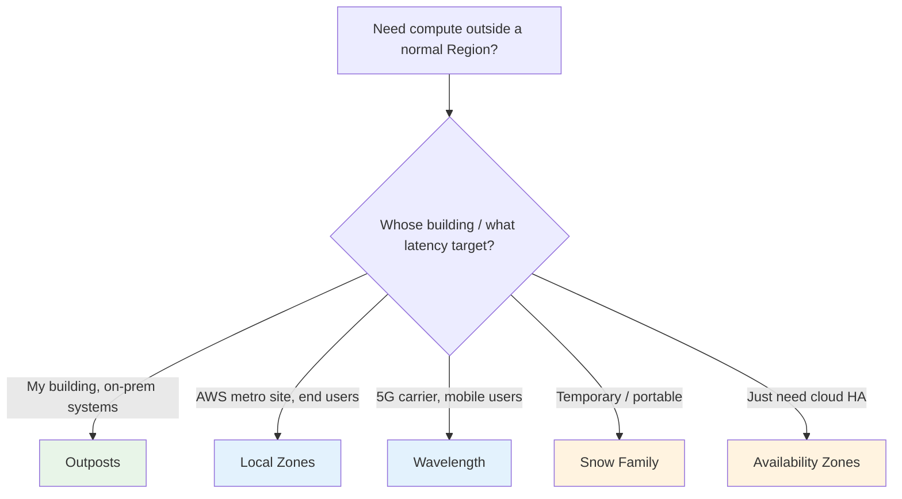

# AWS Outposts - Important Facts & Cheat Sheet

> One-page cram: the high-yield facts, gotchas, comparison tables, and trigger words for SAA-C03. If you only review one Outposts file the night before, make it this one.

See also: [01 - Outposts Intro](01%20-%20Outposts%20Intro.md) · [02 - Outposts Architecture Deep Dive](02%20-%20Outposts%20Architecture%20Deep%20Dive.md) · [03 - Outposts Services Deep Dive](03%20-%20Outposts%20Services%20Deep%20Dive.md) · [04 - Outposts Examples & Patterns](04%20-%20Outposts%20Examples%20%26%20Patterns.md) · [05 - Outposts Scenario Questions](05%20-%20Outposts%20Scenario%20Questions.md)

---

## The 12 facts most likely to be tested

1. **Outposts = AWS hardware in YOUR facility**, fully managed by AWS (delivery, install, patch, replace).
2. An Outpost has **exactly one parent Region** and maps to **one Availability Zone** → it is a **single point of failure**.
3. The **control plane lives in the Region**; the Outpost runs the **data plane** locally.
4. **Service link** = always-on encrypted tunnel to the Region (DX preferred, also VPN or internet).
5. On a **service-link outage**: running workloads continue locally; **no new launches / no management API**.
6. **Two form factors**: **servers (1U/2U)** for edge; **racks (42U)** for data centers.
7. **LGW (Local Gateway) = racks only**; **LNI (Local Network Interface) = servers only**.
8. **Racks-only services**: S3 on Outposts, RDS, ElastiCache, EMR, ALB.
9. **No Spot, no Fargate** on Outposts; capacity is **pre-purchased** (3-year term).
10. **EBS local snapshots** + **S3 on Outposts** keep data fully on-prem (residency); **RDS backups go to the Region**.
11. **EKS local cluster** survives disconnection; **extended cluster** depends on the Region control plane.
12. Three drivers to pick Outposts: **low latency, local data processing, data residency**.

---

## Outposts vs the edge/hybrid family (the big differentiator table)

| Service | Where it lives | Pick it when... |
| :--- | :--- | :--- |
| **Outposts** | Your data center / co-lo | On-prem workloads, data residency, single-digit-ms to on-prem systems, consistent hybrid |
| **Local Zones** | AWS-owned metro site | Low latency to **end users** in a metro with no Region nearby |
| **Wavelength** | Telecom 5G data center | Ultra-low latency to **mobile/5G** users (AR/VR, mobile gaming) |
| **Snow Family** | Anywhere, portable | **Temporary/rugged** edge compute + bulk data transfer to AWS |
| **Availability Zones** | AWS Region | **High availability** for cloud apps (NOT Outposts) |
| **ECS/EKS Anywhere** | Your own hardware | Containers on **non-Outposts** hardware you fully manage |

---

## Form factor cheat sheet

| | Servers (1U/2U) | Racks (42U) |
| :--- | :--- | :--- |
| Local connectivity | **LNI** | **LGW** |
| EC2 / EBS / ECS / EKS | ✅ | ✅ |
| S3 on Outposts / RDS / ElastiCache / EMR / ALB | ❌ | ✅ |
| Best site | Store, clinic, factory, branch | Enterprise / co-lo data center |
| Install | Customer-installable | AWS-installed |

---

## Connectivity cheat sheet

| Construct | Form factor | Carries | Notes |
| :--- | :--- | :--- | :--- |
| **Service link** | Both | Control plane + VPC traffic to Region | DX / VPN / internet; always-on |
| **Local Gateway (LGW)** | Racks | Outpost ↔ on-prem LAN | Has a route table; local ingress |
| **Local Network Interface (LNI)** | Servers | Instance ↔ on-prem LAN | Direct local attach |

---

## Per-service "what's different on Outposts" gotchas

| Service | Gotcha |
| :--- | :--- |
| **EC2** | Only purchased families; **no Spot**; scale ceiling = physical capacity |
| **EBS** | Default `gp2`; choose **local snapshots** for residency vs Region snapshots for DR |
| **S3 on Outposts** | Access points only; `OUTPOSTS` storage class; move to Region via **DataSync** |
| **RDS** | SQL Server / MySQL / PostgreSQL; **backups go to Region**; Multi-AZ = two Outposts |
| **ECS** | Control plane in Region; **no Fargate** |
| **EKS** | **Local cluster** = disconnection-tolerant; **extended cluster** = Region control plane |
| **ALB** | Racks only; balances local targets without Region dependency |

---

## Trigger-word → answer (final cram)

| Question says... | Answer |
| :--- | :--- |
| "regulatory / data residency / data stays on-prem" | **Outposts** (+ local snapshots / S3 on Outposts) |
| "single-digit ms to on-prem systems" | **Outposts** |
| "TBs generated locally, can't ship to cloud" | **Outposts** (local processing) |
| "same AWS APIs/tools on-prem" / "consistent hybrid" | **Outposts** |
| "fully managed by AWS in my data center" | **Outposts** |
| "containers on-prem, same control plane" | **ECS/EKS on Outposts** |
| "k8s must survive losing AWS link" | **EKS local cluster** |
| "backups must also stay local" | **Self-managed DB on EC2 + EBS local snapshots** |
| "metro end users, no Region nearby" | **Local Zones** |
| "5G / mobile edge" | **Wavelength** |
| "temporary rugged field site" | **Snow Family** |
| "make cloud app highly available" | **Availability Zones** (trap — not Outposts) |
| "connect one Outpost to multiple Regions" | **Impossible** — one parent Region |
| "Spot Instances on Outposts" | **Not available** |
| "Fargate on Outposts" | **Not available** (Region-only) |

---

## Domain mapping recap

| Exam domain | Outposts angle |
| :--- | :--- |
| Secure | Customer = physical custody + service config; AWS = hardware/patching; residency satisfied locally |
| Resilient | Single Outpost = single AZ; pair two Outposts + Region DR; EKS local clusters for partitions |
| High-performing | Single-digit-ms local latency; local data processing avoids Region round-trips |
| Cost-optimized | 3-yr commitment bundles HW+install+maintenance; no local-egress charge; burst to Region for elasticity |

---

> Back to start: [01 - Outposts Intro](01%20-%20Outposts%20Intro.md)
