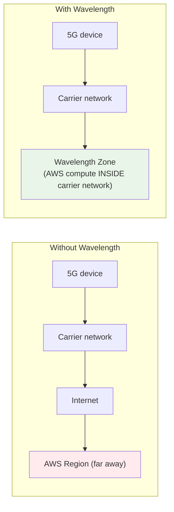
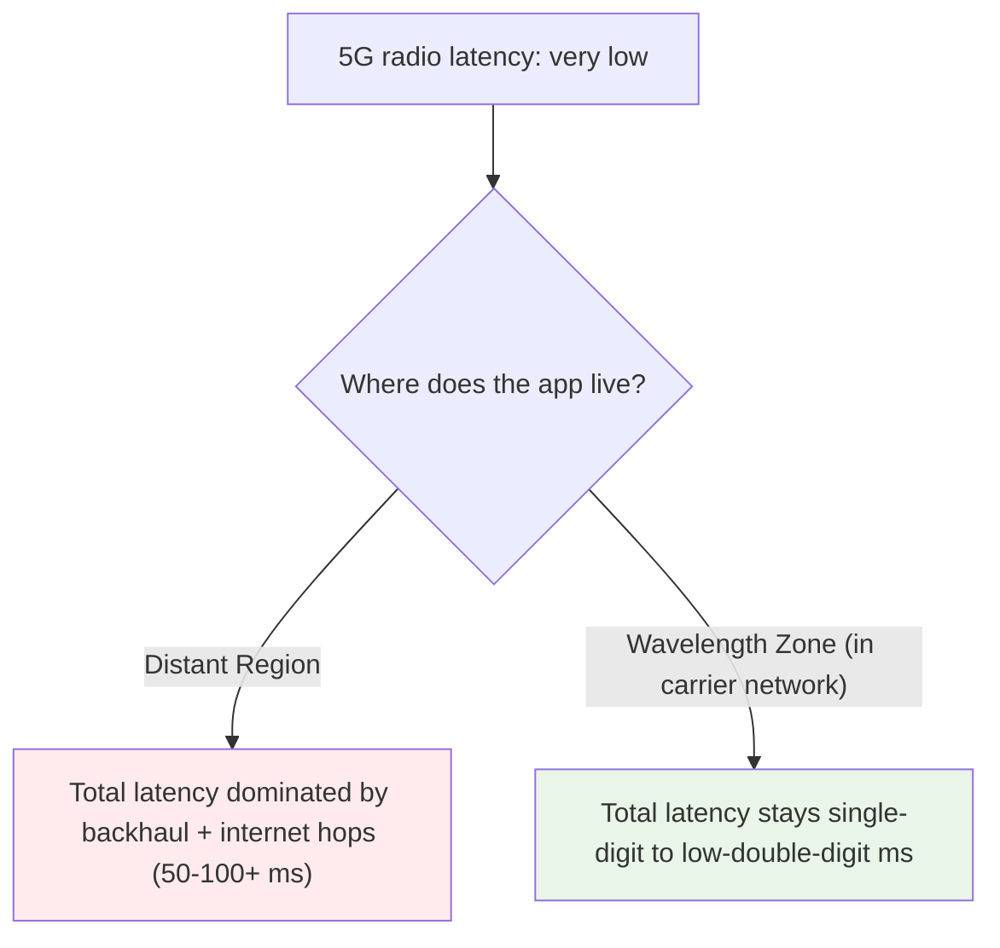
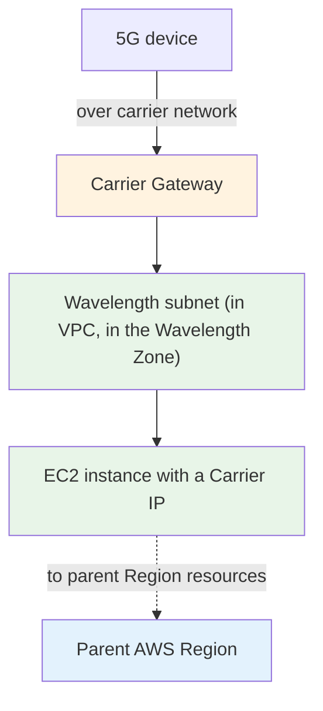
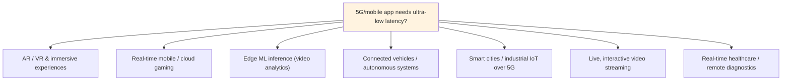
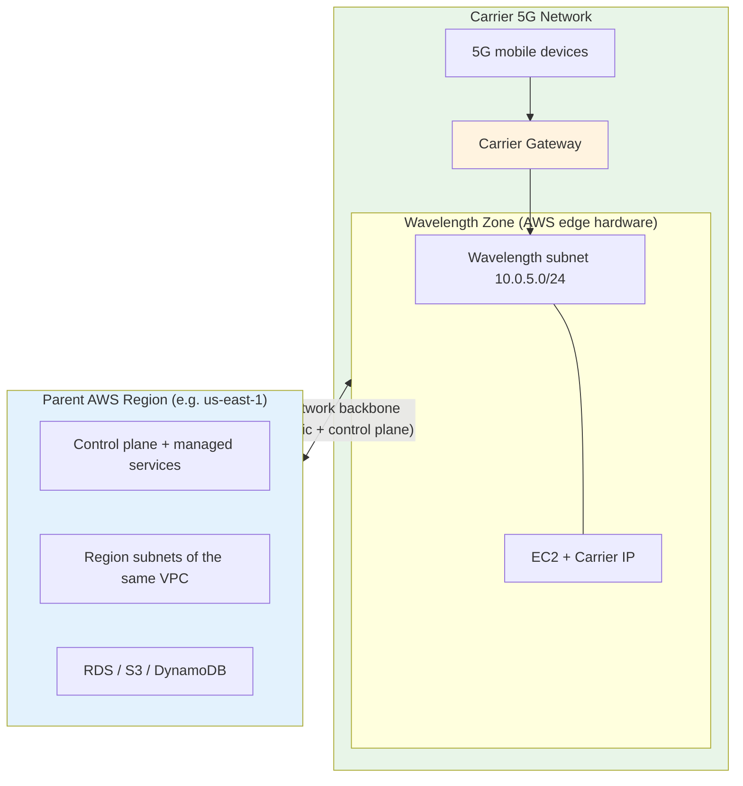

# AWS Wavelength - SAA-C03 Intro

> AWS Wavelength embeds AWS compute and storage **inside telecom carriers' 5G networks**, at the very edge of the network. For the exam, think of Wavelength as **"AWS living inside the 5G carrier's data center"** — so traffic from a mobile device reaches your application without ever leaving the carrier network and hopping across the internet to a Region. The result is **ultra-low latency for 5G/mobile end users**.

See also: [02 - Wavelength Architecture Deep Dive](02%20-%20Wavelength%20Architecture%20Deep%20Dive.md) · [03 - Wavelength Services & Networking Deep Dive](03%20-%20Wavelength%20Services%20%26%20Networking%20Deep%20Dive.md) · [04 - Wavelength Examples & Patterns](04%20-%20Wavelength%20Examples%20%26%20Patterns.md) · [05 - Wavelength Scenario Questions](05%20-%20Wavelength%20Scenario%20Questions.md) · [06 - Wavelength Important Facts & Cheat Sheet](06%20-%20Wavelength%20Important%20Facts%20%26%20Cheat%20Sheet.md)

Related edge/hybrid topics: [01 - Outposts Intro](01%20-%20Outposts%20Intro.md) · [AWS Global Infrastructure](AWS%20Global%20Infrastructure.md)

---

## Table of Contents

- [Core Concept: What is AWS Wavelength?](#core-concept-what-is-aws-wavelength)
- [The Latency Problem Wavelength Solves](#the-latency-problem-wavelength-solves)
- [Wavelength Zones](#wavelength-zones)
- [The Three Key Building Blocks](#the-three-key-building-blocks)
- [When to Use AWS Wavelength](#when-to-use-aws-wavelength)
- [AWS Services Available in a Wavelength Zone](#aws-services-available-in-a-wavelength-zone)
- [How Wavelength Connects to the Parent Region](#how-wavelength-connects-to-the-parent-region)
- [Wavelength vs Local Zones vs Outposts (Exam Favorite)](#wavelength-vs-local-zones-vs-outposts-exam-favorite)
- [Shared Responsibility & Security on Wavelength](#shared-responsibility--security-on-wavelength)
- [Wavelength Across the Four Exam Domains](#wavelength-across-the-four-exam-domains)

---

## Core Concept: What is AWS Wavelength?

**AWS Wavelength is AWS infrastructure (EC2, EBS, VPC) deployed inside a telecom carrier's 5G network**, at the edge — physically close to where mobile traffic aggregates. AWS partners with **Communications Service Providers (CSPs)** like Verizon, Vodafone, KDDI, SK Telecom, and Bell, and places AWS hardware in their data centers.

Because the compute sits inside the carrier network, packets from a 5G device travel **only over the carrier's network** to reach your application — they never traverse the public internet or backhaul to a distant Region. That removes the hops that cause latency.

**Three things that make Wavelength "Wavelength":**

1. AWS compute/storage physically sits **inside the carrier's 5G data center** (you don't own the building, the carrier does).
2. Mobile traffic reaches your app **without leaving the carrier network** → single-digit-millisecond latency.
3. Each Wavelength Zone is **logically part of a parent AWS Region** — you extend your existing VPC into it and manage it with the same APIs, Console, and tools.

> [!warning] Critical exam framing
> Wavelength is **specifically for 5G / mobile edge** applications where the *end user is on a mobile device*. If the question is about latency to **on-premises systems in your own building**, that's [Outposts](01%20-%20Outposts%20Intro.md). If it's about latency to **end users in a metro area** (not specifically mobile/5G), that's **Local Zones**.

---

## The Latency Problem Wavelength Solves

5G promises very high bandwidth and low *radio* latency, but that benefit is wasted if every request still has to travel from the cell tower, through the carrier's aggregation network, out to the internet, and across the country to a Region — adding tens of milliseconds.

Wavelength puts the **application compute at the same edge** as the 5G aggregation point, so the round trip stays inside the carrier network. This is the entire value proposition: **5G + AWS edge compute = ultra-low latency for mobile applications.**

---

## Wavelength Zones

A **Wavelength Zone** is the unit of Wavelength deployment — an infrastructure deployment that embeds AWS compute and storage services within a CSP's data center at the edge of the 5G network.

- Each Wavelength Zone is **associated with exactly one parent AWS Region** (e.g., a Verizon Wavelength Zone in Boston is homed to `us-east-1`).
- Wavelength Zones are **opt-in** — you must explicitly enable a Wavelength Zone in your account before you can launch resources into it (just like Local Zones).
- You extend an **existing VPC** into the Wavelength Zone by creating a **Wavelength subnet** in it.
- A single Wavelength Zone is a **single location / single failure domain** — it is *not* highly available on its own.

| Property | Wavelength Zone |
| :--- | :--- |
| Owned/operated by | AWS hardware **inside the carrier's facility** |
| Parent Region | Exactly one, fixed |
| Enablement | Opt-in (must enable per account) |
| VPC model | Extend an existing Region VPC with a Wavelength subnet |
| Failure domain | Single zone (no built-in multi-AZ HA) |

---

## The Three Key Building Blocks

Wavelength networking revolves around three constructs the exam loves. Full detail in [03 - Wavelength Services & Networking Deep Dive](03%20-%20Wavelength%20Services%20%26%20Networking%20Deep%20Dive.md).

| Building block | What it is |
| :--- | :--- |
| **Wavelength subnet** | A subnet of your VPC that lives in the Wavelength Zone; instances launched here physically run on the carrier-edge hardware |
| **Carrier Gateway (CGW)** | The gateway that connects the Wavelength subnet to the **carrier's 4G/5G network and the internet**; it also performs **NAT** for instance traffic |
| **Carrier IP** | An address from the **carrier's network** that you assign to an instance's network interface so mobile devices can reach it; the Carrier Gateway NATs to/from it |

> **Exam nugget:** A Wavelength subnet does **not** use an Internet Gateway for mobile/carrier traffic — it uses a **Carrier Gateway**. And you don't assign a normal Elastic/public IP to face the carrier network — you assign a **Carrier IP**.

---

## When to Use AWS Wavelength

The exam tests whether you recognize a **5G/mobile ultra-low-latency** requirement. Trigger use cases:

### Exam recognition patterns

| If the question mentions... | Think... |
| :--- | :--- |
| "Ultra-low latency for **5G** mobile users" | Wavelength |
| "AR/VR over mobile networks" | Wavelength |
| "Real-time **mobile** gaming with minimal lag" | Wavelength |
| "ML inference at the **5G edge** / connected cars" | Wavelength |
| "Traffic should not leave the **carrier network**" | Wavelength |
| "Application embedded in a **telecom/CSP** data center" | Wavelength |
| "Single-digit-ms latency to **mobile devices**" | Wavelength |

> **Contrast trap:** "low latency to **on-prem systems**" → Outposts. "low latency to **end users in a metro**" (not explicitly 5G) → Local Zones. The discriminator for Wavelength is almost always the words **5G**, **mobile**, or **carrier network**.

---

## AWS Services Available in a Wavelength Zone

Wavelength runs a **focused, compute-centric subset** of AWS — it is built for running latency-sensitive application servers, not the full service catalog. Deep dives in [03 - Wavelength Services & Networking Deep Dive](03%20-%20Wavelength%20Services%20%26%20Networking%20Deep%20Dive.md).

| Service | In a Wavelength Zone | Notes |
| :--- | :--- | :--- |
| **Amazon EC2** | ✅ | Selected instance families (e.g., t3, r5, and **G4dn** GPU for ML/graphics); not every family |
| **Amazon EBS** | ✅ | Local `gp2` volumes attached to Wavelength instances |
| **Amazon VPC** | ✅ | Wavelength subnets, security groups, route tables, Carrier Gateway |
| **EC2 Auto Scaling** | ✅ | Scale within the Wavelength Zone |
| **Amazon ECS / EKS** | ✅ | Run containers at the 5G edge |
| **EKS / ECS control planes** | Region | Control planes stay in the parent Region |
| **Elastic Load Balancing (ALB/NLB)** | ✅ (in zone) | Distribute traffic to local targets |

> **Exam trick:** The **control plane and most managed services (S3, DynamoDB, RDS, etc.) live in the parent Region**, not in the Wavelength Zone. Wavelength gives you **EC2 + EBS + VPC** for the latency-critical front of your app; everything else is reached over the AWS backbone in the Region. Put the **latency-sensitive tier** in the Wavelength Zone and keep databases/storage/analytics in the Region.

---

## How Wavelength Connects to the Parent Region

Each Wavelength Zone attaches to **one parent Region** over AWS's network. Two paths matter:

- **Carrier-side path** — mobile devices reach your instances **through the Carrier Gateway**, staying inside the carrier network for ultra-low latency.
- **Region-side path** — Wavelength instances reach the rest of the VPC and managed services **in the parent Region over the AWS backbone** (this is how your app tier talks to its database, S3, etc.).

> [!note] What about the public internet?
> Internet-bound and carrier traffic for Wavelength instances flow through the **Carrier Gateway** (which NATs via Carrier IPs). A Wavelength subnet does **not** attach to a regular Internet Gateway for this. To reach Region resources, traffic uses the **AWS backbone** to the parent Region.

---

## Wavelength vs Local Zones vs Outposts (Exam Favorite)

This three-way comparison appears constantly. Know which service owns which location.

| Aspect | AWS Wavelength | AWS Local Zones | AWS Outposts |
| :--- | :--- | :--- | :--- |
| **Location** | Inside a **telecom carrier's 5G** data center | **AWS-owned** site in a metro area | **YOUR** data center / co-lo |
| **Hardware owner** | AWS (in carrier facility) | AWS | AWS (in your facility) |
| **Latency target** | Ultra-low latency over the **5G network** to mobile devices | Single-digit ms to **end users in a metro** | Single-digit ms to **on-prem systems** |
| **Primary user** | **Mobile / 5G** end users | General end users in a geography | On-prem applications & data |
| **Key construct** | **Carrier Gateway + Carrier IP** | Standard VPC + internet/Local Zone subnet | Service link + LGW/LNI |
| **Control plane** | Parent Region | Parent Region | Parent Region |

**Memory aid:**

- **Wavelength** = "Inside the 5G carrier's network — for mobile users."
- **Local Zones** = "AWS's building in my city — for nearby end users."
- **Outposts** = "My building, AWS-owned hardware — for on-prem systems."

> At re:Invent 2020, Andy Jassy framed it as: *Outposts targets on-premises workloads; Local Zones target end users in a geographic area; Wavelength marries 5G networks with AWS edge compute.*

---

## Shared Responsibility & Security on Wavelength

Service-level security in a Wavelength Zone is **identical** to the same services in a Region — IAM, security groups, NACLs, and EBS encryption all behave the same. The physical layer shifts to the **carrier**.

| Aspect | Responsible party |
| :--- | :--- |
| Physical site security (the carrier data center) | **Carrier + AWS** (you do **not** own the building, unlike Outposts) |
| AWS edge hardware operation, maintenance, patching | **AWS** |
| Carrier 5G network | **Carrier** |
| Service-level security: IAM, SGs, NACLs, encryption | **Customer** (same as cloud) |
| EBS volume encryption | Customer-controlled (KMS), same as Region |

> **Exam trick:** Unlike Outposts (where *you* own physical custody), with Wavelength the hardware sits in the **carrier's** facility — physical security is **not your responsibility**. Your responsibility is the usual cloud service configuration (IAM, security groups, etc.).

---

## Wavelength Across the Four Exam Domains

| Domain | Wavelength application |
| :--- | :--- |
| **Secure architectures** | Same IAM/SG/encryption model as cloud; carrier traffic isolated via Carrier Gateway; no on-prem physical custody burden |
| **Resilient architectures** | A single Wavelength Zone = single failure domain; use **multiple Wavelength Zones** and **fall back to the parent Region** for HA/DR |
| **High-performing architectures** | Ultra-low latency to 5G/mobile devices; place the latency-critical tier at the edge, keep heavy/stateful services in the Region |
| **Cost-optimized architectures** | Pay only for the EC2/EBS you run in the zone (on-demand model, unlike Outposts' 3-yr commit); avoid over-deploying — only the latency-critical tier belongs at the edge |

---

> Next: [02 - Wavelength Architecture Deep Dive](02%20-%20Wavelength%20Architecture%20Deep%20Dive.md) — the VPC stretch, Carrier Gateway, Carrier IP, routing tables, and the resilience model in detail.
