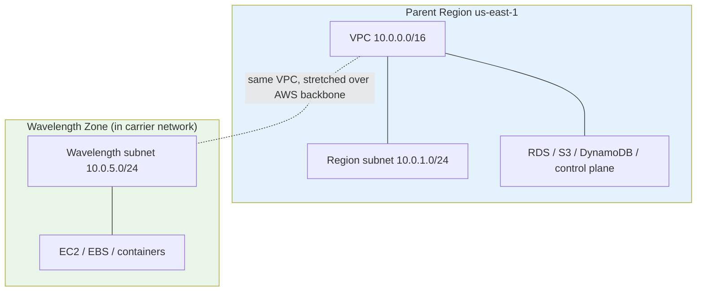
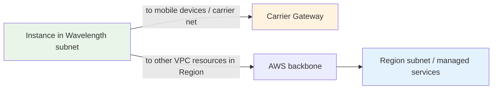
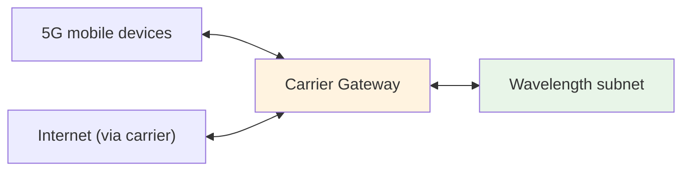
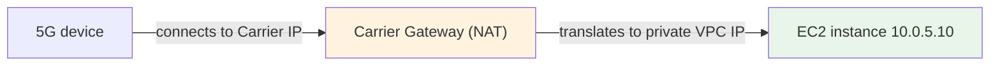
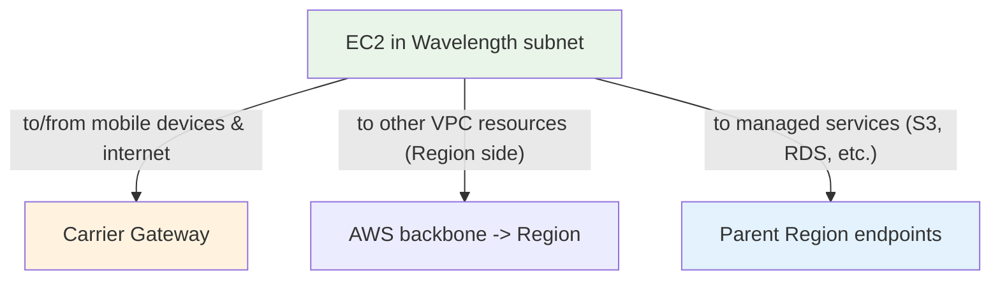
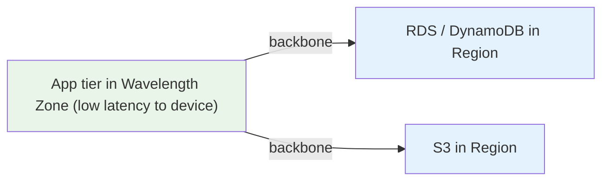
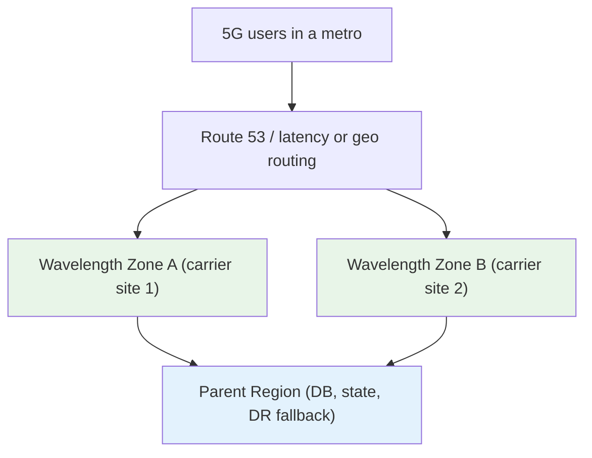
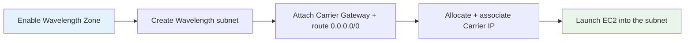

# AWS Wavelength - Architecture Deep Dive

> How Wavelength actually fits into a VPC: the parent-Region link, the Wavelength subnet, the **Carrier Gateway**, the **Carrier IP** and NAT behavior, routing tables, and the resilience model. This is where the exam's "which gateway / what IP / how does mobile traffic reach the instance" questions are won.

See also: [01 - Wavelength Intro](01%20-%20Wavelength%20Intro.md) · [03 - Wavelength Services & Networking Deep Dive](03%20-%20Wavelength%20Services%20%26%20Networking%20Deep%20Dive.md) · [04 - Wavelength Examples & Patterns](04%20-%20Wavelength%20Examples%20%26%20Patterns.md) · [05 - Wavelength Scenario Questions](05%20-%20Wavelength%20Scenario%20Questions.md) · [06 - Wavelength Important Facts & Cheat Sheet](06%20-%20Wavelength%20Important%20Facts%20%26%20Cheat%20Sheet.md)

---

## Table of Contents

- [Part 1: The Logical Model — Wavelength Zone, Region, VPC](#part-1-the-logical-model--wavelength-zone-region-vpc)
- [Part 2: Wavelength Subnets & the VPC Stretch](#part-2-wavelength-subnets--the-vpc-stretch)
- [Part 3: The Carrier Gateway (CGW)](#part-3-the-carrier-gateway-cgw)
- [Part 4: Carrier IP & NAT Behavior](#part-4-carrier-ip--nat-behavior)
- [Part 5: Routing — Three Traffic Paths](#part-5-routing--three-traffic-paths)
- [Part 6: Reaching the Parent Region](#part-6-reaching-the-parent-region)
- [Part 7: Resilience — A Single Wavelength Zone is a Single Failure Domain](#part-7-resilience--a-single-wavelength-zone-is-a-single-failure-domain)
- [Part 8: Capacity & Instance Selection](#part-8-capacity--instance-selection)
- [Part 9: Enabling & Using a Wavelength Zone](#part-9-enabling--using-a-wavelength-zone)
- [Summary](#summary)

---

## Part 1: The Logical Model — Wavelength Zone, Region, VPC

Four facts define how Wavelength sits in AWS:

1. A Wavelength Zone is **homed to exactly one parent Region** (e.g., a Verizon zone in Boston → `us-east-1`).
2. Wavelength Zones are **opt-in** — you enable the zone in your account before using it.
3. Your **VPC is "stretched"** from the Region into the Wavelength Zone — you create a **Wavelength subnet** inside an existing VPC.
4. The **control plane runs in the Region**; the Wavelength Zone runs the **data plane** (your EC2 instances, EBS volumes, containers).

> **Exam nugget:** A Wavelength Zone maps to a *single* location and is therefore a **single failure domain** — it does **not** give you multi-AZ resilience by itself. Use multiple zones + the Region for HA.

---

## Part 2: Wavelength Subnets & the VPC Stretch

- You extend an **existing VPC** by creating one or more **Wavelength subnets** and associating them with the Wavelength Zone.
- Instances launched into a Wavelength subnet **physically run on the carrier-edge hardware**, but logically behave like any VPC resource: ENIs, security groups, route tables, and NACLs all work the same.
- Traffic between the Wavelength subnet and Region subnets flows over the **AWS backbone** privately, as if they were in the same VPC (because they are).

> A Wavelength subnet is just a VPC subnet whose physical home is the Wavelength Zone. There is no separate "deploy to Wavelength" API — **placement = subnet choice**, exactly like Outposts.

---

## Part 3: The Carrier Gateway (CGW)

The **Carrier Gateway** is the single most important Wavelength-specific construct. It is the analog of an Internet Gateway, but for the **carrier's network**.

**What the Carrier Gateway does:**

1. **Connects the Wavelength subnet to the carrier's 4G/5G network** so mobile devices can reach your instances.
2. Provides a path to the **internet** through the carrier network for outbound traffic.
3. Performs **NAT (Network Address Translation)** between the instance's private VPC address and a **Carrier IP** that is valid on the carrier network.

| Construct | Region equivalent | Purpose in Wavelength |
| :--- | :--- | :--- |
| **Carrier Gateway** | Internet Gateway | Connects Wavelength subnet ↔ carrier network & internet; does NAT |
| **Carrier IP** | Elastic / public IP | Address on the **carrier network** assigned to an instance ENI |

> **Exam trap:** A Wavelength subnet uses a **Carrier Gateway**, *not* an Internet Gateway, to face the carrier network. If a distractor says "attach an Internet Gateway to the Wavelength subnet," it's wrong.

---

## Part 4: Carrier IP & NAT Behavior

A **Carrier IP** is an address from the **carrier's address space** that you allocate and associate with a network interface in a Wavelength subnet.

- Mobile devices on the carrier network reach your instance via its **Carrier IP**.
- The **Carrier Gateway translates (NATs)** between the instance's private VPC IP and its Carrier IP.
- A Carrier IP is reachable **only from the carrier network** (and the internet via the carrier), **not** from the parent Region's VPC side.

| Address type | Reachable from | Used for |
| :--- | :--- | :--- |
| **Private VPC IP** | Within the VPC (Region + Wavelength) | Talking to Region resources over the backbone |
| **Carrier IP** | Carrier network + internet (via carrier) | Mobile devices reaching the instance at the edge |

> **Exam nugget:** You do **not** assign a normal Elastic IP to make a Wavelength instance reachable from mobile devices — you allocate and associate a **Carrier IP**, and the **Carrier Gateway** handles the NAT.

---

## Part 5: Routing — Three Traffic Paths

A Wavelength instance has three possible destinations, each via a different route:

| Destination | Route in the Wavelength subnet's route table |
| :--- | :--- |
| Mobile devices / carrier network / internet | `0.0.0.0/0` → **Carrier Gateway** |
| Other resources in the same VPC (Region side) | `local` route (VPC CIDR) over the AWS backbone |
| Managed services in the Region (S3, RDS, DynamoDB) | Reached over the backbone via the Region |

> The route table is what makes a subnet "carrier-facing": a default route to the **Carrier Gateway** is the hallmark of a Wavelength subnet, just as a default route to an IGW marks a public subnet in a normal VPC.

---

## Part 6: Reaching the Parent Region

The latency benefit is only for the **device ↔ edge** hop. When a Wavelength instance needs data that lives in the Region (its database, object storage, etc.), that request travels back over the **AWS network backbone** to the parent Region.

**Design implication:** keep the **latency-critical, chatty-with-the-device** tier in the Wavelength Zone, and accept that calls to Region-hosted databases/storage incur the backbone latency. If the app constantly round-trips to the Region for every device request, you lose much of the benefit — cache or process at the edge where possible.

> **Exam nugget:** Wavelength accelerates the **device-to-app** path, not the **app-to-Region** path. Stateful/managed back ends stay in the Region; put only the latency-sensitive front tier at the edge.

---

## Part 7: Resilience — A Single Wavelength Zone is a Single Failure Domain

A single Wavelength Zone is one location = one failure domain. To build resilient architectures:

- For HA, deploy across **multiple Wavelength Zones** and/or **fall back to the parent Region** for users who can tolerate slightly higher latency.
- Keep **durable state in the Region** (RDS Multi-AZ, DynamoDB, S3) — the Region provides the real availability and durability guarantees.
- A Wavelength Zone is **not** a substitute for Availability Zones; if the question asks for *high availability of a cloud app*, the answer is still **Multi-AZ in a Region**.

> **Exam trap:** "Make my Wavelength app highly available" is **not** solved by one bigger Wavelength Zone — use **multiple zones + Region fallback**, with state anchored in the Region.

---

## Part 8: Capacity & Instance Selection

- Wavelength Zones offer a **limited set of instance types** optimized for edge workloads — commonly **t3** (general purpose), **r5** (memory), and **G4dn** (NVIDIA GPU for ML inference / graphics). Not every Region family is available.
- **EBS** in the zone is **`gp2`** local storage attached to instances.
- Capacity at a given zone is **finite** (edge sites are smaller than a Region). Plan for it and design **Region fallback** for overflow or surges.
- Pricing follows the standard **on-demand EC2/EBS model** — there is **no multi-year hardware commitment** like Outposts.

| Aspect | Region | Wavelength Zone |
| :--- | :--- | :--- |
| Instance families | All | Limited subset (t3 / r5 / G4dn typical) |
| EBS types | Full range | `gp2` |
| Pricing model | On-demand / RI / SP / Spot | **On-demand** (Wavelength pricing); no Outposts-style commit |
| Capacity ceiling | Effectively unlimited | Finite edge capacity → design Region fallback |

> **Exam nugget:** **G4dn GPU instances** in Wavelength are the go-to for **edge ML inference / video analytics / AR-VR rendering** close to 5G users.

---

## Part 9: Enabling & Using a Wavelength Zone

For the exam you don't need every CLI flag, but know the shape:

1. **Opt in / enable** the Wavelength Zone group in your account (zones are not active by default).
2. **Create a Wavelength subnet** inside an existing VPC, associated with the Wavelength Zone.
3. **Create and attach a Carrier Gateway** to the VPC, and set the subnet's route table default route to it.
4. **Allocate a Carrier IP** and associate it with the instance's network interface.
5. **Launch EC2** into the Wavelength subnet — placement happens automatically because the subnet is in the zone.

---

## Summary

- A Wavelength Zone = AWS edge compute **inside a carrier's 5G network**, homed to **one parent Region**; your VPC stretches into it via a **Wavelength subnet**.
- The **Carrier Gateway** connects the subnet to the carrier network/internet and **NATs** instance traffic; a **Carrier IP** is the carrier-network address mobile devices use.
- Three routes: device/internet → **Carrier Gateway**; VPC/Region → **AWS backbone**; managed services → **parent Region**.
- Wavelength accelerates the **device-to-app** hop only; keep state/databases in the **Region**.
- A single Wavelength Zone is a **single failure domain** — use **multiple zones + Region fallback** for HA. Capacity is finite; pricing is on-demand (no Outposts-style commitment).

> Next: [03 - Wavelength Services & Networking Deep Dive](03%20-%20Wavelength%20Services%20%26%20Networking%20Deep%20Dive.md) — EC2/EBS/containers behavior, Carrier Gateway vs Internet Gateway, and the networking matrix in detail.
