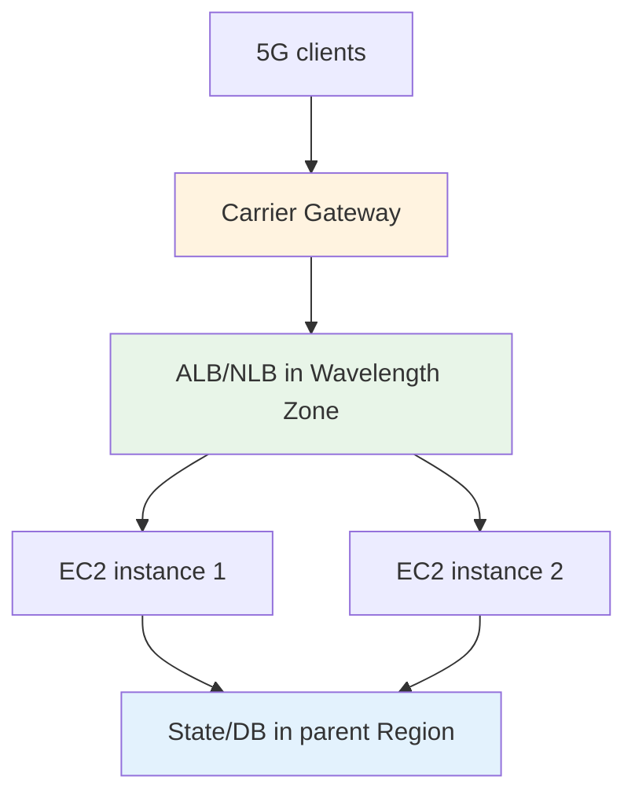
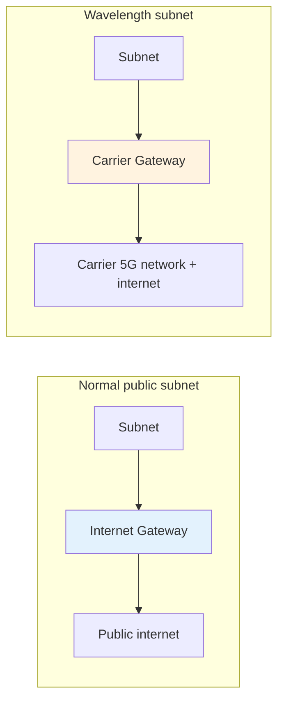
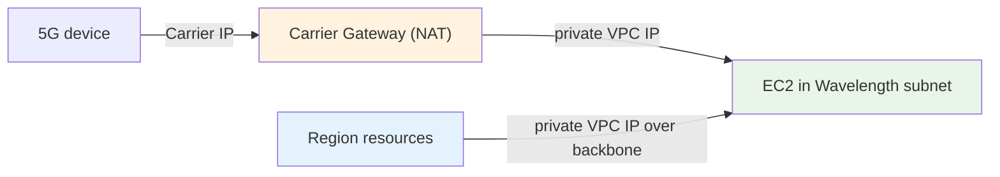
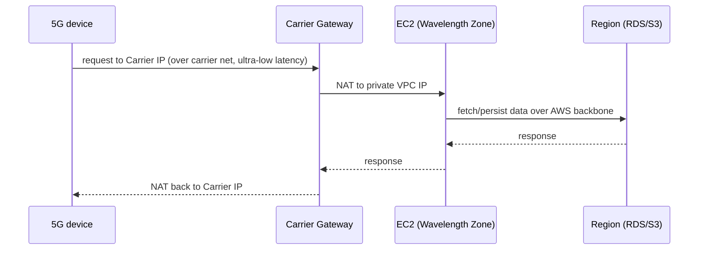

# AWS Wavelength - Services & Networking Deep Dive

> How each service behaves in a Wavelength Zone (EC2, EBS, containers, load balancing), and the networking internals that the exam tests: Carrier Gateway vs Internet Gateway, Carrier IP vs Elastic IP, NAT behavior, security groups, and the device-to-edge-to-Region data flow. The exam tests the *differences* from the Region version.

See also: [01 - Wavelength Intro](01%20-%20Wavelength%20Intro.md) · [02 - Wavelength Architecture Deep Dive](02%20-%20Wavelength%20Architecture%20Deep%20Dive.md) · [04 - Wavelength Examples & Patterns](04%20-%20Wavelength%20Examples%20%26%20Patterns.md) · [05 - Wavelength Scenario Questions](05%20-%20Wavelength%20Scenario%20Questions.md) · [06 - Wavelength Important Facts & Cheat Sheet](06%20-%20Wavelength%20Important%20Facts%20%26%20Cheat%20Sheet.md)

---

## Table of Contents

- [Part 1: EC2 in a Wavelength Zone](#part-1-ec2-in-a-wavelength-zone)
- [Part 2: EBS in a Wavelength Zone](#part-2-ebs-in-a-wavelength-zone)
- [Part 3: Containers — ECS & EKS at the Edge](#part-3-containers--ecs--eks-at-the-edge)
- [Part 4: Load Balancing in a Wavelength Zone](#part-4-load-balancing-in-a-wavelength-zone)
- [Part 5: Carrier Gateway vs Internet Gateway](#part-5-carrier-gateway-vs-internet-gateway)
- [Part 6: Carrier IP vs Elastic IP](#part-6-carrier-ip-vs-elastic-ip)
- [Part 7: Security Groups, NACLs & DNS](#part-7-security-groups-nacls--dns)
- [Part 8: The End-to-End Data Flow](#part-8-the-end-to-end-data-flow)
- [Part 9: What is NOT in a Wavelength Zone](#part-9-what-is-not-in-a-wavelength-zone)
- [Service & Networking Matrix](#service--networking-matrix)

---

## Part 1: EC2 in a Wavelength Zone

- Runs the same **AMIs and APIs** as the Region, but only a **selected subset of instance families** is offered at the edge — typically **t3** (general purpose), **r5** (memory-optimized), and **G4dn** (NVIDIA T4 GPU).
- **G4dn** is the headline edge instance: GPU acceleration for **ML inference, video analytics, game streaming, and AR/VR rendering** right next to 5G users.
- **EC2 Auto Scaling** works within the zone, but scaling is bounded by the zone's **finite edge capacity** — design **Region fallback** for surges.
- **Placement** = launch into a **Wavelength subnet**; security groups, ENIs, and IAM behave exactly as in-Region.

| EC2 aspect | Region | Wavelength Zone |
| :--- | :--- | :--- |
| Instance families | All | Subset (t3 / r5 / **G4dn** typical) |
| Pricing | On-demand / Spot / RI / SP | **On-demand** (Wavelength rates); no long-term commit |
| GPU for edge ML | Many options | **G4dn** |
| Scaling ceiling | Effectively unlimited | Finite edge capacity → Region fallback |

> **Exam nugget:** Edge **ML inference / AR-VR / game streaming** over 5G → **G4dn in a Wavelength Zone**.

---

## Part 2: EBS in a Wavelength Zone

- Wavelength provides **local EBS `gp2` volumes** attached to the edge instances, encrypted the same way as in-Region EBS.
- Use it for the instance's working storage and ephemeral/cache data of the latency-critical tier.
- **Durable, authoritative state should live in the Region** (RDS, DynamoDB, S3) — the edge is for low-latency compute, not as the system of record.

> Treat Wavelength EBS as fast local scratch/working storage at the edge; anchor the durable copy of data in the Region.

---

## Part 3: Containers — ECS & EKS at the Edge

- Run **Amazon ECS** and **Amazon EKS** workloads on EC2 capacity inside the Wavelength Zone, with the **control plane in the parent Region**.
- Same task/pod definitions and tooling as in-Region; you place the worker capacity in the Wavelength subnet.
- Good fit for containerized, low-latency microservices serving 5G clients (e.g., per-session game servers, inference services).

> **Exam trap:** As with Outposts, the **container control plane stays in the Region**; the Wavelength Zone runs the **worker/data plane**. Fargate is a Region construct, not a Wavelength edge offering.

---

## Part 4: Load Balancing in a Wavelength Zone

- You can deploy an **Application Load Balancer (ALB)** or **Network Load Balancer (NLB)** **inside the Wavelength Zone** to distribute traffic across local instances — keeping balancing at the edge so it doesn't add a Region round-trip.
- Combine with **Auto Scaling** to spread 5G client sessions across edge instances.
- For multi-zone resilience, front multiple Wavelength Zones with **Route 53** (latency/geo routing) rather than a single zone-local balancer.

---

## Part 5: Carrier Gateway vs Internet Gateway

The defining networking distinction in Wavelength.

| Feature | Internet Gateway (IGW) | Carrier Gateway (CGW) |
| :--- | :--- | :--- |
| Where used | Normal VPC subnets in a Region | **Wavelength subnets only** |
| Connects to | The public internet | The **carrier's 4G/5G network** and internet |
| NAT | No (works with public/Elastic IPs) | **Yes** — NATs instance traffic to/from a Carrier IP |
| Faces | General internet clients | **Mobile / 5G devices** on the carrier network |

> **Exam trap:** "Attach an Internet Gateway to the Wavelength subnet so mobile users can reach it" is **wrong** — Wavelength uses a **Carrier Gateway**.

---

## Part 6: Carrier IP vs Elastic IP

| Aspect | Elastic IP (Region) | Carrier IP (Wavelength) |
| :--- | :--- | :--- |
| Address space | AWS public IP space | **Carrier network** address space |
| Assigned to | ENI in a normal subnet | ENI in a **Wavelength subnet** |
| Reachable from | The public internet | The **carrier network** (and internet via carrier) |
| NAT performed by | (n/a — public IP) | The **Carrier Gateway** |
| Reachable from the Region VPC side? | Yes (public) | **No** — carrier-facing only |

> **Exam nugget:** To expose a Wavelength instance to mobile devices, allocate a **Carrier IP** (not an Elastic IP). The instance still has a normal **private VPC IP** for talking to the Region over the backbone.

---

## Part 7: Security Groups, NACLs & DNS

- **Security groups and NACLs** work exactly as in a normal VPC — apply them to Wavelength subnet ENIs to control device and Region traffic.
- **DNS / Route 53** resolves normally; use **Route 53 latency/geolocation routing** to send each user to the nearest Wavelength Zone (or to the Region as fallback).
- The same **IAM, KMS, and VPC constructs** apply — there is no special "Wavelength security model" beyond the carrier-facing networking pieces.

> The security model is **the same as the cloud**. Only the *networking front door* (Carrier Gateway + Carrier IP) is Wavelength-specific.

---

## Part 8: The End-to-End Data Flow

Putting it together — a single mobile request to a Wavelength-hosted app that needs Region data:

- The **device↔app hop stays in the carrier network** → ultra-low latency.
- The **app↔Region hop** uses the AWS backbone and carries normal Region latency — so minimize how often the edge must call the Region per request (cache/process locally).

---

## Part 9: What is NOT in a Wavelength Zone

| Not at the edge (lives in the Region) | Why it matters |
| :--- | :--- |
| Most managed services (RDS, DynamoDB, S3, etc.) | Keep durable state in the Region; edge reaches them over the backbone |
| Container/Kubernetes **control planes** | Only the worker/data plane runs at the edge |
| The full EC2 instance catalog | Only a **subset** of families is offered |
| Internet Gateway / standard NAT Gateway model | Carrier traffic uses the **Carrier Gateway** instead |
| Multi-AZ resilience | A Wavelength Zone is a **single failure domain** |

> **Exam framing:** Wavelength is a **compute edge**, not a mini-Region. It gives you EC2/EBS/VPC + containers for the latency-critical tier; everything stateful or "managed" stays in the parent Region.

---

## Service & Networking Matrix

| Item | In Wavelength Zone? | Key note |
| :--- | :--- | :--- |
| EC2 | ✅ | Subset of families (t3 / r5 / **G4dn** GPU); no Spot focus |
| EBS (`gp2`) | ✅ | Local working storage; durable state in Region |
| VPC / subnets / SGs / NACLs | ✅ | Standard behavior |
| **Carrier Gateway** | ✅ | Connects to carrier net + internet; does NAT |
| **Carrier IP** | ✅ | Carrier-network address for mobile reachability |
| Internet Gateway | ❌ (use Carrier Gateway) | IGW is for normal subnets |
| EC2 Auto Scaling | ✅ | Bounded by finite edge capacity |
| ECS / EKS (workers) | ✅ | Control plane stays in Region |
| ALB / NLB | ✅ | Local edge load balancing |
| RDS / DynamoDB / S3 | ❌ (in Region) | Reached over the AWS backbone |
| Multi-AZ HA | ❌ | Single failure domain → use multiple zones + Region |

> Memorize the two Wavelength-only constructs — **Carrier Gateway** and **Carrier IP** — and the fact that durable/managed services stay in the **Region**. That covers most Wavelength networking questions.

> Next: [04 - Wavelength Examples & Patterns](04%20-%20Wavelength%20Examples%20%26%20Patterns.md) — concrete edge architectures, CLI snippets, and reference designs.
