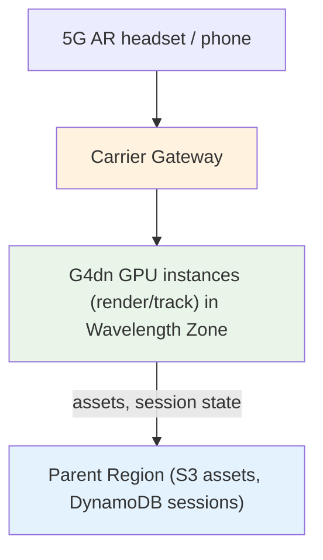
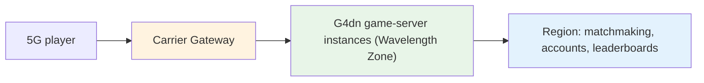
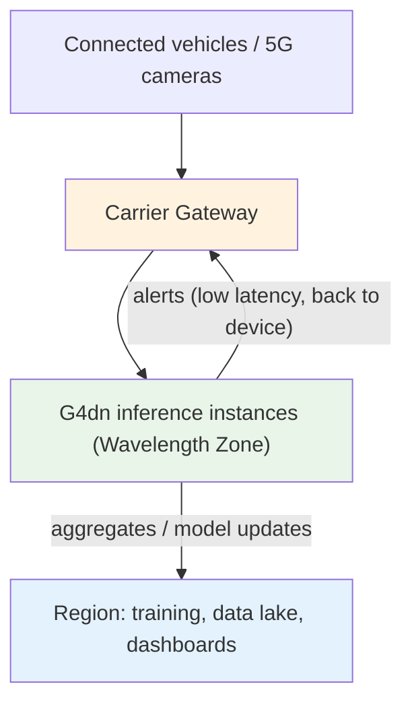
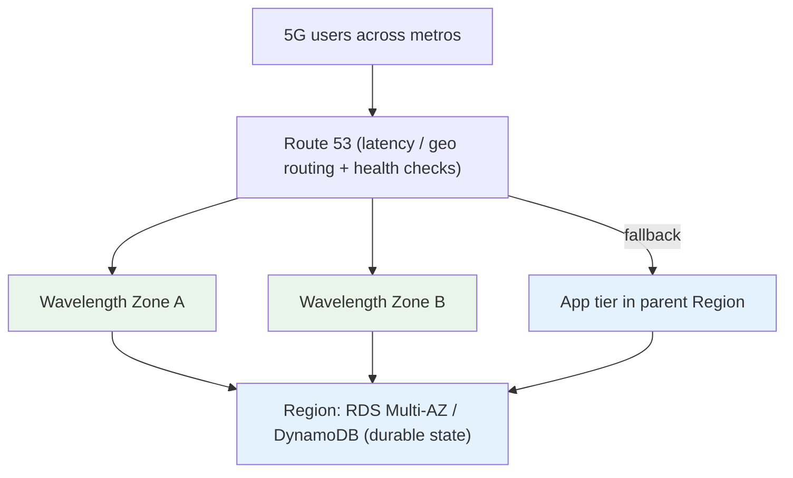
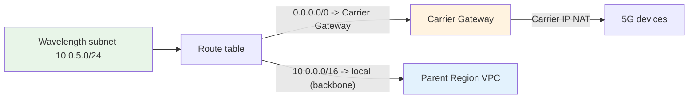
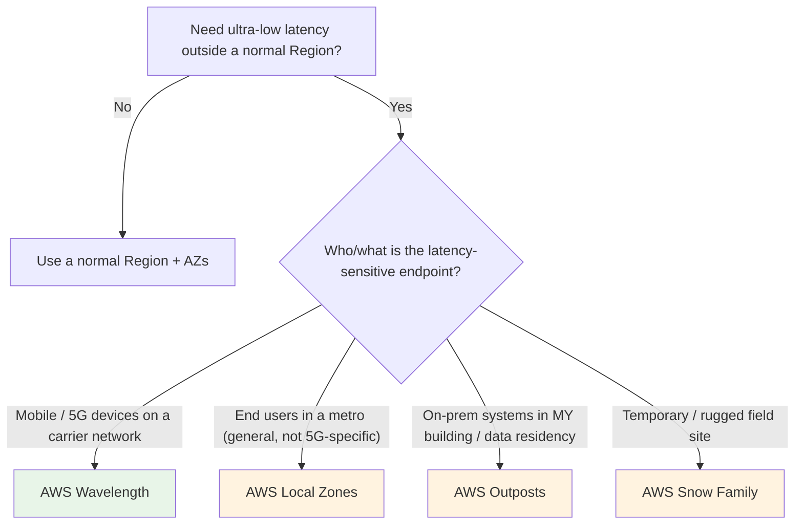

# AWS Wavelength - Examples & Reference Patterns

> End-to-end reference architectures the exam draws from — mobile AR/VR, real-time 5G gaming, edge ML inference for connected vehicles, live video, and multi-zone HA with Region fallback — plus the CLI snippets that show how a Wavelength Zone is wired into a VPC with a Carrier Gateway and Carrier IP.

See also: [01 - Wavelength Intro](01%20-%20Wavelength%20Intro.md) · [02 - Wavelength Architecture Deep Dive](02%20-%20Wavelength%20Architecture%20Deep%20Dive.md) · [03 - Wavelength Services & Networking Deep Dive](03%20-%20Wavelength%20Services%20%26%20Networking%20Deep%20Dive.md) · [05 - Wavelength Scenario Questions](05%20-%20Wavelength%20Scenario%20Questions.md) · [06 - Wavelength Important Facts & Cheat Sheet](06%20-%20Wavelength%20Important%20Facts%20%26%20Cheat%20Sheet.md)

---

## Table of Contents

- [Pattern 1: Mobile AR / VR & Immersive Apps](#pattern-1-mobile-ar--vr--immersive-apps)
- [Pattern 2: Real-Time 5G Cloud Gaming](#pattern-2-real-time-5g-cloud-gaming)
- [Pattern 3: Edge ML Inference — Connected Vehicles / Video Analytics](#pattern-3-edge-ml-inference--connected-vehicles--video-analytics)
- [Pattern 4: Live, Interactive Video Streaming](#pattern-4-live-interactive-video-streaming)
- [Pattern 5: Multi-Zone HA with Region Fallback](#pattern-5-multi-zone-ha-with-region-fallback)
- [Pattern 6: Edge Caching to Minimize Region Round-Trips](#pattern-6-edge-caching-to-minimize-region-round-trips)
- [Wiring a Wavelength Zone into a VPC (CLI)](#wiring-a-wavelength-zone-into-a-vpc-cli)
- [Carrier Gateway Route Table (Concept + CLI)](#carrier-gateway-route-table-concept--cli)
- [Decision Flowchart: Is Wavelength the Answer?](#decision-flowchart-is-wavelength-the-answer)

---

## Pattern 1: Mobile AR / VR & Immersive Apps

**Requirement:** A mobile AR app overlays real-time 3D content; even tens of milliseconds of lag breaks the illusion and causes motion sickness.



- The latency-critical **rendering/tracking** runs on **G4dn GPUs at the edge**, single-digit-ms from the device.
- Heavy assets and session persistence live in the **Region**, pulled/cached as needed.
- **Why not Local Zones/Outposts?** The users are **mobile on 5G** — Wavelength owns that location.

---

## Pattern 2: Real-Time 5G Cloud Gaming

**Requirement:** A cloud-gaming service streams gameplay to phones; input-to-frame latency must feel instant.



- Per-session **game servers / video encoders on G4dn** run at the edge so input and rendered frames stay inside the carrier network.
- Non-latency-critical functions (matchmaking, accounts, leaderboards, billing) stay in the **Region**.
- **Auto Scaling + edge NLB/ALB** spread player sessions across edge instances.

---

## Pattern 3: Edge ML Inference — Connected Vehicles / Video Analytics

**Requirement:** Connected vehicles or smart-city cameras stream sensor/video over 5G and need real-time inference (object detection, hazard alerts) too time-critical to send to a Region.



- **Inference at the edge** on G4dn returns decisions to the device in milliseconds.
- Only **aggregates / events** flow to the Region for model retraining and analytics.
- Mirrors the "process locally, send summaries up" pattern, but the consumer is a **5G device**, not on-prem systems.

---

## Pattern 4: Live, Interactive Video Streaming

**Requirement:** A live event app needs sub-second, interactive video (e.g., real-time betting, fan cameras, low-latency replays) to mobile viewers.

- **Transcoding / packaging** runs on edge instances close to viewers, cutting glass-to-glass latency.
- Origin storage and VOD archives stay in the **Region** (S3); the edge handles the live, interactive hop.
- Use **multiple Wavelength Zones** to cover viewers across several metros.

---

## Pattern 5: Multi-Zone HA with Region Fallback

**Requirement:** The 5G app must stay available even if one Wavelength Zone (or its carrier site) fails.



- A single Wavelength Zone is a **single failure domain** → deploy across **multiple zones**.
- **Route 53** health checks route around a failed zone; the **Region** is the ultimate fallback (slightly higher latency, but available).
- **Durable state** (RDS Multi-AZ, DynamoDB, S3) lives in the **Region**, which provides the real availability/durability guarantees.

---

## Pattern 6: Edge Caching to Minimize Region Round-Trips

**Requirement:** The app would lose its latency advantage if every device request triggered a call back to the Region's database.

- Cache hot/read-mostly data **at the edge** (in-memory on the instance or a local cache) so most device requests are served entirely within the Wavelength Zone.
- Write-through / async-replicate changes to the **Region** so the system of record stays authoritative.
- **Principle:** keep the per-request hot path inside the carrier network; let only cache misses and writes traverse the backbone to the Region.

---

## Wiring a Wavelength Zone into a VPC (CLI)

Conceptual flow — enable a zone, extend a VPC with a Wavelength subnet, attach a Carrier Gateway, and launch an instance:

```bash
# 1. Discover available Wavelength Zones for the Region (they are opt-in)
aws ec2 describe-availability-zones \
  --filters "Name=zone-type,Values=wavelength-zone" \
  --all-availability-zones \
  --query "AvailabilityZones[].{Name:ZoneName,Group:GroupName,State:OptInStatus}"

# 2. Opt in to the Wavelength Zone group
aws ec2 modify-availability-zone-group \
  --group-name us-east-1-wl1 \
  --opt-in-status opted-in

# 3. Create a Wavelength subnet inside an EXISTING VPC, in the Wavelength Zone
aws ec2 create-subnet \
  --vpc-id vpc-0abc123 \
  --cidr-block 10.0.5.0/24 \
  --availability-zone us-east-1-wl1-bos-wlz-1

# 4. Create and attach a Carrier Gateway to the VPC
aws ec2 create-carrier-gateway --vpc-id vpc-0abc123

# 5. Launch an instance ONTO the Wavelength Zone by targeting that subnet
aws ec2 run-instances \
  --image-id ami-0abc \
  --instance-type g4dn.2xlarge \
  --subnet-id subnet-0wavelength \
  --security-group-ids sg-0abc
```

> The instance physically runs in the Wavelength Zone because its subnet is in the zone — there is no separate "deploy to Wavelength" API. **Placement = subnet choice.**

---

## Carrier Gateway Route Table (Concept + CLI)

The Wavelength subnet's route table sends carrier/internet-bound traffic to the **Carrier Gateway**, and a **Carrier IP** makes the instance reachable from mobile devices:



```bash
# Add a default route in the Wavelength subnet's route table to the Carrier Gateway
aws ec2 create-route \
  --route-table-id rtb-0wavelength \
  --destination-cidr-block 0.0.0.0/0 \
  --carrier-gateway-id cagw-0abc

# Allocate a Carrier IP and associate it so mobile devices can reach the instance
aws ec2 allocate-address --domain vpc --network-border-group us-east-1-wl1-bos-wlz-1
aws ec2 associate-address --allocation-id eipalloc-0abc --network-interface-id eni-0abc
```

> The `--network-border-group` set to the Wavelength Zone is what makes the allocated address a **Carrier IP** rather than a normal Region Elastic IP.

---

## Decision Flowchart: Is Wavelength the Answer?



> Next: [05 - Wavelength Scenario Questions](05%20-%20Wavelength%20Scenario%20Questions.md) — exam-style scenarios with full explanations.
