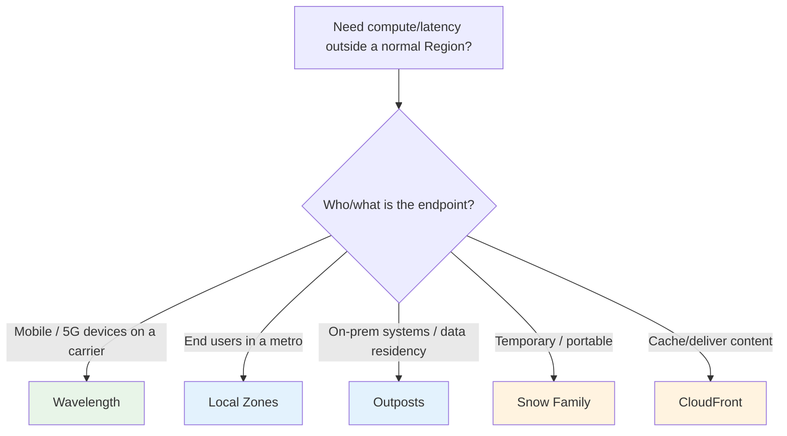
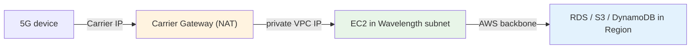

# AWS Wavelength - Important Facts & Cheat Sheet

> One-page cram: the high-yield facts, gotchas, comparison tables, and trigger words for SAA-C03. If you only review one Wavelength file the night before, make it this one.

See also: [01 - Wavelength Intro](01%20-%20Wavelength%20Intro.md) · [02 - Wavelength Architecture Deep Dive](02%20-%20Wavelength%20Architecture%20Deep%20Dive.md) · [03 - Wavelength Services & Networking Deep Dive](03%20-%20Wavelength%20Services%20%26%20Networking%20Deep%20Dive.md) · [04 - Wavelength Examples & Patterns](04%20-%20Wavelength%20Examples%20%26%20Patterns.md) · [05 - Wavelength Scenario Questions](05%20-%20Wavelength%20Scenario%20Questions.md)

---

## The 12 facts most likely to be tested

1. **Wavelength = AWS compute/storage INSIDE a telecom carrier's 5G network**, at the edge → ultra-low latency for **mobile/5G** users.
2. Traffic from 5G devices reaches your app **without leaving the carrier network** (no internet/backhaul hop).
3. A **Wavelength Zone** is homed to **exactly one parent Region** and is **opt-in** (enable before use).
4. You extend an **existing VPC** into the zone with a **Wavelength subnet**; placement = subnet choice.
5. **Carrier Gateway (CGW)** connects the Wavelength subnet to the carrier network + internet and performs **NAT** (the IGW analog for carrier traffic).
6. **Carrier IP** = an address from the **carrier network** assigned to an instance ENI so mobile devices can reach it (the Elastic-IP analog).
7. **Control plane and managed services (RDS, DynamoDB, S3) live in the parent Region**; the zone runs EC2/EBS/VPC + container workers.
8. Wavelength offers a **limited subset of instance families** — commonly **t3, r5, and G4dn (GPU)**; EBS is `gp2`.
9. **G4dn GPU at the edge** = the go-to for **ML inference, AR/VR, game streaming** over 5G.
10. A single Wavelength Zone is a **single failure domain** — for HA use **multiple zones + Region fallback**, with durable state in the Region.
11. Pricing follows the **on-demand EC2/EBS model** — **no multi-year hardware commitment** (unlike Outposts).
12. Physical security is **AWS + carrier** (hardware is in the carrier's facility) — **no customer physical custody** (unlike Outposts).

---

## Wavelength vs the edge/hybrid family (the big differentiator table)

| Service | Where it lives | Pick it when... |
| :--- | :--- | :--- |
| **Wavelength** | Telecom **5G** carrier data center | Ultra-low latency to **mobile/5G** users (AR/VR, gaming, edge ML, connected cars) |
| **Local Zones** | AWS-owned **metro** site | Low latency to **end users** in a metro with no Region nearby |
| **Outposts** | **Your** data center / co-lo | On-prem workloads, **data residency**, single-digit-ms to **on-prem systems** |
| **Snow Family** | Anywhere, portable | **Temporary/rugged** edge compute + bulk data transfer |
| **CloudFront** | Global edge locations | **Caching/delivering content** (CDN), not running app compute |
| **Availability Zones** | AWS Region | **High availability** for cloud apps |

---

## Wavelength-only networking constructs (memorize)

| Construct | Region analog | Role |
| :--- | :--- | :--- |
| **Carrier Gateway (CGW)** | Internet Gateway | Connects Wavelength subnet ↔ carrier network/internet; does **NAT** |
| **Carrier IP** | Elastic / public IP | Carrier-network address for **mobile reachability** |
| **Wavelength subnet** | VPC subnet | The slice of your VPC that runs in the Wavelength Zone |

---

## Traffic-path cheat sheet

| Traffic | Path | Latency |
| :--- | :--- | :--- |
| 5G device ↔ app | Through the **Carrier Gateway**, stays in the carrier network | **Ultra-low** (the whole point) |
| App ↔ Region (DB, S3, control plane) | Over the **AWS backbone** to the parent Region | Normal Region latency |
| App ↔ internet | Through the **Carrier Gateway** (via carrier) | n/a |

---

## What runs where

| In the Wavelength Zone | In the parent Region |
| :--- | :--- |
| EC2 (t3 / r5 / **G4dn**) | Container/Kubernetes **control planes** |
| EBS (`gp2`) | **RDS, DynamoDB, S3** and most managed services |
| VPC subnet, SGs, NACLs, **Carrier Gateway** | Auth/state systems of record |
| Container **workers** (ECS/EKS) | Backups, analytics, DR fallback |
| Edge ALB/NLB + Auto Scaling | The control plane / management APIs |

---

## Per-topic gotchas

| Topic | Gotcha |
| :--- | :--- |
| **Internet Gateway** | Wavelength subnets use a **Carrier Gateway**, not an IGW, for carrier traffic |
| **Elastic IP** | Mobile reachability needs a **Carrier IP**, not a Region Elastic IP |
| **Databases** | RDS/DynamoDB are **not** Wavelength-zone services — they live in the **Region** |
| **HA** | One zone = single failure domain; use **multiple zones + Region** (no "Multi-AZ in a zone") |
| **Instance types** | Only a **subset** of families; specialized families → run in the Region |
| **Latency scope** | Wavelength speeds the **device↔app** hop only; minimize **app↔Region** round-trips |
| **Opt-in** | Wavelength Zones must be **enabled** per account before use |

---

## Trigger-word → answer (final cram)

| Question says... | Answer |
| :--- | :--- |
| "5G / mobile, ultra-low latency to devices" | **Wavelength** |
| "AR/VR, real-time mobile gaming" | **Wavelength** (often **G4dn**) |
| "edge ML inference / connected vehicles / video analytics" | **Wavelength + G4dn** |
| "traffic must not leave the carrier network" | **Wavelength** |
| "app embedded in a telecom/CSP data center" | **Wavelength** |
| "make mobile devices reach the instance" | **Carrier Gateway + Carrier IP** |
| "metro end users, no Region nearby" | **Local Zones** |
| "low latency to on-prem systems / data residency" | **Outposts** |
| "cache and deliver content globally" | **CloudFront** (not Wavelength) |
| "make the single Wavelength Zone HA" | **Multiple zones + Region fallback** |
| "where does the durable DB live" | **Parent Region** |
| "which edge instances" | **t3 / r5 / G4dn** subset |
| "who handles physical security" | **AWS + carrier** (not the customer) |

---

## Domain mapping recap

| Exam domain | Wavelength angle |
| :--- | :--- |
| Secure | Same IAM/SG/encryption as cloud; carrier-facing via Carrier Gateway; **no customer physical custody** |
| Resilient | Single zone = single failure domain; **multiple zones + Region fallback**; durable state in Region |
| High-performing | Ultra-low latency to 5G devices; latency-critical tier at the edge (G4dn for ML/AR/gaming) |
| Cost-optimized | **On-demand** pricing (no Outposts-style commit); deploy only the latency-critical tier at the edge |

---

> Back to start: [01 - Wavelength Intro](01%20-%20Wavelength%20Intro.md)
