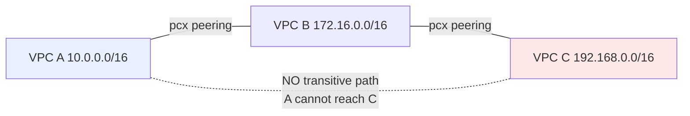

# VPC Peering, DNS & Flow Logs - SAA-C03 Deep Dive

> **VPC Peering** privately connects two VPCs (non-transitive, no overlapping CIDRs); **DNS settings** (`enableDnsSupport` / `enableDnsHostnames`) and **Route 53 Resolver** control name resolution; **VPC Flow Logs** capture IP traffic metadata for troubleshooting and security. Three high-frequency exam topics in one note.

See also: [01 - VPC Fundamentals & Architecture](01%20-%20VPC%20Fundamentals%20%26%20Architecture.md) · [02 - Subnets, Route Tables & Gateways (IGW, NAT)](02%20-%20Subnets%2C%20Route%20Tables%20%26%20Gateways%20%28IGW%2C%20NAT%29.md) · [03 - Security Groups & Network ACLs](03%20-%20Security%20Groups%20%26%20Network%20ACLs.md) · [04 - VPC Endpoints & PrivateLink Basics](04%20-%20VPC%20Endpoints%20%26%20PrivateLink%20Basics.md) · [06 - VPC Exam Scenarios & Cheat Sheet](06%20-%20VPC%20Exam%20Scenarios%20%26%20Cheat%20Sheet.md)

---

## Table of Contents

- [VPC Peering: The Basics](#vpc-peering-the-basics)
- [Peering Rules & Restrictions](#peering-rules--restrictions)
- [Non-Transitive Peering (Critical)](#non-transitive-peering-critical)
- [Transit Gateway as the Scaling Alternative](#transit-gateway-as-the-scaling-alternative)
- [VPC DNS Resolution](#vpc-dns-resolution)
- [Route 53 Resolver (Inbound & Outbound)](#route-53-resolver-inbound--outbound)
- [VPC Flow Logs](#vpc-flow-logs)
- [What Flow Logs Do NOT Capture](#what-flow-logs-do-not-capture)
- [Summary: Key Takeaways for SAA-C03](#summary-key-takeaways-for-saa-c03)

---



---

## VPC Peering: The Basics

A **VPC Peering connection** is a private, one-to-one network link between two VPCs that lets resources communicate using **private IP addresses** as if they were in the same network.

| Property | Detail |
| :--- | :--- |
| **Connectivity** | Private - uses the AWS backbone, never the public internet |
| **Scope** | Same Region or **cross-Region**; same or **cross-account** |
| **Cost** | No hourly charge; standard data transfer applies (intra-AZ free) |
| **Bandwidth** | No bottleneck - no aggregate throughput limit |
| **Encryption** | Inter-region peering traffic is automatically encrypted |

After creating a peering connection you must **update route tables on both sides** to direct the peer's CIDR to the peering connection (`pcx-xxxx`).

```text
VPC A route table
Destination       Target
172.16.0.0/16     pcx-0abc123   (route to VPC B)
```

> **Exam Tip:** Peering alone does nothing until you **add routes on both VPCs** AND open Security Groups/NACLs for the peer's CIDR.

[⬆ Back to top](#table-of-contents)

---

## Peering Rules & Restrictions

| Rule | Detail |
| :--- | :--- |
| **No overlapping CIDRs** | The two VPCs must have **non-overlapping** IP ranges |
| **Non-transitive** | Peering is not chained (see next section) |
| **No edge-to-edge routing** | A peer cannot use your IGW, NAT, VPN, or gateway endpoints |
| **One connection per VPC pair** | You can't create duplicate peerings between the same two VPCs |
| **Cross-account** | Requester creates; accepter must accept |
| **SG referencing** | Allowed across same-Region peers (reference peer's SG by ID) |

> **Exam Trap:** Two VPCs with overlapping CIDRs (e.g., both `10.0.0.0/16`) **cannot be peered**. This is why non-overlapping CIDR planning matters - see [01 - VPC Fundamentals & Architecture](01%20-%20VPC%20Fundamentals%20%26%20Architecture.md).

> **Exam Trap (edge-to-edge):** VPC A **cannot** route through VPC B to reach B's NAT Gateway, Internet Gateway, VPN, or S3 gateway endpoint. Each VPC must provide its own egress.

[⬆ Back to top](#table-of-contents)

---

## Non-Transitive Peering (Critical)

VPC peering is **non-transitive**: if A↔B and B↔C are peered, **A cannot reach C through B**. You'd need a direct A↔C peering.

For **N** VPCs needing full mesh connectivity, you need `N(N-1)/2` peering connections:

| VPCs | Peering connections (full mesh) |
| :--- | :--- |
| 3 | 3 |
| 5 | 10 |
| 10 | 45 |
| 20 | 190 |

This explosion of connections is the reason **Transit Gateway** exists.

> **Exam Tip:** "Connect many VPCs together / mesh is becoming unmanageable" → **Transit Gateway**, not more peering connections. Peering is the right answer only for a **small number** of VPC pairs.

[⬆ Back to top](#table-of-contents)

---

## Transit Gateway as the Scaling Alternative

**AWS Transit Gateway (TGW)** is a regional hub that connects thousands of VPCs (and on-prem via VPN/Direct Connect) in a **hub-and-spoke** topology - and unlike peering, it **supports transitive routing**.

| Dimension | VPC Peering | Transit Gateway |
| :--- | :--- | :--- |
| **Topology** | Point-to-point (mesh) | Hub-and-spoke |
| **Transitive routing** | No | **Yes** |
| **Scale** | Pairs only (mesh blowup) | Thousands of VPCs |
| **On-prem (VPN/DX)** | No | Yes |
| **Cost** | Data transfer only | Per-attachment + data |
| **Cross-region** | Yes (peering) | Yes (TGW peering) |

> **Exam Tip:** Few VPCs and lowest cost → **peering**. Many VPCs, shared services, or on-prem integration → **Transit Gateway**. Deep dive: [01 - Transit Gateway Fundamentals & Architecture](01%20-%20Transit%20Gateway%20Fundamentals%20%26%20Architecture.md) and [01 - Site-to-Site VPN Fundamentals & Architecture](01%20-%20Site-to-Site%20VPN%20Fundamentals%20%26%20Architecture.md).

[⬆ Back to top](#table-of-contents)

---

## VPC DNS Resolution

Two VPC attributes control DNS behavior:

| Attribute | Default (custom VPC) | What It Does |
| :--- | :--- | :--- |
| **`enableDnsSupport`** | `true` | Enables DNS resolution via the Amazon DNS server (VPC base + 2 / `169.254.169.253`) |
| **`enableDnsHostnames`** | `false` | Assigns public DNS hostnames to instances with public IPs |

- The Amazon-provided DNS resolver (Route 53 Resolver) lives at **VPC CIDR base + 2** and at link-local `169.254.169.253`.
- Both attributes must be `true` for **Private DNS on interface endpoints** and for **private hosted zone** resolution to work fully.

> **Exam Trap:** Instances not getting public DNS names → **`enableDnsHostnames` is false** (default in custom VPCs). Private hosted zone / interface endpoint Private DNS not resolving → need **both** attributes `true`.

[⬆ Back to top](#table-of-contents)

---

## Route 53 Resolver (Inbound & Outbound)

For hybrid DNS (resolving names between on-premises and AWS), use **Route 53 Resolver endpoints**:

| Endpoint Type | Direction | Use Case |
| :--- | :--- | :--- |
| **Inbound endpoint** | On-prem → AWS | On-prem DNS servers resolve AWS private zones |
| **Outbound endpoint** | AWS → On-prem | VPC resolves on-prem domain names (via forwarding rules) |

- **Resolver rules** forward queries for specific domains to your on-prem DNS over the outbound endpoint.
- Common in Direct Connect / VPN hybrid architectures. See [01 - Direct Connect Fundamentals & Architecture](01%20-%20Direct%20Connect%20Fundamentals%20%26%20Architecture.md).

> **Exam Tip:** "On-premises servers need to resolve names of AWS resources" → Route 53 Resolver **inbound** endpoint. "EC2 instances need to resolve on-prem internal domains" → **outbound** endpoint + forwarding rules.

[⬆ Back to top](#table-of-contents)

---

## VPC Flow Logs

**VPC Flow Logs** capture **metadata** about IP traffic going to and from network interfaces. They are essential for troubleshooting connectivity and for security analysis.

| Aspect | Detail |
| :--- | :--- |
| **Levels** | VPC, Subnet, or ENI (Elastic Network Interface) |
| **Captures** | Source/dest IP & port, protocol, packets, bytes, action (ACCEPT/REJECT), start/end time |
| **Destinations** | CloudWatch Logs, **Amazon S3**, or **Kinesis Data Firehose** |
| **Traffic types** | ACCEPT, REJECT, or ALL |
| **Performance impact** | None - metadata only, captured out-of-band |

Use cases:

- Diagnosing why traffic is blocked - a **REJECT** entry points to an SG/NACL issue.
- Security monitoring (feed into Athena/GuardDuty for analysis).
- Detecting unexpected outbound connections.

> **Exam Tip:** To find out **why** an instance can't be reached, check Flow Logs: a **REJECT** record means a Security Group or NACL is blocking it. Distinguishing SG vs NACL: SGs are stateful (no REJECT for return traffic), so persistent REJECTs on return often indicate a **NACL** problem.

[⬆ Back to top](#table-of-contents)

---

## What Flow Logs Do NOT Capture

A frequently tested list - Flow Logs **omit** the following:

| Not Captured | Why |
| :--- | :--- |
| Traffic to Amazon DNS server (`base+2`) | Excluded by design |
| Windows license activation traffic | Excluded |
| DHCP traffic | Excluded |
| Traffic to the VPC router (`base+1`) instance-metadata `169.254.169.254` | Excluded |
| Amazon Time Sync (`169.254.169.123`) | Excluded |
| **Packet contents / payload** | Flow Logs are **metadata only** (no packet capture) |

> **Exam Trap:** Flow Logs do **not** capture packet payloads - for full packet inspection use **VPC Traffic Mirroring**, not Flow Logs. Also, queries to the Amazon DNS resolver are **not** logged.

[⬆ Back to top](#table-of-contents)

---

## Summary: Key Takeaways for SAA-C03

| Concept | What You Must Know |
| :--- | :--- |
| **VPC Peering** | Private 1:1 link; same/cross Region & account |
| **No overlapping CIDR** | Peering impossible if ranges overlap |
| **Non-transitive** | A↔B and B↔C does NOT give A↔C |
| **No edge-to-edge** | Peer can't use your IGW/NAT/VPN/endpoints |
| **Scaling** | Many VPCs → **Transit Gateway** (transitive) |
| **`enableDnsSupport`** | DNS resolution via Amazon resolver (default on) |
| **`enableDnsHostnames`** | Public DNS names for instances (default OFF in custom VPC) |
| **Route 53 Resolver** | Inbound (on-prem→AWS), Outbound (AWS→on-prem) |
| **Flow Logs** | Metadata of ACCEPT/REJECT to CloudWatch/S3/Firehose |
| **Flow Logs limits** | No payload, no DNS/DHCP/metadata traffic |
| **Packet capture** | Use Traffic Mirroring, not Flow Logs |

[⬆ Back to top](#table-of-contents)

---
