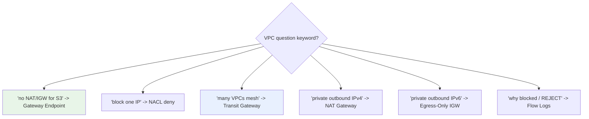
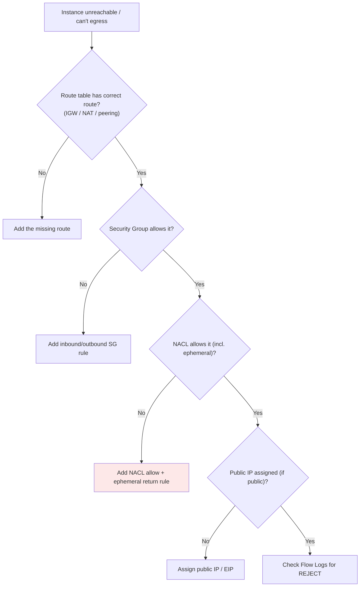

# VPC Exam Scenarios & Cheat Sheet - SAA-C03 Deep Dive

> A rapid-fire revision note: 10 worked **scenario Q&As** with explanations, a **"if the question says X → think Y"** keyword decoder, and a **must-memorize facts** table. Use this as your final pass before the exam.

See also: [01 - VPC Fundamentals & Architecture](01%20-%20VPC%20Fundamentals%20%26%20Architecture.md) · [02 - Subnets, Route Tables & Gateways (IGW, NAT)](02%20-%20Subnets%2C%20Route%20Tables%20%26%20Gateways%20%28IGW%2C%20NAT%29.md) · [03 - Security Groups & Network ACLs](03%20-%20Security%20Groups%20%26%20Network%20ACLs.md) · [04 - VPC Endpoints & PrivateLink Basics](04%20-%20VPC%20Endpoints%20%26%20PrivateLink%20Basics.md) · [05 - VPC Peering, DNS & Flow Logs](05%20-%20VPC%20Peering%2C%20DNS%20%26%20Flow%20Logs.md)

---

## Table of Contents

- [Scenario Q&A (Worked Examples)](#scenario-qa-worked-examples)
- [Keyword Decoder: If the Question Says X → Think Y](#keyword-decoder-if-the-question-says-x--think-y)
- [Must-Memorize Facts Cheat Table](#must-memorize-facts-cheat-table)
- [Common Connectivity Troubleshooting Flow](#common-connectivity-troubleshooting-flow)
- [Number Facts to Memorize](#number-facts-to-memorize)
- [Summary: Key Takeaways for SAA-C03](#summary-key-takeaways-for-saa-c03)

---

---

## Scenario Q&A (Worked Examples)

### Scenario 1: Private instances need to download OS patches

**Q:** EC2 instances in a private subnet must download patches from the internet but must not be reachable from the internet. What do you deploy?

**A:** A **NAT Gateway** in a public subnet, with the private subnet's route table pointing `0.0.0.0/0` at the NAT Gateway. For HA, deploy **one NAT Gateway per AZ**.

**Why:** NAT allows outbound-initiated connections only; the internet cannot initiate inbound. Managed NAT Gateway beats NAT instance unless you need an SG/bastion.

---

### Scenario 2: Access S3 privately with no NAT cost

**Q:** A fleet of private EC2 instances reads/writes large volumes to S3. The team wants to eliminate NAT data-processing charges. Best solution?

**A:** Create a **VPC Gateway Endpoint** for S3 and add the prefix-list route to the private subnets' route tables.

**Why:** Gateway endpoints are **free**, keep traffic on the AWS backbone, and remove the NAT Gateway data-processing cost. See [04 - VPC Endpoints & PrivateLink Basics](04%20-%20VPC%20Endpoints%20%26%20PrivateLink%20Basics.md).

---

### Scenario 3: Block a single malicious IP

**Q:** A specific public IP is attacking your web servers. You must block just that IP for the whole subnet. How?

**A:** Add a **Deny** rule for that IP in the subnet's **Network ACL** with a low rule number.

**Why:** Security Groups support **allow-only** rules - they cannot deny. Only NACLs can explicitly deny an IP. See [03 - Security Groups & Network ACLs](03%20-%20Security%20Groups%20%26%20Network%20ACLs.md).

---

### Scenario 4: Connecting 12 VPCs

**Q:** A company has 12 VPCs that all need to communicate. The peering mesh has become unmanageable. What's the recommended solution?

**A:** **AWS Transit Gateway** - a hub-and-spoke hub with transitive routing.

**Why:** Full-mesh peering of 12 VPCs requires `12×11/2 = 66` connections and isn't transitive. TGW scales to thousands of attachments. See [01 - Transit Gateway Fundamentals & Architecture](01%20-%20Transit%20Gateway%20Fundamentals%20%26%20Architecture.md).

---

### Scenario 5: NACL allows 443 inbound but connections hang

**Q:** A custom NACL permits inbound HTTPS (443) but client connections still time out. What's missing?

**A:** An **outbound rule allowing ephemeral ports `1024–65535`**.

**Why:** NACLs are **stateless** - return traffic must be explicitly allowed. The server replies from the ephemeral source ports. SGs wouldn't have this problem (stateful).

---

### Scenario 6: VPCs with overlapping CIDRs must connect

**Q:** Two VPCs both use `10.0.0.0/16` and need to share data. Can you peer them?

**A:** **No** - peering requires non-overlapping CIDRs. You must re-IP one VPC (add a non-overlapping secondary CIDR and migrate) or use a **PrivateLink** interface endpoint to expose specific services without full network routing.

**Why:** Overlapping ranges make routing ambiguous; AWS rejects the peering.

---

### Scenario 7: On-premises needs private access to S3

**Q:** On-prem servers (connected via Direct Connect) must reach S3 privately, never over the internet. Gateway endpoint or interface endpoint?

**A:** **Interface endpoint (PrivateLink)** for S3.

**Why:** **Gateway endpoints cannot be accessed from on-premises** or peered VPCs. Interface endpoints are reachable over DX/VPN. See [01 - PrivateLink & VPC Endpoints Deep Dive](01%20-%20PrivateLink%20%26%20VPC%20Endpoints%20Deep%20Dive.md).

---

### Scenario 8: Diagnose why an instance is unreachable

**Q:** Users can't reach an EC2 instance and you need to determine whether traffic is being dropped. What tool gives quickest insight?

**A:** **VPC Flow Logs** - look for **REJECT** records to/from the ENI.

**Why:** Flow Logs show ACCEPT/REJECT metadata. A REJECT means an SG or NACL is blocking. (For payload inspection you'd use Traffic Mirroring, not Flow Logs.)

---

### Scenario 9: IPv6 instances need outbound-only internet

**Q:** Instances with IPv6 addresses in a private subnet must reach the internet for updates but not be reachable inbound. What do you use?

**A:** An **Egress-Only Internet Gateway** with a `::/0` route.

**Why:** NAT Gateway is IPv4-only. IPv6 addresses are globally routable, so the egress-only IGW provides stateful outbound-only IPv6.

---

### Scenario 10: Restrict tier-to-tier database access at scale

**Q:** Only the auto-scaling app tier should reach the RDS database, regardless of how many app instances launch. How?

**A:** In the **database Security Group**, allow inbound `3306` with **source = the app tier's Security Group ID** (not a CIDR).

**Why:** SG referencing automatically covers all instances in the referenced SG as they scale, with no IP tracking. See [03 - Security Groups & Network ACLs](03%20-%20Security%20Groups%20%26%20Network%20ACLs.md).

[⬆ Back to top](#table-of-contents)

---

## Keyword Decoder: If the Question Says X → Think Y

| If the question says... | Think... |
| :--- | :--- |
| "Access S3/DynamoDB without IGW or NAT" | **Gateway VPC Endpoint** (free) |
| "Private access to other AWS service / from on-prem" | **Interface Endpoint (PrivateLink)** |
| "Private instances need outbound internet (IPv4)" | **NAT Gateway** (per AZ for HA) |
| "Outbound-only internet for IPv6" | **Egress-Only Internet Gateway** |
| "Block a specific IP address" | **NACL Deny rule** |
| "Allow rule only / can't deny" | **Security Group** |
| "Return traffic blocked / ephemeral ports" | **Stateless NACL** missing outbound rule |
| "Connect 2 VPCs privately, low cost, few VPCs" | **VPC Peering** |
| "Many VPCs, transitive, hub-and-spoke, on-prem" | **Transit Gateway** |
| "Overlapping CIDRs need to connect" | Re-IP or **PrivateLink** (peering won't work) |
| "Why is traffic dropped / who blocked it" | **VPC Flow Logs (REJECT)** |
| "Inspect packet payload / deep packet" | **Traffic Mirroring** |
| "Instance has no public DNS name" | Enable **`enableDnsHostnames`** |
| "On-prem must resolve AWS DNS" | **Route 53 Resolver inbound endpoint** |
| "AWS must resolve on-prem DNS" | **Route 53 Resolver outbound endpoint** |
| "Compliance: dedicated physical hardware" | **Dedicated tenancy** |
| "VPC out of IPs, can't recreate" | **Add a secondary CIDR block** |
| "Allow only app tier to reach DB at scale" | **Reference the app SG** in the DB SG |
| "Database must never reach internet" | **Isolated subnet** (no IGW/NAT route) |
| "Restrict endpoint to specific buckets" | **Endpoint policy** |

[⬆ Back to top](#table-of-contents)

---

## Must-Memorize Facts Cheat Table

| Fact | Value / Rule |
| :--- | :--- |
| **VPC CIDR range** | /16 (65,536) to /28 (16) |
| **Reserved IPs per subnet** | 5 (first 4 + last) |
| **Usable IPs formula** | `2^(32-prefix) - 5` |
| **Amazon DNS resolver** | VPC base + 2, and `169.254.169.253` |
| **Default VPC CIDR** | `172.31.0.0/16` |
| **VPC scope** | Regional (spans all AZs) |
| **Subnet scope** | Single AZ |
| **IGW per VPC** | One |
| **NAT Gateway** | Managed, HA within 1 AZ, IPv4 only, no SG |
| **NAT Instance** | Disable source/dest check; can have SG |
| **SG** | Stateful, allow-only, ENI level |
| **NACL** | Stateless, allow+deny, subnet level, numbered |
| **Default NACL** | Allows all; custom NACL denies all |
| **Default SG** | Deny inbound, allow outbound |
| **Gateway endpoint services** | S3, DynamoDB only (free) |
| **Peering** | Non-transitive, no overlapping CIDR, no edge-to-edge |
| **Flow Logs destinations** | CloudWatch Logs, S3, Kinesis Data Firehose |
| **Ephemeral ports (safe)** | 1024–65535 |

[⬆ Back to top](#table-of-contents)

---

## Common Connectivity Troubleshooting Flow

Order to check: **Route table → Security Group → NACL (ephemeral!) → Public IP → Flow Logs**.

[⬆ Back to top](#table-of-contents)

---

## Number Facts to Memorize

| Item | Number |
| :--- | :--- |
| Reserved IPs per subnet | 5 |
| Min/Max VPC CIDR prefix | /28 / /16 |
| IPv6 subnet size (fixed) | /64 |
| IPv6 VPC block size | /56 |
| Default VPCs per Region | 1 |
| VPCs per Region (default quota) | 5 |
| Secondary CIDRs per VPC | up to 4 more |
| IGWs per VPC | 1 |
| NACLs per subnet | 1 |
| SGs per ENI (default) | up to 5 |
| Full-mesh peering for N VPCs | `N(N-1)/2` |

[⬆ Back to top](#table-of-contents)

---

## Summary: Key Takeaways for SAA-C03

| Theme | Remember |
| :--- | :--- |
| **Endpoints** | Gateway = free S3/DynamoDB in-VPC; Interface = everything else + on-prem |
| **NAT** | IPv4 outbound, one per AZ for HA; Egress-Only IGW for IPv6 |
| **Firewalls** | SG stateful/allow-only; NACL stateless/can-deny + ephemeral ports |
| **Connecting VPCs** | Few = peering; many/transitive/on-prem = Transit Gateway |
| **CIDR** | Plan non-overlapping; /16–/28; can't resize, add secondary |
| **Troubleshooting** | Flow Logs REJECT; check route → SG → NACL → public IP |
| **DNS** | Enable hostnames for public DNS; Resolver endpoints for hybrid |

[⬆ Back to top](#table-of-contents)

---
