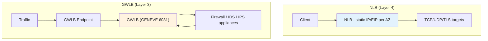
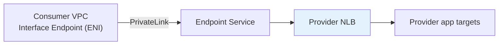
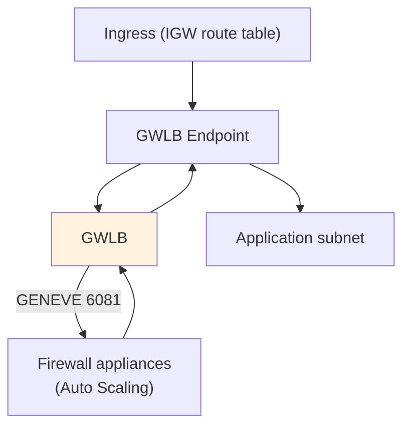

# Network Load Balancer (NLB) & Gateway Load Balancer - SAA-C03 Deep Dive

> The **NLB** is a **Layer 4 (TCP/UDP/TLS)** load balancer built for **extreme performance, static/Elastic IPs, and millions of requests/sec** with ultra-low latency. The **GWLB** is a **Layer 3 gateway** that transparently routes traffic through fleets of **third-party security appliances** (firewalls/IDS/IPS) using the **GENEVE protocol on port 6081**.

See also: [01 - ELB Fundamentals & Types](01%20-%20ELB%20Fundamentals%20%26%20Types.md) · [02 - Application Load Balancer (ALB) Deep Dive](02%20-%20Application%20Load%20Balancer%20%28ALB%29%20Deep%20Dive.md) · [04 - ELB Features (Stickiness, Health Checks, SSL, Cross-Zone, Connection Draining)](04%20-%20ELB%20Features%20%28Stickiness%2C%20Health%20Checks%2C%20SSL%2C%20Cross-Zone%2C%20Connection%20Draining%29.md) · [05 - ELB Exam Scenarios & Cheat Sheet](05%20-%20ELB%20Exam%20Scenarios%20%26%20Cheat%20Sheet.md)

---

## Table of Contents

- [Part 1: Network Load Balancer (NLB) Overview](#part-1-network-load-balancer-nlb-overview)
- [Part 2: NLB Static IP & Elastic IP per AZ](#part-2-nlb-static-ip--elastic-ip-per-az)
- [Part 3: NLB Source IP Preservation & TLS](#part-3-nlb-source-ip-preservation--tls)
- [Part 4: NLB + PrivateLink Front-End](#part-4-nlb--privatelink-front-end)
- [Part 5: Gateway Load Balancer (GWLB) Overview](#part-5-gateway-load-balancer-gwlb-overview)
- [Part 6: GWLB Endpoints & GENEVE](#part-6-gwlb-endpoints--geneve)
- [Part 7: NLB vs ALB vs GWLB Comparison](#part-7-nlb-vs-alb-vs-gwlb-comparison)
- [Summary: Key Takeaways for SAA-C03](#summary-key-takeaways-for-saa-c03)

---



---

When ALB's Layer 7 smarts are not needed - or when you need raw speed, static IPs, UDP, or inline security inspection - NLB and GWLB are the answers. They pair well with [06 - EC2 Auto Scaling (ASG)](06%20-%20EC2%20Auto%20Scaling%20%28ASG%29.md) for the target/appliance fleets and with [01 - Global Accelerator Fundamentals & Architecture](01%20-%20Global%20Accelerator%20Fundamentals%20%26%20Architecture.md) for global static anycast IPs.

---

## Part 1: Network Load Balancer (NLB) Overview

### Key Properties

| Property | Value |
| :--- | :--- |
| **Layer** | 4 (Transport - TCP, UDP, TCP_UDP, TLS) |
| **Performance** | **Millions of requests/sec**, ultra-low latency (~100 µs) |
| **Endpoint** | **One static IP per AZ** (can assign **Elastic IP**) |
| **Targets** | Instance, IP, **ALB-as-target** |
| **Cross-zone** | **OFF by default** (charged when enabled) |
| **Health checks** | TCP, HTTP, HTTPS |
| **Security group** | **Now supported** (added 2023; optional) |

### Why Choose NLB

- Handles **sudden, volatile spikes** without pre-warming.
- **UDP** support (ALB cannot do UDP) - gaming, VoIP, DNS, IoT, syslog.
- **Static IP** that you can **allowlist in firewalls**.
- Performance-sensitive TCP workloads (databases, message brokers).

> **Exam Tip:** Signals for NLB: "**static IP**", "**millions of requests**", "**lowest latency**", "**UDP**", "**whitelist the IP in a firewall**". Signals for ALB: HTTP path/host routing.

[⬆ Back to top](#table-of-contents)

---

## Part 2: NLB Static IP & Elastic IP per AZ

The NLB exposes **one network interface per AZ**, each with a single static IP.

| Scheme | IP Behavior |
| :--- | :--- |
| **Internet-facing** | AWS-assigned public IP per AZ, **or assign your own Elastic IP** per AZ |
| **Internal** | Private static IP per AZ (you can specify it) |

```bash
aws elbv2 create-load-balancer \
  --name my-nlb --type network --scheme internet-facing \
  --subnet-mappings \
    SubnetId=subnet-aaa,AllocationId=eipalloc-111 \
    SubnetId=subnet-bbb,AllocationId=eipalloc-222
```

> **Exam Tip:** Only **NLB** gives you a **static/Elastic IP**. ALB gives a changing DNS name. If clients or partners must **hardcode/allowlist an IP**, choose **NLB** (or front an ALB with an NLB to gain static IPs + L7 routing). For **global** static anycast IPs use [01 - Global Accelerator Fundamentals & Architecture](01%20-%20Global%20Accelerator%20Fundamentals%20%26%20Architecture.md).

[⬆ Back to top](#table-of-contents)

---

## Part 3: NLB Source IP Preservation & TLS

### Source IP Preservation

- For **instance** and **IP (by instance)** targets, the NLB **preserves the original client source IP** - the backend sees the real client IP directly (no `X-Forwarded-For` needed).
- This is a major difference from ALB, where the backend sees the LB's IP.

> **Exam Tip:** "Backend needs to see the **real client IP** at the TCP level / for IP-based firewalling" -> **NLB** preserves source IP. ALB hides it behind X-Forwarded-For.

### TLS Termination vs Passthrough

| Mode | Listener Protocol | Where TLS Ends |
| :--- | :--- | :--- |
| **TLS termination** | `TLS` | At the NLB (uses ACM cert), reduces backend load |
| **TCP passthrough** | `TCP` | At the backend (end-to-end encryption, NLB just forwards bytes) |

> **Exam Tip:** Need **end-to-end encryption** with **no decryption at the LB**? Use an **NLB with a TCP listener (passthrough)**. Want the NLB to offload TLS? Use a **TLS listener with an ACM certificate** (SNI multi-cert supported).

[⬆ Back to top](#table-of-contents)

---

## Part 4: NLB + PrivateLink Front-End

**AWS PrivateLink (VPC Endpoint Services)** lets you expose a service privately to other VPCs/accounts **without VPC peering or going over the internet**. The provider side **must front the service with an NLB** (GWLB endpoint services also exist for appliances).



> **Exam Tip:** "Expose a service to other VPCs/accounts privately via **PrivateLink / VPC Endpoint Service**" -> the provider must put an **NLB** in front. ALB is **not** directly supported as the endpoint-service front-end (you can place an ALB *behind* the NLB as a target if L7 routing is needed). VPC/endpoint details in [01 - VPC Fundamentals & Architecture](01%20-%20VPC%20Fundamentals%20%26%20Architecture.md).

[⬆ Back to top](#table-of-contents)

---

## Part 5: Gateway Load Balancer (GWLB) Overview

The GWLB lets you deploy, scale, and manage a fleet of **third-party virtual network appliances** - firewalls, intrusion detection/prevention (IDS/IPS), deep packet inspection - **transparently in the traffic path**.

### Key Properties

| Property | Value |
| :--- | :--- |
| **Layer** | 3 (network gateway) operating on **all IP traffic** |
| **Protocol to appliances** | **GENEVE encapsulation on port 6081** |
| **Function** | Acts as a transparent **bump-in-the-wire** + load balancer for appliances |
| **Targets** | The security appliances (instance / IP) |
| **Cross-zone** | OFF by default (charged when enabled) |

### Why Two Roles in One

- **Gateway:** a single entry/exit point for traffic to be inspected.
- **Load balancer:** distributes that traffic across a scalable pool of appliances and health-checks them.

> **Exam Tip:** GWLB signal = "**deploy a fleet of third-party firewalls / IDS / IPS** and inspect **all** traffic transparently." It keeps **source/destination intact** because traffic is GENEVE-encapsulated, so appliances see original packets.

[⬆ Back to top](#table-of-contents)

---

## Part 6: GWLB Endpoints & GENEVE

Traffic is routed to the GWLB via a **Gateway Load Balancer Endpoint (GWLBe)** - a type of VPC endpoint (powered by PrivateLink). Route tables send traffic to the GWLBe, which forwards to the GWLB, which load-balances to appliances and returns the (inspected) traffic.



| Term | Meaning |
| :--- | :--- |
| **GWLB** | The load balancer fronting the appliance fleet |
| **GWLB Endpoint (GWLBe)** | VPC endpoint that route tables point to, sending traffic to the GWLB |
| **GENEVE (6081)** | Encapsulation protocol carrying original packets to/from appliances |

> **Exam Trap:** The magic number is **GENEVE port 6081** - a classic GWLB recall question. The appliance vendor's software must support GENEVE.

[⬆ Back to top](#table-of-contents)

---

## Part 7: NLB vs ALB vs GWLB Comparison

| Feature | ALB | NLB | GWLB |
| :--- | :--- | :--- | :--- |
| **OSI Layer** | 7 (HTTP/HTTPS) | 4 (TCP/UDP/TLS) | 3 (IP / GENEVE) |
| **Routing** | Host/path/header/query/method/IP | Port-based (flow hash) | Transparent (all traffic) |
| **Endpoint** | DNS name | **Static IP / Elastic IP** | Via GWLB endpoint |
| **UDP support** | No | **Yes** | N/A (all IP) |
| **Targets** | Instance, IP, **Lambda** | Instance, IP, **ALB** | Appliances (instance/IP) |
| **Preserve client IP** | No (X-Forwarded-For) | **Yes** | Yes (encapsulated) |
| **TLS/SSL** | Terminate (ACM) | Terminate **or** passthrough | N/A |
| **Sticky sessions** | Yes | Yes (source-IP/flow) | N/A |
| **WAF** | **Yes** | No | No |
| **PrivateLink front-end** | No (behind NLB only) | **Yes** | Yes (appliances) |
| **Cross-zone default** | ON (free) | OFF (charged) | OFF (charged) |
| **Performance** | High | **Highest** (millions req/s) | High |
| **Typical use** | Web apps, microservices | Speed, static IP, UDP, PrivateLink | Inline security appliances |

[⬆ Back to top](#table-of-contents)

---

## Summary: Key Takeaways for SAA-C03

| Concept | What You Must Know |
| :--- | :--- |
| **NLB layer** | 4 - TCP/UDP/TLS, ultra-low latency, millions req/s |
| **NLB IPs** | Static IP per AZ; supports **Elastic IPs** |
| **NLB source IP** | **Preserved** to backend (no X-Forwarded-For needed) |
| **NLB TLS** | Terminate (ACM) or **passthrough (TCP)** for end-to-end encryption |
| **NLB + PrivateLink** | Provider front-end for **VPC Endpoint Service** must be an NLB |
| **NLB targets** | Can target an **ALB** (static IP + L7 routing combined) |
| **GWLB layer** | 3 gateway for transparent third-party appliances |
| **GWLB protocol** | **GENEVE on port 6081** |
| **GWLB endpoint** | Route tables point to a **GWLBe** |
| **WAF** | ALB only - not NLB/GWLB |
| **UDP** | NLB only |

[⬆ Back to top](#table-of-contents)

---
