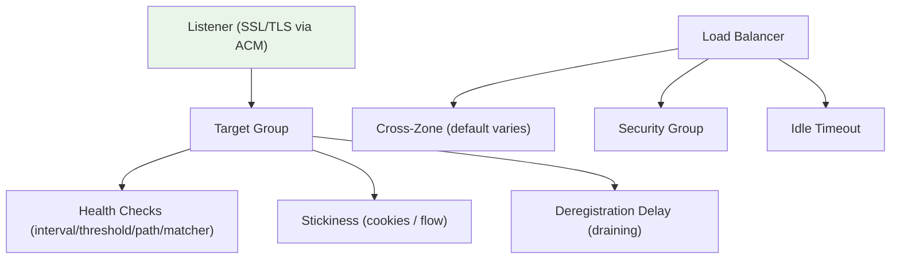
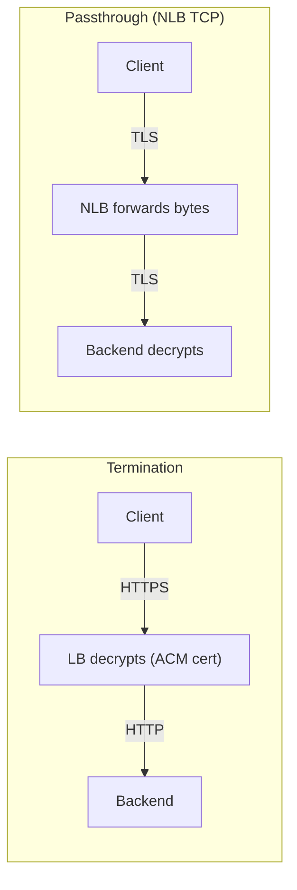
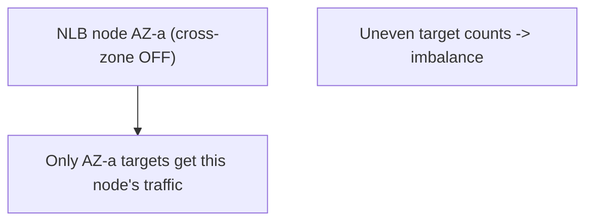

# ELB Features (Stickiness, Health Checks, SSL, Cross-Zone, Connection Draining) - SAA-C03 Deep Dive

> The cross-cutting ELB features tested on SAA-C03: **sticky sessions**, **health-check tuning**, **SSL/TLS via ACM** (termination vs passthrough), **cross-zone load balancing** (defaults & cost), **connection draining / deregistration delay**, **idle timeout**, and **security groups**. Master the defaults - the exam loves the edge cases.

See also: [01 - ELB Fundamentals & Types](01%20-%20ELB%20Fundamentals%20%26%20Types.md) · [02 - Application Load Balancer (ALB) Deep Dive](02%20-%20Application%20Load%20Balancer%20%28ALB%29%20Deep%20Dive.md) · [03 - Network Load Balancer (NLB) & Gateway Load Balancer](03%20-%20Network%20Load%20Balancer%20%28NLB%29%20%26%20Gateway%20Load%20Balancer.md) · [05 - ELB Exam Scenarios & Cheat Sheet](05%20-%20ELB%20Exam%20Scenarios%20%26%20Cheat%20Sheet.md)

---

## Table of Contents

- [Part 1: Sticky Sessions (Session Affinity)](#part-1-sticky-sessions-session-affinity)
- [Part 2: Health Check Tuning](#part-2-health-check-tuning)
- [Part 3: SSL/TLS Certificates via ACM](#part-3-ssltls-certificates-via-acm)
- [Part 4: SSL Termination vs Passthrough](#part-4-ssl-termination-vs-passthrough)
- [Part 5: Cross-Zone Load Balancing (Defaults & Cost)](#part-5-cross-zone-load-balancing-defaults--cost)
- [Part 6: Connection Draining / Deregistration Delay](#part-6-connection-draining--deregistration-delay)
- [Part 7: Idle Timeout](#part-7-idle-timeout)
- [Part 8: Security Groups (ALB & NLB)](#part-8-security-groups-alb--nlb)
- [Summary: Key Takeaways for SAA-C03](#summary-key-takeaways-for-saa-c03)

---



---

These features apply across ALB/NLB (and mostly the legacy CLB) and frequently combine with [06 - EC2 Auto Scaling (ASG)](06%20-%20EC2%20Auto%20Scaling%20%28ASG%29.md) for graceful scaling and instance replacement.

---

## Part 1: Sticky Sessions (Session Affinity)

Stickiness binds a client to the **same target**. Configured at the **target group** level.

| LB | Mechanism | Cookie / Key |
| :--- | :--- | :--- |
| **ALB** | Duration-based cookie | `AWSALB` / `AWSALBCORS` (LB-generated) |
| **ALB** | Application-based cookie | `AWSALBAPP` (wraps your app cookie) |
| **NLB** | Source IP affinity (flow hash) | No cookie - based on protocol/source/dest |
| **CLB** | Duration / app cookie | `AWSELB` |

```bash
aws elbv2 modify-target-group-attributes \
  --target-group-arn $TG_ARN \
  --attributes \
    Key=stickiness.enabled,Value=true \
    Key=stickiness.type,Value=lb_cookie \
    Key=stickiness.lb_cookie.duration_seconds,Value=3600
```

> **Exam Trap:** Stickiness can cause **uneven load** (one target hot). The architecturally preferred fix for scaling stateful apps is to **store session state externally** (ElastiCache for Redis / DynamoDB) so any target can serve any user, then disable stickiness.

[⬆ Back to top](#table-of-contents)

---

## Part 2: Health Check Tuning

Health checks decide if a target receives traffic. Tuned at the **target group** level.

| Parameter | Default (ALB) | What It Controls |
| :--- | :--- | :--- |
| **Protocol** | HTTP/HTTPS | How target is probed (NLB also TCP) |
| **Path** | `/` | URL probed (HTTP/S only), e.g. `/health` |
| **Interval** | 30 s | Time between checks |
| **Timeout** | 5 s | Wait before a probe is a failure |
| **Healthy threshold** | 5 (CLB) / 5 (ALB) | Consecutive passes to mark healthy |
| **Unhealthy threshold** | 2 | Consecutive fails to mark unhealthy |
| **Matcher** | `200` | Success HTTP code(s), e.g. `200-299` |

### Faster Failure Detection

To detect failures faster: lower the **interval** and the **unhealthy threshold**. Trade-off: more probe traffic and risk of flapping on transient blips.

```bash
aws elbv2 modify-target-group \
  --target-group-arn $TG_ARN \
  --health-check-path /health \
  --health-check-interval-seconds 10 \
  --healthy-threshold-count 2 \
  --unhealthy-threshold-count 2 \
  --matcher HttpCode=200
```

> **Exam Tip:** Target "InService but no traffic" or stuck unhealthy -> the **health-check path/matcher is wrong** or the **security group blocks the health-check port**. The health check must reach the **target port** from the LB.

[⬆ Back to top](#table-of-contents)

---

## Part 3: SSL/TLS Certificates via ACM

- Use **AWS Certificate Manager (ACM)** to provision **free public TLS certificates** and attach them to ALB/NLB listeners.
- ACM **auto-renews** managed certificates - no manual rotation.
- You can also **import** third-party certs into ACM.
- A **security policy** on the listener defines allowed TLS versions/ciphers.

| Item | Detail |
| :--- | :--- |
| **Provider** | ACM (free public certs) or imported |
| **Renewal** | Automatic for ACM-issued certs |
| **Multi-domain** | SNI - multiple certs on one listener (ALB & NLB) |
| **Region** | ACM cert must be in the **same region** as the ALB/NLB |

> **Exam Tip:** "Reduce certificate management overhead / auto-renew TLS" -> **ACM** + ELB. (For **CloudFront**, the ACM cert must be in **us-east-1**.)

[⬆ Back to top](#table-of-contents)

---

## Part 4: SSL Termination vs Passthrough



| Mode | Where TLS Ends | LB Type | When to Use |
| :--- | :--- | :--- | :--- |
| **Termination** | At the LB (ACM cert) | ALB, NLB (TLS listener), CLB | Offload crypto, inspect/route on HTTP (ALB) |
| **Passthrough** | At the backend | **NLB (TCP listener)** | End-to-end encryption, LB must not see plaintext |
| **Re-encryption** | LB decrypts then re-encrypts to backend | ALB (HTTPS backend) | Encrypt in transit AND route at L7 |

> **Exam Tip:** **End-to-end encryption with the LB unable to decrypt** -> **NLB TCP passthrough**. **L7 routing AND encryption in transit to backends** -> **ALB with HTTPS targets (re-encryption)**.

[⬆ Back to top](#table-of-contents)

---

## Part 5: Cross-Zone Load Balancing (Defaults & Cost)

Cross-zone determines whether each LB node spreads traffic across **all** AZs' targets or only its **own** AZ.

| LB Type | Default | Configurable? | Inter-AZ Data Cost When ON |
| :--- | :--- | :--- | :--- |
| **ALB** | **ON** | Cannot disable (LB level); can disable per target group | **No charge** |
| **NLB** | **OFF** | Yes (LB or TG level) | **Charged** |
| **GWLB** | **OFF** | Yes | **Charged** |
| **CLB** | OFF | Yes | No charge |

### Why It Matters

Without cross-zone, if AZ-a has 2 targets and AZ-b has 8, a node in AZ-a still sends 50% of traffic to just its 2 targets - **overloading them**.



> **Exam Trap:** "**One AZ's instances are overloaded while another AZ is idle**" on an **NLB** -> cross-zone is **OFF by default**; enable it (and accept inter-AZ charges) **or** balance target counts per AZ. ALB never has this problem (always on).

[⬆ Back to top](#table-of-contents)

---

## Part 6: Connection Draining / Deregistration Delay

When a target is deregistered or fails health checks, the LB stops sending **new** requests but lets **in-flight** requests finish for a configurable window.

| LB | Feature Name | Default | Range |
| :--- | :--- | :--- | :--- |
| **ALB / NLB** | **Deregistration delay** | 300 s | 0 - 3600 s |
| **CLB** | **Connection draining** | 300 s | 1 - 3600 s |

```bash
aws elbv2 modify-target-group-attributes \
  --target-group-arn $TG_ARN \
  --attributes Key=deregistration_delay.timeout_seconds,Value=60
```

- Set **lower** for short requests to recycle instances faster.
- Set **higher** for long-running requests (uploads, streaming) to avoid cutting users off.
- Works with [06 - EC2 Auto Scaling (ASG)](06%20-%20EC2%20Auto%20Scaling%20%28ASG%29.md) scale-in and rolling deploys for graceful instance removal.

> **Exam Tip:** "Allow active requests to complete before an instance is removed during scale-in/deploy" -> **deregistration delay (connection draining)**.

[⬆ Back to top](#table-of-contents)

---

## Part 7: Idle Timeout

The **idle timeout** closes a connection if no data is sent for the configured period.

| LB | Idle Timeout |
| :--- | :--- |
| **ALB** | Default **60 s**, configurable 1 - 4000 s |
| **CLB** | Default 60 s, configurable |
| **NLB** | TCP idle ~350 s (not configurable historically) |

> **Exam Tip:** Long-polling / large uploads getting cut off on an ALB -> **increase the idle timeout** (and configure keep-alive on backends). For very long-lived TCP flows, consider **NLB**.

[⬆ Back to top](#table-of-contents)

---

## Part 8: Security Groups (ALB & NLB)

| LB | Security Group Support |
| :--- | :--- |
| **ALB** | **Always has a security group** (control inbound 80/443, etc.) |
| **NLB** | **Now supports security groups** (added Aug 2023; optional, set at creation) |
| **GWLB** | No SG (transparent) |

### Best-Practice Chaining

Lock backends to accept traffic **only from the LB's security group**:

```bash
# Backend SG: allow from ALB SG only
aws ec2 authorize-security-group-ingress \
  --group-id sg-backend --protocol tcp --port 80 \
  --source-group sg-alb
```

> **Exam Trap:** Historically NLB had **no** security group, so people secured backends by SG referencing or by NACL. As of 2023 **NLB supports SGs** - but it must be **enabled at creation time** (cannot be added later). If a question is dated/pre-2023 it may still say "NLB has no security group."

[⬆ Back to top](#table-of-contents)

---

## Summary: Key Takeaways for SAA-C03

| Concept | What You Must Know |
| :--- | :--- |
| **Stickiness** | TG-level; ALB `AWSALB`/`AWSALBAPP`; better to externalize state |
| **Health checks** | Tune interval/threshold/path/matcher; wrong path = unhealthy |
| **ACM** | Free auto-renewing certs; same region as LB (us-east-1 for CloudFront) |
| **SSL modes** | Terminate (offload) / Passthrough (NLB TCP, end-to-end) / Re-encrypt (ALB) |
| **Cross-zone** | ALB ON+free; NLB/GWLB OFF+charged - cause of AZ imbalance |
| **Deregistration delay** | Default 300 s; graceful in-flight completion |
| **Idle timeout** | ALB default 60 s, up to 4000 s |
| **Security groups** | ALB always; NLB now supports (set at creation); GWLB none |

[⬆ Back to top](#table-of-contents)

---
