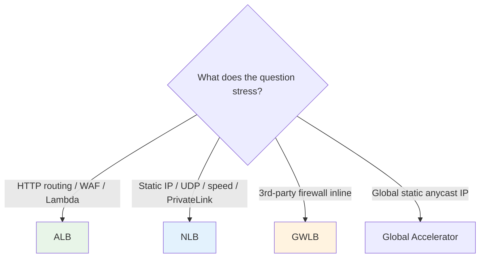

# ELB Exam Scenarios & Cheat Sheet - SAA-C03 Deep Dive

> Rapid-fire **scenario Q&A**, a **"question says X -> pick Y"** mapping table, and a consolidated **important-facts cheat sheet** for Elastic Load Balancing. Use this as the final pre-exam review for the ELB topic.

See also: [01 - ELB Fundamentals & Types](01%20-%20ELB%20Fundamentals%20%26%20Types.md) · [02 - Application Load Balancer (ALB) Deep Dive](02%20-%20Application%20Load%20Balancer%20%28ALB%29%20Deep%20Dive.md) · [03 - Network Load Balancer (NLB) & Gateway Load Balancer](03%20-%20Network%20Load%20Balancer%20%28NLB%29%20%26%20Gateway%20Load%20Balancer.md) · [04 - ELB Features (Stickiness, Health Checks, SSL, Cross-Zone, Connection Draining)](04%20-%20ELB%20Features%20%28Stickiness%2C%20Health%20Checks%2C%20SSL%2C%20Cross-Zone%2C%20Connection%20Draining%29.md)

---

## Table of Contents

- [Part 1: Scenario Q&A (10 Walkthroughs)](#part-1-scenario-qa-10-walkthroughs)
- [Part 2: "Question Says X -> Pick Y" Quick Table](#part-2-question-says-x---pick-y-quick-table)
- [Part 3: Important-Facts Cheat Sheet](#part-3-important-facts-cheat-sheet)
- [Part 4: Common Traps & Distractors](#part-4-common-traps--distractors)
- [Summary: Key Takeaways for SAA-C03](#summary-key-takeaways-for-saa-c03)

---

---

This file assumes the concepts from the other four ELB notes. It pairs heavily with [06 - EC2 Auto Scaling (ASG)](06%20-%20EC2%20Auto%20Scaling%20%28ASG%29.md), [01 - Route 53 Fundamentals & Hosted Zones](01%20-%20Route%2053%20Fundamentals%20%26%20Hosted%20Zones.md), and [01 - Global Accelerator Fundamentals & Architecture](01%20-%20Global%20Accelerator%20Fundamentals%20%26%20Architecture.md).

---

## Part 1: Scenario Q&A (10 Walkthroughs)

### Scenario 1: Path-Based Microservices

**Q:** A web app routes `/api/*` to one service and `/images/*` to another, all on the same domain. Which load balancer?

**A:** **ALB** with **path-based listener rules** to two target groups. NLB cannot inspect URL paths (L4).

### Scenario 2: Static IP for Firewall Allowlisting

**Q:** A partner must allowlist a **fixed IP** to reach your TCP service. Which LB?

**A:** **NLB** - it provides a **static IP per AZ** and supports **Elastic IPs**. ALB only gives a changing DNS name. (For multi-region static IPs use **Global Accelerator**.)

### Scenario 3: Serverless HTTP Backend Behind an LB

**Q:** You want HTTP requests load-balanced to a **Lambda function** (not API Gateway). Which LB?

**A:** **ALB** with a **Lambda target group**. Lambda targets are **ALB-exclusive**.

### Scenario 4: End-to-End Encryption, LB Must Not Decrypt

**Q:** Compliance requires TLS all the way to the instances; the LB must not see plaintext. Which setup?

**A:** **NLB with a TCP listener (passthrough)** so encryption terminates on the backend. (ALB always terminates/inspects HTTP.)

### Scenario 5: One AZ Overloaded on an NLB

**Q:** With an NLB, instances in AZ-a are saturated while AZ-b is nearly idle (uneven counts). Fix?

**A:** **Enable cross-zone load balancing** (OFF by default on NLB - note inter-AZ charges) or balance target counts per AZ. ALB wouldn't have this issue (cross-zone always on).

### Scenario 6: Force HTTPS Without Touching App Code

**Q:** All HTTP traffic must be redirected to HTTPS without modifying the application.

**A:** Configure an **ALB listener rule on port 80 that redirects to 443 with HTTP_301**.

### Scenario 7: Inline Third-Party Firewall Fleet

**Q:** Security mandates all VPC traffic pass through a scalable fleet of **third-party firewall appliances** for inspection.

**A:** **Gateway Load Balancer (GWLB)** with **GWLB endpoints**, using **GENEVE on port 6081** to the appliances.

### Scenario 8: Graceful Instance Removal on Scale-In

**Q:** During Auto Scaling scale-in, active user requests are being dropped. Fix?

**A:** Increase the **deregistration delay (connection draining)** on the target group so in-flight requests complete. See [06 - EC2 Auto Scaling (ASG)](06%20-%20EC2%20Auto%20Scaling%20%28ASG%29.md).

### Scenario 9: Many HTTPS Domains on One LB

**Q:** Host dozens of HTTPS domains on a single ALB without one cert per LB.

**A:** Use **SNI** with **multiple ACM certificates** attached to one HTTPS listener.

### Scenario 10: Expose a Service Privately Across VPCs/Accounts

**Q:** Offer a service to consumer VPCs privately, no peering, no internet.

**A:** **AWS PrivateLink** - create a **VPC Endpoint Service** fronted by an **NLB**. Consumers create interface endpoints. See [01 - VPC Fundamentals & Architecture](01%20-%20VPC%20Fundamentals%20%26%20Architecture.md).

[⬆ Back to top](#table-of-contents)

---

## Part 2: "Question Says X -> Pick Y" Quick Table

| Question Phrase / Requirement | Answer |
| :--- | :--- |
| Route by URL path / hostname / header | **ALB** |
| gRPC or WebSocket | **ALB** |
| Lambda as backend behind a load balancer | **ALB + Lambda target** |
| Attach **AWS WAF** to the load balancer | **ALB** (or CloudFront / API Gateway) |
| Authenticate users at the LB (Cognito/OIDC) | **ALB** |
| **Static IP** / Elastic IP / allowlist an IP | **NLB** |
| **UDP** (gaming, DNS, IoT, VoIP, syslog) | **NLB** |
| Millions of requests/sec, lowest latency | **NLB** |
| Preserve **client source IP** at L4 | **NLB** |
| **End-to-end TLS** (no decryption at LB) | **NLB TCP passthrough** |
| **PrivateLink / VPC Endpoint Service** front-end | **NLB** |
| Static IP **and** L7 routing both needed | **ALB behind NLB** |
| Inline **firewall / IDS / IPS** appliances | **GWLB** |
| GENEVE / port **6081** | **GWLB** |
| Force HTTP -> HTTPS | **ALB redirect 301** |
| Maintenance page from the LB | **ALB fixed-response** |
| Blue/green or canary at the LB | **ALB weighted target groups** |
| Auto-renewing free TLS certs | **ACM** + ALB/NLB |
| Detailed per-request logs | **ALB access logs to S3** |
| Global static anycast IP / lower global latency | **Global Accelerator** ([01 - Global Accelerator Fundamentals & Architecture](01%20-%20Global%20Accelerator%20Fundamentals%20%26%20Architecture.md)) |
| New design, CLB is an option | **Avoid CLB** - pick ALB/NLB |

[⬆ Back to top](#table-of-contents)

---

## Part 3: Important-Facts Cheat Sheet

| Fact | Value |
| :--- | :--- |
| **ALB layer / NLB layer / GWLB layer** | 7 / 4 / 3 |
| **Lambda target** | ALB only |
| **ALB as target** | Of an NLB only |
| **UDP support** | NLB only |
| **WAF attachment** | ALB only (not NLB/GWLB) |
| **Cross-zone default** | ALB ON (free); NLB/GWLB OFF (charged) |
| **NLB IPs** | Static IP per AZ + Elastic IP |
| **ALB/CLB endpoint** | DNS name only |
| **Source IP to backend** | NLB preserves; ALB via X-Forwarded-For |
| **GWLB protocol/port** | GENEVE / 6081 |
| **Deregistration delay default** | 300 s (0-3600) |
| **ALB idle timeout** | 60 s default (1-4000) |
| **ALB stickiness cookies** | `AWSALB` (duration), `AWSALBAPP` (app) |
| **NLB stickiness** | Source-IP / flow based |
| **Security groups** | ALB always; NLB since 2023 (at creation); GWLB none |
| **TLS certs** | ACM (auto-renew); SNI for multi-domain |
| **Access logs** | To S3, disabled by default |
| **Min AZs / subnets** | 2 for high availability |
| **Internet-facing LB subnets** | Must be public (IGW route) |
| **Min healthy AZ behavior** | Routes around failed AZ |

[⬆ Back to top](#table-of-contents)

---

## Part 4: Common Traps & Distractors

> **Trap 1 - CLB as bait.** New-architecture questions list CLB to tempt you. It is legacy; choose ALB or NLB.

> **Trap 2 - ALB static IP.** ALB does **not** offer a static IP. Need one? NLB, or ALB behind an NLB, or Global Accelerator.

> **Trap 3 - WAF on NLB.** WAF does **not** attach to NLB/GWLB. Use ALB, or front the NLB with CloudFront, or use Network Firewall.

> **Trap 4 - NLB cross-zone "free".** Cross-zone on NLB/GWLB is OFF by default and **incurs inter-AZ data charges** when enabled. Only ALB cross-zone is free.

> **Trap 5 - Client IP on ALB.** Backends behind an ALB see the **ALB's** IP; the real client IP is in **X-Forwarded-For**, not the TCP source.

> **Trap 6 - UDP on ALB.** ALB cannot do UDP. Any UDP workload -> NLB.

> **Trap 7 - PrivateLink with ALB.** Endpoint Services require an **NLB** front-end. Put an ALB behind the NLB if you also need L7 routing.

> **Trap 8 - NLB security group timing.** NLB SGs must be enabled **at creation** and cannot be added to an existing NLB.

> **Trap 9 - Global Accelerator vs ELB.** ELB is regional. For **global** static anycast IPs and edge routing across regions, use **Global Accelerator** in front of regional ELBs.

[⬆ Back to top](#table-of-contents)

---

## Summary: Key Takeaways for SAA-C03

| Decision Driver | Choose |
| :--- | :--- |
| HTTP content routing / WAF / Lambda / auth | **ALB** |
| Static IP / UDP / speed / PrivateLink / source-IP preservation / end-to-end TLS | **NLB** |
| Inline third-party security appliances (GENEVE 6081) | **GWLB** |
| Global static IP across regions | **Global Accelerator** |
| Legacy only | CLB (avoid for new designs) |

Memorize the **defaults** (cross-zone, idle timeout, deregistration delay), the **exclusives** (Lambda=ALB, UDP=NLB, WAF=ALB, GENEVE6081=GWLB), and the **source-IP behavior**. Those three buckets cover the large majority of ELB exam questions.

[⬆ Back to top](#table-of-contents)

---
