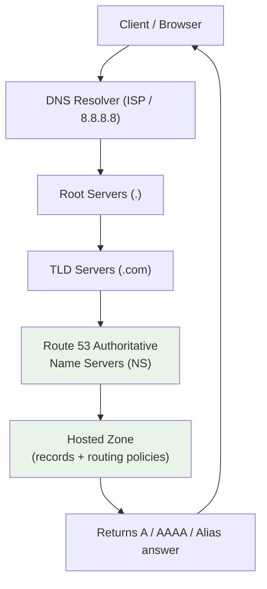
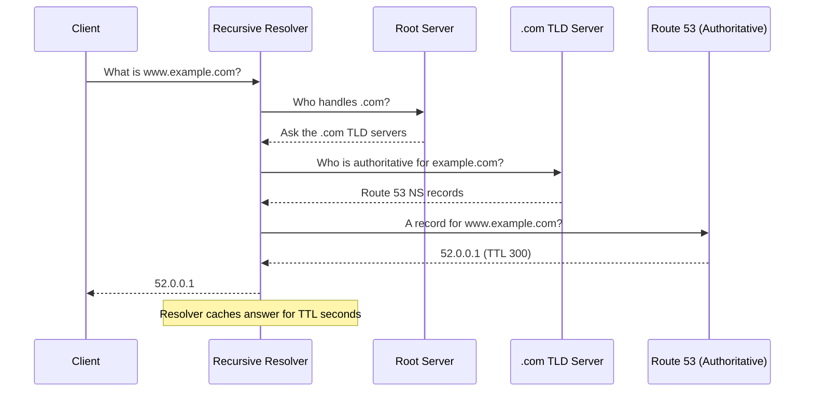
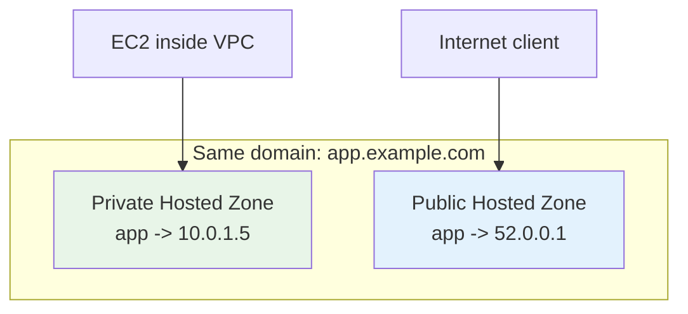

# Route 53 Fundamentals & Hosted Zones - SAA-C03 Deep Dive

> Route 53 is AWS's highly available, scalable **DNS web service** that acts as a **domain registrar**, an **authoritative DNS server** (hosted zones), and a **health-checking** service - the only AWS service with a **100% availability SLA**.

See also: [02 - Record Types & Alias vs CNAME](02%20-%20Record%20Types%20%26%20Alias%20vs%20CNAME.md) · [03 - Routing Policies Deep Dive](03%20-%20Routing%20Policies%20Deep%20Dive.md) · [04 - Health Checks, DNSSEC, Resolver & Hybrid DNS](04%20-%20Health%20Checks%2C%20DNSSEC%2C%20Resolver%20%26%20Hybrid%20DNS.md) · [05 - Route 53 Exam Scenarios & Cheat Sheet](05%20-%20Route%2053%20Exam%20Scenarios%20%26%20Cheat%20Sheet.md)

---

## Table of Contents

- [Part 1: What Is Route 53? The Three Roles](#part-1-what-is-route-53-the-three-roles)
- [Part 2: DNS Refresher (Foundations You Must Know)](#part-2-dns-refresher-foundations-you-must-know)
- [Part 3: How a DNS Query Resolves Through Route 53](#part-3-how-a-dns-query-resolves-through-route-53)
- [Part 4: Hosted Zones - Public vs Private](#part-4-hosted-zones---public-vs-private)
- [Part 5: NS and SOA Records (The Backbone of a Zone)](#part-5-ns-and-soa-records-the-backbone-of-a-zone)
- [Part 6: TTL - Time To Live](#part-6-ttl---time-to-live)
- [Part 7: Domain Registration](#part-7-domain-registration)
- [Part 8: The 100% SLA and High Availability](#part-8-the-100-sla-and-high-availability)
- [Summary: Key Takeaways for SAA-C03](#summary-key-takeaways-for-saa-c03)

---



---

Amazon Route 53 is the AWS DNS service, and DNS questions appear across multiple SAA-C03 domains (resiliency, performance, networking). The name "53" comes from **TCP/UDP port 53**, the standard DNS port.

---

## Part 1: What Is Route 53? The Three Roles

Route 53 wears three hats. Knowing which role a question is testing makes most answers obvious.

| Role | What It Does | Exam Trigger Words |
| :--- | :--- | :--- |
| **Domain Registrar** | Buy/transfer/renew domain names (e.g. `example.com`) | "register a domain", "transfer domain to AWS" |
| **Authoritative DNS** | Hosts the **hosted zone** that answers DNS queries for your domain | "manage records", "point domain to ELB/CloudFront" |
| **Health Checks** | Monitors endpoint health and integrates with failover routing | "automatic failover", "monitor endpoint", "DR" |

> **Exam Tip:** Route 53 is a **global** service (not Region-scoped). You do not pick a Region when creating a hosted zone - the data plane is distributed worldwide via anycast name servers.

### What Route 53 Is NOT

- It is **not** a recursive resolver for the public internet (that is your ISP/8.8.8.8). Route 53 is **authoritative** - it holds the answers for zones you own.
- Route 53 **Resolver** (covered in [04 - Health Checks, DNSSEC, Resolver & Hybrid DNS](04%20-%20Health%20Checks%2C%20DNSSEC%2C%20Resolver%20%26%20Hybrid%20DNS.md)) is the separate component that *does* resolve queries inside a VPC.

[⬆ Back to top](#table-of-contents)

---

## Part 2: DNS Refresher (Foundations You Must Know)

**DNS** (Domain Name System) translates human-friendly names (`www.example.com`) into IP addresses (`52.0.0.1`). It is a hierarchical, distributed database.

### Key Terminology

| Term | Meaning |
| :--- | :--- |
| **FQDN** | Fully Qualified Domain Name, e.g. `api.example.com.` (trailing dot = root) |
| **TLD** | Top-Level Domain: `.com`, `.org`, `.gov`, `.io` |
| **SLD** | Second-Level Domain: the `example` in `example.com` |
| **Subdomain** | Prefix under the SLD: `api` in `api.example.com` |
| **Zone Apex (Naked / Root domain)** | The domain with no subdomain, e.g. `example.com` |
| **Authoritative server** | The server that holds the real records for a zone (Route 53) |
| **Recursive resolver** | The server that hunts down the answer on the client's behalf (ISP) |

### The DNS Hierarchy

```
                    . (root)
                    |
        +-----------+-----------+
       .com        .org        .gov     <- TLD name servers
        |
    example.com                         <- SLD, your hosted zone lives here
        |
   www / api / mail                     <- records inside the zone
```

[⬆ Back to top](#table-of-contents)

---

## Part 3: How a DNS Query Resolves Through Route 53

Understanding the resolution flow explains caching, TTL, and why changes take time to propagate.



**Step-by-step:**

1. Client asks its **recursive resolver** (ISP or public resolver like `8.8.8.8`).
2. Resolver walks the hierarchy: root → TLD (`.com`) → the **NS records** that point to Route 53.
3. Route 53 evaluates the **routing policy** (Simple, Weighted, Latency, etc. - see [03 - Routing Policies Deep Dive](03%20-%20Routing%20Policies%20Deep%20Dive.md)) and returns the answer.
4. The resolver **caches** the answer for the record's **TTL**, then returns it to the client.

> **Exam Trap:** If you change a record but clients still see the old value, it is **TTL caching** at resolvers - not a Route 53 bug. Lower the TTL *before* a planned change.

[⬆ Back to top](#table-of-contents)

---

## Part 4: Hosted Zones - Public vs Private

A **hosted zone** is a container for DNS records that define how to route traffic for a domain and its subdomains. There are two kinds.

| Feature | Public Hosted Zone | Private Hosted Zone |
| :--- | :--- | :--- |
| **Resolvable from** | The public internet | Only inside associated VPC(s) |
| **Use case** | Public websites, APIs, mail | Internal service discovery, split-horizon DNS |
| **Requires** | Domain delegated via NS records | Association with one or more VPCs |
| **VPC settings** | n/a | `enableDnsHostnames` + `enableDnsSupport` must be enabled |
| **Cross-VPC / cross-account** | n/a | Associate multiple VPCs (even cross-account via CLI) |
| **Cost** | $0.50 / hosted zone / month | $0.50 / hosted zone / month |

### Split-Horizon DNS

You can have a **public** and a **private** hosted zone with the **same domain name** (e.g. `example.com`). Internal VPC clients resolve to private IPs; external clients resolve to public IPs. This is **split-horizon (split-view) DNS** - a common exam answer for "internal users should reach the private endpoint, external users the public one."



> **Exam Tip:** For a private hosted zone to work, the VPC must have **both** `enableDnsSupport` and `enableDnsHostnames` set to `true`. This is a frequent "why isn't my private DNS resolving?" answer.

[⬆ Back to top](#table-of-contents)

---

## Part 5: NS and SOA Records (The Backbone of a Zone)

When you create a hosted zone, Route 53 **automatically** creates two records you should never blindly delete.

| Record | Purpose |
| :--- | :--- |
| **NS (Name Server)** | Lists the 4 authoritative Route 53 name servers for the zone. These values must be copied to the **registrar / parent zone** for delegation to work. |
| **SOA (Start of Authority)** | Stores administrative metadata: primary NS, admin email, zone serial number, refresh/retry/expire timers, and the **negative-caching TTL** (how long NXDOMAIN responses are cached). |

### The Delegation Chain

For the public internet to find your zone, the **parent** (the registrar / TLD) must contain NS records pointing to Route 53's NS set.

```
.com TLD  --(NS records)-->  Route 53 NS for example.com  --> your records
```

If you registered the domain elsewhere (e.g. GoDaddy) but host the zone in Route 53, you must paste Route 53's 4 NS values into the third-party registrar.

> **Exam Trap:** "Domain registered at a 3rd-party registrar, records in Route 53, but resolution fails." → The **NS records at the registrar** were not updated to point at Route 53.

[⬆ Back to top](#table-of-contents)

---

## Part 6: TTL - Time To Live

**TTL** is how long (in seconds) a resolver caches a record before re-querying Route 53.

| TTL Setting | Pros | Cons |
| :--- | :--- | :--- |
| **High TTL** (e.g. 86400 / 24h) | Fewer queries, lower cost, less Route 53 load | Stale records linger; slow to propagate changes |
| **Low TTL** (e.g. 60s) | Fast change propagation, good for failover | More queries, slightly higher cost |

**Best practice for a planned change:** lower the TTL well in advance (more than one old-TTL period before the change), make the change, then optionally raise it again.

> **Exam Tip:** **Alias records** do not let you set a TTL - Route 53 uses the TTL of the target AWS resource automatically. Only non-alias records have a configurable TTL.

[⬆ Back to top](#table-of-contents)

---

## Part 7: Domain Registration

Route 53 can act as a **registrar** to buy domains directly, or you can use a third party.

```bash
# Check whether a domain is available
aws route53domains check-domain-availability \
    --domain-name example-saa-c03.com

# Register a domain (Route 53 auto-creates a public hosted zone)
aws route53domains register-domain \
    --domain-name example-saa-c03.com \
    --duration-in-years 1 \
    --admin-contact file://contact.json \
    --registrant-contact file://contact.json \
    --tech-contact file://contact.json
```

### Registration Facts for the Exam

- Registering a domain in Route 53 **automatically creates a public hosted zone** with matching NS/SOA records.
- Registrar and DNS hosting are **independent**: you can register at GoDaddy but host the zone in Route 53 (update NS at GoDaddy), or vice versa.
- **WHOIS privacy protection** is offered free for eligible TLDs.
- Domain registration is billed per year per TLD; the hosted zone is billed separately ($0.50/month).

[⬆ Back to top](#table-of-contents)

---

## Part 8: The 100% SLA and High Availability

> **Route 53 is the only AWS service that offers a 100% availability SLA.**

This is possible because the authoritative DNS service runs on a **globally distributed anycast** network of name servers. Each hosted zone is served from 4 NS hosts spread across separate top-level DNS infrastructure.

| HA Concept | How Route 53 Delivers It |
| :--- | :--- |
| **Global anycast** | The same NS IPs are announced from many locations; queries hit the nearest healthy node. |
| **No single Region** | Hosted zones are not tied to a Region, so a Regional outage does not take DNS down. |
| **Health checks + failover** | Combine with routing policies to route away from unhealthy endpoints (see [04 - Health Checks, DNSSEC, Resolver & Hybrid DNS](04%20-%20Health%20Checks%2C%20DNSSEC%2C%20Resolver%20%26%20Hybrid%20DNS.md)). |

> **Exam Tip:** When a question asks which AWS service guarantees **100% uptime**, the answer is **Route 53**. When it asks how to make a **multi-Region application** fail over automatically, the answer combines Route 53 **health checks** + **failover routing**.

[⬆ Back to top](#table-of-contents)

---

## Summary: Key Takeaways for SAA-C03

| Concept | What You Must Know |
| :--- | :--- |
| **Three roles** | Registrar + Authoritative DNS + Health checks |
| **Global service** | No Region selection; anycast name servers worldwide |
| **100% SLA** | The only AWS service with a 100% availability SLA |
| **Public hosted zone** | Resolvable on the internet |
| **Private hosted zone** | Resolvable only inside associated VPCs (needs DNS support + hostnames) |
| **Split-horizon DNS** | Same domain, public + private zone → internal vs external answers |
| **NS records** | Must be copied to the registrar / parent for delegation |
| **SOA record** | Zone metadata + negative-caching TTL |
| **TTL** | Lower it before planned changes; Alias records have no manual TTL |
| **Port** | DNS uses port 53 (hence the name) |

[⬆ Back to top](#table-of-contents)

---
