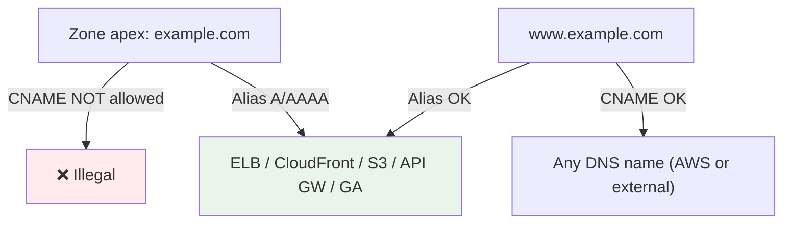

# Record Types & Alias vs CNAME - SAA-C03 Deep Dive

> Route 53 supports standard DNS record types (A, AAAA, CNAME, MX, TXT, NS, SOA, SRV, CAA, PTR) plus the AWS-specific **Alias** record - free, works at the **zone apex**, and points to AWS resources where a CNAME cannot.

See also: [01 - Route 53 Fundamentals & Hosted Zones](01%20-%20Route%2053%20Fundamentals%20%26%20Hosted%20Zones.md) · [03 - Routing Policies Deep Dive](03%20-%20Routing%20Policies%20Deep%20Dive.md) · [04 - Health Checks, DNSSEC, Resolver & Hybrid DNS](04%20-%20Health%20Checks%2C%20DNSSEC%2C%20Resolver%20%26%20Hybrid%20DNS.md) · [05 - Route 53 Exam Scenarios & Cheat Sheet](05%20-%20Route%2053%20Exam%20Scenarios%20%26%20Cheat%20Sheet.md)

---

## Table of Contents

- [Part 1: Standard DNS Record Types](#part-1-standard-dns-record-types)
- [Part 2: The Alias Record (AWS-Specific)](#part-2-the-alias-record-aws-specific)
- [Part 3: Alias vs CNAME - The Big Comparison](#part-3-alias-vs-cname---the-big-comparison)
- [Part 4: When Alias Is Mandatory](#part-4-when-alias-is-mandatory)
- [Part 5: Valid Alias Targets](#part-5-valid-alias-targets)
- [Part 6: Examples (CLI + Record JSON)](#part-6-examples-cli--record-json)
- [Summary: Key Takeaways for SAA-C03](#summary-key-takeaways-for-saa-c03)

---



---

DNS record questions on SAA-C03 almost always reduce to one decision: **Alias or CNAME?** Master that and the standard record types.

---

## Part 1: Standard DNS Record Types

| Record | Maps... | Typical Use | Notes |
| :--- | :--- | :--- | :--- |
| **A** | Name → IPv4 address | `example.com` → `52.0.0.1` | Most common record |
| **AAAA** | Name → IPv6 address | `example.com` → `2600:1f...` | IPv6 equivalent of A |
| **CNAME** | Name → another **name** | `www` → `app.elb.amazonaws.com` | Cannot be at zone apex |
| **MX** | Name → mail server | `example.com` → `10 mail.example.com` | Includes a **priority** value |
| **TXT** | Name → free text | SPF, DKIM, domain verification | Used by SES, ACM, Google, etc. |
| **NS** | Zone → authoritative name servers | Delegation to Route 53 | Auto-created with the zone |
| **SOA** | Zone → admin metadata | Serial, timers, negative-cache TTL | Auto-created with the zone |
| **SRV** | Service → host + port | `_sip._tcp` → `10 60 5060 server` | Priority, weight, port, target |
| **CAA** | Domain → allowed CAs | Restrict which CAs may issue certs | Security hardening |
| **PTR** | IP → name (reverse DNS) | `1.0.0.52.in-addr.arpa` → name | Reverse lookups |

> **Exam Tip:** **TXT records** are the answer for **domain ownership verification** and email auth (SPF/DKIM via SES, ACM DNS validation often uses CNAME though). **MX** has a priority number; lower = preferred.

[⬆ Back to top](#table-of-contents)

---

## Part 2: The Alias Record (AWS-Specific)

An **Alias** record is a Route 53 extension (not part of the DNS standard) that maps a name to a **specific AWS resource**. To clients it looks like an **A or AAAA record** (returns IPs), but you configure it by selecting an AWS target rather than typing an IP.

### Why Alias Exists

- A **CNAME cannot live at the zone apex** (`example.com`) per DNS rules, but websites routinely need the naked domain to point at an ELB or CloudFront. Alias solves this.
- AWS resources (ELB, CloudFront) have **changing IPs**; Alias lets Route 53 track them automatically.

### Alias Characteristics

| Property | Behaviour |
| :--- | :--- |
| **Cost** | **Free** - no charge for Alias queries to AWS resources |
| **Zone apex** | **Allowed** (unlike CNAME) |
| **Record type seen** | A or AAAA |
| **TTL** | **Not settable** - Route 53 uses the target's TTL |
| **Target** | Only **specific AWS resources** (or another record in the same zone) |
| **Health check / evaluate target health** | Supports "Evaluate Target Health" |

> **Exam Tip:** "Free DNS queries" + "works at the root/naked domain" + "points to ELB/CloudFront/S3" = **Alias record**.

[⬆ Back to top](#table-of-contents)

---

## Part 3: Alias vs CNAME - The Big Comparison

This single table answers the majority of Route 53 record questions.

| Feature | **Alias** | **CNAME** |
| :--- | :--- | :--- |
| **Standard DNS?** | No (AWS-specific) | Yes |
| **Works at zone apex** (`example.com`)? | ✅ Yes | ❌ No |
| **Works at subdomain** (`www`)? | ✅ Yes | ✅ Yes |
| **Target** | AWS resources only (+ same-zone records) | Any hostname (AWS or external) |
| **Cost for queries** | Free (to AWS targets) | May be charged |
| **TTL configurable** | No (uses target TTL) | Yes |
| **Type shown to client** | A / AAAA | CNAME |
| **Evaluate target health** | ✅ Yes | Indirect (via health check on record) |
| **Auto-tracks changing AWS IPs** | ✅ Yes | Resolves to the name, AWS handles IPs |

### Quick Decision Rule

- **Apex / naked domain pointing at an AWS resource** → must use **Alias**.
- **Subdomain pointing at an AWS resource** → Alias preferred (free + health), CNAME also works.
- **Pointing at a non-AWS / external hostname** → must use **CNAME** (Alias only targets AWS).

> **Exam Trap:** A question asking to point `example.com` (no `www`) at a load balancer and offering both CNAME and Alias - the answer is **Alias**, because **CNAME at the apex is illegal**.

[⬆ Back to top](#table-of-contents)

---

## Part 4: When Alias Is Mandatory

You **must** use Alias (CNAME will not work) in these cases:

1. **Zone apex pointing to any AWS service** - `example.com` → ELB, CloudFront, S3 static website, API Gateway, or Global Accelerator.
2. **S3 static website hosting at the apex** - S3 only accepts Alias (the bucket name must match the domain).
3. **CloudFront distribution at the apex** - point `example.com` directly at the distribution.

In every one of these, a CNAME is **not permitted at the apex**, so Alias is the only choice.

> **Exam Tip:** S3 static-website Alias requires the **bucket name to exactly match the domain name** (e.g. bucket `example.com` for domain `example.com`).

[⬆ Back to top](#table-of-contents)

---

## Part 5: Valid Alias Targets

Alias records can only point to a **defined list** of AWS resources. Memorise these.

| Alias Target | Notes | Related Note |
| :--- | :--- | :--- |
| **Elastic Load Balancer** (ALB/NLB/CLB) | Most common target | [01 - ELB Fundamentals & Types](01%20-%20ELB%20Fundamentals%20%26%20Types.md) |
| **CloudFront distribution** | CDN at apex or subdomain | [01 - CloudFront Fundamentals & Architecture](01%20-%20CloudFront%20Fundamentals%20%26%20Architecture.md) |
| **S3 static website endpoint** | Bucket name must match domain | - |
| **API Gateway** (custom domain / regional) | REST/HTTP APIs | - |
| **Global Accelerator** | Static anycast IPs | [01 - Global Accelerator Fundamentals & Architecture](01%20-%20Global%20Accelerator%20Fundamentals%20%26%20Architecture.md) |
| **VPC interface endpoint** | PrivateLink endpoint DNS | [01 - VPC Fundamentals & Architecture](01%20-%20VPC%20Fundamentals%20%26%20Architecture.md) |
| **Elastic Beanstalk environment** | Regional environment URL | - |
| **Another Route 53 record** | In the **same** hosted zone | - |

> **Exam Trap:** You **cannot** Alias to an **EC2 instance's public DNS or IP directly** - use an **A record** to the EC2 Elastic IP, or front it with an ELB and Alias to that. Alias targets are the fixed list above only.

[⬆ Back to top](#table-of-contents)

---

## Part 6: Examples (CLI + Record JSON)

### Alias A record at the apex pointing to an ALB

```json
{
  "Comment": "Apex alias to ALB",
  "Changes": [
    {
      "Action": "UPSERT",
      "ResourceRecordSet": {
        "Name": "example.com",
        "Type": "A",
        "AliasTarget": {
          "HostedZoneId": "Z35SXDOTRQ7X7K",
          "DNSName": "my-alb-1234567890.us-east-1.elb.amazonaws.com",
          "EvaluateTargetHealth": true
        }
      }
    }
  ]
}
```

```bash
aws route53 change-resource-record-sets \
    --hosted-zone-id Z123EXAMPLE \
    --change-batch file://apex-alias.json
```

### CNAME for a subdomain pointing to an external host

```json
{
  "Changes": [
    {
      "Action": "UPSERT",
      "ResourceRecordSet": {
        "Name": "www.example.com",
        "Type": "CNAME",
        "TTL": 300,
        "ResourceRecords": [
          { "Value": "external-host.thirdparty.net" }
        ]
      }
    }
  ]
}
```

### MX record (note the priority value)

```json
{
  "Name": "example.com",
  "Type": "MX",
  "TTL": 3600,
  "ResourceRecords": [
    { "Value": "10 mail1.example.com" },
    { "Value": "20 mail2.example.com" }
  ]
}
```

> **Exam Tip:** The `AliasTarget.HostedZoneId` for an Alias is the **target service's** hosted zone ID (e.g. the ELB's zone ID), **not** your domain's hosted zone ID. CloudFront always uses the special zone ID `Z2FDTNDATAQYW2`.

[⬆ Back to top](#table-of-contents)

---

## Summary: Key Takeaways for SAA-C03

| Concept | What You Must Know |
| :--- | :--- |
| **A / AAAA** | Name → IPv4 / IPv6 |
| **CNAME** | Name → another name; **never at apex**; may cost |
| **Alias** | AWS-specific; **free**; **works at apex**; A/AAAA to AWS targets; no manual TTL |
| **MX** | Mail; has a priority (lower = preferred) |
| **TXT** | Verification, SPF, DKIM |
| **NS / SOA** | Auto-created delegation + zone metadata |
| **Apex → AWS resource** | Must be **Alias** (CNAME illegal at apex) |
| **External hostname** | Must be **CNAME** (Alias only targets AWS) |
| **Cannot Alias** | Directly to an EC2 instance - use A record to EIP or front with ELB |
| **S3 website Alias** | Bucket name must match the domain |

[⬆ Back to top](#table-of-contents)

---
