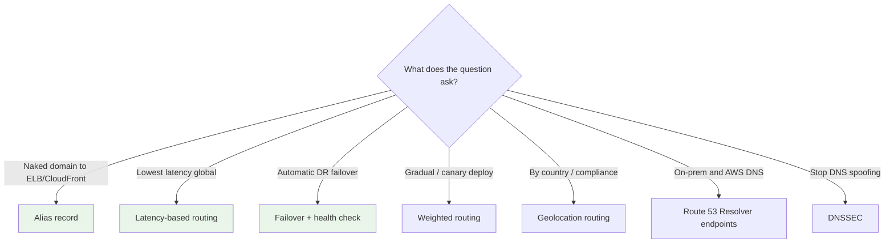
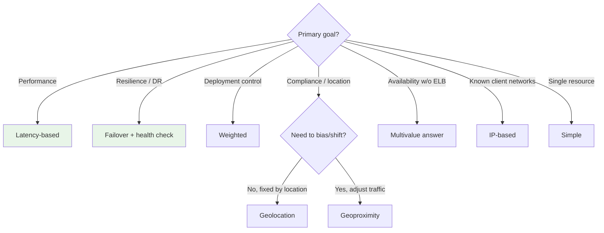

# Route 53 Exam Scenarios & Cheat Sheet - SAA-C03 Deep Dive

> Scenario-style Q&A plus a **"question says X → pick Y"** lookup and an important-facts cheat table to lock in Route 53 for the SAA-C03 exam.

See also: [01 - Route 53 Fundamentals & Hosted Zones](01%20-%20Route%2053%20Fundamentals%20%26%20Hosted%20Zones.md) · [02 - Record Types & Alias vs CNAME](02%20-%20Record%20Types%20%26%20Alias%20vs%20CNAME.md) · [03 - Routing Policies Deep Dive](03%20-%20Routing%20Policies%20Deep%20Dive.md) · [04 - Health Checks, DNSSEC, Resolver & Hybrid DNS](04%20-%20Health%20Checks%2C%20DNSSEC%2C%20Resolver%20%26%20Hybrid%20DNS.md)

---

## Table of Contents

- [Part 1: Scenario Q&A](#part-1-scenario-qa)
- [Part 2: "Question Says X → Pick Y" Quick Table](#part-2-question-says-x--pick-y-quick-table)
- [Part 3: Routing Policy Selector](#part-3-routing-policy-selector)
- [Part 4: Important-Facts Cheat Table](#part-4-important-facts-cheat-table)
- [Part 5: Common Traps to Avoid](#part-5-common-traps-to-avoid)
- [Summary: Key Takeaways for SAA-C03](#summary-key-takeaways-for-saa-c03)

---

---

Use this as a final-review sheet; every answer links back to the deep-dive note that explains it.

---

## Part 1: Scenario Q&A

### Scenario 1: Naked Domain to a Load Balancer

**Q:** You must point `example.com` (the zone apex, no `www`) at an Application Load Balancer. Options include a CNAME and an Alias. Which do you choose?

**A:** **Alias A record** with the ALB as target. A **CNAME cannot exist at the zone apex**, so Alias is the only valid choice (and it's free). See [02 - Record Types & Alias vs CNAME](02%20-%20Record%20Types%20%26%20Alias%20vs%20CNAME.md).

### Scenario 2: Lowest Latency for Global Users

**Q:** A web app runs in `us-east-1` and `ap-southeast-1`. Users worldwide should get the **fastest** response. Which routing policy?

**A:** **Latency-based routing** - routes each user to the Region with the lowest measured network latency. See [03 - Routing Policies Deep Dive](03%20-%20Routing%20Policies%20Deep%20Dive.md).

### Scenario 3: Gradual Deployment / Canary

**Q:** You want to send **10%** of traffic to a new app version and 90% to the current one, then ramp up.

**A:** **Weighted routing** (weights 10 and 90; adjust over time). Setting a weight to 0 drains traffic.

### Scenario 4: Disaster Recovery Failover

**Q:** A primary site in `us-east-1` must automatically fail over to a standby in `us-west-2` if it goes down.

**A:** **Failover routing (active-passive)** with a **health check** on the primary. If unhealthy, Route 53 returns the secondary. See [04 - Health Checks, DNSSEC, Resolver & Hybrid DNS](04%20-%20Health%20Checks%2C%20DNSSEC%2C%20Resolver%20%26%20Hybrid%20DNS.md).

### Scenario 5: Data Sovereignty / Country Restriction

**Q:** EU users must be served only from EU infrastructure; certain countries must be blocked.

**A:** **Geolocation routing** (match by country/continent, with a Default record). For blocking, omit a record for that location (and consider a default "blocked" page).

### Scenario 6: Shift More Traffic to One Region

**Q:** You run two Regions and want to **gradually shift more traffic** toward one as you scale it, based on geography.

**A:** **Geoproximity routing** with a positive **bias** on the target Region (requires **Traffic Flow**). "Bias" is the giveaway keyword.

### Scenario 7: Health-Check a Private Internal Server

**Q:** You need a Route 53 health check on an EC2 instance that has **only a private IP**.

**A:** Route 53 public health checkers cannot reach it. Publish a metric to **CloudWatch**, create an **alarm**, and use a **CloudWatch alarm health check**.

### Scenario 8: On-Prem Must Resolve AWS Private Names

**Q:** On-premises servers (connected via Direct Connect) must resolve records in a Route 53 **private hosted zone**.

**A:** Create a Route 53 Resolver **inbound endpoint**; point on-prem DNS at it. (For AWS resolving on-prem names, use an **outbound endpoint + forwarding rules**.)

### Scenario 9: Prevent DNS Spoofing

**Q:** Security requires DNS responses for a public domain to be verifiable against tampering / cache poisoning.

**A:** Enable **DNSSEC signing** on the public hosted zone (KSK backed by **KMS**, publish the **DS record** at the parent/registrar).

### Scenario 10: Improve Availability Without a Load Balancer

**Q:** You have several independent web servers (public IPs) and want DNS to return only healthy ones, without deploying an ELB.

**A:** **Multivalue answer routing** with a health check per record - returns up to 8 healthy IPs at random. (If real load balancing/SSL termination is needed, use an [ELB](01%20-%20ELB%20Fundamentals%20%26%20Types.md) instead.)

[⬆ Back to top](#table-of-contents)

---

## Part 2: "Question Says X → Pick Y" Quick Table

| Question Says... | Pick... |
| :--- | :--- |
| Naked / apex domain → ELB, CloudFront, S3, API GW | **Alias record** |
| Point subdomain to an external (non-AWS) host | **CNAME** |
| Lowest latency / best performance globally | **Latency-based routing** |
| Disaster recovery / active-passive / auto failover | **Failover routing + health check** |
| Gradual rollout / canary / A-B / send X% | **Weighted routing** |
| Restrict / route by country, continent, compliance | **Geolocation routing** |
| "Bias" / shift more traffic to a Region or site | **Geoproximity (Traffic Flow)** |
| Return several healthy IPs, no load balancer | **Multivalue answer** |
| Route by client IP / CIDR / ISP range | **IP-based routing** |
| 100% uptime SLA service | **Route 53** |
| Health-check a private resource | **CloudWatch alarm health check** |
| On-prem resolves AWS private names | **Resolver inbound endpoint** |
| AWS resolves on-prem names | **Resolver outbound endpoint + rules** |
| Stop DNS spoofing / cache poisoning | **DNSSEC** |
| Internal users get private IP, external get public IP, same name | **Split-horizon (public + private hosted zone)** |
| Domain ownership / SES / SPF / DKIM verification | **TXT record** (ACM validation often **CNAME**) |

[⬆ Back to top](#table-of-contents)

---

## Part 3: Routing Policy Selector

[⬆ Back to top](#table-of-contents)

---

## Part 4: Important-Facts Cheat Table

| Fact | Value / Rule |
| :--- | :--- |
| **DNS port** | 53 |
| **Route 53 scope** | Global (not Region-bound) |
| **SLA** | 100% availability (only AWS service) |
| **Hosted zone cost** | $0.50 / zone / month |
| **NS per zone** | 4 authoritative name servers |
| **Alias** | Free, works at apex, A/AAAA, AWS targets only, no manual TTL |
| **CNAME** | Standard, never at apex, any host, has TTL |
| **CloudFront Alias zone ID** | `Z2FDTNDATAQYW2` |
| **Cannot Alias to** | A bare EC2 instance (use A → EIP, or front with ELB) |
| **Endpoint health check** | HTTP/HTTPS/TCP; healthy if >18% checkers OK; default 3-failure threshold |
| **Private resource health check** | CloudWatch alarm health check |
| **Multivalue max answers** | 8 healthy records |
| **Geoproximity needs** | Traffic Flow |
| **DNSSEC KSK** | Backed by AWS KMS asymmetric key; DS record at parent |
| **Private hosted zone reqs** | `enableDnsSupport` + `enableDnsHostnames` = true |
| **Resolver inbound** | On-prem → AWS DNS |
| **Resolver outbound** | AWS → on-prem DNS (forwarding rules) |
| **TTL on Alias** | Not configurable (uses target's) |

[⬆ Back to top](#table-of-contents)

---

## Part 5: Common Traps to Avoid

| Trap | Reality |
| :--- | :--- |
| "Use a CNAME for `example.com` → ELB" | Illegal at apex; must use **Alias** |
| "Latency routing = nearest Region" | It's **lowest measured latency**, usually but not always nearest |
| "Simple routing can fail over" | No - Simple has **no health checks**; use Failover or Multivalue |
| "Multivalue is a load balancer" | No - it's DNS availability only; no traffic mgmt/SSL |
| "DNSSEC encrypts DNS" | No - it **authenticates/integrity**-checks; not encryption |
| "Health-check a private IP with an endpoint check" | Can't reach it; use **CloudWatch alarm** check |
| "Changed record but old value persists = bug" | It's **TTL caching**; lower TTL before changes |
| "Geolocation without a Default record" | Unmatched locations get **no answer**; always set Default |
| "Records in Route 53 but domain won't resolve" | **NS records at the registrar** not pointed to Route 53 |
| "On-prem can't resolve AWS names, add outbound EP" | Wrong direction - on-prem→AWS needs **inbound** EP |

[⬆ Back to top](#table-of-contents)

---

## Summary: Key Takeaways for SAA-C03

| Theme | Remember |
| :--- | :--- |
| **Apex records** | Alias only - CNAME illegal at apex |
| **Performance routing** | Latency-based |
| **Resilience routing** | Failover + health checks (active-passive DR) |
| **Deployment routing** | Weighted (canary / gradual) |
| **Location routing** | Geolocation (fixed) vs Geoproximity (bias/shift) |
| **Availability w/o ELB** | Multivalue answer (≤8 healthy) |
| **Hybrid DNS** | Inbound = on-prem→AWS, Outbound = AWS→on-prem |
| **Security** | DNSSEC for anti-spoofing (KMS KSK + DS record) |
| **The big SLA fact** | Route 53 = 100% availability SLA |

[⬆ Back to top](#table-of-contents)

---
