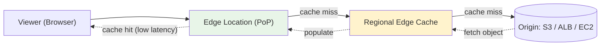
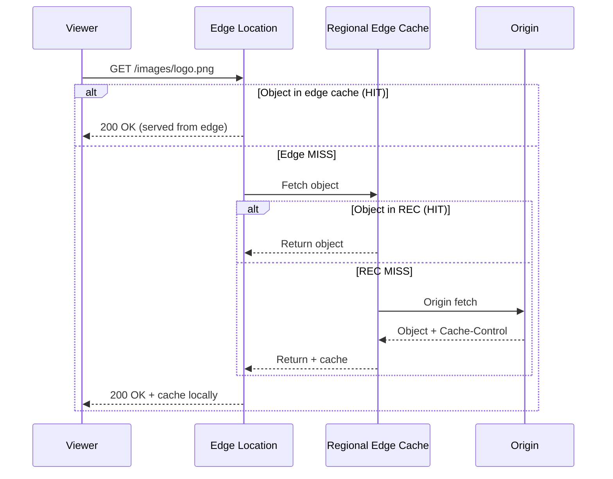

# Amazon CloudFront Fundamentals & Architecture - SAA-C03 Deep Dive

> CloudFront is AWS's global Content Delivery Network (CDN). It caches content at 600+ edge locations worldwide to reduce latency, offload origins, and absorb DDoS attacks at the edge.

See also: [02 - Origins, Cache Behaviors & TTL](02%20-%20Origins%2C%20Cache%20Behaviors%20%26%20TTL.md) · [03 - CloudFront Security (OAC, Signed URLs, WAF, Geo, Field-Level Encryption)](03%20-%20CloudFront%20Security%20%28OAC%2C%20Signed%20URLs%2C%20WAF%2C%20Geo%2C%20Field-Level%20Encryption%29.md) · [04 - Edge Functions (CloudFront Functions vs Lambda@Edge)](04%20-%20Edge%20Functions%20%28CloudFront%20Functions%20vs%20Lambda%40Edge%29.md) · [05 - CloudFront Exam Scenarios & Cheat Sheet](05%20-%20CloudFront%20Exam%20Scenarios%20%26%20Cheat%20Sheet.md)

---

## Table of Contents

- [What Is a CDN?](#what-is-a-cdn)
- [The CloudFront Network: Edge Locations vs Regional Edge Caches](#the-cloudfront-network-edge-locations-vs-regional-edge-caches)
- [Anatomy of a CloudFront Request (Cache Hit, Miss, Origin Fetch)](#anatomy-of-a-cloudfront-request-cache-hit-miss-origin-fetch)
- [Core Benefits for the Exam](#core-benefits-for-the-exam)
- [Global Service vs Regional Resources](#global-service-vs-regional-resources)
- [Price Classes](#price-classes)
- [CloudFront vs S3 Cross-Region Replication](#cloudfront-vs-s3-cross-region-replication)
- [Summary: Key Takeaways for SAA-C03](#summary-key-takeaways-for-saa-c03)

---

---

CloudFront is one of the most frequently tested services in the SAA-C03 networking and performance domains. Understanding *how a request flows through the network* is the key to answering latency and caching questions correctly.

---

## What Is a CDN?

A **Content Delivery Network (CDN)** is a globally distributed network of caching servers that store copies of your content **close to your users**. Instead of every viewer fetching content from a single origin server (which may be on the other side of the world), they retrieve it from the nearest edge location.

### The Core Problem CloudFront Solves

| Without CDN | With CloudFront |
| :--- | :--- |
| Every request travels to the origin region | Requests served from nearest edge |
| High latency for distant users | Low, consistent latency worldwide |
| Origin handles 100% of traffic | Origin offloaded; serves only cache misses |
| Origin directly exposed to DDoS | Edge absorbs attacks (Shield Standard built-in) |

### What CloudFront Caches

- **Static content:** images, CSS, JS, video, downloads (ideal cache candidates)
- **Dynamic content:** API responses, personalized HTML (can be cached briefly or passed through)
- CloudFront supports **both** — a single distribution can mix cached static paths and pass-through dynamic paths via cache behaviors.

> **Exam Tip:** CloudFront improves performance for **both static and dynamic** content. A common distractor claims CloudFront is only for static files — that is false.

[⬆ Back to top](#table-of-contents)

---

## The CloudFront Network: Edge Locations vs Regional Edge Caches

CloudFront has a **two-tier caching hierarchy**. Knowing the difference is exam-relevant.

| Tier | Name | Role | Count (approx) |
| :--- | :--- | :--- | :--- |
| Tier 1 | **Edge Location** (Point of Presence / PoP) | First touchpoint for viewers; serves cached objects | 600+ globally |
| Tier 2 | **Regional Edge Cache (REC)** | Larger cache sitting between edge locations and the origin | ~13 |

### How the Two Tiers Interact

1. Viewer hits the nearest **edge location**.
2. On a miss, the edge location asks its **Regional Edge Cache** (not the origin directly).
3. Only on a REC miss does CloudFront fetch from the **origin**.

### Why Regional Edge Caches Matter

- They hold objects **longer** and have a **larger cache footprint** than edge locations.
- They keep less-popular content cached that would otherwise be evicted from small edge caches.
- This further **offloads the origin** — more requests are absorbed before reaching it.

> **Exam Trap:** Regional Edge Caches are **automatic and free** — you don't configure or pay extra for them. Also, **proxy methods (POST, PUT, DELETE, PATCH, OPTIONS) bypass the REC** and go straight to the origin, since they shouldn't be cached.

[⬆ Back to top](#table-of-contents)

---

## Anatomy of a CloudFront Request (Cache Hit, Miss, Origin Fetch)

### The Three Outcomes

| Outcome | What Happens | Latency |
| :--- | :--- | :--- |
| **Cache Hit** | Object found at edge | Lowest (no origin contact) |
| **Cache Miss (REC hit)** | Edge fetches from Regional Edge Cache | Medium |
| **Origin Fetch** | Neither tier has it; goes to origin | Highest (but populates caches for next request) |

### Connection Reuse and Keep-Alive

CloudFront maintains **persistent, pre-warmed TCP/TLS connections** from edge locations to the origin over the AWS backbone. Even for a cache miss, the viewer benefits from:

- Faster TLS handshake (terminated at edge)
- Optimized routing over AWS private backbone (not public internet)
- HTTP/2 and HTTP/3 (QUIC) support at the viewer edge

[⬆ Back to top](#table-of-contents)

---

## Core Benefits for the Exam

| Benefit | How CloudFront Delivers It |
| :--- | :--- |
| **Lower latency** | Content served from edge nearest the user |
| **Origin offload** | Cache hits + REC absorb most traffic; origin sees far fewer requests |
| **DDoS protection** | AWS Shield Standard included free; integrates with Shield Advanced + WAF |
| **TLS termination at edge** | Faster HTTPS handshakes; free ACM certs for `*.cloudfront.net`, custom via ACM |
| **AWS backbone** | Origin fetches travel AWS's private network, not the public internet |
| **High availability** | Origin groups enable automatic failover (see [02 - Origins, Cache Behaviors & TTL](02%20-%20Origins%2C%20Cache%20Behaviors%20%26%20TTL.md)) |

### Security Layer Summary

- **Shield Standard:** automatic, free, layer 3/4 DDoS mitigation at the edge.
- **AWS WAF:** attach a web ACL to filter layer 7 (SQLi, XSS, rate limiting) at the edge.
- **OAC:** lock down S3 origins so they're only reachable through CloudFront (see [03 - CloudFront Security (OAC, Signed URLs, WAF, Geo, Field-Level Encryption)](03%20-%20CloudFront%20Security%20%28OAC%2C%20Signed%20URLs%2C%20WAF%2C%20Geo%2C%20Field-Level%20Encryption%29.md)).

> **Exam Tip:** "Reduce load on origin servers" or "protect the origin from traffic spikes" → CloudFront caching is almost always the answer.

[⬆ Back to top](#table-of-contents)

---

## Global Service vs Regional Resources

CloudFront is a **global service** — a distribution is not tied to a single region. But several associated resources have **region requirements** that are heavily tested.

| Resource | Region Requirement |
| :--- | :--- |
| **CloudFront distribution** | Global (no region selection) |
| **ACM certificate for custom domain** | **Must be in us-east-1 (N. Virginia)** |
| **AWS WAF web ACL for CloudFront** | **Must be `CLOUDFRONT` (global) scope, created in us-east-1** |
| **Lambda@Edge function** | Authored in **us-east-1**, replicated globally |
| **CloudFront Functions** | Global; run at edge locations |

> **Exam Trap:** If a custom SSL certificate "won't attach" to a CloudFront distribution, the cause is almost always that the **ACM cert is not in us-east-1**. This is one of the most common CloudFront exam questions.

[⬆ Back to top](#table-of-contents)

---

## Price Classes

Price classes let you **limit which edge locations** serve your content, trading global reach for lower cost.

| Price Class | Edge Locations Used | Cost | Use Case |
| :--- | :--- | :--- | :--- |
| **Price Class All** | All regions (most edge locations) | Highest | Truly global audience, best performance |
| **Price Class 200** | Most regions, excludes the most expensive (e.g., parts of South America, Australia) | Medium | Broad but cost-conscious |
| **Price Class 100** | US, Canada, Europe, Israel only | Lowest | Audience concentrated in NA/EU |

### How It Works

- Choosing a cheaper class means viewers in **excluded regions** are routed to the **nearest *included* edge location** — they still get content, just with higher latency.
- DNS routing still works globally; only the *edge serving location* is constrained.

> **Exam Tip:** "Minimize CloudFront costs but users are only in the US and Europe" → **Price Class 100**. "Best global performance regardless of cost" → **Price Class All**.

[⬆ Back to top](#table-of-contents)

---

## CloudFront vs S3 Cross-Region Replication

Both can improve read performance globally, but they solve different problems.

| Feature | CloudFront | S3 Cross-Region Replication |
| :--- | :--- | :--- |
| **Mechanism** | Caches content at edge (TTL-based) | Copies objects to another region's bucket |
| **Coverage** | 600+ edge locations globally | The specific regions you replicate to |
| **Content freshness** | Cached (may be slightly stale until TTL) | Always the replicated copy (eventual consistency) |
| **Best for** | Content read frequently by globally dispersed users | Low-latency reads in a **few specific regions**; compliance/DR |
| **Updates** | Frequently changing content with TTL/invalidation | Content that changes rarely |

> **Exam Tip:** "Some files accessed frequently from all over the world" → **CloudFront**. "Low-latency access in a small number of specific regions" → **S3 CRR**.

[⬆ Back to top](#table-of-contents)

---

## Summary: Key Takeaways for SAA-C03

| Concept | What You Must Know |
| :--- | :--- |
| **CDN purpose** | Cache content at edge → lower latency, origin offload, DDoS protection |
| **Two-tier cache** | Edge Location → Regional Edge Cache → Origin (REC is automatic & free) |
| **Static + dynamic** | CloudFront accelerates both, not just static |
| **Global service** | Distribution is global; ACM cert + WAF for CF must be in **us-east-1** |
| **Shield Standard** | Free L3/L4 DDoS protection included automatically |
| **Price classes** | All / 200 / 100 — restrict edge locations to cut cost |
| **vs S3 CRR** | CloudFront = global caching; CRR = specific-region copies |
| **Backbone** | Origin fetches use AWS private network, not public internet |

[⬆ Back to top](#table-of-contents)

---
